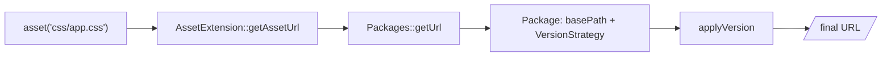

# Assets Management

!!! tip "In a nutshell"
    `asset('css/app.css')` transforme un chemin relatif à `public/` en URL
    publique avec base path et version appliqués. Point d'examen : `asset()` sert
    aux fichiers statiques (versionnement = cache busting) tandis que
    `path()`/`url()` servent aux routes ; AssetMapper/Encore sont hors périmètre.

!!! example "Real-world analogy"
    `asset()` est le comptoir du vestiaire. Vous donnez un nom simple et stable —
    « le manteau gris », `css/app.css` — et il vous rend le ticket de retrait
    exact de l'article courant, avec le numéro d'étiquette du jour. Quand vous
    remplacez le manteau par un neuf, le numéro d'étiquette change, si bien que
    personne ne peut repartir avec l'ancien manteau en réutilisant un ticket
    périmé (c'est le cache busting via la version ou le hash du `manifest.json`).
    Vous prononcez toujours le nom simple ; le comptoir gère où l'article est
    réellement accroché et quelle étiquette numérotée est en vigueur — même s'il
    vit dans un autre vestiaire à l'autre bout de la ville (un package CDN).

!!! abstract "Learning objectives"
    À la fin de ce chapitre, vous saurez :

    - [ ] Référencer des fichiers statiques avec `asset()` et savoir ce qu'elle retourne.
    - [ ] Expliquer le **versionnement** des assets et les stratégies de cache busting.
    - [ ] Énoncer clairement ce qui est hors périmètre (AssetMapper, Encore).

    **Syllabus:** `Templating (Twig) → Asset management` ·
    **Level:** Advanced ·
    **Est. time:** 15 min ·
    **Prerequisites:** [Twig Syntax](syntax.md)

---

!!! info "Scope"
    Ce chapitre couvre **uniquement la fonction `asset()` et le versionnement**.
    Les pipelines de build **AssetMapper** et **Webpack Encore** existent mais
    sont **hors périmètre** pour ce contenu et la matière d'examen ici — ils ne
    sont mentionnés que pour que vous sachiez que ce sont les outils qui
    *produisent* les fichiers vers lesquels `asset()` pointe.

## Theory

`asset()` transforme un chemin relatif à `public/` en URL publique, en
appliquant tout base path et toute version configurés :

```twig
<link rel="stylesheet" href="{{ asset('css/app.css') }}">

<script src="{{ asset('js/app.js') }}"></script>
```

Avec `public/css/app.css`, `asset('css/app.css')` peut rendre
`/css/app.css?v=42` (avec versionnement) ou `/build/app.css` (avec un manifest).

```twig
{# one logical path, different output per configured strategy #}
{{ asset('css/app.css') }}
{# no versioning:        /css/app.css #}
{# static version v42:   /css/app.css?v=42 #}
{# JSON manifest:        /build/app.css (name looked up in the manifest) #}
```

!!! question "Predict first"
    Un manifest JSON associe `app.css` → `app.7f3c.css`. Vers quoi
    `{{ asset('css/app.css') }}` résout-il — le chemin littéral ou le nom hashé ?

??? note "Reveal"
    Le nom **hashé** du `manifest.json` (p. ex. `/build/app.7f3c.css`). Avec une
    `JsonManifestVersionStrategy`, `asset()` cherche le chemin logique dans le
    manifest au lieu de le retourner tel quel — c'est cette recherche qui fait
    fonctionner le cache busting.

## Deep Dive — how it works internally

`asset()` est fournie par **`Symfony\Bridge\Twig\Extension\AssetExtension`**,
qui délègue au service **`Symfony\Component\Asset\Packages`**. Chaque *package*
associe un **base path/URL** à une **`VersionStrategyInterface`** :

| Stratégie | Comportement |
|---|---|
| `EmptyVersionStrategy` | pas de version (défaut) |
| `StaticVersionStrategy` | ajoute un `?v=…` fixe (ou un format) |
| `JsonManifestVersionStrategy` | cherche le chemin dans un `manifest.json` |

```php
use Symfony\Component\Asset\Package;
use Symfony\Component\Asset\Packages;
use Symfony\Component\Asset\VersionStrategy\StaticVersionStrategy;

// a Package pairs a base path with a VersionStrategyInterface
$package = new Package(new StaticVersionStrategy('v42'));

// Packages is the service AssetExtension delegates asset() calls to
$packages = new Packages($package);
$packages->getUrl('css/app.css'); // "css/app.css?v42"
```



- Le **versionnement** existe pour le cache busting : quand un fichier change,
  vous changez sa version pour que les navigateurs récupèrent la nouvelle copie
  au lieu d'une version périmée en cache.
- Avec un **manifest** (produit par un outil de build), le nom logique
  correspond à un nom de fichier hashé par contenu (`app.css` → `app.7f3c.css`) ;
  la stratégie lit `manifest.json`.
- Plusieurs **packages nommés** permettent différentes base URL (p. ex. un CDN) :
  `asset('logo.png', 'cdn')`.
- L'URL générée est sûre selon le contexte ; combinée à l'URL de base de la
  request, elle fonctionne dans les déploiements en sous-répertoire.

```twig
{# manifest strategy: the logical name is looked up in manifest.json #}
{{ asset('build/app.css') }}   {# -> /build/app.7f3c.css (cache busting) #}

{# named package: same call, served from a CDN base URL #}
{{ asset('logo.png', 'cdn') }} {# -> https://cdn.example.com/logo.png #}
```

!!! note "Source reference"
    `Symfony\Bridge\Twig\Extension\AssetExtension`,
    `Symfony\Component\Asset\Packages`,
    `Symfony\Component\Asset\VersionStrategy\JsonManifestVersionStrategy` —
    [symfony/symfony `8.0`](https://github.com/symfony/symfony/blob/8.0/src/Symfony/Component/Asset/Packages.php).

## Configuration & code

=== "YAML — static version"

    ```yaml
    # config/packages/framework.yaml
    framework:
        assets:
            version: 'v42'
            version_format: '%%s?version=%%s'   # path ? version
    ```

=== "YAML — manifest + CDN package"

    ```yaml
    # config/packages/framework.yaml
    framework:
        assets:
            json_manifest_path: '%kernel.project_dir%/public/manifest.json'
            packages:
                cdn:
                    base_urls: ['https://cdn.example.com']
    ```

=== "Twig"

    ```twig
    <link rel="stylesheet" href="{{ asset('css/app.css') }}">
    
    ```

## Best practices & anti-patterns

| ✅ À faire | ❌ À éviter |
|---|---|
| `asset()` pour chaque fichier statique | `/css/app.css` codé en dur |
| Versionner pour le cache busting | Renommer les fichiers à la main à chaque déploiement |
| Des packages nommés pour les CDN | Des URL CDN absolues en dur dans les templates |
| Garder les fichiers sous `public/` | Référencer des fichiers hors de la racine web |

## When (not) to use it / alternatives

Utilisez `asset()` pour tout fichier servi depuis `public/`. Pour les URL
générées à partir de routes, utilisez plutôt `path()`/`url()`
([URL Generation](urls.md)). Le *build* de ces assets (bundling, hashing) relève
d'AssetMapper/Encore — **hors périmètre ici** ; `asset()` ne fait que résoudre
le chemin public/la version finale.

!!! danger "Certification traps"
    - `asset()` retourne un **chemin relatif à `public/`** avec base path/version
      appliqués — ce n'est **pas** une route (`path()` sert aux routes).
    - Le versionnement concerne le **cache busting**, pas la sécurité.
    - Avec un manifest JSON, `asset('app.css')` résout vers le nom **hashé** du
      `manifest.json`, pas le chemin littéral.
    - AssetMapper/Encore ne sont **pas** couverts — n'attendez pas leurs fonctions
      (`importmap`, `encore_entry_link_tags`) dans ce périmètre.

!!! warning "Common mistakes"
    - Utiliser `path()` pour un fichier statique ou `asset()` pour une route.
    - Oublier que le chemin est relatif à `public/`, pas à la racine du projet.

## Exercises

1. **(Basic)** Référencez `public/css/app.css` dans un `<link>`.
2. **(Intermediate)** Configurez une version statique `v3` ajoutée en `?v=3`.
3. **(Advanced)** Pointez les images vers un package CDN pendant que le CSS reste local.

??? success "Solutions"

    **1.** `<link rel="stylesheet" href="{{ asset('css/app.css') }}">`.

    **2.** `framework.assets.version: 'v3'` (le format par défaut ajoute `?v3`) ;
    ou définissez `version_format: '%%s?v=%%s'`.

    **3.** Définissez un package `cdn` avec `base_urls`, puis
    `{{ asset('img/hero.jpg', 'cdn') }}` tandis que `{{ asset('css/app.css') }}`
    utilise le package par défaut.

## Certification questions

??? question "Q1. What does `asset('css/app.css')` return?"
    - [x] A. A public URL/path (with base path + version) to the file ✅
    - [ ] B. A route URL
    - [ ] C. The file contents
    - [ ] D. An absolute filesystem path

    **Why:** `asset()` résout un chemin relatif à `public/` via `Packages`.
    **Ref:** [Linking to assets](https://symfony.com/doc/current/templates.html#linking-to-css-and-javascript-assets).

??? question "Q2. What is asset versioning for?"
    - [x] A. Cache busting when files change ✅
    - [ ] B. Access control
    - [ ] C. Minification
    - [ ] D. Route matching

    **Why:** Les versions forcent les clients à récupérer les assets modifiés. **Ref:**
    [Asset versioning](https://symfony.com/doc/current/frontend.html).

??? question "Q3. Which service does `asset()` delegate to?"
    - [x] A. `Symfony\Component\Asset\Packages` ✅
    - [ ] B. `UrlGeneratorInterface`
    - [ ] C. `TranslatorInterface`
    - [ ] D. `FragmentHandler`

    **Why:** `AssetExtension` enveloppe le service `Packages`. **Ref:**
    [Packages](https://github.com/symfony/symfony/blob/8.0/src/Symfony/Component/Asset/Packages.php).

## Key takeaways

- `asset('path')` → URL publique relative à `public/`, avec base path + version.
- Versionnement = cache busting ; stratégies : statique, manifest JSON, vide.
- Les packages nommés ciblent des CDN / des base URL alternatives.
- AssetMapper et Encore sont hors périmètre — seul `asset()` ici.

## Last-minute revision

!!! tip "Cheat sheet"
    - `{{ asset('css/app.css') }}` · `{{ asset('logo.png', 'cdn') }}`.
    - `framework.assets.version` / `json_manifest_path` / `packages`.
    - `asset()` = fichiers statiques ; `path()`/`url()` = routes.

## Connections

- **Depends on:** [Twig Syntax](syntax.md) — `asset()` est un appel de fonction Twig ordinaire.
- **Reused in:** [Template Inheritance](inheritance.md) — les liens d'assets vivent généralement dans les blocks de `base.html.twig` partagés par toutes les pages.
- **Confused with:** [URL Generation](urls.md) — `asset()` sert aux fichiers statiques sous `public/` ; `path()`/`url()` aux routes.

## Official References
- [Official — Linking to CSS/JS assets](https://symfony.com/doc/current/templates.html#linking-to-css-and-javascript-assets)
- [Official — Asset component](https://symfony.com/doc/current/components/asset.html)
- [Symfony source — Packages](https://github.com/symfony/symfony/blob/8.0/src/Symfony/Component/Asset/Packages.php)

## Video references

!!! tip "Watch & learn"
    Ce sont des chaînes vidéo officielles, mises à jour en continu — cherchez-y
    « Twig templating » pour consolider ce chapitre. Nous lions des chaînes
    stables plutôt que des vidéos individuelles afin que les références ne
    périment jamais.

    - [SymfonyCasts screencasts](https://symfonycasts.com/tracks/symfony) — tutoriels scénarisés à suivre en codant.
    - [Symfony official YouTube](https://www.youtube.com/@SymfonyOfficial) — conférences SymfonyCon & keynotes.
    - [Official docs for this topic](https://symfony.com/doc/current/templates.html#linking-to-css-and-javascript-assets) — certaines pages de la doc Symfony intègrent un screencast.

## Confidence check

Je suis prêt quand je peux :

- [ ] expliquer **pourquoi** `asset()` existe plutôt que des chemins codés en dur (versionnement, base path)
- [ ] configurer une stratégie de version ou un package CDN en Symfony 8
- [ ] déboguer un asset périmé qu'un navigateur refuse de recharger
- [ ] repérer la réponse piège qui confond `asset()` avec `path()`/`url()`
- [ ] expliquer comment `AssetExtension` délègue à `Packages` + une `VersionStrategy`

---

<small>Related: [URL Generation](urls.md) · [Twig Syntax](syntax.md) · [Filters & Functions](filters-functions.md)</small>
