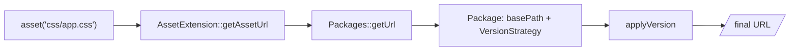

# Assets Management

!!! tip "In a nutshell"
    `asset('css/app.css')` turns a path relative to `public/` into a public URL with
    base path and version applied. Exam hook: `asset()` is for static files (versioning
    = cache busting) while `path()`/`url()` are for routes; AssetMapper/Encore are out of scope.

!!! example "Real-world analogy"
    `asset()` is the coat-check counter. You hand over a simple, stable name — "the grey
    coat," `css/app.css` — and it hands back the exact claim ticket for the current item,
    complete with today's tag number. When you replace the coat with a new one, the tag
    number changes, so nobody can walk off with the old coat by reusing a stale ticket (that
    is cache busting via the version or the `manifest.json` hash). You always speak the plain
    name; the counter handles where it actually hangs and which numbered tag is current —
    even if it lives in another cloakroom across town (a CDN package).

!!! abstract "Learning objectives"
    By the end of this chapter you can:

    - [ ] Reference static files with `asset()` and know what it returns.
    - [ ] Explain asset **versioning** and cache-busting strategies.
    - [ ] State clearly what is out of scope (AssetMapper, Encore).

    **Syllabus:** `Templating (Twig) → Asset management` ·
    **Level:** Advanced ·
    **Est. time:** 15 min ·
    **Prerequisites:** [Twig Syntax](syntax.md)

---

!!! info "Scope"
    This chapter covers the **`asset()` function and versioning only**. The build
    pipelines **AssetMapper** and **Webpack Encore** exist but are **out of scope**
    for this content and the exam material here — they are mentioned only so you
    know they are the tools that *produce* the files `asset()` points at.

## Theory

`asset()` turns a path relative to `public/` into a public URL, applying any
configured base path and version:

```twig
<link rel="stylesheet" href="{{ asset('css/app.css') }}">

<script src="{{ asset('js/app.js') }}"></script>
```

Given `public/css/app.css`, `asset('css/app.css')` might render
`/css/app.css?v=42` (with versioning) or `/build/app.css` (with a manifest).

```twig
{# one logical path, different output per configured strategy #}
{{ asset('css/app.css') }}
{# no versioning:        /css/app.css #}
{# static version v42:   /css/app.css?v=42 #}
{# JSON manifest:        /build/app.css (name looked up in the manifest) #}
```

!!! question "Predict first"
    A JSON manifest maps `app.css` → `app.7f3c.css`. What does
    `{{ asset('css/app.css') }}` resolve to — the literal path or the hashed name?

??? note "Reveal"
    The **hashed** name from `manifest.json` (e.g. `/build/app.7f3c.css`). With a
    `JsonManifestVersionStrategy`, `asset()` looks the logical path up in the
    manifest rather than returning it verbatim — that lookup is what makes cache
    busting work.

## Deep Dive — how it works internally

`asset()` is provided by **`Symfony\Bridge\Twig\Extension\AssetExtension`**,
which delegates to the **`Symfony\Component\Asset\Packages`** service. Each
*package* pairs a **base path/URL** with a **`VersionStrategyInterface`**:

| Strategy | Behaviour |
|---|---|
| `EmptyVersionStrategy` | no version (default) |
| `StaticVersionStrategy` | appends a fixed `?v=…` (or a format) |
| `JsonManifestVersionStrategy` | looks the path up in a `manifest.json` |

```php
use Symfony\Component\Asset\Package;
use Symfony\Component\Asset\Packages;
use Symfony\Component\Asset\VersionStrategy\StaticVersionStrategy;

// a Package pairs a base path with a VersionStrategyInterface
$package = new Package(new StaticVersionStrategy('v42'));

// Packages is the service AssetExtension delegates asset() calls to
$packages = new Packages($package);
$packages->getUrl('css/app.css'); // "css/app.css?v42"
```



- **Versioning** exists for cache busting: when a file changes you change its
  version so browsers fetch the new copy instead of a stale cached one.
- With a **manifest** (produced by a build tool), the logical name maps to a
  content-hashed filename (`app.css` → `app.7f3c.css`); the strategy reads
  `manifest.json`.
- Multiple **named packages** allow different base URLs (e.g. a CDN):
  `asset('logo.png', 'cdn')`.
- The generated URL is context-safe; combined with the request's base URL it
  works under subdirectory deployments.

```twig
{# manifest strategy: the logical name is looked up in manifest.json #}
{{ asset('build/app.css') }}   {# -> /build/app.7f3c.css (cache busting) #}

{# named package: same call, served from a CDN base URL #}
{{ asset('logo.png', 'cdn') }} {# -> https://cdn.example.com/logo.png #}
```

!!! note "Source reference"
    `Symfony\Bridge\Twig\Extension\AssetExtension`,
    `Symfony\Component\Asset\Packages`,
    `Symfony\Component\Asset\VersionStrategy\JsonManifestVersionStrategy` —
    [symfony/symfony `8.0`](https://github.com/symfony/symfony/blob/8.0/src/Symfony/Component/Asset/Packages.php).

## Configuration & code

=== "YAML — static version"

    ```yaml
    # config/packages/framework.yaml
    framework:
        assets:
            version: 'v42'
            version_format: '%%s?version=%%s'   # path ? version
    ```

=== "YAML — manifest + CDN package"

    ```yaml
    # config/packages/framework.yaml
    framework:
        assets:
            json_manifest_path: '%kernel.project_dir%/public/manifest.json'
            packages:
                cdn:
                    base_urls: ['https://cdn.example.com']
    ```

=== "Twig"

    ```twig
    <link rel="stylesheet" href="{{ asset('css/app.css') }}">
    
    ```

## Best practices & anti-patterns

| ✅ Do | ❌ Avoid |
|---|---|
| `asset()` for every static file | Hard-coding `/css/app.css` |
| Version for cache busting | Bumping filenames by hand each deploy |
| Named packages for CDNs | Absolute CDN URLs inline in templates |
| Keep files under `public/` | Referencing files outside the web root |

## When (not) to use it / alternatives

Use `asset()` for any file served from `public/`. For URLs generated from routes
use `path()`/`url()` instead ([URL Generation](urls.md)). The *build* of those
assets (bundling, hashing) is AssetMapper/Encore territory — **out of scope
here**; `asset()` merely resolves the final public path/version.

!!! danger "Certification traps"
    - `asset()` returns a **path relative to `public/`** with base path/version
      applied — it is **not** a route (`path()` is for routes).
    - Versioning is about **cache busting**, not security.
    - With a JSON manifest, `asset('app.css')` resolves to the **hashed** name
      from `manifest.json`, not the literal path.
    - AssetMapper/Encore are **not** covered — do not expect their functions
      (`importmap`, `encore_entry_link_tags`) in this scope.

!!! warning "Common mistakes"
    - Using `path()` for a static file or `asset()` for a route.
    - Forgetting the leading path is relative to `public/`, not the project root.

## Exercises

1. **(Basic)** Reference `public/css/app.css` in a `<link>`.
2. **(Intermediate)** Configure a static version `v3` appended as `?v=3`.
3. **(Advanced)** Point image assets at a CDN package while CSS stays local.

??? success "Solutions"

    **1.** `<link rel="stylesheet" href="{{ asset('css/app.css') }}">`.

    **2.** `framework.assets.version: 'v3'` (default format appends `?v3`); or set
    `version_format: '%%s?v=%%s'`.

    **3.** Define a `cdn` package with `base_urls`, then
    `{{ asset('img/hero.jpg', 'cdn') }}` while `{{ asset('css/app.css') }}` uses
    the default package.

## Certification questions

??? question "Q1. What does `asset('css/app.css')` return?"
    - [x] A. A public URL/path (with base path + version) to the file ✅
    - [ ] B. A route URL
    - [ ] C. The file contents
    - [ ] D. An absolute filesystem path

    **Why:** `asset()` resolves a path relative to `public/` via `Packages`.
    **Ref:** [Linking to assets](https://symfony.com/doc/8.0/templates.html#linking-to-css-and-javascript-assets).

??? question "Q2. What is asset versioning for?"
    - [x] A. Cache busting when files change ✅
    - [ ] B. Access control
    - [ ] C. Minification
    - [ ] D. Route matching

    **Why:** Versions force clients to refetch changed assets. **Ref:**
    [Asset versioning](https://symfony.com/doc/8.0/frontend.html).

??? question "Q3. Which service does `asset()` delegate to?"
    - [x] A. `Symfony\Component\Asset\Packages` ✅
    - [ ] B. `UrlGeneratorInterface`
    - [ ] C. `TranslatorInterface`
    - [ ] D. `FragmentHandler`

    **Why:** `AssetExtension` wraps the `Packages` service. **Ref:**
    [Packages](https://github.com/symfony/symfony/blob/8.0/src/Symfony/Component/Asset/Packages.php).

## Key takeaways

- `asset('path')` → public URL relative to `public/`, with base path + version.
- Versioning = cache busting; strategies: static, JSON manifest, empty.
- Named packages target CDNs / alternate base URLs.
- AssetMapper & Encore are out of scope — only `asset()` here.

## Last-minute revision

!!! tip "Cheat sheet"
    - `{{ asset('css/app.css') }}` · `{{ asset('logo.png', 'cdn') }}`.
    - `framework.assets.version` / `json_manifest_path` / `packages`.
    - `asset()` = static files; `path()`/`url()` = routes.

## Connections

- **Depends on:** [Twig Syntax](syntax.md) — `asset()` is an ordinary Twig function call.
- **Reused in:** [Template Inheritance](inheritance.md) — asset links usually live in `base.html.twig` blocks shared by every page.
- **Confused with:** [URL Generation](urls.md) — `asset()` is for static files under `public/`; `path()`/`url()` are for routes.

## Official References
- [Official — Linking to CSS/JS assets](https://symfony.com/doc/8.0/templates.html#linking-to-css-and-javascript-assets)
- [Official — Asset component](https://symfony.com/doc/8.0/components/asset.html)
- [Symfony source — Packages](https://github.com/symfony/symfony/blob/8.0/src/Symfony/Component/Asset/Packages.php)

## Video references

!!! tip "Watch & learn"
    These are official, continuously-updated video channels — search them for
    "Twig templating" to reinforce this chapter. We link stable channels rather than
    individual videos so the references never rot.

    - [SymfonyCasts screencasts](https://symfonycasts.com/tracks/symfony) — scripted, code-along tutorials.
    - [Symfony official YouTube](https://www.youtube.com/@SymfonyOfficial) — SymfonyCon conference talks & keynotes.
    - [Official docs for this topic](https://symfony.com/doc/8.0/templates.html#linking-to-css-and-javascript-assets) — some Symfony doc pages embed a screencast.

## Confidence check

I'm ready when I can:

- [ ] explain **why** `asset()` exists instead of hard-coded paths (versioning, base path)
- [ ] configure a version strategy or CDN package in Symfony 8
- [ ] debug a stale asset that a browser refuses to refetch
- [ ] spot the trick answer confusing `asset()` with `path()`/`url()`
- [ ] explain how `AssetExtension` delegates to `Packages` + a `VersionStrategy`

---

<small>Related: [URL Generation](urls.md) · [Twig Syntax](syntax.md) · [Filters & Functions](filters-functions.md)</small>
