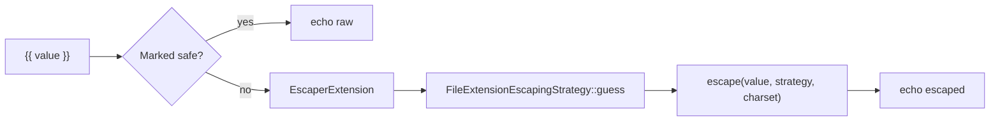

# Auto-Escaping

!!! tip "In a nutshell"
    Twig échappe chaque sortie `{{ }}` pour bloquer les XSS, et Symfony choisit la
    stratégie selon l'extension du fichier (`.html.twig` → HTML, `.js.twig` → JS…).
    Point d'examen : `.txt.twig` n'échappe rien, et `|raw` / ``
    désactivent la protection.

!!! example "Real-world analogy"
    L'auto-escaping est un filet de sécurité tendu sous un trapèze. Tout ce qu'un
    visiteur jette dans votre page — `<script>`, guillemets, chevrons — tombe dans
    le filet et est désamorcé en texte inoffensif avant que le public ne le voie.
    Vous ne décrochez le filet (`|raw`) que pour les artistes que vous avez
    personnellement contrôlés.

!!! abstract "Learning objectives"
    À la fin de ce chapitre, vous saurez :

    - [ ] Expliquer l'auto-escaping contextuel de Symfony et contre quoi il protège.
    - [ ] Choisir la bonne stratégie `escape` (`html`, `js`, `css`, `url`, `html_attr`).
    - [ ] Utiliser `|raw` et `` en sécurité et savoir quand *ne pas* le faire.

    **Syllabus:** `Templating (Twig) → Auto-escaping` ·
    **Level:** Expert ·
    **Est. time:** 30 min ·
    **Prerequisites:** [Web Security Fundamentals](../php-web-security/web-security.md)

---

## Pour les nuls

### L'idée en une phrase
Twig neutralise automatiquement tout ce qu'un visiteur pourrait injecter dans une page — pas besoin d'y penser toi-même, à chaque `{{ }}`.

### Imagine dans la vraie vie
L'auto-escaping est un filet de sécurité tendu sous un trapèze. Quoi qu'un visiteur jette dans ta page — `<script>`, guillemets, chevrons — tombe dans le filet et est neutralisé en texte inoffensif avant que le public ne le voie. Tu ne décroches le filet (`|raw`) que pour des artistes que tu as personnellement vérifiés.

### Dans Symfony
`{{ commentaire_utilisateur }}` affiche en toute sécurité même si le visiteur a écrit `<script>alert(1)</script>` — le texte apparaît littéralement à l'écran, il ne s'exécute jamais.

### Exemple simple
```twig
{{ commentaire }}          {# échappé automatiquement, toujours sûr #}
{{ commentaire|raw }}      {# ⚠️ dangereux : jamais sur du contenu utilisateur non vérifié #}
```

### Comment le mémoriser 🧠
`.txt.twig` n'échappe **rien** (ce n'est pas du HTML, il n'y a rien à échapper) — seule une extension comme `.html.twig` déclenche la protection XSS.


## Theory

L'auto-escaping est la défense intégrée de Twig contre les **XSS** : chaque
valeur affichée avec `{{ }}` est échappée pour son contexte de sortie avant
d'atteindre le navigateur. Dans Symfony, l'échappement est **activé par défaut**
et la stratégie est choisie selon l'**extension de fichier** du template — ainsi
`page.html.twig` échappe en HTML, `data.js.twig` en JavaScript, etc.

```twig
{{ '<b>hi</b>' }}   {# renders &lt;b&gt;hi&lt;/b&gt; — not bold #}
```

Comme l'échappement est automatique, le travail du développeur se réduit à deux
décisions : **dans quel contexte** une valeur atterrit, et **quand une valeur est
du HTML de confiance** (rare).

!!! question "Predict first"
    Un partial se nomme `report.txt.twig` et contient `{{ '<script>alert(1)</script>' }}`.
    Qu'arrive-t-il dans la sortie — des entités échappées ou la balise brute ?

??? note "Reveal"
    La balise brute `<script>…</script>` — non échappée. `.txt.twig` correspond à
    la stratégie *none* via `FileExtensionEscapingStrategy::guess()`, donc rien
    n'est encodé. Le défaut est choisi par **extension de fichier**, pas un `html`
    figé ; seuls `.html.twig` (et le fallback) échappent en HTML.

## Deep Dive — how it works internally

L'échappement est une **extension** Twig, `Twig\Extension\EscaperExtension`,
adossée à `Twig\Runtime\EscaperRuntime` (la logique de `twig_escape_filter`). Le
moteur ajoute un `|escape(strategy)` implicite à chaque `{{ }}` sauf si le nœud
est déjà marqué *safe*.

```php
// EscaperExtension rewrites {{ value }} into
// {{ value|escape(strategy) }} at compile time.
// The encoding itself runs in EscaperRuntime
// (the former twig_escape_filter logic):
$escaped = $twig->getRuntime(\Twig\Runtime\EscaperRuntime::class)
    ->escape('<b>hi</b>', 'html');  // &lt;b&gt;hi&lt;/b&gt;
```

La **stratégie** est décidée par le TwigBundle de Symfony : il configure
l'environnement avec une stratégie sous forme de callable —
`Twig\FileExtensionEscapingStrategy::guess()` — qui associe l'extension du nom du
template à un contexte :

| Le template se termine par | Stratégie |
|---|---|
| `.html.twig`, `.html` | `html` |
| `.js.twig` | `js` |
| `.css.twig` | `css` |
| `.txt.twig` | *none* (false) |
| tout le reste | `html` |



- Une valeur est **safe** quand elle provient d'un filtre/d'une fonction déclarés
  avec `is_safe`, quand elle passe par `|raw`, ou à l'intérieur de
  ``.
- L'échappement est **conscient de l'idempotence** : Twig marque les chaînes déjà
  échappées afin que les affichages chaînés ne double-échappent pas.
- Chaque stratégie correspond à un vrai escaper PHP : `html` →
  `htmlspecialchars` avec `ENT_QUOTES|ENT_SUBSTITUTE`, `html_attr` → un escaper
  sûr pour les attributs, `js` → encodage hexadécimal `\xNN`, `css` → encodage
  hexadécimal CSS, `url` → `rawurlencode`.

```twig
{# three ways a value counts as safe #}
{{ trusted|raw }}                                       {# 1. |raw #}
{{ trusted }}  {# 2. autoescape off #}
{# 3. output of a filter/function declared is_safe: ['html'] #}

{# each strategy maps to a real PHP escaper #}
{{ v|e('html') }}       {# htmlspecialchars with ENT_QUOTES|ENT_SUBSTITUTE #}
{{ v|e('html_attr') }}  {# attribute-safe escaper #}
{{ v|e('js') }}         {# \xNN hex encoding #}
{{ v|e('css') }}        {# CSS hex encoding #}
{{ v|e('url') }}        {# rawurlencode #}
```

!!! note "Source reference"
    `Twig\Extension\EscaperExtension`, `Twig\Runtime\EscaperRuntime`,
    `Twig\FileExtensionEscapingStrategy` —
    [twigphp/Twig `3.x`](https://github.com/twigphp/Twig/blob/3.x/src/Extension/EscaperExtension.php).

### Why context matters (security rationale)

Échapper en HTML une valeur qui atterrit dans un bloc `<script>` ou un attribut
`style` ne la rend **pas** sûre — le jeu de caractères à échapper est différent.
Placer des données utilisateur dans une URL, une chaîne JS ou une valeur CSS
exige à chaque fois son propre encodage. Utiliser la mauvaise stratégie est un
vrai vecteur XSS. Voir
[Web Security Fundamentals](../php-web-security/web-security.md) pour le modèle
d'attaque.

```twig
{# WRONG — HTML escaping inside a <script> block is still exploitable #}
<script>const q = "{{ query|e('html') }}";</script>
{# RIGHT — match the escaper to the context #}
<script>const q = "{{ query|e('js') }}";</script>
<div style="color: {{ color|e('css') }}"></div>
<a href="/search?q={{ query|e('url') }}">search</a>
```

### Null behavior

L'escaper est tolérant au `null`. Afficher une valeur `null` — `{{ comment }}`
quand il n'y a pas de commentaire — produit une **chaîne vide**, pas `"null"` ni
une erreur : le `|escape` implicite n'a simplement rien à encoder. Il en va de
même pour un `{{ x|e }}` ou `{{ x|e('js') }}` explicite sur `null`. Une valeur
nullable (une bio utilisateur non renseignée, un flash absent) peut donc être
affichée directement — l'échappement ne transforme jamais `null` en texte
visible. Si vous voulez un texte de substitution plutôt qu'un blanc, utilisez
`|default` **avant** l'échappement : `{{ bio|default('—') }}`.

```twig

{{ comment }}          {# '' — the implicit escape has nothing to encode #}
{{ comment|e }}        {# '' — explicit escape on null is also empty #}
{{ comment|e('js') }}  {# '' — same for any strategy #}
{{ bio|default('—') }} {# placeholder applied BEFORE escaping #}
```

!!! note "Null in real life"
    Une valeur null au filet de sécurité, c'est un trapèze vide : rien ne tombe,
    donc rien à rattraper — le filet reste silencieux et la page rend un blanc.

## Configuration & code

=== "Twig — explicit strategies"

    ```twig
    {# HTML body (default) #}
    <p>{{ comment }}</p>

    {# HTML attribute #}
    <div title="{{ tooltip|e('html_attr') }}"></div>

    {# Inside a URL #}
    <a href="/search?q={{ query|e('url') }}">go</a>

    {# Inside inline JS #}
    <script>const n = "{{ name|e('js') }}";</script>

    {# Inside inline CSS #}
    <style>.x { content: "{{ label|e('css') }}"; }</style>
    ```

=== "Twig — autoescape blocks"

    ```twig
    
        {{ value }} {# escaped as JS here #}
    

    
        {{ trustedHtml }} {# NOT escaped — dangerous if untrusted #}
    
    ```

=== "YAML (bundle default)"

    ```yaml
    # config/packages/twig.yaml
    twig:
        # 'name' = guess by file extension (the Symfony default)
        autoescape: name
        strict_variables: '%kernel.debug%'
    ```

Le filtre `|e` est l'alias court de `|escape`. Passer une stratégie explicite
remplace la détection contextuelle pour cette valeur uniquement.

## Best practices & anti-patterns

| ✅ À faire | ❌ À éviter |
|---|---|
| Faire confiance à l'auto-escaping ; nommer les fichiers `*.html.twig` | Désactiver l'autoescape globalement |
| Adapter la stratégie au contexte (`js`, `url`…) | Échapper en HTML une valeur dans un `<script>` |
| Assainir, puis `|raw` uniquement sur du HTML contrôlé | `|raw` sur une saisie utilisateur |
| Garder `strict_variables` activé en dev | Deviner si une valeur est sûre |

## When (not) to use it / alternatives

Utilisez `|raw` **uniquement** pour du HTML que vous avez généré ou assaini côté
serveur (p. ex. une chaîne nettoyée par `html_sanitizer`). Pour du contenu riche
saisi par l'utilisateur, assainissez en PHP avec le composant HtmlSanitizer, puis
affichez avec `|raw` — ne faites jamais confiance à du markup utilisateur brut.

!!! danger "Certification traps"
    - La stratégie par défaut est choisie par **extension de fichier**, pas un
      `html` figé. Un template `.txt.twig` n'échappe **rien**.
    - `|e('html_attr')` ≠ `|e('html')`. Le contexte attribut exige l'encodeur le
      plus strict (espaces, `=`, accents graves).
    - `|raw` et `` **désactivent** la protection — des
      données non fiables à cet endroit sont une faille XSS.
    - L'échappement s'applique à l'**affichage** (`{{ }}`), pas quand une variable
      est définie avec `set`.

!!! warning "Common mistakes"
    - Craintes de double échappement : Twig suit les chaînes safe, donc `{{ x|e }}`
      après un auto-escape ne double-encode pas dans le flux normal — mais appeler
      `|e|e` échappe bien deux fois.
    - Utiliser `|e('js')` pour une valeur placée dans un attribut HTML — mauvais contexte.

## Exercises

1. **(Basic)** Quelle stratégie pour une valeur dans `href="..."` ? Écrivez l'extrait.
2. **(Intermediate)** Un partial se nomme `snippet.js.twig`. Qu'est-ce qui est
   auto-échappé à l'intérieur, et comment forcer l'échappement HTML pour une valeur ?
3. **(Advanced)** Vous avez du HTML assaini côté serveur dans `body`. Affichez-le
   sans échappement et justifiez pourquoi c'est sûr.

??? success "Solutions"

    **1.** Contexte URL à l'intérieur d'une valeur d'attribut :
    `<a href="/q?s={{ term|e('url') }}">`. (Les guillemets de l'attribut eux-mêmes
    sont gérés par l'échappement HTML du littéral environnant.)

    **2.** Dans un fichier `.js.twig`, la détection donne `js`, donc `{{ x }}` est
    échappé en JS. Forcez le HTML avec `{{ x|e('html') }}`.

    **3.** `{{ body|raw }}` — sûr **uniquement parce que** la valeur est passée par
    l'HtmlSanitizer côté serveur ; raw revient à faire confiance à la source.

## Certification questions

??? question "Q1. In Symfony, how is the default escaping strategy chosen?"
    - [ ] A. Always `html`
    - [x] B. Guessed from the template file extension ✅
    - [ ] C. From the `Accept` header
    - [ ] D. It is off by default

    **Why:** Le TwigBundle définit `autoescape: name`, en utilisant
    `FileExtensionEscapingStrategy::guess()`. **Ref:**
    [Twig autoescape](https://symfony.com/doc/8.0/templates.html#output-escaping).

??? question "Q2. A value goes inside `<script>const x = \"…\";</script>`. Which filter?"
    - [ ] A. `|e('html')`
    - [x] B. `|e('js')` ✅
    - [ ] C. `|raw`
    - [ ] D. `|e('html_attr')`

    **Why:** Le contexte chaîne JavaScript exige un échappement JS, pas HTML. **Ref:**
    [escape filter](https://twig.symfony.com/doc/3.x/filters/escape.html).

??? question "Q3. What does `` do?"
    - [ ] A. Escapes as text
    - [x] B. Disables escaping inside the block ✅
    - [ ] C. Escapes as URL
    - [ ] D. Throws an error

    **Why:** Il désactive l'échappement — à n'utiliser que pour du contenu de
    confiance. **Ref:**
    [autoescape tag](https://twig.symfony.com/doc/3.x/tags/autoescape.html).

## Key takeaways

- L'échappement est **activé par défaut**, le contexte est choisi par **extension de fichier**.
- Cinq stratégies : `html`, `html_attr`, `js`, `css`, `url` — adaptez-les au contexte.
- `|raw` / `` désactivent la protection : contenu de confiance uniquement.
- L'échappement se produit à l'affichage via `EscaperExtension`.

## Last-minute revision

!!! tip "Cheat sheet"
    - `.html.twig`→html · `.js.twig`→js · `.txt.twig`→none.
    - `|e` = `|escape` ; stratégies `html|html_attr|js|css|url`.
    - `|raw` = « faites-moi confiance ». `…`.
    - Échappement au `{{ }}`, pas au ``.

## Connections

- **Depends on:** [Web Security](../php-web-security/web-security.md) — l'auto-escaping est une défense contre le modèle d'attaque XSS qui y est décrit.
- **Reused in:** [Filters & Functions](filters-functions.md) — un filtre/une fonction personnalisé doit déclarer `is_safe: ['html']` pour se soustraire à cet échappement.
- **Confused with:** [Twig Syntax](syntax.md) — l'échappement se produit à l'**affichage** (`{{ }}`), pas au `` ; afficher et échapper ne font qu'un.

## Official References
- [Official — Output escaping](https://symfony.com/doc/8.0/templates.html#output-escaping)
- [Twig — escape filter](https://twig.symfony.com/doc/3.x/filters/escape.html)
- [Twig source — EscaperExtension](https://github.com/twigphp/Twig/blob/3.x/src/Extension/EscaperExtension.php)

## Video references

!!! tip "Watch & learn"
    Ce sont des chaînes vidéo officielles, mises à jour en continu — cherchez-y
    « Twig templating » pour consolider ce chapitre. Nous lions des chaînes
    stables plutôt que des vidéos individuelles afin que les références ne
    périment jamais.

    - [SymfonyCasts screencasts](https://symfonycasts.com/tracks/symfony) — tutoriels scénarisés à suivre en codant.
    - [Symfony official YouTube](https://www.youtube.com/@SymfonyOfficial) — conférences SymfonyCon & keynotes.
    - [Official docs for this topic](https://symfony.com/doc/8.0/templates.html#output-escaping) — certaines pages de la doc Symfony intègrent un screencast.

## Confidence check

Je suis prêt quand je peux :

- [ ] expliquer **pourquoi** l'auto-escaping existe et quelle attaque (XSS) il stoppe
- [ ] le configurer en Symfony 8 et nommer la stratégie par extension de fichier
- [ ] déboguer une valeur rendue en entités échappées alors que je voulais du HTML brut
- [ ] repérer la réponse piège qui suppose que le défaut est toujours `html`
- [ ] expliquer le flux interne `EscaperExtension` → stratégie → escaper

---

<small>Related: [Twig Syntax](syntax.md) · [Web Security](../php-web-security/web-security.md) · [Filters & Functions](filters-functions.md)</small>
