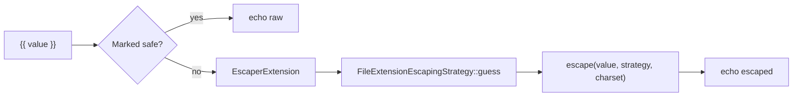

# Auto-Escaping

!!! tip "In a nutshell"
    Twig escapes every `{{ }}` output to block XSS, and Symfony picks the strategy
    from the file extension (`.html.twig` → HTML, `.js.twig` → JS…). Exam hook:
    `.txt.twig` escapes nothing, and `|raw` / `` turn it off.

!!! example "Real-world analogy"
    Auto-escaping is a safety net strung under a trapeze. Whatever a visitor throws
    into your page — `<script>`, quotes, angle brackets — falls into the net and is
    defused into harmless text before the audience ever sees it. You only unclip the
    net (`|raw`) for performers you have personally vetted.

!!! abstract "Learning objectives"
    By the end of this chapter you can:

    - [ ] Explain Symfony's context-aware auto-escaping and what it defends against.
    - [ ] Choose the correct `escape` strategy (`html`, `js`, `css`, `url`, `html_attr`).
    - [ ] Use `|raw` and `` safely and know when *not* to.

    **Syllabus:** `Templating (Twig) → Auto-escaping` ·
    **Level:** Expert ·
    **Est. time:** 30 min ·
    **Prerequisites:** [Web Security Fundamentals](../php-web-security/web-security.md)

---

## Theory

Auto-escaping is Twig's built-in defence against **XSS**: every value printed
with `{{ }}` is escaped for its output context before it reaches the browser. In
Symfony, escaping is **on by default** and the strategy is chosen from the
template's **file extension** — so `page.html.twig` escapes as HTML,
`data.js.twig` as JavaScript, etc.

```twig
{{ '<b>hi</b>' }}   {# renders &lt;b&gt;hi&lt;/b&gt; — not bold #}
```

Because escaping is automatic, the developer's job shrinks to two decisions:
**which context** a value lands in, and **when a value is trusted HTML** (rare).

!!! question "Predict first"
    A partial is named `report.txt.twig` and contains `{{ '<script>alert(1)</script>' }}`.
    What ends up in the output — escaped entities or the raw tag?

??? note "Reveal"
    The raw `<script>…</script>` — unescaped. `.txt.twig` maps to the *none*
    strategy via `FileExtensionEscapingStrategy::guess()`, so nothing is encoded.
    The default is chosen by **file extension**, not a fixed `html`; only
    `.html.twig` (and the fallback) escape as HTML.

## Deep Dive — how it works internally

Escaping is a Twig **extension**, `Twig\Extension\EscaperExtension`, backed by
`Twig\Runtime\EscaperRuntime` (the `twig_escape_filter` logic). The engine adds
an implicit `|escape(strategy)` to every `{{ }}` unless the node is already
marked *safe*.

```php
// EscaperExtension rewrites {{ value }} into {{ value|escape(strategy) }} at compile time.
// The encoding itself runs in EscaperRuntime (the former twig_escape_filter logic):
$escaped = $twig->getRuntime(\Twig\Runtime\EscaperRuntime::class)
    ->escape('<b>hi</b>', 'html');  // &lt;b&gt;hi&lt;/b&gt;
```

The **strategy** is decided by Symfony's TwigBundle: it configures the
environment with a callable strategy —
`Twig\FileExtensionEscapingStrategy::guess()` — which maps the template name's
extension to a context:

| Template ends with | Strategy |
|---|---|
| `.html.twig`, `.html` | `html` |
| `.js.twig` | `js` |
| `.css.twig` | `css` |
| `.txt.twig` | *none* (false) |
| anything else | `html` |



- A value is **safe** when produced by a filter/function declared with
  `is_safe`, when passed through `|raw`, or inside ``.
- Escaping is **idempotent-aware**: Twig marks already-escaped strings so
  chained prints do not double-escape.
- Each strategy maps to a real PHP escaper: `html` → `htmlspecialchars` with
  `ENT_QUOTES|ENT_SUBSTITUTE`, `html_attr` → an attribute-safe escaper,
  `js` → `\xNN` hex encoding, `css` → CSS hex encoding, `url` → `rawurlencode`.

!!! note "Source reference"
    `Twig\Extension\EscaperExtension`, `Twig\Runtime\EscaperRuntime`,
    `Twig\FileExtensionEscapingStrategy` —
    [twigphp/Twig `3.x`](https://github.com/twigphp/Twig/blob/3.x/src/Extension/EscaperExtension.php).

### Why context matters (security rationale)

HTML-escaping a value that lands in a `<script>` block or a `style` attribute
does **not** make it safe — the escape set is different. Putting user data into
a URL, a JS string, or a CSS value each needs its own encoding. Using the wrong
strategy is a real XSS vector. See
[Web Security Fundamentals](../php-web-security/web-security.md) for the attack
model.

### Null behavior

The escaper is null-safe. Printing a `null` value — `{{ comment }}` when there is
no comment — produces an **empty string**, not `"null"` and not an error: the
implicit `|escape` simply has nothing to encode. The same holds for an explicit
`{{ x|e }}` or `{{ x|e('js') }}` on `null`. So a nullable value (an unset user
bio, an absent flash) is safe to print directly — escaping never turns `null`
into visible text. If you want a placeholder instead of a blank, reach for
`|default` **before** escaping: `{{ bio|default('—') }}`.

!!! note "Null in real life"
    A null value at the safety net is an empty trapeze: nothing falls, so there is
    nothing to catch — the net stays quiet and the page renders blank.

## Configuration & code

=== "Twig — explicit strategies"

    ```twig
    {# HTML body (default) #}
    <p>{{ comment }}</p>

    {# HTML attribute #}
    <div title="{{ tooltip|e('html_attr') }}"></div>

    {# Inside a URL #}
    <a href="/search?q={{ query|e('url') }}">go</a>

    {# Inside inline JS #}
    <script>const n = "{{ name|e('js') }}";</script>

    {# Inside inline CSS #}
    <style>.x { content: "{{ label|e('css') }}"; }</style>
    ```

=== "Twig — autoescape blocks"

    ```twig
    
        {{ value }} {# escaped as JS here #}
    

    
        {{ trustedHtml }} {# NOT escaped — dangerous if untrusted #}
    
    ```

=== "YAML (bundle default)"

    ```yaml
    # config/packages/twig.yaml
    twig:
        # 'name' = guess by file extension (the Symfony default)
        autoescape: name
        strict_variables: '%kernel.debug%'
    ```

The `|e` filter is the short alias of `|escape`. Passing an explicit strategy
overrides the context guess for that value only.

## Best practices & anti-patterns

| ✅ Do | ❌ Avoid |
|---|---|
| Trust auto-escaping; name files `*.html.twig` | Disabling autoescape globally |
| Match the strategy to the context (`js`, `url`…) | HTML-escaping a value in a `<script>` |
| Sanitise, then `|raw` only vetted HTML | `|raw` on user input |
| Keep `strict_variables` on in dev | Guessing whether a value is safe |

## When (not) to use it / alternatives

Use `|raw` **only** for HTML you generated or sanitised server-side (e.g. a
`html_sanitizer`-cleaned string). For rich user content, sanitise in PHP with the
HtmlSanitizer component, then print with `|raw` — never trust raw user markup.

!!! danger "Certification traps"
    - The default strategy is chosen by **file extension**, not a fixed `html`.
      A `.txt.twig` template escapes **nothing**.
    - `|e('html_attr')` ≠ `|e('html')`. Attribute context needs the stricter
      encoder (spaces, `=`, backticks).
    - `|raw` and `` **disable** protection — untrusted data
      there is an XSS hole.
    - Escaping is applied at **print** (`{{ }}`), not when a variable is `set`.

!!! warning "Common mistakes"
    - Double-escaping worries: Twig tracks safe strings, so `{{ x|e }}` after an
      auto-escape does not double-encode in normal flow — but calling `|e|e`
      still escapes twice.
    - Using `|e('js')` for a value placed inside an HTML attribute — wrong context.

## Exercises

1. **(Basic)** Which strategy for a value inside `href="..."`? Write the snippet.
2. **(Intermediate)** A partial is named `snippet.js.twig`. What is auto-escaped
   inside it, and how do you force HTML escaping for one value?
3. **(Advanced)** You have server-sanitised HTML in `body`. Print it un-escaped
   and justify why it is safe.

??? success "Solutions"

    **1.** URL context inside an attribute value:
    `<a href="/q?s={{ term|e('url') }}">`. (The attribute quotes themselves are
    handled by HTML escaping of the surrounding literal.)

    **2.** In a `.js.twig` file the guess is `js`, so `{{ x }}` is JS-escaped.
    Force HTML with `{{ x|e('html') }}`.

    **3.** `{{ body|raw }}` — safe **only because** it was passed through the
    HtmlSanitizer server-side; raw is trusting the source.

## Certification questions

??? question "Q1. In Symfony, how is the default escaping strategy chosen?"
    - [ ] A. Always `html`
    - [x] B. Guessed from the template file extension ✅
    - [ ] C. From the `Accept` header
    - [ ] D. It is off by default

    **Why:** TwigBundle sets `autoescape: name`, using
    `FileExtensionEscapingStrategy::guess()`. **Ref:**
    [Twig autoescape](https://symfony.com/doc/current/templates.html#output-escaping).

??? question "Q2. A value goes inside `<script>const x = \"…\";</script>`. Which filter?"
    - [ ] A. `|e('html')`
    - [x] B. `|e('js')` ✅
    - [ ] C. `|raw`
    - [ ] D. `|e('html_attr')`

    **Why:** JavaScript string context needs JS escaping, not HTML. **Ref:**
    [escape filter](https://twig.symfony.com/doc/3.x/filters/escape.html).

??? question "Q3. What does `` do?"
    - [ ] A. Escapes as text
    - [x] B. Disables escaping inside the block ✅
    - [ ] C. Escapes as URL
    - [ ] D. Throws an error

    **Why:** It turns escaping off — use only for trusted content. **Ref:**
    [autoescape tag](https://twig.symfony.com/doc/3.x/tags/autoescape.html).

## Key takeaways

- Escaping is **on by default**, context chosen by **file extension**.
- Five strategies: `html`, `html_attr`, `js`, `css`, `url` — match the context.
- `|raw` / `` disable protection: trusted content only.
- Escaping happens at print time via `EscaperExtension`.

## Last-minute revision

!!! tip "Cheat sheet"
    - `.html.twig`→html · `.js.twig`→js · `.txt.twig`→none.
    - `|e` = `|escape`; strategies `html|html_attr|js|css|url`.
    - `|raw` = trust me. `…`.
    - Escape at `{{ }}`, not at ``.

## Connections

- **Depends on:** [Web Security](../php-web-security/web-security.md) — auto-escaping is a defence against the XSS attack model described there.
- **Reused in:** [Filters & Functions](filters-functions.md) — a custom filter/function must declare `is_safe: ['html']` to opt out of this escaping.
- **Confused with:** [Twig Syntax](syntax.md) — escaping happens at **print** (`{{ }}`), not at ``; printing and escaping are one step.

## Official References
- [Official — Output escaping](https://symfony.com/doc/current/templates.html#output-escaping)
- [Twig — escape filter](https://twig.symfony.com/doc/3.x/filters/escape.html)
- [Twig source — EscaperExtension](https://github.com/twigphp/Twig/blob/3.x/src/Extension/EscaperExtension.php)

## Video references

!!! tip "Watch & learn"
    These are official, continuously-updated video channels — search them for
    "Twig templating" to reinforce this chapter. We link stable channels rather than
    individual videos so the references never rot.

    - [SymfonyCasts screencasts](https://symfonycasts.com/tracks/symfony) — scripted, code-along tutorials.
    - [Symfony official YouTube](https://www.youtube.com/@SymfonyOfficial) — SymfonyCon conference talks & keynotes.
    - [Official docs for this topic](https://symfony.com/doc/current/templates.html#output-escaping) — some Symfony doc pages embed a screencast.

## Confidence check

I'm ready when I can:

- [ ] explain **why** auto-escaping exists and which attack (XSS) it stops
- [ ] configure it in Symfony 8 and name the strategy per file extension
- [ ] debug a value that renders as escaped entities when I wanted raw HTML
- [ ] spot the trick answer that assumes the default is always `html`
- [ ] explain the internal `EscaperExtension` → strategy → escaper flow

---

<small>Related: [Twig Syntax](syntax.md) · [Web Security](../php-web-security/web-security.md) · [Filters & Functions](filters-functions.md)</small>
