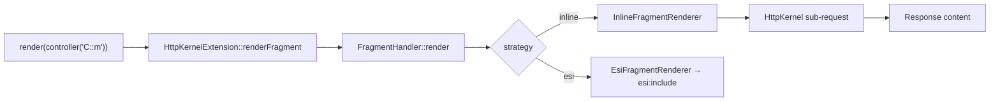

# Controller Rendering

!!! tip "In a nutshell"
    Quand un fragment a besoin de ses propres données, embarquez un controller
    avec `render(controller(...))` plutôt que de faire des requêtes dans le
    template. Point d'examen : le rendu inline est une vraie sous-request
    HttpKernel ; `render_esi` délègue à un reverse proxy.

!!! example "Real-world analogy"
    Embarquer un controller, c'est comme une page de journal qui envoie un jeune
    reporter chercher l'encadré « dernières nouvelles » pendant que l'article
    principal est mis en page. `render(controller(...))` dépêche ce reporter —
    une vraie sous-request — qui revient avec une coupure finie et autonome.
    L'ESI confie le même travail à la presse d'imprimerie (un reverse proxy) pour
    que l'encadré puisse être réutilisé d'une édition à l'autre.

!!! abstract "Learning objectives"
    À la fin de ce chapitre, vous saurez :

    - [ ] Embarquer la sortie d'un controller avec `render(controller(...))`.
    - [ ] Choisir entre le rendu de fragment inline, ESI et hinclude.
    - [ ] Décider quand embarquer un controller vaut mieux qu'un `include`.

    **Syllabus:** `Templating (Twig) → Controller rendering` ·
    **Level:** Expert ·
    **Est. time:** 25 min ·
    **Prerequisites:** [Includes](includes.md), [Controllers](../controllers/index.md)

---

## Theory

Parfois, un fragment a besoin de **sa propre logique et de ses propres données** —
une barre latérale « dernières nouvelles », un résumé de panier, un menu
construit depuis la base de données. Au lieu de récupérer ces données dans le
controller principal, **embarquez un controller** et laissez-le se rendre
lui-même :

```twig
{{ render(controller('App\\Controller\\NewsController::latest', { max: 3 })) }}
```

`controller('…::method', {args})` construit une **référence** vers un
controller ; `render()` l'exécute en **sous-request** et insère le contenu de la
`Response` retournée.

!!! question "Predict first"
    Vous livrez `render_esi(controller(...))` mais la production n'a **aucun**
    reverse proxy compatible ESI. Le fragment plante-t-il, se rend-il vide, ou
    autre chose ?

??? note "Reveal"
    Il **retombe sur le rendu inline** — une sous-request HttpKernel normale.
    L'ESI est une amélioration progressive : `FragmentHandler` se dégrade
    gracieusement vers le renderer inline quand aucun proxy n'annonce le support
    ESI, si bien que la page se rend quand même (juste sans cache indépendant).

## Deep Dive — how it works internally

`render` et `controller` sont fournis par
**`Symfony\Bridge\Twig\Extension\HttpKernelExtension`**, qui délègue à
**`Symfony\Component\HttpKernel\Fragment\FragmentHandler`**. Le handler choisit
un **`FragmentRendererInterface`** par nom de stratégie :

| Appel Twig | Renderer | Ce qu'il fait |
|---|---|---|
| `render(controller(...))` | `InlineFragmentRenderer` | sous-request immédiate, insérée |
| `render_esi(controller(...))` | `EsiFragmentRenderer` | émet un tag `<esi:include>` |
| `render_hinclude(...)` | `HIncludeFragmentRenderer` | émet un tag JS/hinclude |



- **Inline** émet une vraie sous-request via `HttpKernel::handle(..., SUB_REQUEST)`,
  donc tout le cycle de vie de la request (listeners, resolver) s'exécute pour le
  fragment. Cela coûte une sous-request mais reste transparent et fonctionne partout.
- **ESI** délègue le rendu à un **reverse proxy** (le `HttpCache` de Symfony ou
  Varnish) : le fragment peut être mis en cache indépendamment de la page. Si
  aucun proxy ne supporte l'ESI, Symfony retombe sur l'inline. Voir
  [HTTP Caching → ESI](../http-caching/esi.md).
- **hinclude** retourne un placeholder résolu par le **navigateur** via
  JavaScript — la page se rend immédiatement et le fragment se charge de façon
  asynchrone.
- Les controllers embarqués ne sont normalement exposés qu'aux sous-requests ;
  pour autoriser des URL ESI/hinclude directes, activez le listener/la route
  **`fragments`** (`framework.fragments`).

!!! note "Source reference"
    `Symfony\Bridge\Twig\Extension\HttpKernelExtension`,
    `Symfony\Component\HttpKernel\Fragment\FragmentHandler` —
    [symfony/symfony `8.0`](https://github.com/symfony/symfony/blob/8.0/src/Symfony/Component/HttpKernel/Fragment/FragmentHandler.php).

## Configuration & code

=== "Twig"

    ```twig
    {# inline sub-request #}
    {{ render(controller('App\\Controller\\CartController::summary')) }}

    {# cached independently by a reverse proxy #}
    {{ render_esi(controller('App\\Controller\\NewsController::latest', { max: 5 })) }}
    ```

=== "The embedded controller"

    ```php
    <?php
    declare(strict_types=1);

    namespace App\Controller;

    use App\Repository\NewsRepository;
    use Symfony\Bundle\FrameworkBundle\Controller\AbstractController;
    use Symfony\Component\HttpFoundation\Response;

    final class NewsController extends AbstractController
    {
        public function latest(NewsRepository $repo, int $max = 3): Response
        {
            return $this->render('news/_latest.html.twig', [
                'items' => $repo->findLatest($max),
            ]);
        }
    }
    ```

=== "YAML — enable fragments"

    ```yaml
    # config/packages/framework.yaml
    framework:
        fragments:
            enabled: true
            path: /_fragment
        esi: { enabled: true }
    ```

## Best practices & anti-patterns

| ✅ À faire | ❌ À éviter |
|---|---|
| Embarquer un controller pour ses propres données | Interroger la BDD dans un template |
| `render_esi` pour les morceaux mis en cache indépendamment | L'ESI pour de petits fragments toujours frais |
| Garder les controllers embarqués petits | Embarquer de nombreux fragments inline par page |
| Passer des scalaires via les arguments de `controller()` | Passer de gros objets entre sous-requests |

## When (not) to use it / alternatives

- **`include`** — le fragment n'a besoin que de variables déjà disponibles. Le moins cher.
- **`render(controller())`** — le fragment a besoin de **ses propres** services/données/cache.
- **`render_esi`** — le fragment a une **durée de cache différente** de la page et
  un reverse proxy est disponible.

Chaque embed inline est une sous-request ; en abuser nuit aux performances.
Préférez les includes simples sauf si le fragment a réellement besoin d'une
logique isolée.

!!! danger "Certification traps"
    - `render()` prend le **résultat** de `controller()`, pas directement une
      chaîne de controller pour les stratégies de fragment — `controller()`
      construit la référence.
    - Le rendu inline est une **vraie sous-request** (les listeners s'exécutent à
      nouveau), pas un appel de fonction.
    - `render_esi` **retombe sur l'inline** si aucun proxy compatible ESI n'est présent.
    - Les controllers embarqués ne sont joignables directement que lorsque les
      **fragments** sont activés (et l'URL signée).

!!! warning "Common mistakes"
    - Faire des requêtes BDD dans le controller parent *et* les transmettre alors
      qu'un controller embarqué autonome isolerait les responsabilités.
    - Oublier qu'une sous-request a sa **propre** `Request` — les attributs de la
      request parente ne sont pas automatiquement partagés.

## Exercises

1. **(Basic)** Embarquez `CartController::summary` en inline dans le header.
2. **(Intermediate)** Rendez la liste des nouvelles via ESI pour qu'elle soit
   mise en cache séparément.
3. **(Advanced)** Expliquez ce qu'il advient des listeners quand le fragment
   inline est rendu.

??? success "Solutions"

    **1.** `{{ render(controller('App\\Controller\\CartController::summary')) }}`.

    **2.** `{{ render_esi(controller('App\\Controller\\NewsController::latest')) }}`
    avec `framework.esi.enabled: true`.

    **3.** Une sous-request complète traverse `HttpKernel`, déclenchant les events
    du kernel (`REQUEST`, `CONTROLLER`, `RESPONSE`) pour le fragment de façon
    indépendante.

## Certification questions

??? question "Q1. `render(controller('C::m'))` executes the controller as…"
    - [x] A. A sub-request through HttpKernel ✅
    - [ ] B. A static method call, no request
    - [ ] C. A redirect
    - [ ] D. A CLI command

    **Why:** Le renderer inline émet une `SUB_REQUEST`. **Ref:**
    [Embedding controllers](https://symfony.com/doc/current/templates.html#embedding-controllers).

??? question "Q2. What happens with `render_esi` and no ESI-capable proxy?"
    - [x] A. It falls back to inline rendering ✅
    - [ ] B. It throws
    - [ ] C. It renders nothing
    - [ ] D. It caches forever

    **Why:** Symfony dégrade l'ESI vers l'inline quand aucun proxy ne le gère. **Ref:**
    [ESI](https://symfony.com/doc/current/http_cache/esi.html).

??? question "Q3. Which handler chooses the fragment renderer?"
    - [x] A. `FragmentHandler` ✅
    - [ ] B. `UrlGenerator`
    - [ ] C. `EscaperExtension`
    - [ ] D. `AppVariable`

    **Why:** `FragmentHandler` sélectionne le `FragmentRendererInterface`. **Ref:**
    [FragmentHandler](https://github.com/symfony/symfony/blob/8.0/src/Symfony/Component/HttpKernel/Fragment/FragmentHandler.php).

## Key takeaways

- `render(controller(...))` embarque un controller en sous-request (inline).
- `render_esi` délègue à un reverse proxy ; `render_hinclude` au navigateur.
- Soutenu par `HttpKernelExtension` → `FragmentHandler` → un `FragmentRenderer`.
- N'utilisez-le que quand le fragment a besoin de sa propre logique/données/cache.

## Last-minute revision

!!! tip "Cheat sheet"
    - `render(controller('C::m', {a:1}))` = sous-request inline.
    - `render_esi(...)` = cache par reverse proxy, retombe sur l'inline.
    - Activation via `framework.fragments` / `framework.esi`.
    - `include` pour les fragments peu coûteux ; embed pour la logique isolée.

## Connections

- **Depends on:** [Includes](includes.md) — l'embed est l'alternative plus lourde quand un simple `include` ne peut pas récupérer ses propres données.
- **Reused in:** [HTTP Caching → ESI](../http-caching/esi.md) — `render_esi` est là où le cache de fragments par un reverse proxy devient rentable.
- **Confused with:** [Controllers](../controllers/index.md) — le rendu inline est une vraie **sous-request**, pas un simple appel de méthode.

## Official References
- [Official — Embedding controllers](https://symfony.com/doc/current/templates.html#embedding-controllers)
- [Official — ESI](https://symfony.com/doc/current/http_cache/esi.html)
- [Symfony source — FragmentHandler](https://github.com/symfony/symfony/blob/8.0/src/Symfony/Component/HttpKernel/Fragment/FragmentHandler.php)

## Video references

!!! tip "Watch & learn"
    Ce sont des chaînes vidéo officielles, mises à jour en continu — cherchez-y
    « Twig templating » pour consolider ce chapitre. Nous lions des chaînes
    stables plutôt que des vidéos individuelles afin que les références ne
    périment jamais.

    - [SymfonyCasts screencasts](https://symfonycasts.com/tracks/symfony) — tutoriels scénarisés à suivre en codant.
    - [Symfony official YouTube](https://www.youtube.com/@SymfonyOfficial) — conférences SymfonyCon & keynotes.
    - [Official docs for this topic](https://symfony.com/doc/current/templates.html#embedding-controllers) — certaines pages de la doc Symfony intègrent un screencast.

## Confidence check

Je suis prêt quand je peux :

- [ ] expliquer **pourquoi** embarquer un controller plutôt que de faire des requêtes dans le template
- [ ] embarquer un controller en inline et via ESI en Symfony 8
- [ ] déboguer un fragment qui relance les listeners du kernel dans sa propre sous-request
- [ ] repérer la réponse piège sur `render_esi` sans proxy ESI
- [ ] expliquer le chemin `HttpKernelExtension` → `FragmentHandler` → renderer

---

<small>Related: [Includes](includes.md) · [HTTP Caching → ESI](../http-caching/esi.md) · [Controllers](../controllers/index.md)</small>
