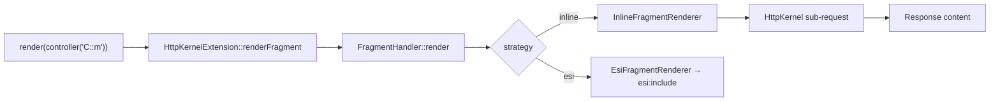

# Controller Rendering

!!! tip "In a nutshell"
    When a fragment needs its own data, embed a controller with
    `render(controller(...))` instead of querying in the template. Exam hook: inline
    rendering is a real HttpKernel sub-request; `render_esi` defers to a reverse proxy.

!!! example "Real-world analogy"
    Embedding a controller is like a newspaper page that sends a junior reporter to
    fetch the "latest headlines" box while the main story is laid out.
    `render(controller(...))` dispatches that reporter — a real sub-request — who
    returns with a finished, self-contained clipping. ESI hands the same job to the
    printing press (a reverse proxy) so the box can be reused across editions.

!!! abstract "Learning objectives"
    By the end of this chapter you can:

    - [ ] Embed a controller's output with `render(controller(...))`.
    - [ ] Choose between inline, ESI and hinclude fragment rendering.
    - [ ] Decide when embedding a controller beats an `include`.

    **Syllabus:** `Templating (Twig) → Controller rendering` ·
    **Level:** Expert ·
    **Est. time:** 25 min ·
    **Prerequisites:** [Includes](includes.md), [Controllers](../controllers/index.md)

---

## Theory

Sometimes a fragment needs its **own logic and data** — a "latest news" sidebar,
a cart summary, a menu built from the database. Instead of fetching that data in
the main controller, **embed a controller** and let it render itself:

```twig
{{ render(controller('App\\Controller\\NewsController::latest', { max: 3 })) }}
```

`controller('…::method', {args})` builds a **reference** to a controller; `render()`
executes it as a **sub-request** and inlines the returned `Response` content.

## Deep Dive — how it works internally

`render` and `controller` are provided by
**`Symfony\Bridge\Twig\Extension\HttpKernelExtension`**, which delegates to
**`Symfony\Component\HttpKernel\Fragment\FragmentHandler`**. The handler picks a
**`FragmentRendererInterface`** by strategy name:

| Twig call | Renderer | What it does |
|---|---|---|
| `render(controller(...))` | `InlineFragmentRenderer` | sub-request now, inlined |
| `render_esi(controller(...))` | `EsiFragmentRenderer` | emits an `<esi:include>` tag |
| `render_hinclude(...)` | `HIncludeFragmentRenderer` | emits a JS/hinclude tag |



- **Inline** issues a real sub-request through `HttpKernel::handle(..., SUB_REQUEST)`,
  so the full request lifecycle (listeners, resolver) runs for the fragment. This
  costs a sub-request but is transparent and works everywhere.
- **ESI** defers rendering to a **reverse proxy** (Symfony's `HttpCache` or
  Varnish): the fragment can be cached independently of the page. If no proxy
  supports ESI, Symfony falls back to inline. See
  [HTTP Caching → ESI](../http-caching/esi.md).
- **hinclude** returns a placeholder resolved by the **browser** via JavaScript —
  the page renders immediately and the fragment loads asynchronously.
- Embedded controllers are normally exposed only to sub-requests; to allow direct
  ESI/hinclude URLs you enable the **`fragments`** listener/route
  (`framework.fragments`).

!!! note "Source reference"
    `Symfony\Bridge\Twig\Extension\HttpKernelExtension`,
    `Symfony\Component\HttpKernel\Fragment\FragmentHandler` —
    [symfony/symfony `8.0`](https://github.com/symfony/symfony/blob/8.0/src/Symfony/Component/HttpKernel/Fragment/FragmentHandler.php).

## Configuration & code

=== "Twig"

    ```twig
    {# inline sub-request #}
    {{ render(controller('App\\Controller\\CartController::summary')) }}

    {# cached independently by a reverse proxy #}
    {{ render_esi(controller('App\\Controller\\NewsController::latest', { max: 5 })) }}
    ```

=== "The embedded controller"

    ```php
    <?php
    declare(strict_types=1);

    namespace App\Controller;

    use App\Repository\NewsRepository;
    use Symfony\Bundle\FrameworkBundle\Controller\AbstractController;
    use Symfony\Component\HttpFoundation\Response;

    final class NewsController extends AbstractController
    {
        public function latest(NewsRepository $repo, int $max = 3): Response
        {
            return $this->render('news/_latest.html.twig', [
                'items' => $repo->findLatest($max),
            ]);
        }
    }
    ```

=== "YAML — enable fragments"

    ```yaml
    # config/packages/framework.yaml
    framework:
        fragments:
            enabled: true
            path: /_fragment
        esi: { enabled: true }
    ```

## Best practices & anti-patterns

| ✅ Do | ❌ Avoid |
|---|---|
| Embed a controller for its own data | Querying the DB inside a template |
| `render_esi` for independently-cached bits | ESI for tiny always-fresh fragments |
| Keep embedded controllers small | Embedding many inline fragments per page |
| Pass scalars via `controller()` args | Passing large objects across sub-requests |

## When (not) to use it / alternatives

- **`include`** — fragment needs only variables you already have. Cheapest.
- **`render(controller())`** — fragment needs its **own** services/data/cache.
- **`render_esi`** — fragment has a **different cache lifetime** than the page and
  a reverse proxy is available.

Each inline embed is a sub-request; overusing it hurts performance. Prefer plain
includes unless the fragment genuinely needs isolated logic.

!!! danger "Certification traps"
    - `render()` takes the **result** of `controller()`, not a controller string
      directly for the fragment strategies — `controller()` builds the reference.
    - Inline rendering is a **real sub-request** (listeners run again), not a
      function call.
    - `render_esi` **falls back to inline** if no ESI-capable proxy is present.
    - Embedded controllers are reachable directly only when **fragments** are
      enabled (and the URL is signed).

!!! warning "Common mistakes"
    - Doing DB queries in the parent controller *and* passing them down when a
      self-contained embedded controller would isolate concerns.
    - Forgetting that a sub-request has its **own** `Request` — parent request
      attributes are not automatically shared.

## Exercises

1. **(Basic)** Embed `CartController::summary` inline in the header.
2. **(Intermediate)** Render the news list via ESI so it caches separately.
3. **(Advanced)** Explain what happens to listeners when the inline fragment is
   rendered.

??? success "Solutions"

    **1.** `{{ render(controller('App\\Controller\\CartController::summary')) }}`.

    **2.** `{{ render_esi(controller('App\\Controller\\NewsController::latest')) }}`
    with `framework.esi.enabled: true`.

    **3.** A full sub-request runs through `HttpKernel`, firing kernel events
    (`REQUEST`, `CONTROLLER`, `RESPONSE`) for the fragment independently.

## Certification questions

??? question "Q1. `render(controller('C::m'))` executes the controller as…"
    - [x] A. A sub-request through HttpKernel ✅
    - [ ] B. A static method call, no request
    - [ ] C. A redirect
    - [ ] D. A CLI command

    **Why:** The inline renderer issues a `SUB_REQUEST`. **Ref:**
    [Embedding controllers](https://symfony.com/doc/current/templates.html#embedding-controllers).

??? question "Q2. What happens with `render_esi` and no ESI-capable proxy?"
    - [x] A. It falls back to inline rendering ✅
    - [ ] B. It throws
    - [ ] C. It renders nothing
    - [ ] D. It caches forever

    **Why:** Symfony degrades ESI to inline when no proxy handles it. **Ref:**
    [ESI](https://symfony.com/doc/current/http_cache/esi.html).

??? question "Q3. Which handler chooses the fragment renderer?"
    - [x] A. `FragmentHandler` ✅
    - [ ] B. `UrlGenerator`
    - [ ] C. `EscaperExtension`
    - [ ] D. `AppVariable`

    **Why:** `FragmentHandler` selects the `FragmentRendererInterface`. **Ref:**
    [FragmentHandler](https://github.com/symfony/symfony/blob/8.0/src/Symfony/Component/HttpKernel/Fragment/FragmentHandler.php).

## Key takeaways

- `render(controller(...))` embeds a controller as a sub-request (inline).
- `render_esi` defers to a reverse proxy; `render_hinclude` to the browser.
- Backed by `HttpKernelExtension` → `FragmentHandler` → a `FragmentRenderer`.
- Use it only when the fragment needs its own logic/data/cache.

## Last-minute revision

!!! tip "Cheat sheet"
    - `render(controller('C::m', {a:1}))` = inline sub-request.
    - `render_esi(...)` = reverse-proxy cache, falls back to inline.
    - Enable via `framework.fragments` / `framework.esi`.
    - `include` for cheap fragments; embed for isolated logic.

## Official References
- [Official — Embedding controllers](https://symfony.com/doc/current/templates.html#embedding-controllers)
- [Official — ESI](https://symfony.com/doc/current/http_cache/esi.html)
- [Symfony source — FragmentHandler](https://github.com/symfony/symfony/blob/8.0/src/Symfony/Component/HttpKernel/Fragment/FragmentHandler.php)

---

<small>Related: [Includes](includes.md) · [HTTP Caching → ESI](../http-caching/esi.md) · [Controllers](../controllers/index.md)</small>
