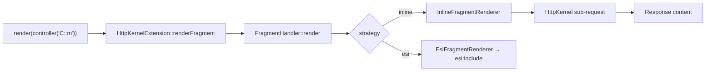

# Controller Rendering

!!! tip "In a nutshell"
    When a fragment needs its own data, embed a controller with
    `render(controller(...))` instead of querying in the template. Exam hook: inline
    rendering is a real HttpKernel sub-request.

!!! example "Real-world analogy"
    Embedding a controller is like a newspaper page that sends a junior reporter to
    fetch the "latest headlines" box while the main story is laid out.
    `render(controller(...))` dispatches that reporter — a real sub-request — who
    returns with a finished, self-contained clipping.

!!! abstract "Learning objectives"
    By the end of this chapter you can:

    - [ ] Embed a controller's output with `render(controller(...))`.
    - [ ] Choose between inline and hinclude fragment rendering.
    - [ ] Decide when embedding a controller beats an `include`.

    **Syllabus:** `Templating (Twig) → Controller rendering` ·
    **Level:** Expert ·
    **Est. time:** 25 min ·
    **Prerequisites:** [Includes](includes.md), [Controllers](../controllers/index.md)

---

## Theory

Sometimes a fragment needs its **own logic and data** — a "latest news" sidebar,
a cart summary, a menu built from the database. Instead of fetching that data in
the main controller, **embed a controller** and let it render itself:

```twig
{{ render(controller('App\\Controller\\NewsController::latest', { max: 3 })) }}
```

`controller('…::method', {args})` builds a **reference** to a controller; `render()`
executes it as a **sub-request** and inlines the returned `Response` content.

```twig
{# controller() only builds a reference — nothing executes yet #}


{# render() runs it as a sub-request and inlines the Response body #}
{{ render(ref) }}
```

## Deep Dive — how it works internally

`render` and `controller` are provided by
**`Symfony\Bridge\Twig\Extension\HttpKernelExtension`**, which delegates to
**`Symfony\Component\HttpKernel\Fragment\FragmentHandler`**. The handler picks a
**`FragmentRendererInterface`** by strategy name:

| Twig call | Renderer | What it does |
|---|---|---|
| `render(controller(...))` | `InlineFragmentRenderer` | sub-request now, inlined |
| `render_esi(controller(...))` | `EsiFragmentRenderer` | emits an `<esi:include>` tag |
| `render_hinclude(...)` | `HIncludeFragmentRenderer` | emits a JS/hinclude tag |

```php
use Symfony\Component\HttpKernel\Controller\ControllerReference;
use Symfony\Component\HttpKernel\Fragment\FragmentHandler;
use Symfony\Component\HttpKernel\Fragment\InlineFragmentRenderer;

// FragmentHandler holds one FragmentRendererInterface per strategy name
$handler = new FragmentHandler(
    $requestStack,
    [new InlineFragmentRenderer($kernel)],
);

// what HttpKernelExtension does for {{ render(controller('C::m')) }}:
$ref = new ControllerReference(
    'App\\Controller\\NewsController::latest',
    ['max' => 3],
);
echo $handler->render($ref, 'inline');
```



- **Inline** issues a real sub-request through `HttpKernel::handle(..., SUB_REQUEST)`,
  so the full request lifecycle (listeners, resolver) runs for the fragment. This
  costs a sub-request but is transparent and works everywhere.
- **hinclude** returns a placeholder resolved by the **browser** via JavaScript —
  the page renders immediately and the fragment loads asynchronously.
- Embedded controllers are normally exposed only to sub-requests; to allow direct
  hinclude URLs you enable the **`fragments`** listener/route
  (`framework.fragments`).
- `render_esi(...)` also exists as a third strategy, deferring the fragment to a
  reverse proxy. **Excluded from Symfony 8 certification** — see
  [HTTP Caching → ESI](../http-caching/esi.md).

```yaml
# config/packages/framework.yaml
framework:
    # fragments listener/route: allow direct (signed) hinclude URLs;
    # hinclude placeholders are resolved by the browser via JavaScript
    fragments:
        enabled: true
        path: /_fragment
```

!!! note "Source reference"
    `Symfony\Bridge\Twig\Extension\HttpKernelExtension`,
    `Symfony\Component\HttpKernel\Fragment\FragmentHandler` —
    [symfony/symfony `8.0`](https://github.com/symfony/symfony/blob/8.0/src/Symfony/Component/HttpKernel/Fragment/FragmentHandler.php).

## Configuration & code

=== "Twig"

    ```twig
    {# inline sub-request #}
    {{ render(controller('App\\Controller\\CartController::summary')) }}

    {# placeholder resolved asynchronously by the browser #}
    {{ render_hinclude(controller(
        'App\\Controller\\NewsController::latest',
        { max: 5 }
    )) }}
    ```

=== "The embedded controller"

    ```php
    <?php
    declare(strict_types=1);

    namespace App\Controller;

    use App\Repository\NewsRepository;
    use Symfony\Bundle\FrameworkBundle\Controller\AbstractController;
    use Symfony\Component\HttpFoundation\Response;

    final class NewsController extends AbstractController
    {
        public function latest(NewsRepository $repo, int $max = 3): Response
        {
            return $this->render('news/_latest.html.twig', [
                'items' => $repo->findLatest($max),
            ]);
        }
    }
    ```

=== "YAML — enable fragments"

    ```yaml
    # config/packages/framework.yaml
    framework:
        fragments:
            enabled: true
            path: /_fragment
    ```

## Best practices & anti-patterns

| ✅ Do | ❌ Avoid |
|---|---|
| Embed a controller for its own data | Querying the DB inside a template |
| `render_hinclude` for content that can load asynchronously | Blocking the whole page on a slow inline fragment |
| Keep embedded controllers small | Embedding many inline fragments per page |
| Pass scalars via `controller()` args | Passing large objects across sub-requests |

## When (not) to use it / alternatives

- **`include`** — fragment needs only variables you already have. Cheapest.
- **`render(controller())`** — fragment needs its **own** services/data/cache.
- **`render_hinclude`** — fragment can load asynchronously after the main page.

Each inline embed is a sub-request; overusing it hurts performance. Prefer plain
includes unless the fragment genuinely needs isolated logic.

!!! danger "Certification traps"
    - `render()` takes the **result** of `controller()`, not a controller string
      directly for the fragment strategies — `controller()` builds the reference.
    - Inline rendering is a **real sub-request** (listeners run again), not a
      function call.
    - Embedded controllers are reachable directly only when **fragments** are
      enabled (and the URL is signed).

!!! warning "Common mistakes"
    - Doing DB queries in the parent controller *and* passing them down when a
      self-contained embedded controller would isolate concerns.
    - Forgetting that a sub-request has its **own** `Request` — parent request
      attributes are not automatically shared.

## Exercises

1. **(Basic)** Embed `CartController::summary` inline in the header.
2. **(Intermediate)** Render the news list via hinclude so it loads asynchronously.
3. **(Advanced)** Explain what happens to listeners when the inline fragment is
   rendered.

??? success "Solutions"

    **1.** `{{ render(controller('App\\Controller\\CartController::summary')) }}`.

    **2.** `{{ render_hinclude(controller('App\\Controller\\NewsController::latest')) }}`.

    **3.** A full sub-request runs through `HttpKernel`, firing kernel events
    (`REQUEST`, `CONTROLLER`, `RESPONSE`) for the fragment independently.

## Certification questions

??? question "Q1. `render(controller('C::m'))` executes the controller as…"
    - [x] A. A sub-request through HttpKernel ✅
    - [ ] B. A static method call, no request
    - [ ] C. A redirect
    - [ ] D. A CLI command

    **Why:** The inline renderer issues a `SUB_REQUEST`. **Ref:**
    [Embedding controllers](https://symfony.com/doc/current/templates.html#embedding-controllers).

??? question "Q2. Which handler chooses the fragment renderer?"
    - [x] A. `FragmentHandler` ✅
    - [ ] B. `UrlGenerator`
    - [ ] C. `EscaperExtension`
    - [ ] D. `AppVariable`

    **Why:** `FragmentHandler` selects the `FragmentRendererInterface`. **Ref:**
    [FragmentHandler](https://github.com/symfony/symfony/blob/8.0/src/Symfony/Component/HttpKernel/Fragment/FragmentHandler.php).

## Key takeaways

- `render(controller(...))` embeds a controller as a sub-request (inline).
- `render_hinclude` defers loading to the browser via a JS placeholder.
- Backed by `HttpKernelExtension` → `FragmentHandler` → a `FragmentRenderer`.
- Use it only when the fragment needs its own logic/data/cache.

## Last-minute revision

!!! tip "Cheat sheet"
    - `render(controller('C::m', {a:1}))` = inline sub-request.
    - `render_hinclude(...)` = async placeholder resolved by the browser.
    - Enable direct fragment URLs via `framework.fragments`.
    - `include` for cheap fragments; embed for isolated logic.

## Connections

- **Depends on:** [Includes](includes.md) — embedding is the heavier alternative when a plain `include` can't fetch its own data.
- **Related but excluded:** [HTTP Caching → ESI](../http-caching/esi.md) — `render_esi` uses the same `FragmentHandler` but ESI itself is **excluded from Symfony 8 certification**.
- **Confused with:** [Controllers](../controllers/index.md) — inline rendering is a real **sub-request**, not a plain method call.

## Official References
- [Official — Embedding controllers](https://symfony.com/doc/current/templates.html#embedding-controllers)
- [Symfony source — FragmentHandler](https://github.com/symfony/symfony/blob/8.0/src/Symfony/Component/HttpKernel/Fragment/FragmentHandler.php)

## Video references

!!! tip "Watch & learn"
    These are official, continuously-updated video channels — search them for
    "Twig templating" to reinforce this chapter. We link stable channels rather than
    individual videos so the references never rot.

    - [SymfonyCasts screencasts](https://symfonycasts.com/tracks/symfony) — scripted, code-along tutorials.
    - [Symfony official YouTube](https://www.youtube.com/@SymfonyOfficial) — SymfonyCon conference talks & keynotes.
    - [Official docs for this topic](https://symfony.com/doc/current/templates.html#embedding-controllers) — some Symfony doc pages embed a screencast.

## Confidence check

I'm ready when I can:

- [ ] explain **why** to embed a controller instead of querying in the template
- [ ] embed a controller inline and via hinclude in Symfony 8
- [ ] debug a fragment that reruns kernel listeners as its own sub-request
- [ ] explain the `HttpKernelExtension` → `FragmentHandler` → renderer path

---

<small>Related: [Includes](includes.md) · [Controllers](../controllers/index.md)</small>
