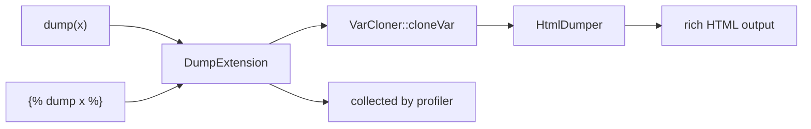

# Debugging Variables

!!! tip "In a nutshell"
    `{{ dump(x) }}` affiche une vue VarDumper riche en ligne ; ``
    l'envoie à la toolbar sans markup dans la page. Point d'examen : l'outillage
    de dump n'existe qu'en debug/dev — un `dump()` oublié provoque une erreur en prod.

!!! example "Real-world analogy"
    `dump()` est la valise de diagnostic du mécanicien branchée sur une voiture
    montée sur le pont de l'atelier. Elle affiche une lecture riche et dépliable
    de l'état de n'importe quel composant — bien plus qu'un simple voyant
    (`var_dump`). La fonction `{{ dump() }}` imprime cette lecture sur un écran
    fixé au tableau de bord, là où vous vous tenez, tandis que `` envoie
    les mêmes données à la console centrale de l'atelier sans encombrer le
    tableau de bord. Point crucial : la prise de diagnostic n'existe que sur les
    voitures d'atelier (debug/dev) ; livrez une voiture à un client avec la valise
    encore branchée (prod) et elle bloque complètement le démarrage.

!!! abstract "Learning objectives"
    À la fin de ce chapitre, vous saurez :

    - [ ] Inspecter les variables de template avec `dump()` et ``.
    - [ ] Expliquer la `DumpExtension` de Symfony vs l'extension de debug du cœur de Twig.
    - [ ] Choisir entre `{{ dump() }}` et le profiler pour le diagnostic.

    **Syllabus:** `Templating (Twig) → Debugging variables` ·
    **Level:** Advanced ·
    **Est. time:** 15 min ·
    **Prerequisites:** [Twig Syntax](syntax.md)

---

## Theory

`dump()` rend une vue riche et dépliable de n'importe quelle variable —
l'équivalent côté template du `dump()`/`var_dump()` de PHP :

```twig
{{ dump(user) }}          {# dump one variable, prints inline #}
{{ dump(user, order) }}   {# dump several #}
{{ dump() }}              {# dump ALL variables in the current context #}
           {# tag form: sends to output, prints nothing here #}
```

`dump()` (fonction) **affiche** le dump là où elle est appelée ; ``
(tag) envoie les données vers la destination de dump **sans** injecter de markup
dans la page.

```twig
{# function form: prints the dump right here in the page #}
{{ dump(order) }}

{# tag form: nothing rendered here — data goes to the profiler/toolbar #}

```

!!! question "Predict first"
    Un `{{ dump(order) }}` se glisse dans un template commité et atteint la
    **production**. Que se passe-t-il à la première request qui le rend ?

??? note "Reveal"
    Une erreur fatale `Unknown "dump" function`. La `DumpExtension` n'est
    enregistrée **qu'en** mode debug, donc la fonction n'existe tout simplement
    pas en `prod`. L'outillage de dump est une commodité réservée au dev —
    retirez les dumps avant de déployer et utilisez les logs/le profiler (dans un
    environnement non prod) pour le diagnostic.

## Deep Dive — how it works internally

Deux couches existent :

- Le **cœur de Twig** fournit `Twig\Extension\DebugExtension`, qui propose un
  `dump()` basique adossé à `var_dump`. Elle ne fonctionne que lorsque l'option
  `debug` de l'environnement est activée.
- **Symfony** la remplace/l'enrichit avec
  **`Symfony\Bridge\Twig\Extension\DumpExtension`**, câblée au composant
  **VarDumper** (`Symfony\Component\VarDumper\Dumper\HtmlDumper` +
  `VarCloner`). Cela donne la sortie repliable avec coloration syntaxique et
  route les dumps vers la **web debug toolbar / le profiler** en dev.

```php
use Symfony\Component\VarDumper\Cloner\VarCloner;
use Symfony\Component\VarDumper\Dumper\HtmlDumper;

// Twig core: DebugExtension = plain var_dump-based dump(), needs debug: true
$twig = new \Twig\Environment($loader, ['debug' => true]);
$twig->addExtension(new \Twig\Extension\DebugExtension());

// Symfony's DumpExtension routes dump() through VarDumper instead:
$cloner = new VarCloner();  // safely clones the variable graph
$dumper = new HtmlDumper(); // renders the collapsible, highlighted view
$dumper->dump($cloner->cloneVar($order));
```



- Les deux ne sont enregistrées **qu'en mode debug** (`kernel.debug` / `dev`) ;
  en `prod`, `dump()` n'est pas disponible, donc un `dump()` oublié lève une
  erreur « unknown function » — retirez-les avant de déployer.
- `dump()` **sans argument** dump tout le contexte de rendu (toutes les variables
  passées plus les globales).
- Comme VarDumper clone d'abord la variable, dumper de grands graphes d'objets
  est sûr (il limite la profondeur) mais peut être gourmand en mémoire sur de
  très grosses structures.

```twig
{# dev (kernel.debug = true): both forms are available #}
{{ dump(user) }}
{{ dump() }}   {# no args: the whole context, variables + globals #}

{# prod: DumpExtension is not registered — this template fails
   to compile with: Unknown "dump" function #}
```

!!! note "Source reference"
    `Symfony\Bridge\Twig\Extension\DumpExtension`,
    `Symfony\Component\VarDumper\Cloner\VarCloner` —
    [symfony/symfony `8.0`](https://github.com/symfony/symfony/blob/8.0/src/Symfony/Bridge/Twig/Extension/DumpExtension.php).

## Configuration & code

=== "Twig usage"

    ```twig
    {# inline, expandable #}
    <pre>{{ dump(order) }}</pre>

    {# whole context #}
    {{ dump() }}

    {# tag: no markup injected, shows in toolbar #}
    
    ```

=== "YAML (debug bundle)"

    ```yaml
    # config/packages/debug.yaml  (dev only, auto-configured)
    when@dev:
        debug:
            dump_destination: "tcp://%env(VAR_DUMPER_SERVER)%"
    ```

## Best practices & anti-patterns

| ✅ À faire | ❌ À éviter |
|---|---|
| `dump()` en dev pour inspecter les données | Des `dump()` laissés dans des templates commités |
| `` pour garder le markup propre | `dump()` dans une boucle de 10 000 lignes |
| Le profiler pour une vue à l'échelle de la request | `dump()` pour du profiling de performance |
| Retirer les dumps avant la prod | Compter sur `dump()` en `prod` (indisponible) |

## When (not) to use it / alternatives

Utilisez `dump()`/`` pour un **coup d'œil rapide** sur une variable
pendant la construction d'un template. Pour un diagnostic à l'échelle de la
request (requêtes, events, timing, la vue complète translation/route/sécurité),
utilisez le **Profiler / la web debug toolbar**. Pour les problèmes en
production, utilisez les logs — jamais `dump()`.

!!! danger "Certification traps"
    - `dump()` et `` ne sont disponibles **qu'en debug/dev** ; ils
      provoquent une erreur en `prod`.
    - `{{ dump() }}` (fonction) **imprime** dans la page ; `` (tag)
      n'injecte **pas** de markup (il va au collector/à la toolbar).
    - `dump()` sans argument dump le **contexte entier**.
    - Le dump riche de Symfony vient de **VarDumper**, pas de la simple
      `DebugExtension` de Twig.

!!! warning "Common mistakes"
    - Déployer avec un `{{ dump() }}` oublié → `Unknown "dump" function` en prod.
    - Confondre l'emplacement de sortie de `dump()` : la forme tag n'apparaît pas
      en ligne.

## Exercises

1. **(Basic)** Dumpez la variable `product` en ligne.
2. **(Intermediate)** Dumpez toutes les variables disponibles dans le template courant.
3. **(Advanced)** Expliquez pourquoi `{{ dump() }}` échoue en `prod` et quoi
   utiliser à la place.

??? success "Solutions"

    **1.** `{{ dump(product) }}`.

    **2.** `{{ dump() }}` — sans argument, dump tout le contexte.

    **3.** La `DumpExtension` n'est enregistrée qu'en mode debug, donc la fonction
    est indéfinie en `prod` ; utilisez plutôt les logs ou le profiler (dans un
    environnement non prod), et retirez les dumps avant de déployer.

## Certification questions

??? question "Q1. What does `{{ dump() }}` with no arguments do?"
    - [x] A. Dumps all variables in the current context ✅
    - [ ] B. Dumps nothing
    - [ ] C. Throws
    - [ ] D. Dumps only globals

    **Why:** Un `dump()` sans argument affiche le contexte de rendu entier. **Ref:**
    [dump function](https://symfony.com/doc/8.0/templates.html#the-dump-twig-utilities).

??? question "Q2. Difference between `{{ dump(x) }}` and ``?"
    - [x] A. The function prints inline; the tag sends to the collector without markup ✅
    - [ ] B. They are identical
    - [ ] C. The tag works in prod
    - [ ] D. The function only works in prod

    **Why:** La forme tag évite d'injecter du HTML dans la page. **Ref:**
    [dump utilities](https://symfony.com/doc/8.0/templates.html#the-dump-twig-utilities).

??? question "Q3. Why does `dump()` error in `prod`?"
    - [x] A. The DumpExtension is only registered in debug mode ✅
    - [ ] B. It is a syntax error
    - [ ] C. VarDumper is never installed
    - [ ] D. It is deprecated

    **Why:** L'outillage de dump est réservé au dev. **Ref:**
    [VarDumper](https://symfony.com/doc/8.0/components/var_dumper.html).

## Key takeaways

- `dump()` affiche une vue VarDumper riche ; `` l'envoie au collector.
- `dump()` sans argument dump tout le contexte.
- Dev/debug uniquement — à retirer avant la prod (erreur sinon).
- Sortie riche = `DumpExtension` + VarDumper, pas la simple extension de debug de Twig.

## Last-minute revision

!!! tip "Cheat sheet"
    - `{{ dump(a, b) }}` en ligne · `{{ dump() }}` = tout le contexte.
    - `` = vers la toolbar, pas de markup dans la page.
    - Debug/dev uniquement ; indisponible en prod.
    - Adossé à VarDumper (`VarCloner` + `HtmlDumper`).

## Connections

- **Depends on:** [Twig Syntax](syntax.md) — `dump()` est une fonction, `` un tag ; le délimiteur décide où va la sortie.
- **Reused in:** [Global Variables](globals.md) — `dump()` sans argument inspecte tout le contexte de rendu, globale `app` comprise.
- **Confused with:** [Profiler](../miscellaneous/profiler.md) — pour un diagnostic à l'échelle de la request (requêtes, events, timing), prenez le profiler, pas `dump()`.

## Official References
- [Official — The dump Twig utilities](https://symfony.com/doc/8.0/templates.html#the-dump-twig-utilities)
- [Official — VarDumper](https://symfony.com/doc/8.0/components/var_dumper.html)
- [Symfony source — DumpExtension](https://github.com/symfony/symfony/blob/8.0/src/Symfony/Bridge/Twig/Extension/DumpExtension.php)

## Video references

!!! tip "Watch & learn"
    Ce sont des chaînes vidéo officielles, mises à jour en continu — cherchez-y
    « Twig templating » pour consolider ce chapitre. Nous lions des chaînes
    stables plutôt que des vidéos individuelles afin que les références ne
    périment jamais.

    - [SymfonyCasts screencasts](https://symfonycasts.com/tracks/symfony) — tutoriels scénarisés à suivre en codant.
    - [Symfony official YouTube](https://www.youtube.com/@SymfonyOfficial) — conférences SymfonyCon & keynotes.
    - [Official docs for this topic](https://symfony.com/doc/8.0/templates.html#the-dump-twig-utilities) — certaines pages de la doc Symfony intègrent un screencast.

## Confidence check

Je suis prêt quand je peux :

- [ ] expliquer **pourquoi** la sortie riche de `dump()` surpasse `var_dump` et où elle va
- [ ] utiliser `dump()`, `dump()` sans argument et `` correctement en Symfony 8
- [ ] déboguer un `dump()` oublié qui provoque une 500 en production
- [ ] repérer la réponse piège affirmant que la forme tag imprime en ligne
- [ ] expliquer que c'est VarDumper (`VarCloner` + `HtmlDumper`), et non la `DebugExtension` de Twig, qui l'alimente

---

<small>Related: [Global Variables](globals.md) · [Twig Syntax](syntax.md) · [Filters & Functions](filters-functions.md)</small>
