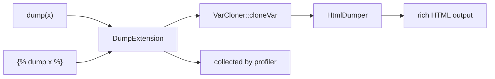

# Debugging Variables

!!! tip "In a nutshell"
    `{{ dump(x) }}` prints a rich VarDumper view inline; `` sends it to the
    toolbar without page markup. Exam hook: dump tooling exists only in debug/dev — a
    stray `dump()` errors in prod.

!!! abstract "Learning objectives"
    By the end of this chapter you can:

    - [ ] Inspect template variables with `dump()` and ``.
    - [ ] Explain the Symfony `DumpExtension` vs Twig's core debug extension.
    - [ ] Choose between `{{ dump() }}` and the profiler for diagnosis.

    **Syllabus:** `Templating (Twig) → Debugging variables` ·
    **Level:** Advanced ·
    **Est. time:** 15 min ·
    **Prerequisites:** [Twig Syntax](syntax.md)

---

## Theory

`dump()` renders a rich, expandable view of any variable — the template-side
equivalent of PHP's `dump()`/`var_dump()`:

```twig
{{ dump(user) }}          {# dump one variable, prints inline #}
{{ dump(user, order) }}   {# dump several #}
{{ dump() }}              {# dump ALL variables in the current context #}
           {# tag form: sends to output, prints nothing here #}
```

`dump()` (function) **outputs** the dump where it is called; `` (tag)
sends data to the dump destination **without** injecting markup into the page.

## Deep Dive — how it works internally

Two layers exist:

- **Twig core** ships `Twig\Extension\DebugExtension`, which provides a plain
  `dump()` backed by `var_dump`. It only works when the environment's `debug`
  option is on.
- **Symfony** replaces/augments it with
  **`Symfony\Bridge\Twig\Extension\DumpExtension`**, wired to the **VarDumper**
  component (`Symfony\Component\VarDumper\Dumper\HtmlDumper` +
  `VarCloner`). This gives the collapsible, syntax-highlighted output and routes
  dumps to the **web debug toolbar / profiler** in dev.



- Both are registered **only in debug mode** (`kernel.debug` / `dev`); in `prod`
  `dump()` is not available, so a leftover `dump()` throws an "unknown function"
  error — remove them before deploy.
- `dump()` with **no arguments** dumps the entire render context (all variables
  passed plus globals).
- Because VarDumper clones the variable first, dumping large object graphs is
  safe (it limits depth) but can be memory-heavy on huge structures.

!!! note "Source reference"
    `Symfony\Bridge\Twig\Extension\DumpExtension`,
    `Symfony\Component\VarDumper\Cloner\VarCloner` —
    [symfony/symfony `8.0`](https://github.com/symfony/symfony/blob/8.0/src/Symfony/Bridge/Twig/Extension/DumpExtension.php).

## Configuration & code

=== "Twig usage"

    ```twig
    {# inline, expandable #}
    <pre>{{ dump(order) }}</pre>

    {# whole context #}
    {{ dump() }}

    {# tag: no markup injected, shows in toolbar #}
    
    ```

=== "YAML (debug bundle)"

    ```yaml
    # config/packages/debug.yaml  (dev only, auto-configured)
    when@dev:
        debug:
            dump_destination: "tcp://%env(VAR_DUMPER_SERVER)%"
    ```

## Best practices & anti-patterns

| ✅ Do | ❌ Avoid |
|---|---|
| `dump()` in dev to inspect data | `dump()` left in committed templates |
| `` to keep markup clean | `dump()` inside a loop over 10k rows |
| Profiler for request-wide insight | `dump()` for perf profiling |
| Remove dumps before prod | Relying on `dump()` in `prod` (unavailable) |

## When (not) to use it / alternatives

Use `dump()`/`` for a **quick look** at a variable while building a
template. For request-wide diagnosis (queries, events, timing, the full
translation/route/security picture) use the **Profiler / web debug toolbar**. For
production issues, use logging — never `dump()`.

!!! danger "Certification traps"
    - `dump()` and `` are available **only in debug/dev**; they error in
      `prod`.
    - `{{ dump() }}` (function) **prints** into the page; `` (tag) does
      **not** inject page markup (it goes to the collector/toolbar).
    - `dump()` with no args dumps the **entire context**.
    - Symfony's rich dump comes from **VarDumper**, not Twig's plain
      `DebugExtension`.

!!! warning "Common mistakes"
    - Deploying with a stray `{{ dump() }}` → `Unknown "dump" function` in prod.
    - Confusing `dump()` output location: the tag form won't appear inline.

## Exercises

1. **(Basic)** Dump the `product` variable inline.
2. **(Intermediate)** Dump every variable available in the current template.
3. **(Advanced)** Explain why `{{ dump() }}` fails in `prod` and what to use
   instead.

??? success "Solutions"

    **1.** `{{ dump(product) }}`.

    **2.** `{{ dump() }}` — no arguments dumps the whole context.

    **3.** The `DumpExtension` is only registered in debug mode, so the function
    is undefined in `prod`; use logging or the profiler (in a non-prod env)
    instead, and remove dumps before deploy.

## Certification questions

??? question "Q1. What does `{{ dump() }}` with no arguments do?"
    - [x] A. Dumps all variables in the current context ✅
    - [ ] B. Dumps nothing
    - [ ] C. Throws
    - [ ] D. Dumps only globals

    **Why:** No-arg `dump()` outputs the entire render context. **Ref:**
    [dump function](https://symfony.com/doc/current/templates.html#the-dump-twig-utilities).

??? question "Q2. Difference between `{{ dump(x) }}` and ``?"
    - [x] A. The function prints inline; the tag sends to the collector without markup ✅
    - [ ] B. They are identical
    - [ ] C. The tag works in prod
    - [ ] D. The function only works in prod

    **Why:** Tag form avoids injecting HTML into the page. **Ref:**
    [dump utilities](https://symfony.com/doc/current/templates.html#the-dump-twig-utilities).

??? question "Q3. Why does `dump()` error in `prod`?"
    - [x] A. The DumpExtension is only registered in debug mode ✅
    - [ ] B. It is a syntax error
    - [ ] C. VarDumper is never installed
    - [ ] D. It is deprecated

    **Why:** Dump tooling is dev-only. **Ref:**
    [VarDumper](https://symfony.com/doc/current/components/var_dumper.html).

## Key takeaways

- `dump()` prints a rich VarDumper view; `` sends it to the collector.
- No-arg `dump()` dumps the whole context.
- Dev/debug only — remove before prod (it errors there).
- Rich output = `DumpExtension` + VarDumper, not Twig's plain debug extension.

## Last-minute revision

!!! tip "Cheat sheet"
    - `{{ dump(a, b) }}` inline · `{{ dump() }}` = all context.
    - `` = to toolbar, no page markup.
    - Debug/dev only; unavailable in prod.
    - Backed by VarDumper (`VarCloner` + `HtmlDumper`).

## Official References
- [Official — The dump Twig utilities](https://symfony.com/doc/current/templates.html#the-dump-twig-utilities)
- [Official — VarDumper](https://symfony.com/doc/current/components/var_dumper.html)
- [Symfony source — DumpExtension](https://github.com/symfony/symfony/blob/8.0/src/Symfony/Bridge/Twig/Extension/DumpExtension.php)

---

<small>Related: [Global Variables](globals.md) · [Twig Syntax](syntax.md) · [Filters & Functions](filters-functions.md)</small>
