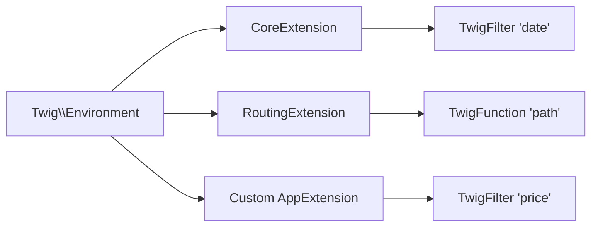

# Filters & Functions

!!! tip "In a nutshell"
    Les filtres transforment une valeur avec un pipe (`value|filter`) ; les
    fonctions s'appellent par leur nom (`func(args)`) — enregistrez les vôtres via
    `#[AsTwigFilter]`/`#[AsTwigFunction]`. Point d'examen : la sortie d'un filtre
    est auto-échappée sauf s'il est déclaré `is_safe: ['html']`.

!!! example "Real-world analogy"
    Les filtres sont une chaîne de montage en cuisine : une valeur glisse sur le
    tapis et chaque `|` est un poste qui la transforme (`|lower`, `|round`) avant
    le dressage. Les fonctions sont le chef que vous appelez par son nom
    (`path()`, `max()`) pour aller chercher ou produire quelque chose de nouveau.
    Même cuisine, deux façons de travailler.

!!! abstract "Learning objectives"
    À la fin de ce chapitre, vous saurez :

    - [ ] Utiliser correctement les filtres et fonctions intégrés les plus pertinents pour l'examen.
    - [ ] Distinguer un **filtre** (`value|f`) d'une **fonction** (`f(value)`).
    - [ ] Créer des filtres/fonctions personnalisés via une extension Twig et les
          attributs `#[AsTwigFilter]` / `#[AsTwigFunction]`.

    **Syllabus:** `Templating (Twig) → Filters & functions` ·
    **Level:** Advanced → Expert ·
    **Est. time:** 30 min ·
    **Prerequisites:** [Twig Syntax](syntax.md)

---

## Theory

Un **filtre** transforme une valeur avec le pipe : `{{ price|round(2) }}`. Les
filtres s'enchaînent de gauche à droite : `{{ name|lower|capitalize }}`. Une
**fonction** s'appelle par son nom et retourne une valeur : `{{ max(a, b) }}`,
`{{ path('home') }}`.

```twig
{{ price|round(2) }}         {# filter: value|filter(args) #}
{{ name|lower|capitalize }}  {# filters chain left to right #}
{{ max(a, b) }}              {# function: called by name #}
{{ path('home') }}           {# function generating a route URL #}
```

**Filtres** intégrés courants :

| Filtre | Rôle |
|---|---|
| `date('d/m/Y')` | formater une date/un `DateTimeInterface` |
| `format(a, b)` | interpolation à la `sprintf` |
| `merge({...})` | fusionner tableaux/hashes |
| `default('x')` | repli pour non défini/null/vide |
| `json_encode` | encodage JSON (échappé pour le HTML) |
| `length` `first` `last` `join(', ')` | collections |
| `escape`/`e` `raw` | échappement (voir [Auto-Escaping](auto-escaping.md)) |
| `trans` | traduction (voir [Translations](translations.md)) |

**Fonctions** intégrées courantes : `path()`, `url()`, `asset()`, `range()`,
`max()`, `min()`, `random()`, `include()`, `dump()`, `constant()`, `cycle()`.

```twig
{{ path('home') }} {{ url('home') }}       {# relative vs absolute route URL #}
    {# public asset path #}
{{ max(1, 5) }} {{ min(1, 5) }}            {# 5 and 1 #}
{{ random(['a', 'b', 'c']) }}              {# random element #}
{{ range(0, 6, 2)|join(',') }}             {# 0,2,4,6 #}
{{ include('partials/_card.html.twig') }}  {# render another template inline #}
{{ dump(user) }}                           {# debug output (dev only) #}
{{ constant('App\\Entity\\Post::DRAFT') }} {# read a PHP constant #}
{{ cycle(['odd', 'even'], loop.index0) }}  {# alternate values by index #}
```

!!! question "Predict first"
    Votre filtre personnalisé retourne la chaîne `<b>x</b>`, mais la page affiche
    le texte littéral `<b>x</b>` au lieu du gras. Pourquoi — et quelle option
    corrige cela ?

??? note "Reveal"
    La sortie d'un filtre est **auto-échappée** comme toute autre valeur, donc le
    markup est encodé à l'affichage. Déclarez le filtre avec `is_safe: ['html']`
    (ou `#[AsTwigFilter(..., isSafe: ['html'])]`) pour marquer sa sortie comme du
    HTML de confiance — mais uniquement quand vous êtes certain que le contenu est sûr.

## Deep Dive — how it works internally

Les filtres et fonctions sont fournis par des **extensions Twig** —
`Twig\Extension\CoreExtension` (`date`, `merge`, `default`…) et les extensions du
bridge Symfony (`RoutingExtension` pour `path`/`url`, `AssetExtension` pour
`asset`, `TranslationExtension` pour `trans`). Chacun est enregistré comme objet
`Twig\TwigFilter` ou `Twig\TwigFunction`.

```php
use Twig\TwigFilter;
use Twig\TwigFunction;

// every filter/function is a named callable wrapped in one of these objects
$date  = new TwigFilter('date', $formatDate);      // CoreExtension: 'date', 'merge', 'default'…
$path  = new TwigFunction('path', $generatePath);  // RoutingExtension: path()/url()
$asset = new TwigFunction('asset', $resolveAsset); // AssetExtension: asset()
$trans = new TwigFilter('trans', $translate);      // TranslationExtension: trans
```



Options clés de `TwigFilter`/`TwigFunction` :

- **`is_safe: ['html']`** — la sortie est du HTML de confiance, saute l'auto-escaping.
- **`needs_environment: true`** — le premier argument du callable est le `Twig\Environment`.
- **`needs_context: true`** — reçoit le tableau du contexte de rendu.
- **`is_variadic: true`** — regroupe les arguments supplémentaires dans un tableau.
- **`deprecated`** — marque le chemin de dépréciation.

```php
new TwigFilter('excerpt', $callable, [
    'is_safe' => ['html'],        // output is trusted HTML → skips auto-escaping
    'needs_environment' => true,  // callable receives Twig\Environment as 1st arg
    'needs_context' => true,      // …then the render context array
    'is_variadic' => true,        // extra template args collected into an array
    'deprecated' => true,         // using the filter triggers a deprecation
]);
// resulting callable signature:
// function (Environment $env, array $context, mixed $value, ...$args)
```

À la compilation, Twig résout le nom vers le callable et inline l'appel dans le
PHP généré, si bien que les filtres/fonctions ne coûtent qu'un appel de fonction
normal à l'exécution.

!!! note "Source reference"
    `Twig\Extension\CoreExtension`, `Twig\TwigFilter`, `Twig\TwigFunction` —
    [twigphp/Twig `3.x`](https://github.com/twigphp/Twig/blob/3.x/src/Extension/CoreExtension.php).

### Custom filters/functions

Deux styles d'enregistrement équivalents en Twig 3.x actuel :

=== "AbstractExtension (classic)"

    ```php
    <?php
    declare(strict_types=1);

    namespace App\Twig;

    use Twig\Extension\AbstractExtension;
    use Twig\TwigFilter;
    use Twig\TwigFunction;

    final class PriceExtension extends AbstractExtension
    {
        public function getFilters(): array
        {
            return [
                new TwigFilter('price', $this->formatPrice(...)),
            ];
        }

        public function getFunctions(): array
        {
            return [
                new TwigFunction('vat', $this->vat(...)),
            ];
        }

        public function formatPrice(float $n, string $currency = '€'): string
        {
            return number_format($n, 2, '.', ' ').' '.$currency;
        }

        public function vat(float $n, float $rate = 0.20): float
        {
            return round($n * (1 + $rate), 2);
        }
    }
    ```

=== "Attributes (Twig 3.x)"

    ```php
    <?php
    declare(strict_types=1);

    namespace App\Twig;

    use Twig\Attribute\AsTwigFilter;
    use Twig\Attribute\AsTwigFunction;

    final class PriceRuntime
    {
        #[AsTwigFilter('price')]
        public function formatPrice(float $n, string $currency = '€'): string
        {
            return number_format($n, 2, '.', ' ').' '.$currency;
        }

        #[AsTwigFunction('vat')]
        public function vat(float $n, float $rate = 0.20): float
        {
            return round($n * (1 + $rate), 2);
        }
    }
    ```

Avec l'autoconfiguration de Symfony, une `AbstractExtension` est auto-taguée
`twig.extension`, et les classes utilisant `#[AsTwigFilter]`/`#[AsTwigFunction]`
sont enregistrées automatiquement. Utilisez `{{ 9.9|price }}` et `{{ vat(100) }}`.

```twig
{{ 9.9|price }}  {# custom filter — extension auto-tagged twig.extension #}
{{ vat(100) }}   {# custom function — registered via #[AsTwigFunction] #}
```

!!! info "Runtime extensions"
    Pour les dépendances lourdes, placez la logique dans une classe **runtime**
    (instanciée en lazy via `RuntimeExtensionInterface` / le style par attributs)
    et référencez-la depuis une extension légère — le service n'est construit que
    lorsque le filtre est réellement utilisé.

### Null behavior

Le filtre `default` est l'outil null principal de Twig :
`{{ name|default('Anon') }}` substitue quand `name` est `null`, non défini **ou**
vide (`''`, `[]`, `false`). C'est plus large que `??`, qui ne remplace que
`null`/non défini — `{{ '' ?? 'x' }}` conserve la chaîne vide, tandis que
`{{ ''|default('x') }}` retourne `'x'`.

```twig
{{ '' ?? 'x' }}             {# '' — ?? only replaces null/undefined #}
{{ ''|default('x') }}       {# 'x' — default also replaces empty values #}
{{ name|default('Anon') }}  {# covers null, undefined, '' and [] #}
```

La plupart des filtres intégrés tolèrent `null` : `{{ null|length }}` vaut `0`,
`{{ null|json_encode }}` vaut `null` (le littéral JSON). Un filtre
**personnalisé**, en revanche, reçoit `null` tel quel — si votre callable est
typé `string $s`, il lèvera une `TypeError` sur un argument null ; typez donc le
paramètre `?string` (ou protégez-le) quand la valeur peut manquer, et associez-le
à `|default` au point d'appel : `{{ bio|default('')|excerpt }}`.

```twig
{{ null|length }}              {# 0 — most built-ins tolerate null #}
{{ null|json_encode }}         {# prints the JSON literal null #}
{# a custom filter typed `string $s` would TypeError on null: #}
{{ bio|default('')|excerpt }}  {# guard with |default (or type the param ?string) #}
```

!!! note "Null in real life"
    `|default` est le tampon « N/A » qu'un commis appose sur tout champ de
    formulaire laissé vide, pour que le reste de la paperasse ne bloque jamais sur
    une entrée manquante.

## Configuration & code

=== "Built-ins in action"

    ```twig
    {{ now|date('Y-m-d H:i') }}
    {{ 'Hello %s'|format(name) }}
    {{ {a: 1}|merge({b: 2})|json_encode }}
    {{ tags|default([])|join(', ') }}
    ```

## Best practices & anti-patterns

| ✅ À faire | ❌ À éviter |
|---|---|
| `is_safe` uniquement pour du HTML réellement sûr | Marquer des données utilisateur comme sûres |
| Des classes runtime pour les dépendances coûteuses | Injecter la BDD dans une extension eager |
| Des filtres valeur → valeur | Des filtres avec effets de bord |
| `default([])` avant `join` | `join` sur une valeur potentiellement non définie |

## When (not) to use it / alternatives

Ajoutez un filtre personnalisé quand une transformation est **présentationnelle
et réutilisée**. S'il a besoin d'un service ou relève de la logique métier,
calculez-le en PHP et passez le résultat. Préférez les fonctions quand l'appel se
lit naturellement (`path('x')`) et les filtres quand ils transforment une valeur
existante (`value|price`).

!!! danger "Certification traps"
    - `|` est un **filtre**, `f()` est une **fonction** — `date` existe à la fois
      comme filtre *et* comme fonction.
    - Un filtre personnalisé qui retourne du HTML est auto-échappé sauf s'il est
      déclaré `is_safe: ['html']`.
    - `default` remplace aussi les valeurs **vides**, pas seulement non défini/null.
    - `needs_environment`/`needs_context` décalent les positions des arguments du callable.

!!! warning "Common mistakes"
    - Oublier qu'injecter des services dans une extension *eager* ralentit chaque
      request — utilisez un runtime.
    - S'attendre à ce que la sortie de `json_encode` soit affichable telle quelle —
      elle est échappée en HTML par défaut (utilisez-la dans
      `<script type="application/json">` ou avec `|raw` prudemment).

## Exercises

1. **(Basic)** Formatez `total` avec deux décimales et ajoutez `€`.
2. **(Intermediate)** Écrivez un filtre personnalisé `excerpt` tronquant à N caractères.
3. **(Advanced)** Enregistrez le même `excerpt` avec `#[AsTwigFilter]`.

??? success "Solutions"

    **1.** `{{ total|number_format(2, '.', ' ') }} €` (ou un filtre `price` personnalisé).

    **2.** `new TwigFilter('excerpt', fn(string $s, int $n = 100) => mb_strlen($s) > $n ? mb_substr($s, 0, $n).'…' : $s)`.

    **3.** Une méthode `#[AsTwigFilter('excerpt')] public function excerpt(string $s, int $n = 100): string` avec le même corps.

## Certification questions

??? question "Q1. Which attribute registers a custom Twig filter?"
    - [x] A. `#[AsTwigFilter]` ✅
    - [ ] B. `#[TwigFilter]`
    - [ ] C. `#[Filter]`
    - [ ] D. `#[AsFilter]`

    **Why:** Twig 3.x actuel fournit `Twig\Attribute\AsTwigFilter` (et
    `AsTwigFunction`). **Ref:**
    [Custom extensions](https://symfony.com/doc/current/templates.html#creating-a-twig-extension).

??? question "Q2. A custom filter returns `<b>x</b>`. Why does the page show escaped text?"
    - [ ] A. Twig never escapes filter output
    - [x] B. It must be declared `is_safe: ['html']` ✅
    - [ ] C. You must call `|raw` on the input
    - [ ] D. It's a bug

    **Why:** La sortie d'un filtre est auto-échappée sauf si elle est marquée safe. **Ref:**
    [is_safe](https://twig.symfony.com/doc/3.x/advanced.html#automatic-escaping).

??? question "Q3. What does `{{ items|default([])|length }}` guarantee?"
    - [x] A. No error when `items` is undefined/empty ✅
    - [ ] B. Sorts items
    - [ ] C. Always returns 0
    - [ ] D. Escapes items

    **Why:** `default([])` fournit un tableau vide, donc `length` est sûr. **Ref:**
    [default filter](https://twig.symfony.com/doc/3.x/filters/default.html).

## Key takeaways

- Les filtres (`|`) transforment ; les fonctions (`f()`) retournent des valeurs.
- Les intégrés vivent dans `CoreExtension` + les extensions du bridge Symfony.
- Personnalisé : `AbstractExtension` retournant `TwigFilter`/`TwigFunction`, ou
  `#[AsTwigFilter]`/`#[AsTwigFunction]`.
- Marquez le HTML de confiance avec `is_safe` ; utilisez des runtimes pour les
  dépendances lourdes.

## Last-minute revision

!!! tip "Cheat sheet"
    - `value|filter(args)` · `function(args)`.
    - Options : `is_safe`, `needs_environment`, `needs_context`, `is_variadic`.
    - Enregistrement : `getFilters()`/`getFunctions()` ou `#[AsTwigFilter/Function]`.
    - `default` couvre non défini **et** vide ; `json_encode` est échappé.

## Connections

- **Depends on:** [Twig Syntax](syntax.md) — les filtres sont prioritaires sur les opérateurs, ce qui détermine comment `value|f` est analysé.
- **Reused in:** [URL Generation](urls.md), [Translations](translations.md) — `path()`/`url()` et `trans` ne sont que des fonctions/filtres fournis par le bridge.
- **Confused with:** [Auto-Escaping](auto-escaping.md) — la sortie HTML d'un filtre est échappée sauf s'il déclare `is_safe`.

## Official References
- [Official — Twig extensions](https://symfony.com/doc/current/templates.html#creating-a-twig-extension)
- [Twig — filters & functions reference](https://twig.symfony.com/doc/3.x/#reference)
- [Twig source — CoreExtension](https://github.com/twigphp/Twig/blob/3.x/src/Extension/CoreExtension.php)

## Video references

!!! tip "Watch & learn"
    Ce sont des chaînes vidéo officielles, mises à jour en continu — cherchez-y
    « Twig templating » pour consolider ce chapitre. Nous lions des chaînes
    stables plutôt que des vidéos individuelles afin que les références ne
    périment jamais.

    - [SymfonyCasts screencasts](https://symfonycasts.com/tracks/symfony) — tutoriels scénarisés à suivre en codant.
    - [Symfony official YouTube](https://www.youtube.com/@SymfonyOfficial) — conférences SymfonyCon & keynotes.
    - [Official docs for this topic](https://symfony.com/doc/current/templates.html#creating-a-twig-extension) — certaines pages de la doc Symfony intègrent un screencast.

## Confidence check

Je suis prêt quand je peux :

- [ ] expliquer **pourquoi** filtres (`|`) et fonctions (`f()`) sont distincts et quand chacun se lit le mieux
- [ ] enregistrer un filtre/une fonction personnalisé en Symfony 8 via `#[AsTwigFilter]`/`#[AsTwigFunction]`
- [ ] déboguer du HTML issu d'un filtre qui apparaît échappé sur la page
- [ ] repérer la réponse piège qui suppose que la sortie de `json_encode` s'affiche telle quelle
- [ ] expliquer comment une classe runtime diffère les dépendances lourdes jusqu'à l'utilisation du filtre

---

<small>Related: [URL Generation](urls.md) · [Auto-Escaping](auto-escaping.md) · [Translations](translations.md)</small>
