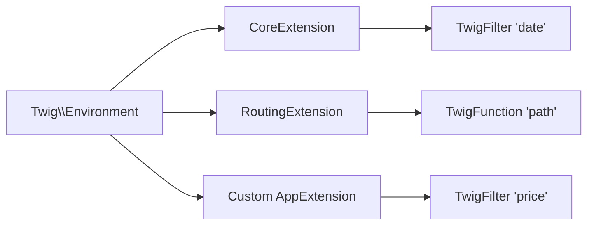

# Filters & Functions

!!! tip "In a nutshell"
    Filters transform a value with a pipe (`value|filter`); functions are called by
    name (`func(args)`) — register your own via `#[AsTwigFilter]`/`#[AsTwigFunction]`.
    Exam hook: filter output is auto-escaped unless declared `is_safe: ['html']`.

!!! example "Real-world analogy"
    Filters are a kitchen assembly line: a value slides down the belt and each `|`
    is a station that transforms it (`|lower`, `|round`) before plating. Functions
    are the chef you call by name (`path()`, `max()`) to fetch or produce something
    new. Same kitchen, two ways to work.

!!! abstract "Learning objectives"
    By the end of this chapter you can:

    - [ ] Use the most exam-relevant built-in filters and functions correctly.
    - [ ] Distinguish a **filter** (`value|f`) from a **function** (`f(value)`).
    - [ ] Create custom filters/functions via a Twig extension and the
          `#[AsTwigFilter]` / `#[AsTwigFunction]` attributes.

    **Syllabus:** `Templating (Twig) → Filters & functions` ·
    **Level:** Advanced → Expert ·
    **Est. time:** 30 min ·
    **Prerequisites:** [Twig Syntax](syntax.md)

---

## Theory

A **filter** transforms a value with the pipe: `{{ price|round(2) }}`. Filters
chain left-to-right: `{{ name|lower|capitalize }}`. A **function** is called by
name and returns a value: `{{ max(a, b) }}`, `{{ path('home') }}`.

```twig
{{ price|round(2) }}         {# filter: value|filter(args) #}
{{ name|lower|capitalize }}  {# filters chain left to right #}
{{ max(a, b) }}              {# function: called by name #}
{{ path('home') }}           {# function generating a route URL #}
```

Common built-in **filters**:

| Filter | Purpose |
|---|---|
| `date('d/m/Y')` | format a date/`DateTimeInterface` |
| `format(a, b)` | `sprintf`-style interpolation |
| `merge({...})` | merge arrays/hashes |
| `default('x')` | fallback for undefined/null/empty |
| `json_encode` | JSON encode (escapes for HTML) |
| `length` `first` `last` `join(', ')` | collections |
| `escape`/`e` `raw` | escaping (see [Auto-Escaping](auto-escaping.md)) |
| `trans` | translation (see [Translations](translations.md)) |

Common built-in **functions**: `path()`, `url()`, `asset()`, `range()`, `max()`,
`min()`, `random()`, `include()`, `dump()`, `constant()`, `cycle()`.

```twig
{{ path('home') }} {{ url('home') }}       {# relative vs absolute route URL #}
    {# public asset path #}
{{ max(1, 5) }} {{ min(1, 5) }}            {# 5 and 1 #}
{{ random(['a', 'b', 'c']) }}              {# random element #}
{{ range(0, 6, 2)|join(',') }}             {# 0,2,4,6 #}
{{ include('partials/_card.html.twig') }}  {# render another template inline #}
{{ dump(user) }}                           {# debug output (dev only) #}
{{ constant('App\\Entity\\Post::DRAFT') }} {# read a PHP constant #}
{{ cycle(['odd', 'even'], loop.index0) }}  {# alternate values by index #}
```

!!! question "Predict first"
    Your custom filter returns the string `<b>x</b>`, but the page shows the literal
    `<b>x</b>` text instead of bold. Why — and what one option fixes it?

??? note "Reveal"
    Filter output is **auto-escaped** like any other value, so the markup is encoded
    on print. Declare the filter with `is_safe: ['html']` (or `#[AsTwigFilter(..., isSafe: ['html'])]`)
    to mark its output as trusted HTML — but only when you're certain the content is safe.

## Deep Dive — how it works internally

Filters and functions are provided by **Twig extensions** —
`Twig\Extension\CoreExtension` (`date`, `merge`, `default`…) and Symfony bridge
extensions (`RoutingExtension` for `path`/`url`, `AssetExtension` for `asset`,
`TranslationExtension` for `trans`). Each is registered as a
`Twig\TwigFilter` or `Twig\TwigFunction` object.

```php
use Twig\TwigFilter;
use Twig\TwigFunction;

// every filter/function is a named callable wrapped in one of these objects
$date  = new TwigFilter('date', $formatDate);      // CoreExtension: 'date', 'merge', 'default'…
$path  = new TwigFunction('path', $generatePath);  // RoutingExtension: path()/url()
$asset = new TwigFunction('asset', $resolveAsset); // AssetExtension: asset()
$trans = new TwigFilter('trans', $translate);      // TranslationExtension: trans
```



Key `TwigFilter`/`TwigFunction` options:

- **`is_safe: ['html']`** — output is trusted HTML, skip auto-escaping.
- **`needs_environment: true`** — first callable arg is the `Twig\Environment`.
- **`needs_context: true`** — receive the render context array.
- **`is_variadic: true`** — collect extra args into an array.
- **`deprecated`** — mark for the deprecation path.

```php
new TwigFilter('excerpt', $callable, [
    'is_safe' => ['html'],        // output is trusted HTML → skips auto-escaping
    'needs_environment' => true,  // callable receives Twig\Environment as 1st arg
    'needs_context' => true,      // …then the render context array
    'is_variadic' => true,        // extra template args collected into an array
    'deprecated' => true,         // using the filter triggers a deprecation
]);
// resulting callable signature:
// function (Environment $env, array $context, mixed $value, ...$args)
```

At compile time Twig resolves the name to the callable and inlines the call in
the generated PHP, so filters/functions cost a normal function call at runtime.

!!! note "Source reference"
    `Twig\Extension\CoreExtension`, `Twig\TwigFilter`, `Twig\TwigFunction` —
    [twigphp/Twig `3.x`](https://github.com/twigphp/Twig/blob/3.x/src/Extension/CoreExtension.php).

### Custom filters/functions

Two equivalent registration styles in Twig up to 3.22:

=== "AbstractExtension (classic)"

    ```php
    <?php
    declare(strict_types=1);

    namespace App\Twig;

    use Twig\Extension\AbstractExtension;
    use Twig\TwigFilter;
    use Twig\TwigFunction;

    final class PriceExtension extends AbstractExtension
    {
        public function getFilters(): array
        {
            return [
                new TwigFilter('price', $this->formatPrice(...)),
            ];
        }

        public function getFunctions(): array
        {
            return [
                new TwigFunction('vat', $this->vat(...)),
            ];
        }

        public function formatPrice(float $n, string $currency = '€'): string
        {
            return number_format($n, 2, '.', ' ').' '.$currency;
        }

        public function vat(float $n, float $rate = 0.20): float
        {
            return round($n * (1 + $rate), 2);
        }
    }
    ```

=== "Attributes (Twig 3.x)"

    ```php
    <?php
    declare(strict_types=1);

    namespace App\Twig;

    use Twig\Attribute\AsTwigFilter;
    use Twig\Attribute\AsTwigFunction;

    final class PriceRuntime
    {
        #[AsTwigFilter('price')]
        public function formatPrice(float $n, string $currency = '€'): string
        {
            return number_format($n, 2, '.', ' ').' '.$currency;
        }

        #[AsTwigFunction('vat')]
        public function vat(float $n, float $rate = 0.20): float
        {
            return round($n * (1 + $rate), 2);
        }
    }
    ```

With Symfony autoconfiguration, an `AbstractExtension` is auto-tagged
`twig.extension`, and classes using `#[AsTwigFilter]`/`#[AsTwigFunction]` are
registered automatically. Use `{{ 9.9|price }}` and `{{ vat(100) }}`.

```twig
{{ 9.9|price }}  {# custom filter — extension auto-tagged twig.extension #}
{{ vat(100) }}   {# custom function — registered via #[AsTwigFunction] #}
```

!!! info "Runtime extensions"
    For heavy dependencies, put the logic in a **runtime** class (lazy-instantiated
    via `RuntimeExtensionInterface` / the attribute style) and reference it with a
    lightweight extension — the service is only built when the filter is actually used.

### Null behavior

The `default` filter is Twig's primary null tool: `{{ name|default('Anon') }}`
substitutes when `name` is `null`, undefined **or** empty (`''`, `[]`, `false`).
That is broader than `??`, which replaces only `null`/undefined —
`{{ '' ?? 'x' }}` keeps the empty string, while `{{ ''|default('x') }}` returns
`'x'`.

```twig
{{ '' ?? 'x' }}             {# '' — ?? only replaces null/undefined #}
{{ ''|default('x') }}       {# 'x' — default also replaces empty values #}
{{ name|default('Anon') }}  {# covers null, undefined, '' and [] #}
```

Most built-in filters tolerate `null`: `{{ null|length }}` is `0`,
`{{ null|json_encode }}` is `null` (the JSON literal). A **custom** filter,
though, receives `null` as-is — if your callable is typed `string $s` it will
`TypeError` on a null argument, so type the parameter `?string` (or guard) when
the value can be missing, and pair it with `|default` at the call site:
`{{ bio|default('')|excerpt }}`.

```twig
{{ null|length }}              {# 0 — most built-ins tolerate null #}
{{ null|json_encode }}         {# prints the JSON literal null #}
{# a custom filter typed `string $s` would TypeError on null: #}
{{ bio|default('')|excerpt }}  {# guard with |default (or type the param ?string) #}
```

!!! note "Null in real life"
    `|default` is the "N/A" stamp a clerk puts on any form field left blank, so the
    rest of the paperwork never stalls on a missing entry.

## Configuration & code

=== "Built-ins in action"

    ```twig
    {{ now|date('Y-m-d H:i') }}
    {{ 'Hello %s'|format(name) }}
    {{ {a: 1}|merge({b: 2})|json_encode }}
    {{ tags|default([])|join(', ') }}
    ```

## Best practices & anti-patterns

| ✅ Do | ❌ Avoid |
|---|---|
| `is_safe` only for genuinely safe HTML | Marking user data safe |
| Runtime classes for costly deps | Injecting DB into an eager extension |
| Filters for value → value | Filters with side effects |
| `default([])` before `join` | `join` on possibly-undefined |

## When (not) to use it / alternatives

Add a custom filter when a transformation is **presentational and reused**. If it
needs a service or is business logic, compute it in PHP and pass the result.
Prefer functions when the call reads naturally (`path('x')`) and filters when it
transforms an existing value (`value|price`).

!!! danger "Certification traps"
    - `|` is a **filter**, `f()` is a **function** — `date` exists as both a
      filter *and* a function.
    - A custom filter returning HTML is auto-escaped unless declared
      `is_safe: ['html']`.
    - `default` also replaces **empty** values, not just undefined/null.
    - `needs_environment`/`needs_context` shift the callable's argument positions.

!!! warning "Common mistakes"
    - Forgetting to inject services into an *eager* extension slows every request —
      use a runtime.
    - Expecting `json_encode` output to be printable raw — it is HTML-escaped by
      default (use in `<script type="application/json">` or `|raw` carefully).

## Exercises

1. **(Basic)** Format `total` to two decimals and append `€`.
2. **(Intermediate)** Write a custom `excerpt` filter truncating to N chars.
3. **(Advanced)** Register the same `excerpt` using `#[AsTwigFilter]`.

??? success "Solutions"

    **1.** `{{ total|number_format(2, '.', ' ') }} €` (or a custom `price` filter).

    **2.** `new TwigFilter('excerpt', fn(string $s, int $n = 100) => mb_strlen($s) > $n ? mb_substr($s, 0, $n).'…' : $s)`.

    **3.** A method `#[AsTwigFilter('excerpt')] public function excerpt(string $s, int $n = 100): string` with the same body.

## Certification questions

??? question "Q1. Which attribute registers a custom Twig filter?"
    - [x] A. `#[AsTwigFilter]` ✅
    - [ ] B. `#[TwigFilter]`
    - [ ] C. `#[Filter]`
    - [ ] D. `#[AsFilter]`

    **Why:** Current Twig 3.x provides `Twig\Attribute\AsTwigFilter` (and
    `AsTwigFunction`). **Ref:**
    [Custom extensions](https://symfony.com/doc/current/templates.html#creating-a-twig-extension).

??? question "Q2. A custom filter returns `<b>x</b>`. Why does the page show escaped text?"
    - [ ] A. Twig never escapes filter output
    - [x] B. It must be declared `is_safe: ['html']` ✅
    - [ ] C. You must call `|raw` on the input
    - [ ] D. It's a bug

    **Why:** Filter output is auto-escaped unless marked safe. **Ref:**
    [is_safe](https://twig.symfony.com/doc/3.x/advanced.html#automatic-escaping).

??? question "Q3. What does `{{ items|default([])|length }}` guarantee?"
    - [x] A. No error when `items` is undefined/empty ✅
    - [ ] B. Sorts items
    - [ ] C. Always returns 0
    - [ ] D. Escapes items

    **Why:** `default([])` supplies an empty array so `length` is safe. **Ref:**
    [default filter](https://twig.symfony.com/doc/3.x/filters/default.html).

## Key takeaways

- Filters (`|`) transform; functions (`f()`) return values.
- Built-ins live in `CoreExtension` + Symfony bridge extensions.
- Custom: `AbstractExtension` returning `TwigFilter`/`TwigFunction`, or
  `#[AsTwigFilter]`/`#[AsTwigFunction]`.
- Mark trusted HTML with `is_safe`; use runtimes for heavy deps.

## Last-minute revision

!!! tip "Cheat sheet"
    - `value|filter(args)` · `function(args)`.
    - Options: `is_safe`, `needs_environment`, `needs_context`, `is_variadic`.
    - Register: `getFilters()`/`getFunctions()` or `#[AsTwigFilter/Function]`.
    - `default` covers undefined **and** empty; `json_encode` is escaped.

## Connections

- **Depends on:** [Twig Syntax](syntax.md) — filters bind tighter than operators, which decides how `value|f` parses.
- **Reused in:** [URL Generation](urls.md), [Translations](translations.md) — `path()`/`url()` and `trans` are just bridge-provided functions/filters.
- **Confused with:** [Auto-Escaping](auto-escaping.md) — a filter's HTML output is escaped unless it declares `is_safe`.

## Official References
- [Official — Twig extensions](https://symfony.com/doc/current/templates.html#creating-a-twig-extension)
- [Twig — filters & functions reference](https://twig.symfony.com/doc/3.x/#reference)
- [Twig source — CoreExtension](https://github.com/twigphp/Twig/blob/3.x/src/Extension/CoreExtension.php)

## Video references

!!! tip "Watch & learn"
    These are official, continuously-updated video channels — search them for
    "Twig templating" to reinforce this chapter. We link stable channels rather than
    individual videos so the references never rot.

    - [SymfonyCasts screencasts](https://symfonycasts.com/tracks/symfony) — scripted, code-along tutorials.
    - [Symfony official YouTube](https://www.youtube.com/@SymfonyOfficial) — SymfonyCon conference talks & keynotes.
    - [Official docs for this topic](https://symfony.com/doc/current/templates.html#creating-a-twig-extension) — some Symfony doc pages embed a screencast.

## Confidence check

I'm ready when I can:

- [ ] explain **why** filters (`|`) and functions (`f()`) are distinct and when each reads best
- [ ] register a custom filter/function in Symfony 8 via `#[AsTwigFilter]`/`#[AsTwigFunction]`
- [ ] debug HTML from a filter that shows up escaped on the page
- [ ] spot the trick answer that expects `json_encode` output to be printable raw
- [ ] explain how a runtime class defers heavy dependencies until the filter is used

---

<small>Related: [URL Generation](urls.md) · [Auto-Escaping](auto-escaping.md) · [Translations](translations.md)</small>
