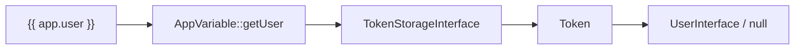

# Global Variables

!!! tip "In a nutshell"
    `app` est la seule globale que Symfony offre à chaque template — votre fenêtre
    sur la request, l'utilisateur, la session et l'environnement, adossée à
    `AppVariable`. Point d'examen : `app.user` vaut `null` quand personne n'est
    connecté, protégez donc toujours son accès.

!!! example "Real-world analogy"
    `app` est un presse-papiers partagé épinglé au mur du bureau : chaque template
    peut y jeter un œil pour connaître l'utilisateur courant, la request, la
    session ou la locale sans que personne ne lui en tende une copie. Symfony
    tient ce presse-papiers (`AppVariable`) à jour à chaque request, et vous
    pouvez y épingler vos propres notes avec des globales personnalisées.

!!! abstract "Learning objectives"
    À la fin de ce chapitre, vous saurez :

    - [ ] Utiliser chaque membre de la globale `app` et savoir ce qu'il retourne.
    - [ ] Expliquer d'où vient `app` (`AppVariable`) et comment elle est câblée.
    - [ ] Enregistrer votre propre variable globale via la config ou une extension Twig.

    **Syllabus:** `Templating (Twig) → Global variables` ·
    **Level:** Advanced ·
    **Est. time:** 25 min ·
    **Prerequisites:** [Twig Syntax](syntax.md)

---

## Pour les nuls

### L'idée en une phrase
`app` est une variable spéciale disponible dans **tous** les templates sans jamais avoir à la passer depuis le contrôleur — ta fenêtre sur la requête, l'utilisateur, la session.

### Imagine dans la vraie vie
`app` est un tableau blanc partagé, accroché au mur du bureau : n'importe quel template peut y jeter un œil pour connaître l'utilisateur actuel, la requête, la session ou la langue, sans que personne n'ait besoin de lui en fournir une copie manuellement.

### Dans Symfony
`Bonjour {{ app.user.userIdentifier }}` fonctionne dans n'importe quel template, sans que le contrôleur n'ait jamais explicitement passé une variable "utilisateur".

### Exemple simple
```twig

    Connecté en tant que {{ app.user.userIdentifier }}

    Non connecté

```

### Comment le mémoriser 🧠
`app.user` vaut **`null`** quand personne n'est connecté — toujours le protéger avec un ``, jamais l'utiliser directement sans vérification.


## Theory

Une **globale** est une variable disponible dans **chaque** template sans la
passer depuis le controller. Symfony n'enregistre qu'une seule globale
importante — `app` — plus celles que vous définissez. `app` est votre fenêtre
sur la request courante, l'utilisateur, la session et l'environnement.

| Expression | Retourne |
|---|---|
| `app.user` | le `UserInterface` authentifié, ou `null` |
| `app.request` | la `Request` courante (ou `null` hors request) |
| `app.session` | la `SessionInterface` (la démarre si nécessaire) |
| `app.flashes` | les flash messages (tableau ou par type) |
| `app.environment` | la chaîne d'environnement du kernel (`dev`/`prod`) |
| `app.debug` | `bool` — le mode debug est-il actif |
| `app.token` | le `TokenInterface` de sécurité ou `null` |
| `app.locale` | la locale de la request courante |
| `app.enabled_locales` | les locales activées configurées |
| `app.current_route` | le nom de la route courante |
| `app.current_route_parameters` | les paramètres de la route courante |

```twig
Hi {{ app.user.userIdentifier }}Guest
```

!!! question "Predict first"
    Une page se rend pour un visiteur anonyme et exécute `{{ app.user.roles|length }}`.
    Que vaut `app.user`, et que se passe-t-il sur cette ligne ?

??? note "Reveal"
    `app.user` vaut **`null`** quand personne n'est authentifié —
    `AppVariable::getUser()` retourne l'utilisateur du token ou `null`. Lire
    `.roles` sur `null` fait planter le classique rendu de page anonyme. Protégez
    d'abord : `…` ou le ternaire `app.user ? … : …`.

## Deep Dive — how it works internally

`app` est une instance de **`Symfony\Bridge\Twig\AppVariable`**. Le TwigBundle
l'enregistre comme globale Twig nommée `app` et lui injecte les services du
container dont elle a besoin (token storage, request stack, locale). Chaque appel
`app.X` correspond à un getter :

| Accès | Méthode | Service source |
|---|---|---|
| `app.user` | `getUser()` | `TokenStorageInterface` → token → user |
| `app.request` | `getRequest()` | `RequestStack::getCurrentRequest()` |
| `app.session` | `getSession()` | `Request::getSession()` |
| `app.flashes` | `getFlashes()` | `FlashBagInterface` de la session |
| `app.token` | `getToken()` | `TokenStorageInterface` |

```php
// TwigBundle wires AppVariable and registers it as the 'app' global
$app = new AppVariable();
$app->setTokenStorage($tokenStorage);   // backs app.user / app.token
$app->setRequestStack($requestStack);   // backs app.request / app.session
$twig->addGlobal('app', $app);

// every app.X access is a getter call on AppVariable
$app->getUser();    // {{ app.user }}
$app->getRequest(); // {{ app.request }}
```



- `AppVariable` lève une `\RuntimeException` si vous lisez
  `request`/`user`/`session` quand le service correspondant n'a pas été défini
  (p. ex. pas de request dans le scope) — mais dans une request web normale, tout
  est câblé.
- `app.flashes` accepte un type : `app.flashes('notice')` retourne uniquement les
  messages de ce type ; `app.flashes(['notice','error'])` filtre sur ces types ;
  sans argument, elle retourne tout — et lire les flashes les efface.
- Les globales sont résolues **à l'exécution** : elles sont fusionnées dans le
  contexte de rendu, si bien qu'une variable locale nommée `app` masquerait la
  globale.

```twig
{# AppVariable throws \RuntimeException if e.g. no request was wired #}

{# flashes by type — reading them clears them #}

    <div class="notice">{{ message }}</div>


    <div class="{{ label }}">{{ message }}</div>


{# a local variable named 'app' shadows the global — avoid #}

```

!!! note "Source reference"
    `Symfony\Bridge\Twig\AppVariable` —
    [symfony/symfony `8.0`](https://github.com/symfony/symfony/blob/8.0/src/Symfony/Bridge/Twig/AppVariable.php).

### Null behavior

Plusieurs membres de `app` sont **nullables par conception**. `app.user` vaut
`null` dès que la request est anonyme — `AppVariable::getUser()` lit
l'utilisateur du token et retourne `null` si personne n'est authentifié.
`app.token` et `app.request` valent `null` hors d'un contexte sécurité/HTTP
(certains scripts CLI ou du code exécuté très tôt au boot).

**Protégez** toujours avant de déréférencer :

```twig
{{ app.user ? app.user.userIdentifier : 'Guest' }}
<a href="{{ path('logout') }}">Log out</a>
```

Lire `app.user.userIdentifier` sans garde affiche vide en mode tolérant mais lève
une exception une fois `strict_variables` activé — et `app.user.roles` sur un
utilisateur `null` est le crash classique de la page anonyme.
`app.user is not null` et le ternaire ci-dessus sont les idiomes sûrs.

```twig
{# crashes for an anonymous visitor once strict_variables is on #}
{{ app.user.userIdentifier }}

{# safe idioms #}
{{ app.user.roles|join(', ') }}
{{ app.user ? app.user.userIdentifier : 'Guest' }}
```

!!! note "Null in real life"
    `app.user` est le visiteur inconnu à l'accueil sécurité : tant que personne ne
    s'est enregistré, l'emplacement du badge est vide — vérifiez-le avant d'y lire
    un nom.

## Configuration & code

=== "YAML — custom global"

    ```yaml
    # config/packages/twig.yaml
    twig:
        globals:
            ga_tracking: 'UA-xxxxx'
            # reference a service with @
            company: '@App\Service\CompanySettings'
    ```

=== "PHP extension — computed global"

    ```php
    <?php
    declare(strict_types=1);

    namespace App\Twig;

    use App\Service\CompanySettings;
    use Twig\Extension\AbstractExtension;
    use Twig\Extension\GlobalsInterface;

    final class AppGlobalsExtension extends AbstractExtension implements GlobalsInterface
    {
        public function __construct(private readonly CompanySettings $settings) {}

        public function getGlobals(): array
        {
            return ['company' => $this->settings];
        }
    }
    ```

=== "Twig usage"

    ```twig
    <p>{{ company.name }} — tracking {{ ga_tracking }}</p>
    
        <div class="ok">{{ msg }}</div>
    
    ```

Préférez une extension `GlobalsInterface` à une globale YAML `@service` quand la
valeur est **calculée** ou que vous voulez un accès lazy — le service n'est
résolu qu'à l'instanciation de l'extension.

## Best practices & anti-patterns

| ✅ À faire | ❌ À éviter |
|---|---|
| Utiliser `app.user` / `app.request` | Passer user/request depuis chaque controller |
| Protéger `app.user` avec `if` (peut être null) | Supposer qu'un utilisateur est toujours présent |
| Globales personnalisées pour la config vraiment globale | Des globales pour des données propres à une page |
| `GlobalsInterface` pour les valeurs calculées | Du travail lourd dans `getGlobals()` à chaque rendu |

## When (not) to use it / alternatives

Les globales conviennent aux valeurs **transverses** (branding, feature flags,
l'utilisateur courant). Pour des données propres à une page, passez-les depuis le
controller. Pour des valeurs nécessaires à un seul partial, passez-les via
`include(..., with {…})` plutôt que de polluer l'espace de noms global.

!!! danger "Certification traps"
    - `app.user` vaut **`null`** pour les requests anonymes/non authentifiées — ne
      supposez jamais qu'il existe.
    - `app.session` **démarre la session** à l'accès ; la lire inutilement peut
      compromettre le cache.
    - `app.environment` est l'**environnement du kernel** (`dev`/`prod`), *pas*
      l'environnement du système d'exploitation.
    - Lire `app.flashes` **consomme** les messages (ils sont effacés après affichage).
    - Une variable locale de template nommée `app` masque la globale.

!!! warning "Common mistakes"
    - Utiliser `app.user.username` — en Symfony 8, l'identifiant est
      `app.user.userIdentifier` (`getUserIdentifier()`).
    - Attendre `app.request` hors d'une request HTTP (CLI, certains events) — il
      peut valoir `null`.

## Exercises

1. **(Basic)** Saluez l'utilisateur par son identifiant, avec repli sur « Guest ».
2. **(Intermediate)** Enregistrez une globale `support_email` via YAML et affichez-la.
3. **(Advanced)** Exposez une globale calculée `unread_count` via une extension
   `GlobalsInterface` injectant un service.

??? success "Solutions"

    **1.** `{{ app.user ? app.user.userIdentifier : 'Guest' }}`.

    **2.** `twig.globals.support_email: 'help@ex.com'` puis `{{ support_email }}`.

    **3.** Implémentez `GlobalsInterface::getGlobals()` retournant
    `['unread_count' => $this->notifier->countUnread()]` depuis un service injecté.

## Certification questions

??? question "Q1. What is `app.user` when nobody is logged in?"
    - [ ] A. An empty `User` object
    - [x] B. `null` ✅
    - [ ] C. The string "anonymous"
    - [ ] D. It throws

    **Why:** `AppVariable::getUser()` retourne l'utilisateur du token ou `null`. **Ref:**
    [The app global](https://symfony.com/doc/8.0/templates.html#the-app-global-variable).

??? question "Q2. Which class backs the `app` global?"
    - [ ] A. `Twig\Environment`
    - [x] B. `Symfony\Bridge\Twig\AppVariable` ✅
    - [ ] C. `Symfony\Component\HttpFoundation\Request`
    - [ ] D. `Symfony\Component\HttpKernel\Kernel`

    **Why:** Le TwigBundle enregistre `AppVariable` comme globale `app`. **Ref:**
    [AppVariable](https://github.com/symfony/symfony/blob/8.0/src/Symfony/Bridge/Twig/AppVariable.php).

??? question "Q3. How do you register a static global string `foo`?"
    - [x] A. `twig.globals.foo: 'bar'` in YAML ✅
    - [ ] B. `#[AsGlobal]`
    - [ ] C. ``
    - [ ] D. It is impossible

    **Why:** Les globales se déclarent sous `twig.globals` ou via `GlobalsInterface`.
    **Ref:** [Global variables](https://symfony.com/doc/8.0/templates.html#global-variables).

## Key takeaways

- `app` = `AppVariable` : `user`, `request`, `session`, `flashes`, `environment`,
  `debug`, `token`, `locale`, `current_route`.
- `app.user` peut être `null` ; l'identifiant est `userIdentifier`.
- Enregistrez des globales personnalisées via `twig.globals` ou `GlobalsInterface`.
- `app.session`/`app.flashes` ont des effets de bord (démarrage / consommation).

## Last-minute revision

!!! tip "Cheat sheet"
    - `app.user` (null !), `app.request`, `app.session`, `app.flashes`.
    - `app.environment` = dev/prod · `app.debug` = bool · `app.locale`.
    - Personnalisé : `twig.globals.X: value` ou `implements GlobalsInterface`.

## Connections

- **Depends on:** [Twig Syntax](syntax.md) — `app.user` suit les mêmes règles de résolution d'attributs et de null que toute variable.
- **Reused in:** [URL Generation](urls.md) — `app.current_route` / `app.current_route_parameters` reconstruisent le lien courant.
- **Confused with:** [Authentication](../security/authentication.md) — `app.user` n'est que le versant vue ; le token qu'il lit est alimenté par la couche de sécurité.

## Official References
- [Official — The app global variable](https://symfony.com/doc/8.0/templates.html#the-app-global-variable)
- [Official — Global variables](https://symfony.com/doc/8.0/templates.html#global-variables)
- [Symfony source — AppVariable](https://github.com/symfony/symfony/blob/8.0/src/Symfony/Bridge/Twig/AppVariable.php)

## Video references

!!! tip "Watch & learn"
    Ce sont des chaînes vidéo officielles, mises à jour en continu — cherchez-y
    « Twig templating » pour consolider ce chapitre. Nous lions des chaînes
    stables plutôt que des vidéos individuelles afin que les références ne
    périment jamais.

    - [SymfonyCasts screencasts](https://symfonycasts.com/tracks/symfony) — tutoriels scénarisés à suivre en codant.
    - [Symfony official YouTube](https://www.youtube.com/@SymfonyOfficial) — conférences SymfonyCon & keynotes.
    - [Official docs for this topic](https://symfony.com/doc/8.0/templates.html#the-app-global-variable) — certaines pages de la doc Symfony intègrent un screencast.

## Confidence check

Je suis prêt quand je peux :

- [ ] expliquer **pourquoi** `app` existe et ce qu'elle expose sans plomberie côté controller
- [ ] enregistrer une globale personnalisée via `twig.globals` ou `GlobalsInterface` en Symfony 8
- [ ] déboguer un crash de page anonyme dû au déréférencement d'un `app.user` `null`
- [ ] repérer la réponse piège qui traite `app.user` comme toujours présent ou `app.username`
- [ ] expliquer comment `AppVariable` associe `app.X` aux services (token storage, request stack)

---

<small>Related: [Filters & Functions](filters-functions.md) · [URL Generation](urls.md) · [Debugging](debugging.md)</small>
