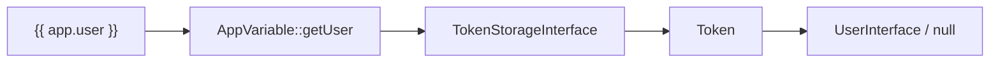

# Global Variables

!!! tip "In a nutshell"
    `app` is the one global Symfony gives every template — your window into the
    request, user, session and environment, backed by `AppVariable`. Exam hook:
    `app.user` is `null` when nobody is logged in, so always guard it.

!!! example "Real-world analogy"
    `app` is a shared clipboard pinned to the office wall: every template can glance
    at it for the current user, request, session or locale without anyone handing
    them a copy. Symfony keeps that clipboard (`AppVariable`) up to date for each
    request, and you can pin your own notes to it with custom globals.

!!! abstract "Learning objectives"
    By the end of this chapter you can:

    - [ ] Use every member of the `app` global and know what it returns.
    - [ ] Explain where `app` comes from (`AppVariable`) and how it is wired.
    - [ ] Register your own global variable via config or a Twig extension.

    **Syllabus:** `Templating (Twig) → Global variables` ·
    **Level:** Advanced ·
    **Est. time:** 25 min ·
    **Prerequisites:** [Twig Syntax](syntax.md)

---

## Theory

A **global** is a variable available in **every** template without passing it
from the controller. Symfony registers exactly one important global — `app` —
plus any you define. `app` is your window into the current request, user,
session and environment.

| Expression | Returns |
|---|---|
| `app.user` | the authenticated `UserInterface`, or `null` |
| `app.request` | the current `Request` (or `null` outside a request) |
| `app.session` | the `SessionInterface` (starts it if needed) |
| `app.flashes` | flash messages (array or by type) |
| `app.environment` | the kernel environment string (`dev`/`prod`) |
| `app.debug` | `bool` — is debug mode on |
| `app.token` | the security `TokenInterface` or `null` |
| `app.locale` | the current request locale |
| `app.enabled_locales` | configured enabled locales |
| `app.current_route` | current route name |
| `app.current_route_parameters` | current route params |

```twig
Hi {{ app.user.userIdentifier }}Guest
```

## Deep Dive — how it works internally

`app` is an instance of **`Symfony\Bridge\Twig\AppVariable`**. TwigBundle
registers it as a Twig global named `app` and injects the container services it
needs (token storage, request stack, locale). Each `app.X` call maps to a getter:

| Access | Method | Source service |
|---|---|---|
| `app.user` | `getUser()` | `TokenStorageInterface` → token → user |
| `app.request` | `getRequest()` | `RequestStack::getCurrentRequest()` |
| `app.session` | `getSession()` | `Request::getSession()` |
| `app.flashes` | `getFlashes()` | session `FlashBagInterface` |
| `app.token` | `getToken()` | `TokenStorageInterface` |



- `AppVariable` throws a `\RuntimeException` if you read `request`/`user`/`session`
  when the corresponding service was not set (e.g. no request in scope) — but in
  a normal web request everything is wired.
- `app.flashes` accepts a type: `app.flashes('notice')` returns just that type's
  messages; `app.flashes(['notice','error'])` filters to those types; no arg
  returns all and **peeks** vs **reads** depending — reading flashes clears them.
- Globals are resolved **at compile-safe runtime**: they are merged into the
  render context, so a local variable named `app` would shadow the global.

!!! note "Source reference"
    `Symfony\Bridge\Twig\AppVariable` —
    [symfony/symfony `8.0`](https://github.com/symfony/symfony/blob/8.0/src/Symfony/Bridge/Twig/AppVariable.php).

## Configuration & code

=== "YAML — custom global"

    ```yaml
    # config/packages/twig.yaml
    twig:
        globals:
            ga_tracking: 'UA-xxxxx'
            # reference a service with @
            company: '@App\Service\CompanySettings'
    ```

=== "PHP extension — computed global"

    ```php
    <?php
    declare(strict_types=1);

    namespace App\Twig;

    use App\Service\CompanySettings;
    use Twig\Extension\AbstractExtension;
    use Twig\Extension\GlobalsInterface;

    final class AppGlobalsExtension extends AbstractExtension implements GlobalsInterface
    {
        public function __construct(private readonly CompanySettings $settings) {}

        public function getGlobals(): array
        {
            return ['company' => $this->settings];
        }
    }
    ```

=== "Twig usage"

    ```twig
    <p>{{ company.name }} — tracking {{ ga_tracking }}</p>
    
        <div class="ok">{{ msg }}</div>
    
    ```

Prefer a `GlobalsInterface` extension over a YAML `@service` global when the value
is **computed** or you want lazy access — the service is only resolved when the
extension is instantiated.

## Best practices & anti-patterns

| ✅ Do | ❌ Avoid |
|---|---|
| Use `app.user` / `app.request` | Passing user/request from every controller |
| Guard `app.user` with `if` (may be null) | Assuming a user is always present |
| Custom globals for truly global config | Globals for per-page data |
| `GlobalsInterface` for computed values | Heavy work in `getGlobals()` on every render |

## When (not) to use it / alternatives

Globals suit **cross-cutting** values (branding, feature flags, the current
user). For page-specific data pass it from the controller. For values needed by a
single partial, pass them via `include(..., with {…})` instead of polluting the
global namespace.

!!! danger "Certification traps"
    - `app.user` is **`null`** for anonymous/unauthenticated requests — never
      assume it exists.
    - `app.session` will **start the session** on access; reading it needlessly
      can defeat caching.
    - `app.environment` is the **kernel env** (`dev`/`prod`), *not* the OS
      environment.
    - Reading `app.flashes` **consumes** the messages (they clear after display).
    - A local template variable named `app` shadows the global.

!!! warning "Common mistakes"
    - Using `app.user.username` — in Symfony 8 the identifier is
      `app.user.userIdentifier` (`getUserIdentifier()`).
    - Expecting `app.request` outside an HTTP request (CLI, some events) — it can
      be `null`.

## Exercises

1. **(Basic)** Greet the user by identifier, falling back to "Guest".
2. **(Intermediate)** Register a global `support_email` via YAML and print it.
3. **(Advanced)** Expose a computed `unread_count` global via a
   `GlobalsInterface` extension injecting a service.

??? success "Solutions"

    **1.** `{{ app.user ? app.user.userIdentifier : 'Guest' }}`.

    **2.** `twig.globals.support_email: 'help@ex.com'` then `{{ support_email }}`.

    **3.** Implement `GlobalsInterface::getGlobals()` returning
    `['unread_count' => $this->notifier->countUnread()]` from an injected service.

## Certification questions

??? question "Q1. What is `app.user` when nobody is logged in?"
    - [ ] A. An empty `User` object
    - [x] B. `null` ✅
    - [ ] C. The string "anonymous"
    - [ ] D. It throws

    **Why:** `AppVariable::getUser()` returns the token's user or `null`. **Ref:**
    [The app global](https://symfony.com/doc/current/templates.html#the-app-global-variable).

??? question "Q2. Which class backs the `app` global?"
    - [ ] A. `Twig\Environment`
    - [x] B. `Symfony\Bridge\Twig\AppVariable` ✅
    - [ ] C. `Symfony\Component\HttpFoundation\Request`
    - [ ] D. `Symfony\Component\HttpKernel\Kernel`

    **Why:** TwigBundle registers `AppVariable` as the `app` global. **Ref:**
    [AppVariable](https://github.com/symfony/symfony/blob/8.0/src/Symfony/Bridge/Twig/AppVariable.php).

??? question "Q3. How do you register a static global string `foo`?"
    - [x] A. `twig.globals.foo: 'bar'` in YAML ✅
    - [ ] B. `#[AsGlobal]`
    - [ ] C. ``
    - [ ] D. It is impossible

    **Why:** Globals are declared under `twig.globals` or via `GlobalsInterface`.
    **Ref:** [Global variables](https://symfony.com/doc/current/templates.html#global-variables).

## Key takeaways

- `app` = `AppVariable`: `user`, `request`, `session`, `flashes`, `environment`,
  `debug`, `token`, `locale`, `current_route`.
- `app.user` may be `null`; identifier is `userIdentifier`.
- Register custom globals via `twig.globals` or `GlobalsInterface`.
- `app.session`/`app.flashes` have side effects (start / consume).

## Last-minute revision

!!! tip "Cheat sheet"
    - `app.user` (null!), `app.request`, `app.session`, `app.flashes`.
    - `app.environment` = dev/prod · `app.debug` = bool · `app.locale`.
    - Custom: `twig.globals.X: value` or `implements GlobalsInterface`.

## Official References
- [Official — The app global variable](https://symfony.com/doc/current/templates.html#the-app-global-variable)
- [Official — Global variables](https://symfony.com/doc/current/templates.html#global-variables)
- [Symfony source — AppVariable](https://github.com/symfony/symfony/blob/8.0/src/Symfony/Bridge/Twig/AppVariable.php)

---

<small>Related: [Filters & Functions](filters-functions.md) · [URL Generation](urls.md) · [Debugging](debugging.md)</small>
