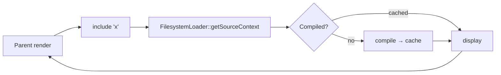

# Template Includes

!!! tip "In a nutshell"
    `include` dépose un fragment réutilisable en place ; par défaut, il voit les
    variables de l'appelant, et `only` l'isole aux seules valeurs du `with`.
    Point d'examen : `include` ne peut pas surcharger des blocks — c'est `embed`
    (include + surcharge de blocks).

!!! example "Real-world analogy"
    Inclure un partial, c'est comme coller une fiche recette réutilisable sur la
    page d'un grand livre de cuisine que vous rédigez. Par défaut, la fiche peut
    lire tous les ingrédients déjà listés sur cette page (elle hérite du contexte
    parent). Ajoutez `only` et vous lui tendez à la place une boîte-repas scellée
    ne contenant que les ingrédients que vous avez emballés pour elle — elle ne
    voit rien d'autre sur la page. `embed` va plus loin : il ne se contente pas de
    coller la fiche, il vous laisse barrer et réécrire certaines étapes numérotées
    imprimées dessus (surcharger ses blocks), ce qu'un simple `include` ne pourra
    jamais faire.

!!! abstract "Learning objectives"
    À la fin de ce chapitre, vous saurez :

    - [ ] Inclure un partial avec le tag `include` et la fonction `include()`.
    - [ ] Contrôler le contexte transmis avec `with`, `only`, et gérer `ignore missing`.
    - [ ] Utiliser `embed` pour inclure *et* surcharger des blocks en une étape.

    **Syllabus:** `Templating (Twig) → Includes` ·
    **Level:** Advanced ·
    **Est. time:** 25 min ·
    **Prerequisites:** [Template Inheritance](inheritance.md)

---

## Pour les nuls

### L'idée en une phrase
`include` colle un morceau de template réutilisable à l'endroit voulu — et voit par défaut toutes les variables de la page qui l'accueille.

### Imagine dans la vraie vie
Inclure un fragment, c'est coller une fiche recette réutilisable sur la page d'un plus grand livre de cuisine que tu écris. Par défaut, la fiche peut lire tous les ingrédients déjà listés sur cette page (elle hérite du contexte parent). Ajoute `only` et tu lui donnes à la place une boîte à repas scellée contenant uniquement les ingrédients que tu as choisis pour elle.

### Dans Symfony
`{{ include('partials/_carte_produit.html.twig', {produit: p}, {with_context: false}) }}` (équivalent à `only`) garantit que le fragment ne dépend d'aucune variable "ambiante" de la page — plus facile à réutiliser ailleurs sans surprise.

### Exemple simple
```twig
{{ include('partials/_alerte.html.twig', {message: 'Enregistré !'}, with_context: false) }}
```

### Comment le mémoriser 🧠
`include` ne peut **jamais** réécrire un bloc du fragment inclus — c'est `embed` qui ajoute cette capacité, en combinant `include` + surcharge de blocs.

Where **inheritance** fills holes in a layout, **includes** drop a reusable
fragment *in place* — a card, a menu, a form row. Two forms exist:

```twig
{# tag form — renders immediately #}


{# function form — usable inside expressions #}
{{ include('partials/_card.html.twig') }}
```

By default the partial inherits **the current context** (all variables in scope).

!!! question "Predict first"
    `` — inside `_card`, can
    you still read a variable `product` that only the parent set? What if you add `only`?

??? note "Reveal"
    Without `only`, **yes** — the include inherits the whole parent context *plus*
    the `with` vars. Add `only` and the include sees **just** `title` (the `with`
    set) — the parent scope is hidden. `with` merges; `only` isolates. (The `app`
    global stays available either way.)


## Theory

Là où l'**héritage** remplit des trous dans un layout, les **includes** déposent
un fragment réutilisable *en place* — une carte, un menu, une ligne de form.
Deux formes existent :

```twig
{# tag form — renders immediately #}


{# function form — usable inside expressions #}
{{ include('partials/_card.html.twig') }}
```

Par défaut, le partial hérite **du contexte courant** (toutes les variables dans
le scope).

!!! question "Predict first"
    `` — dans `_card`,
    pouvez-vous encore lire une variable `product` définie uniquement par le
    parent ? Et si vous ajoutez `only` ?

??? note "Reveal"
    Sans `only`, **oui** — l'include hérite de tout le contexte parent *plus* les
    variables du `with`. Ajoutez `only` et l'include ne voit **que** `title`
    (l'ensemble du `with`) — le scope parent est masqué. `with` fusionne ; `only`
    isole. (La globale `app` reste disponible dans les deux cas.)

## Deep Dive — how it works internally

Le tag compile en un appel à `Twig\Template::display()` (ou `render()` pour la
fonction) sur le sous-template chargé. Le **loader**
(`Twig\Loader\FilesystemLoader` dans Symfony) résout le nom logique vers un
fichier, et le sous-template est compilé et mis en cache exactement comme
n'importe quel autre template — les includes ne sont pas « inlinés », ce sont des
classes compilées distinctes invoquées à l'exécution.

```php
// simplified view of what an include does at runtime
$sub = $twig->load('partials/_card.html.twig'); // Twig\Loader\FilesystemLoader resolves the name
$sub->display($context);          // tag form: Twig\Template::display() echoes the output
$html = $sub->render($context);   // function form: render() returns the string
```



Règles de contexte :

- **par défaut** — le template inclus voit les variables de l'appelant **plus**
  celles du `with`.
- **`with { … }`** — ajoute/remplace des variables pour l'include.
- **`only`** — l'include ne voit **que** les variables du `with` (isolé) — rien
  du scope parent.
- **`ignore missing`** — si le template n'existe pas, ne rend rien au lieu de
  lever une `LoaderError`.

```twig
{# default: the partial sees the caller's vars plus the `with` ones #}


{# only: the partial sees just title — parent scope hidden #}


{# missing template: render nothing instead of throwing LoaderError #}

```

La **fonction** `include()` est préférée en Twig moderne car elle retourne une
chaîne, se compose dans les expressions, et accepte les mêmes options en
arguments nommés :
`include('x', {a: 1}, with_context = false, ignore_missing = true)`.

```twig
{# include() returns a string, so it composes inside expressions #}

{{ card|upper }}
{{ include('_promo.html.twig', ignore_missing = true) }}  {# named-argument options #}
```

!!! note "Source reference"
    `Twig\Loader\FilesystemLoader`, include token parser & `include` function —
    [twigphp/Twig `3.x`](https://github.com/twigphp/Twig/blob/3.x/src/Loader/FilesystemLoader.php).

### `embed` — include + override

`embed` inclut un template **et** vous laisse surcharger ses blocks, combinant
`include` avec la surcharge de blocks façon `extends` — idéal pour des
composants configurables (modales, cartes avec slots).

```twig

    Confirm
    Are you sure?

```

## Configuration & code

=== "with / only"

    ```twig
    {# adds title, keeps parent scope #}
    

    {# isolated: ONLY title is visible inside #}
    
    ```

=== "ignore missing + fallback list"

    ```twig
    

    {# first template that exists wins #}
    
    ```

=== "function form"

    ```twig
    <div>{{ include('_card.html.twig', { title: t }, with_context = false) }}</div>
    ```

## Best practices & anti-patterns

| ✅ À faire | ❌ À éviter |
|---|---|
| `only` pour des partials réutilisables sans effet de bord | Se reposer sur des variables parentes qui fuient |
| La fonction `include()` dans les expressions | La forme tag quand il faut une chaîne |
| `embed` pour des composants à slots | Des chaînes d'`include` profondes pour la mise en page |
| `ignore missing` pour les widgets optionnels | Avaler de vrais bugs de template manquant |

## When (not) to use it / alternatives

- **`include`** — fragment statique, autonome.
- **`embed`** — fragment dont l'appelant personnalise les *blocks internes*.
- **`extends`** — squelette au niveau page ([Inheritance](inheritance.md)).
- **`render(controller())`** — le fragment a besoin de sa **propre logique de
  controller / ses données / son cache** — voir
  [Controller Rendering](controller-rendering.md). N'allez pas chercher des
  données dans un template juste pour inclure un partial.

!!! danger "Certification traps"
    - Sans `only`, un include **hérite de tout le contexte parent**.
    - `only` isole le scope mais la globale `app` reste **toujours disponible**.
    - `ignore missing` évite une `LoaderError` uniquement pour un **template
      manquant**, pas pour des erreurs *à l'intérieur* du template.
    - Passer une **liste** de templates rend le **premier qui existe**.
    - `include` ne peut pas surcharger des blocks — c'est `embed`.

!!! warning "Common mistakes"
    - Croire que `with { x }` *remplace* tout le contexte — il *fusionne* sauf si
      vous ajoutez `only`.
    - Utiliser un include pour exécuter de la logique de controller (requêtes
      BDD) — embarquez plutôt un controller.

## Exercises

1. **(Basic)** Incluez `_flash.html.twig` uniquement si le fichier peut être absent.
2. **(Intermediate)** Incluez une carte en passant seulement `title` et `value`,
   isolée du scope parent.
3. **(Advanced)** Construisez un composant `_modal` avec des blocks `title`/`body`
   et embarquez-le avec du contenu personnalisé.

??? success "Solutions"

    **1.** ``.

    **2.** ``.

    **3.** Définissez `` / ``
    dans `_modal.html.twig`, puis `…`
    en surchargeant les deux blocks.

## Certification questions

??? question "Q1. What does `only` do on an include?"
    - [ ] A. Includes the template once
    - [x] B. Restricts scope to the `with` variables ✅
    - [ ] C. Makes it read-only
    - [ ] D. Ignores missing templates

    **Why:** `only` isole l'include du contexte parent. **Ref:**
    [include tag](https://twig.symfony.com/doc/3.x/tags/include.html).

??? question "Q2. Which construct includes a template AND overrides its blocks?"
    - [ ] A. `include`
    - [x] B. `embed` ✅
    - [ ] C. `use`
    - [ ] D. `extends`

    **Why:** `embed` = include + surcharge de blocks. **Ref:**
    [embed tag](https://twig.symfony.com/doc/3.x/tags/embed.html).

??? question "Q3. `` renders…"
    - [x] A. The first template that exists ✅
    - [ ] B. Both, concatenated
    - [ ] C. The last one
    - [ ] D. An error

    **Why:** Une liste sélectionne le premier template existant. **Ref:**
    [include tag](https://twig.symfony.com/doc/3.x/tags/include.html).

## Key takeaways

- `include` dépose un fragment ; la fonction `include()` retourne une chaîne.
- Le contexte fusionne par défaut ; `only` isole ; `with` ajoute/remplace.
- `ignore missing` ignore un template manquant (pas les erreurs internes).
- `embed` = include + surcharge de blocks ; une liste inclut le premier qui existe.

## Last-minute revision

!!! tip "Cheat sheet"
    - `` · `{{ include('x', {a:1}) }}`.
    - `ignore missing` · liste `['a','b']` → premier existant.
    - `…`.

## Connections

- **Depends on:** [Template Inheritance](inheritance.md) — `embed` réutilise la mécanique de surcharge de blocks d'`extends`.
- **Reused in:** [Controller Rendering](controller-rendering.md) — quand un fragment a besoin de ses propres données, embarquez un controller plutôt qu'un `include`.
- **Confused with:** [Template Inheritance](inheritance.md) — `include` dépose un fragment ; seuls `embed`/`extends` peuvent surcharger des blocks.

## Official References
- [Official — Including templates](https://symfony.com/doc/8.0/templates.html#including-templates)
- [Twig — include / embed](https://twig.symfony.com/doc/3.x/tags/include.html)
- [Twig source — FilesystemLoader](https://github.com/twigphp/Twig/blob/3.x/src/Loader/FilesystemLoader.php)

## Video references

!!! tip "Watch & learn"
    Ce sont des chaînes vidéo officielles, mises à jour en continu — cherchez-y
    « Twig templating » pour consolider ce chapitre. Nous lions des chaînes
    stables plutôt que des vidéos individuelles afin que les références ne
    périment jamais.

    - [SymfonyCasts screencasts](https://symfonycasts.com/tracks/symfony) — tutoriels scénarisés à suivre en codant.
    - [Symfony official YouTube](https://www.youtube.com/@SymfonyOfficial) — conférences SymfonyCon & keynotes.
    - [Official docs for this topic](https://symfony.com/doc/8.0/templates.html#including-templates) — certaines pages de la doc Symfony intègrent un screencast.

## Confidence check

Je suis prêt quand je peux :

- [ ] expliquer **pourquoi** les includes existent et en quoi ils diffèrent de l'héritage
- [ ] contrôler le scope avec `with` / `only` et gérer `ignore missing` en Symfony 8
- [ ] déboguer un partial qui voit (ou ne voit pas) une variable parente de façon inattendue
- [ ] repérer la réponse piège affirmant qu'`include` peut surcharger des blocks
- [ ] expliquer que les includes compilent en classes de template distinctes mises en cache, pas en markup inliné

---

<small>Related: [Template Inheritance](inheritance.md) · [Controller Rendering](controller-rendering.md) · [Filters & Functions](filters-functions.md)</small>
