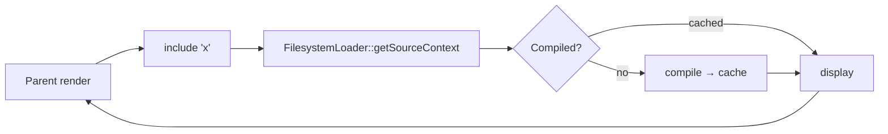

# Template Includes

!!! tip "In a nutshell"
    `include` drops a reusable fragment in place; by default it sees the caller's
    variables, and `only` isolates it to just the `with` values. Exam hook: `include`
    can't override blocks — that's `embed` (include + block overriding).

!!! example "Real-world analogy"
    Including a partial is like pasting a reusable recipe card onto the page of a larger
    cookbook you are writing. By default the card can read all the ingredients already listed
    on that page (it inherits the parent context). Add `only` and you instead hand the card a
    sealed lunchbox holding just the ingredients you packed for it — it can't see anything
    else on the page. `embed` goes further: it doesn't merely paste the card, it lets you
    cross out and rewrite specific numbered steps printed on it (overriding its blocks),
    which plain `include` can never do.

!!! abstract "Learning objectives"
    By the end of this chapter you can:

    - [ ] Include a partial with the `include` tag and the `include()` function.
    - [ ] Control the passed context with `with`, `only`, and handle `ignore missing`.
    - [ ] Use `embed` to include *and* override blocks in one step.

    **Syllabus:** `Templating (Twig) → Includes` ·
    **Level:** Advanced ·
    **Est. time:** 25 min ·
    **Prerequisites:** [Template Inheritance](inheritance.md)

---

## Theory

Where **inheritance** fills holes in a layout, **includes** drop a reusable
fragment *in place* — a card, a menu, a form row. Two forms exist:

```twig
{# tag form — renders immediately #}


{# function form — usable inside expressions #}
{{ include('partials/_card.html.twig') }}
```

By default the partial inherits **the current context** (all variables in scope).

!!! question "Predict first"
    `` — inside `_card`, can
    you still read a variable `product` that only the parent set? What if you add `only`?

??? note "Reveal"
    Without `only`, **yes** — the include inherits the whole parent context *plus*
    the `with` vars. Add `only` and the include sees **just** `title` (the `with`
    set) — the parent scope is hidden. `with` merges; `only` isolates. (The `app`
    global stays available either way.)

## Deep Dive — how it works internally

The tag compiles to a call to `Twig\Template::display()` (or `render()` for the
function) on the loaded sub-template. The **loader** (`Twig\Loader\FilesystemLoader`
in Symfony) resolves the logical name to a file, and the sub-template is compiled
and cached exactly like any other template — includes are not "inlined", they are
separate compiled classes invoked at runtime.

```php
// simplified view of what an include does at runtime
$sub = $twig->load('partials/_card.html.twig'); // Twig\Loader\FilesystemLoader resolves the name
$sub->display($context);          // tag form: Twig\Template::display() echoes the output
$html = $sub->render($context);   // function form: render() returns the string
```



Context rules:

- **default** — the included template sees the caller's variables **plus** any
  from `with`.
- **`with { … }`** — adds/overrides variables for the include.
- **`only`** — the include sees **just** the `with` vars (isolated) — nothing
  from the parent scope.
- **`ignore missing`** — if the template does not exist, render nothing instead
  of throwing `LoaderError`.

```twig
{# default: the partial sees the caller's vars plus the `with` ones #}


{# only: the partial sees just title — parent scope hidden #}


{# missing template: render nothing instead of throwing LoaderError #}

```

The `include()` **function** is preferred in modern Twig because it returns a
string, composes in expressions, and takes the same options as named arguments:
`include('x', {a: 1}, with_context = false, ignore_missing = true)`.

```twig
{# include() returns a string, so it composes inside expressions #}

{{ card|upper }}
{{ include('_promo.html.twig', ignore_missing = true) }}  {# named-argument options #}
```

!!! note "Source reference"
    `Twig\Loader\FilesystemLoader`, include token parser & `include` function —
    [twigphp/Twig `3.x`](https://github.com/twigphp/Twig/blob/3.x/src/Loader/FilesystemLoader.php).

### `embed` — include + override

`embed` includes a template **and** lets you override its blocks, combining
`include` with `extends`-style block overriding — ideal for configurable
components (modals, cards with slots).

```twig

    Confirm
    Are you sure?

```

## Configuration & code

=== "with / only"

    ```twig
    {# adds title, keeps parent scope #}
    

    {# isolated: ONLY title is visible inside #}
    
    ```

=== "ignore missing + fallback list"

    ```twig
    

    {# first template that exists wins #}
    
    ```

=== "function form"

    ```twig
    <div>{{ include('_card.html.twig', { title: t }, with_context = false) }}</div>
    ```

## Best practices & anti-patterns

| ✅ Do | ❌ Avoid |
|---|---|
| `only` for reusable, side-effect-free partials | Relying on leaked parent vars |
| `include()` function in expressions | Tag form where you need a string |
| `embed` for slotted components | Deep `include` chains for layout |
| `ignore missing` for optional widgets | Swallowing real missing-template bugs |

## When (not) to use it / alternatives

- **`include`** — static, self-contained fragment.
- **`embed`** — fragment whose *inner blocks* the caller customises.
- **`extends`** — page-level skeleton ([Inheritance](inheritance.md)).
- **`render(controller())`** — the fragment needs its **own controller logic /
  data / cache** — see [Controller Rendering](controller-rendering.md). Do not
  fetch data inside a template just to include a partial.

!!! danger "Certification traps"
    - Without `only`, an include **inherits the whole parent context**.
    - `only` isolates scope but the `app` global is **still available**.
    - `ignore missing` prevents a `LoaderError` only for a **missing template**,
      not for errors *inside* the template.
    - Passing a **list** of templates renders the **first existing** one.
    - `include` cannot override blocks — that is `embed`.

!!! warning "Common mistakes"
    - Expecting `with { x }` to *replace* the whole context — it *merges* unless
      you add `only`.
    - Using an include to run controller logic (DB queries) — embed a controller
      instead.

## Exercises

1. **(Basic)** Include `_flash.html.twig` only if the file may be absent.
2. **(Intermediate)** Include a card passing only `title` and `value`, isolated
   from the parent scope.
3. **(Advanced)** Build a `_modal` component with `title`/`body` blocks and embed
   it with custom content.

??? success "Solutions"

    **1.** ``.

    **2.** ``.

    **3.** Define `` / ``
    in `_modal.html.twig`, then `…`
    overriding both blocks.

## Certification questions

??? question "Q1. What does `only` do on an include?"
    - [ ] A. Includes the template once
    - [x] B. Restricts scope to the `with` variables ✅
    - [ ] C. Makes it read-only
    - [ ] D. Ignores missing templates

    **Why:** `only` isolates the include from the parent context. **Ref:**
    [include tag](https://twig.symfony.com/doc/3.x/tags/include.html).

??? question "Q2. Which construct includes a template AND overrides its blocks?"
    - [ ] A. `include`
    - [x] B. `embed` ✅
    - [ ] C. `use`
    - [ ] D. `extends`

    **Why:** `embed` = include + block overriding. **Ref:**
    [embed tag](https://twig.symfony.com/doc/3.x/tags/embed.html).

??? question "Q3. `` renders…"
    - [x] A. The first template that exists ✅
    - [ ] B. Both, concatenated
    - [ ] C. The last one
    - [ ] D. An error

    **Why:** A list picks the first existing template. **Ref:**
    [include tag](https://twig.symfony.com/doc/3.x/tags/include.html).

## Key takeaways

- `include` drops a fragment; `include()` function returns a string.
- Context merges by default; `only` isolates; `with` adds/overrides.
- `ignore missing` skips a missing template (not internal errors).
- `embed` = include + override blocks; a list includes the first that exists.

## Last-minute revision

!!! tip "Cheat sheet"
    - `` · `{{ include('x', {a:1}) }}`.
    - `ignore missing` · list `['a','b']` → first existing.
    - `…`.

## Connections

- **Depends on:** [Template Inheritance](inheritance.md) — `embed` reuses the block-overriding machinery from `extends`.
- **Reused in:** [Controller Rendering](controller-rendering.md) — when a fragment needs its own data, embed a controller instead of an `include`.
- **Confused with:** [Template Inheritance](inheritance.md) — `include` drops a fragment; only `embed`/`extends` can override blocks.

## Official References
- [Official — Including templates](https://symfony.com/doc/current/templates.html#including-templates)
- [Twig — include / embed](https://twig.symfony.com/doc/3.x/tags/include.html)
- [Twig source — FilesystemLoader](https://github.com/twigphp/Twig/blob/3.x/src/Loader/FilesystemLoader.php)

## Video references

!!! tip "Watch & learn"
    These are official, continuously-updated video channels — search them for
    "Twig templating" to reinforce this chapter. We link stable channels rather than
    individual videos so the references never rot.

    - [SymfonyCasts screencasts](https://symfonycasts.com/tracks/symfony) — scripted, code-along tutorials.
    - [Symfony official YouTube](https://www.youtube.com/@SymfonyOfficial) — SymfonyCon conference talks & keynotes.
    - [Official docs for this topic](https://symfony.com/doc/current/templates.html#including-templates) — some Symfony doc pages embed a screencast.

## Confidence check

I'm ready when I can:

- [ ] explain **why** includes exist and how they differ from inheritance
- [ ] control scope with `with` / `only` and handle `ignore missing` in Symfony 8
- [ ] debug a partial that unexpectedly sees (or can't see) a parent variable
- [ ] spot the trick answer claiming `include` can override blocks
- [ ] explain that includes compile to separate cached template classes, not inlined markup

---

<small>Related: [Template Inheritance](inheritance.md) · [Controller Rendering](controller-rendering.md) · [Filters & Functions](filters-functions.md)</small>
