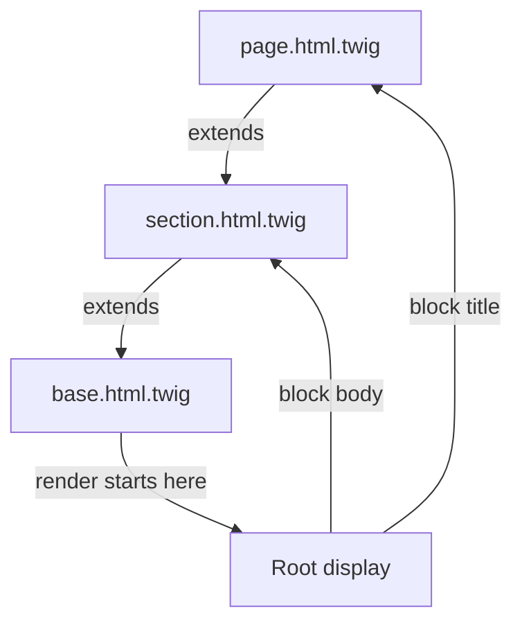

# Template Inheritance

!!! tip "In a nutshell"
    Un enfant `` un layout parent et surcharge ses trous nommés
    `` ; `{{ parent() }}` conserve le contenu du parent. Point
    d'examen : un template n'étend qu'un seul parent, mais `` mélange des
    blocks provenant de plusieurs templates (réutilisation horizontale).

!!! example "Real-world analogy"
    L'héritage de template est un formulaire imprimé sur papier à en-tête. Le
    parent `base.html.twig` est la page maître pré-imprimée — logo, pied de page,
    mise en page générale — et chaque `` est une ligne vierge laissée à
    remplir. Une page enfant conserve l'en-tête et n'écrit que dans les blancs qui
    l'intéressent ; `{{ parent() }}` signifie « garde ce qui était déjà imprimé
    ici, puis complète ».

!!! abstract "Learning objectives"
    À la fin de ce chapitre, vous saurez :

    - [ ] Construire un layout multi-niveaux avec `extends` et `block`.
    - [ ] Réutiliser le contenu d'un block parent avec `parent()` et afficher n'importe quel block avec `block()`.
    - [ ] Choisir entre `extends` (vertical) et `use` (horizontal).

    **Syllabus:** `Templating (Twig) → Template inheritance` ·
    **Level:** Advanced ·
    **Est. time:** 25 min ·
    **Prerequisites:** [Twig Syntax](syntax.md)

---

## Theory

L'héritage permet à un template enfant de **remplir des trous** laissés par un
layout parent. Le parent déclare des régions nommées `` ; l'enfant
l'`` et surcharge les blocks qui l'intéressent.

=== "base.html.twig (parent)"

    ```twig
    <!DOCTYPE html>
    <html>
    <head><title>My App</title></head>
    <body>
        
        <footer>© 2026</footer>
    </body>
    </html>
    ```

=== "page.html.twig (child)"

    ```twig
    

    Dashboard — {{ parent() }}

    
        <h1>Welcome</h1>
    
    ```

Un enfant ne peut `extends` **qu'un seul** parent (héritage simple), mais les
layouts peuvent être **chaînés** à n'importe quelle profondeur :
`page → section → base`.

!!! question "Predict first"
    Vous voulez qu'une page récupère des blocks de *deux* templates différents.
    Un template peut-il `extends` deux parents ? Sinon, quel est l'outil ?

??? note "Reveal"
    Non — un template `extends` **exactement un** parent (héritage vertical
    simple). Pour mélanger des blocks nommés issus de plusieurs templates,
    utilisez `` (réutilisation horizontale, comme un trait PHP) ; il
    n'importe que des blocks et ne définit **pas** de parent.

## Deep Dive — how it works internally

Chaque template compile en une classe PHP étendant `Twig\Template`. Un
`` devient une méthode `block_<name>()` ; `` définit le
parent afin que le rendu démarre à l'ancêtre **racine** et descende, laissant les
méthodes de l'enfant surcharger celles du parent — exactement comme la surcharge
de méthodes en PHP.



- **`extends`** est résolu à l'exécution (il peut s'agir d'une expression
  dynamique). Pour cette raison, `extends` doit être le **premier** tag et un
  template qui en étend un autre ne peut pas définir de markup de premier niveau
  hors des blocks.
- **`parent()`** appelle le `block_<name>()` de la classe parente — il rend le
  contenu du block du template situé un niveau au-dessus.
- **`block('name')`** (fonction) affiche un block par son nom depuis la
  hiérarchie du template courant ; `block('name', 'other.html.twig')` le lit
  depuis un autre template.
- Le moteur de rendu résout chaque block via la **table des blocks** de la classe
  compilée (`$this->blocks`), de sorte qu'une surcharge n'importe où dans la
  chaîne l'emporte.

!!! note "Source reference"
    `Twig\Template`, `Twig\Node\ModuleNode`, block token parsers —
    [twigphp/Twig `3.x`](https://github.com/twigphp/Twig/blob/3.x/src/Template.php).

### `use` — horizontal reuse

`` importe des **blocks** (pas du markup) d'un autre template dans le
template courant, comme un trait PHP. Contrairement à `extends`, vous pouvez
`use` **plusieurs** templates, et cela ne définit pas de parent. Les noms en
conflit sont renommés avec `as`.

```twig




    {{ block('base_sidebar') }}  {# reuse the imported block #}
    <p>extra</p>

```

Ici, `_sidebar.html.twig` ne contient que des définitions
`…` — pas d'`extends`, pas de HTML autour.

## Configuration & code

=== "Multi-level: section extends base"

    ```twig
    {# section.html.twig #}
    
    
        <aside></aside>
        <main></main>
    
    ```

=== "Leaf: page extends section"

    ```twig
    {# page.html.twig #}
    
    <p>Only fills content.</p>
    ```

=== "Dynamic parent"

    ```twig
    
    ```

## Best practices & anti-patterns

| ✅ À faire | ❌ À éviter |
|---|---|
| Un seul `base.html.twig`, chaîner les sections | Des hiérarchies profondes de 6 niveaux et plus |
| `{{ parent() }}` pour étendre, pas remplacer | Copier-coller le markup du parent |
| `use` pour des ensembles de blocks partagés | `extends` quand il faut plusieurs sources |
| Nommer les blocks de façon sémantique | Des imbrications anonymes que personne ne peut surcharger |

## When (not) to use it / alternatives

- **`extends`** — vous voulez un *squelette* que l'enfant remplit. Vertical, parent unique.
- **`use`** — vous voulez *mélanger* des blocks nommés venant de plusieurs sources. Horizontal.
- **`include`/`embed`** — vous voulez *déposer un fragment* en place (voir
  [Includes](includes.md)). Préférez les includes pour des partials réutilisables
  qui ne sont pas des « trous » dans un layout.

!!! danger "Certification traps"
    - Un template peut `extends` **exactement un** parent, mais peut `use` **plusieurs** templates.
    - `` doit venir en premier ; un enfant qui étend un parent ne
      peut pas produire de markup hors des blocks.
    - `parent()` rend le **block parent**, `block('x')` rend le block `x` de la
      hiérarchie courante — deux outils différents.
    - `use` n'importe **que des blocks**, pas d'autre contenu, et ne définit **pas** de parent.

!!! warning "Common mistakes"
    - S'attendre à ce que des variables définies avec `set` dans un enfant avant
      `extends` atteignent le parent — définissez-les plutôt dans un block.
    - Surcharger un block et perdre le contenu du parent en oubliant `{{ parent() }}`.

## Exercises

1. **(Basic)** Ajoutez un préfixe `Dashboard` au `title` du parent tout en
   gardant la valeur du parent.
2. **(Intermediate)** Créez une hiérarchie à trois niveaux `base → layout → page`
   où `page` ne définit que `content`.
3. **(Advanced)** Réutilisez un block `menu` défini dans `_menu.html.twig` depuis
   une page qui étend déjà `base.html.twig`.

??? success "Solutions"

    **1.** `Dashboard — {{ parent() }}`.

    **2.** `base` déclare `body` ; `layout` étend base et découpe `body` en
    `sidebar`+`content` ; `page` étend layout et ne définit que `content`.

    **3.** `` puis, en cas de surcharge,
    `{{ parent() }}…` — ou laissez simplement le
    block importé s'appliquer par héritage.

## Certification questions

??? question "Q1. How many templates can a single template `extends`?"
    - [x] A. Exactly one ✅
    - [ ] B. Up to three
    - [ ] C. Unlimited
    - [ ] D. Zero

    **Why:** Twig prend en charge l'héritage vertical simple ; utilisez `use` pour
    plusieurs sources de blocks. **Ref:**
    [Twig inheritance](https://twig.symfony.com/doc/3.x/tags/extends.html).

??? question "Q2. What does `{{ parent() }}` do inside a block?"
    - [ ] A. Renders the whole parent template
    - [x] B. Renders the parent's version of this block ✅
    - [ ] C. Calls the controller's parent
    - [ ] D. Nothing

    **Why:** `parent()` affiche le même block issu du template parent. **Ref:**
    [parent()](https://twig.symfony.com/doc/3.x/functions/parent.html).

??? question "Q3. Which tag provides horizontal reuse of blocks?"
    - [ ] A. `extends`
    - [ ] B. `include`
    - [x] C. `use` ✅
    - [ ] D. `embed`

    **Why:** `use` importe des définitions de blocks comme un trait. **Ref:**
    [use tag](https://twig.symfony.com/doc/3.x/tags/use.html).

## Key takeaways

- `extends` = un seul parent vertical ; les blocks sont les trous surchargeables.
- `parent()` étend un block ; `block('x')` affiche un block nommé.
- `use` mélange des blocks issus de plusieurs templates (horizontal), sans définir de parent.
- L'héritage compile en surcharge de méthodes PHP sur `Twig\Template`.

## Last-minute revision

!!! tip "Cheat sheet"
    - `` en premier, un seul parent.
    - `…` → région surchargeable.
    - `{{ parent() }}` block parent · `{{ block('x') }}` n'importe quel block.
    - `` horizontal, blocks uniquement.

## Connections

- **Depends on:** [Twig Syntax](syntax.md) — les blocks et `extends` ne sont que des tags ; `extends` doit être le premier tag.
- **Reused in:** [Includes](includes.md) — `embed` ajoute la surcharge de blocks par-dessus un include.
- **Confused with:** [Includes](includes.md) — l'héritage remplit des *trous* dans un layout ; les includes déposent un *fragment* en place.

## Official References
- [Official — Template inheritance](https://symfony.com/doc/current/templates.html#template-inheritance-and-layouts)
- [Twig — extends / use / block](https://twig.symfony.com/doc/3.x/tags/extends.html)
- [Twig source — Template.php](https://github.com/twigphp/Twig/blob/3.x/src/Template.php)

## Video references

!!! tip "Watch & learn"
    Ce sont des chaînes vidéo officielles, mises à jour en continu — cherchez-y
    « Twig templating » pour consolider ce chapitre. Nous lions des chaînes
    stables plutôt que des vidéos individuelles afin que les références ne
    périment jamais.

    - [SymfonyCasts screencasts](https://symfonycasts.com/tracks/symfony) — tutoriels scénarisés à suivre en codant.
    - [Symfony official YouTube](https://www.youtube.com/@SymfonyOfficial) — conférences SymfonyCon & keynotes.
    - [Official docs for this topic](https://symfony.com/doc/current/templates.html#template-inheritance-and-layouts) — certaines pages de la doc Symfony intègrent un screencast.

## Confidence check

Je suis prêt quand je peux :

- [ ] expliquer **pourquoi** les layouts utilisent des blocks et comment les surcharges de l'enfant l'emportent
- [ ] construire une chaîne `extends` multi-niveaux avec `parent()` en Symfony 8
- [ ] déboguer un block qui a perdu le contenu de son parent parce que `{{ parent() }}` a été supprimé
- [ ] repérer la réponse piège qui autorise `extends` de plusieurs parents
- [ ] expliquer comment l'héritage se traduit en surcharge de méthodes PHP sur `Twig\Template`

---

<small>Related: [Twig Syntax](syntax.md) · [Includes](includes.md) · [Controller Rendering](controller-rendering.md)</small>
