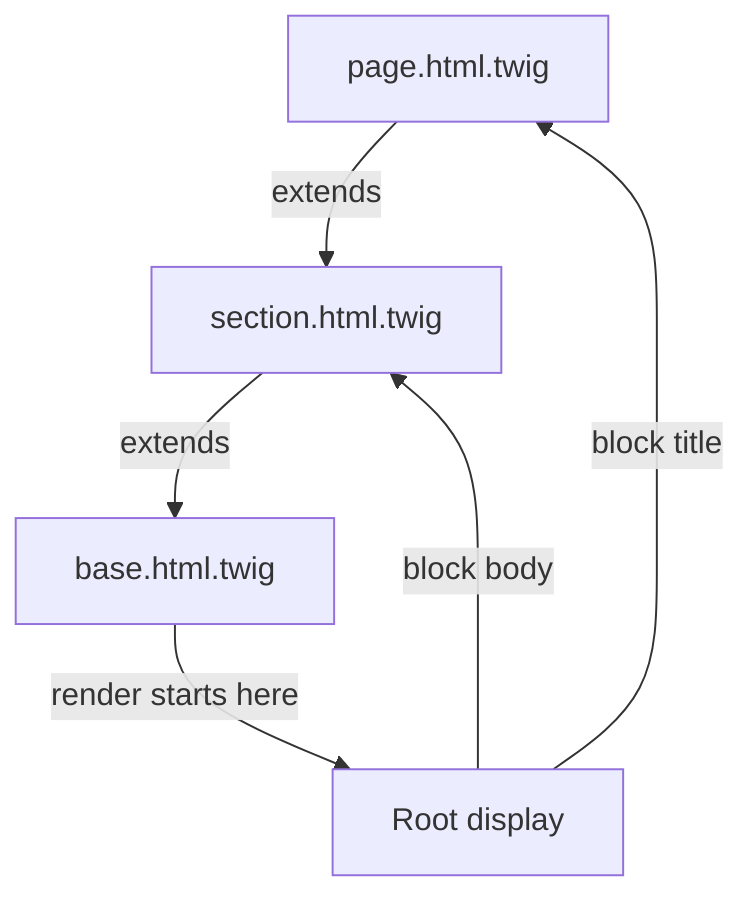

# Template Inheritance

!!! tip "In a nutshell"
    A child `` a parent layout and overrides its named ``
    holes; `{{ parent() }}` keeps the parent's content. Exam hook: a template extends
    exactly one parent, but `` mixes in blocks from many (horizontal reuse).

!!! example "Real-world analogy"
    Template inheritance is a printed form on company letterhead. The parent
    `base.html.twig` is the pre-printed master page — logo, footer, overall layout —
    and each `` is a blank line left for you to fill in. A child page
    keeps the letterhead and only writes into the blanks it cares about; `{{ parent()
    }}` means "keep what was already printed here, then add to it."

!!! abstract "Learning objectives"
    By the end of this chapter you can:

    - [ ] Build a multi-level layout with `extends` and `block`.
    - [ ] Reuse a parent block's content with `parent()` and print any block with `block()`.
    - [ ] Choose between `extends` (vertical) and `use` (horizontal) reuse.

    **Syllabus:** `Templating (Twig) → Template inheritance` ·
    **Level:** Advanced ·
    **Est. time:** 25 min ·
    **Prerequisites:** [Twig Syntax](syntax.md)

---

## Theory

Inheritance lets a child template **fill holes** left by a parent layout. The
parent declares named `` regions; the child `` it and
overrides the blocks it cares about.

=== "base.html.twig (parent)"

    ```twig
    <!DOCTYPE html>
    <html>
    <head><title>My App</title></head>
    <body>
        
        <footer>© 2026</footer>
    </body>
    </html>
    ```

=== "page.html.twig (child)"

    ```twig
    

    Dashboard — {{ parent() }}

    
        <h1>Welcome</h1>
    
    ```

A child may `extends` **only one** parent (single inheritance), but layouts can
be **chained** to any depth: `page → section → base`.

!!! question "Predict first"
    You want a page to pull in blocks from *two* different templates. Can one
    template `extends` two parents? If not, what's the tool?

??? note "Reveal"
    No — a template `extends` **exactly one** parent (single vertical inheritance).
    To mix in named blocks from several templates use `` (horizontal reuse,
    like a PHP trait); it imports blocks only and does **not** set a parent.

## Deep Dive — how it works internally

Each template compiles to a PHP class extending `Twig\Template`. A ``
becomes a `block_<name>()` method; `` sets the parent so that
rendering starts at the **root** ancestor and walks **down**, letting child
methods override parent ones — exactly like PHP method overriding.



- **`extends`** is resolved at runtime (it may be a dynamic expression). Because
  of that, `extends` must be the **first** tag and a template that extends
  another cannot define top-level markup outside blocks.
- **`parent()`** calls the parent class's `block_<name>()` — it renders the block
  content from the template one level up.
- **`block('name')`** (function) prints a block by name from the current template
  hierarchy; `block('name', 'other.html.twig')` reads it from another template.
- The renderer resolves each block via the compiled class's **block table**
  (`$this->blocks`), so an override anywhere in the chain wins.

!!! note "Source reference"
    `Twig\Template`, `Twig\Node\ModuleNode`, block token parsers —
    [twigphp/Twig `3.x`](https://github.com/twigphp/Twig/blob/3.x/src/Template.php).

### `use` — horizontal reuse

`` imports **blocks** (not markup) from another template into the
current one, like a PHP trait. Unlike `extends`, you can `use` **several**
templates, and it does not set a parent. Conflicting names are aliased with `as`.

```twig




    {{ block('base_sidebar') }}  {# reuse the imported block #}
    <p>extra</p>

```

`_sidebar.html.twig` here only contains `…`
definitions — no `extends`, no surrounding HTML.

## Configuration & code

=== "Multi-level: section extends base"

    ```twig
    {# section.html.twig #}
    
    
        <aside></aside>
        <main></main>
    
    ```

=== "Leaf: page extends section"

    ```twig
    {# page.html.twig #}
    
    <p>Only fills content.</p>
    ```

=== "Dynamic parent"

    ```twig
    
    ```

## Best practices & anti-patterns

| ✅ Do | ❌ Avoid |
|---|---|
| One `base.html.twig`, chain sections | Deep 6+ level hierarchies |
| `{{ parent() }}` to extend, not replace | Copy-pasting parent markup |
| `use` for shared block sets | `extends` when you need multiple sources |
| Name blocks semantically | Anonymous nesting nobody can override |

## When (not) to use it / alternatives

- **`extends`** — you want a *skeleton* the child fills. Vertical, single-parent.
- **`use`** — you want to *mix in* named blocks from many sources. Horizontal.
- **`include`/`embed`** — you want to *drop a fragment* in place (see
  [Includes](includes.md)). Prefer includes for reusable partials that are not
  "holes" in a layout.

!!! danger "Certification traps"
    - A template can `extends` **exactly one** parent, but can `use` **many**.
    - `` must be first; a child extending a parent cannot output
      markup outside blocks.
    - `parent()` renders the **parent block**, `block('x')` renders block `x` of
      the current hierarchy — different tools.
    - `use` imports **blocks only**, not other content, and does **not** set a parent.

!!! warning "Common mistakes"
    - Expecting variables `set` in a child before `extends` to reach the parent —
      set them inside a block instead.
    - Overriding a block and losing the parent content by forgetting `{{ parent() }}`.

## Exercises

1. **(Basic)** Add a `Dashboard` prefix to the parent `title` while keeping the
   parent value.
2. **(Intermediate)** Create a three-level hierarchy `base → layout → page` where
   `page` only defines `content`.
3. **(Advanced)** Reuse a `menu` block defined in `_menu.html.twig` from a page
   that already extends `base.html.twig`.

??? success "Solutions"

    **1.** `Dashboard — {{ parent() }}`.

    **2.** `base` declares `body`; `layout` extends base, splits `body` into
    `sidebar`+`content`; `page` extends layout and defines only `content`.

    **3.** `` then, if overriding,
    `{{ parent() }}…` — or just leave it to inherit
    the imported block.

## Certification questions

??? question "Q1. How many templates can a single template `extends`?"
    - [x] A. Exactly one ✅
    - [ ] B. Up to three
    - [ ] C. Unlimited
    - [ ] D. Zero

    **Why:** Twig supports single vertical inheritance; use `use` for multiple
    block sources. **Ref:**
    [Twig inheritance](https://twig.symfony.com/doc/3.x/tags/extends.html).

??? question "Q2. What does `{{ parent() }}` do inside a block?"
    - [ ] A. Renders the whole parent template
    - [x] B. Renders the parent's version of this block ✅
    - [ ] C. Calls the controller's parent
    - [ ] D. Nothing

    **Why:** `parent()` outputs the same block from the parent template. **Ref:**
    [parent()](https://twig.symfony.com/doc/3.x/functions/parent.html).

??? question "Q3. Which tag provides horizontal reuse of blocks?"
    - [ ] A. `extends`
    - [ ] B. `include`
    - [x] C. `use` ✅
    - [ ] D. `embed`

    **Why:** `use` imports block definitions like a trait. **Ref:**
    [use tag](https://twig.symfony.com/doc/3.x/tags/use.html).

## Key takeaways

- `extends` = single vertical parent; blocks are the overridable holes.
- `parent()` extends a block; `block('x')` prints a named block.
- `use` mixes in blocks from many templates (horizontal), no parent set.
- Inheritance compiles to PHP method overriding on `Twig\Template`.

## Last-minute revision

!!! tip "Cheat sheet"
    - `` first, one parent only.
    - `…` → overridable region.
    - `{{ parent() }}` parent block · `{{ block('x') }}` any block.
    - `` horizontal, blocks only.

## Connections

- **Depends on:** [Twig Syntax](syntax.md) — blocks and `extends` are just tags; `extends` must be the first tag.
- **Reused in:** [Includes](includes.md) — `embed` layers block-overriding onto an include.
- **Confused with:** [Includes](includes.md) — inheritance fills *holes* in a layout; includes drop a *fragment* in place.

## Official References
- [Official — Template inheritance](https://symfony.com/doc/current/templates.html#template-inheritance-and-layouts)
- [Twig — extends / use / block](https://twig.symfony.com/doc/3.x/tags/extends.html)
- [Twig source — Template.php](https://github.com/twigphp/Twig/blob/3.x/src/Template.php)

## Confidence check

I'm ready when I can:

- [ ] explain **why** layouts use blocks and how child overrides win
- [ ] build a multi-level `extends` chain with `parent()` in Symfony 8
- [ ] debug a block that lost its parent content because `{{ parent() }}` was dropped
- [ ] spot the trick answer that allows `extends` of multiple parents
- [ ] explain how inheritance maps to PHP method overriding on `Twig\Template`

---

<small>Related: [Twig Syntax](syntax.md) · [Includes](includes.md) · [Controller Rendering](controller-rendering.md)</small>
