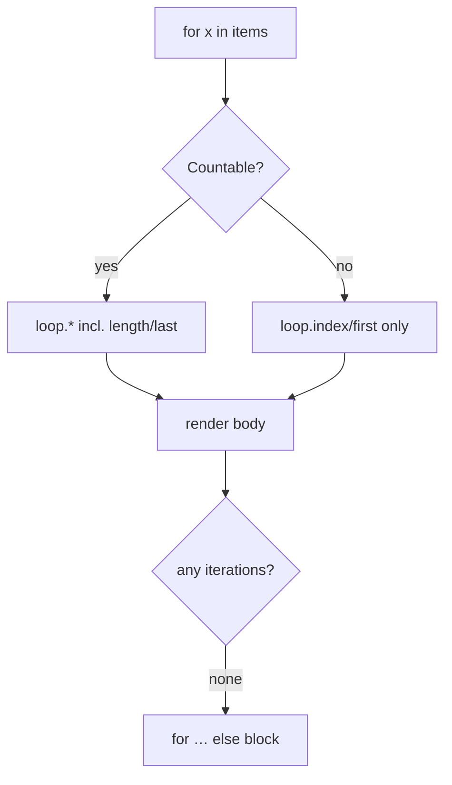

# Loops & Conditions

!!! tip "In a nutshell"
    `` itère et expose la variable `loop` (`index`, `first`, `last`,
    `length`) ; `` gère le cas vide. Point d'examen : Twig n'a pas
    de `break`/`continue` — filtrez plutôt la source avec `for x in items if …`.

!!! example "Real-world analogy"
    `` est un guide de musée qui fait passer un groupe devant chaque
    œuvre : la variable `loop` est le porte-bloc du guide indiquant à quel arrêt
    il se trouve (`index`), s'il s'agit du premier ou du dernier (`first`/`last`)
    et combien il en reste. `for … else` est le panneau « galerie fermée » affiché
    quand il n'y a rien à visiter.

!!! abstract "Learning objectives"
    À la fin de ce chapitre, vous saurez :

    - [ ] Itérer avec `for` et utiliser chaque membre de la variable `loop`.
    - [ ] Brancher avec `if`/`elseif`/`else` et les tests Twig courants.
    - [ ] Utiliser la clause `for … else` pour les collections vides.

    **Syllabus:** `Templating (Twig) → Loops & conditions` ·
    **Level:** Advanced ·
    **Est. time:** 25 min ·
    **Prerequisites:** [Twig Syntax](syntax.md)

---

## Theory

### `for`

```twig

    {{ loop.index }}. {{ item.name }}

```

Itérez des tableaux, des `Traversable`, ou en clé→valeur avec
``.

```twig
{# works on arrays and any Traversable (e.g. a Doctrine Collection) #}

    {{ key }}: {{ value }}

```

La variable **`loop`** dans un `for` :

| Membre | Signification |
|---|---|
| `loop.index` / `loop.index0` | position à partir de 1 / de 0 |
| `loop.revindex` / `loop.revindex0` | distance depuis la fin |
| `loop.first` / `loop.last` | `bool` |
| `loop.length` | total |
| `loop.parent` | contexte de la boucle englobante |

```twig

    
        {{ loop.parent.loop.index }}.{{ loop.index }}/{{ loop.length }}
        {# outer index via loop.parent · 1-based index / total count #}
        {{ loop.index0 }} {{ loop.revindex }} {{ loop.revindex0 }}  {# 0-based / from the end #}
        firstlast  {# booleans #}
    

```

### `if`

```twig
A
B
F

```

### `for … else`

```twig
{{ u.name }}
<p>No users.</p>

```

!!! question "Predict first"
    Vous devez sauter les lignes inactives dans un ``. Vous cherchez
    `` ? Que propose réellement Twig ?

??? note "Reveal"
    Rien — Twig n'a **ni `break` ni `continue`** (délibérément, pour garder les
    templates déclaratifs). Filtrez plutôt la source :
    ``, découpez-la, ou enveloppez le corps dans
    un ``.

## Deep Dive — how it works internally

`` compile en un `foreach` PHP, et la variable `loop` est un petit
tableau que Twig maintient à chaque itération. Point crucial : `loop.length`,
`loop.last`, `loop.revindex` ne sont disponibles que si l'itérable est
**dénombrable** (un tableau ou un `Countable`/`Traversable` que Twig peut
compter) — pour un simple `Generator`, Twig peut les mettre en mémoire tampon ou
les omettre. `loop.first`/`loop.index` sont toujours disponibles.

```twig
  {# compiles to a PHP foreach #}
    {{ loop.index }} {{ loop.first ? 'first' }}    {# always available #}
    {{ loop.length }} {{ loop.revindex }} {{ loop.last ? 'last' }}
    {# ^ need a countable iterable (array/Countable) — not a bare Generator #}

```



- La clause **`else`** ne s'exécute que si la collection produit **zéro** itération.
- `` peut **filtrer** et **découper** en ligne :
  `` et ``.
- Vous **ne pouvez pas `break`/`continue`** en Twig — filtrez la source ou
  utilisez un `if` dans le corps. C'est délibéré (garde les templates déclaratifs).

```twig
{# no break/continue: filter and slice the source instead #}

    {{ x.name }}

    No active items.   {# else: runs only on zero iterations #}

```

!!! note "Source reference"
    `for`/`if` token parsers, `Twig\Node\ForNode`, `Twig\Node\ForLoopNode` —
    [twigphp/Twig `3.x`](https://github.com/twigphp/Twig/blob/3.x/src/Node/ForNode.php).

### Tests (used in conditions)

`is defined`, `is null`, `is empty`, `is even`/`odd`, `is iterable`,
`is same as(x)` (identité `===`), `divisible by(n)`, `constant('X')`. Négation
avec `is not`. `empty` est vrai pour `null`, `false`, `0`, `''`, `[]`.

```twig
has a real value
empty: null / false / 0 / '' / []
evenodd
can be looped
identical (===)
multiple of 3
paid
```

### Null behavior

Itérer sur `null` est sans danger : `` quand `items` est
`null` effectue **zéro** itération et tombe directement dans le bloc
`for … else` — pas d'erreur en mode tolérant. Cela fait de `for … else` la garde
naturelle pour une collection potentiellement null ; vous avez rarement besoin
d'un `` autour.

```twig
{# items is null → zero iterations, straight to else — no wrapping if needed #}

    {{ x }}

    <p>Nothing to show.</p>

```

Dans les conditions, gardez les trois tests distincts :

- `x is defined` — la variable existe tout court (non défini ≠ null).
- `x is null` — elle existe et vaut `null`.
- `x is empty` — plus large : vrai pour `null`, `false`, `0`, `''` et `[]`.

Le piège : `` traite `null`, `0` et `[]` pareillement comme falsy ;
utilisez donc `is null` quand vous devez distinguer « pas de valeur » de « liste
vide ». Combinez avec `is defined` quand une variable peut manquer entièrement :
``.

```twig
truthy             {# falsy for null, 0 and [] alike #}
no value   {# "no value" only #}
nothing   {# null, false, 0, '', [] #}
{{ x }}  {# may be missing entirely #}
```

!!! note "Null in real life"
    Une collection null est un groupe de visite vide : le guide n'a personne à
    promener devant les œuvres, alors il passe directement au panneau « galerie
    fermée » (`for … else`).

## Configuration & code

=== "loop members"

    ```twig
    <ul>
    
        <li class="{{ loop.first ? 'top' }} {{ loop.last ? 'bottom' }}">
            {{ loop.index }}/{{ loop.length }} — {{ row.title }}
        </li>
    
    </ul>
    ```

=== "nested + loop.parent"

    ```twig
    
        
            {{ loop.parent.loop.index }}.{{ loop.index }}
        
    
    ```

=== "inline filter + else"

    ```twig
    
        {{ p.name }}
    
        Nothing in stock.
    
    ```

## Best practices & anti-patterns

| ✅ À faire | ❌ À éviter |
|---|---|
| `for … else` pour l'état vide | Un `` superflu autour |
| Filtrer la source dans le controller | Une logique de filtrage lourde dans la boucle |
| `loop.first`/`last` pour les bords | Des compteurs d'index manuels |
| `is same as` pour l'identité | `==` quand vous voulez dire `===` |

## When (not) to use it / alternatives

Gardez les boucles présentationnelles. Tri, filtrage et pagination relèvent du
controller/repository ; les templates doivent itérer sur des données prêtes.
Pour de grandes collections, paginez plutôt que de boucler sur des milliers de
lignes dans Twig.

!!! danger "Certification traps"
    - Il n'y a **ni `break` ni `continue`** en Twig — utilisez `if` ou filtrez l'itérable.
    - `loop.length`/`loop.last` sont indisponibles pour les itérateurs **non dénombrables**.
    - `loop.index` commence à **1** ; `loop.index0` à 0.
    - Le `else` du `for … else` se déclenche sur une collection **vide**, pas sur le dernier élément.
    - `is empty` est vrai pour `0`, `''`, `false`, `[]`, `null` — plus large que `is null`.

!!! warning "Common mistakes"
    - Imbriquer des boucles et utiliser `loop.index` en attendant l'index externe —
      utilisez `loop.parent.loop.index`.
    - Utiliser `==` pour l'identité d'objets là où `is same as` (`===`) est voulu.

## Exercises

1. **(Basic)** Affichez une liste numérotée, en marquant le dernier élément d'un séparateur.
2. **(Intermediate)** Affichez « No results » quand une liste filtrée est vide, en
   une seule construction.
3. **(Advanced)** Dans des boucles imbriquées, affichez `outerIndex.innerIndex`.

??? success "Solutions"

    **1.** `{{ loop.index }}. {{ i }}—`.

    **2.** `{{ r }}No results`.

    **3.** `{{ loop.parent.loop.index }}.{{ loop.index }}` dans la boucle interne.

## Certification questions

??? question "Q1. What is `loop.index` on the first iteration?"
    - [ ] A. `0`
    - [x] B. `1` ✅
    - [ ] C. `null`
    - [ ] D. `-1`

    **Why:** `loop.index` commence à 1 ; `loop.index0` à 0. **Ref:**
    [for tag](https://twig.symfony.com/doc/3.x/tags/for.html#the-loop-variable).

??? question "Q2. When does the `else` of a `for` run?"
    - [ ] A. On the last item
    - [x] B. When the collection is empty ✅
    - [ ] C. On error
    - [ ] D. Every iteration

    **Why:** `for … else` s'affiche quand il y a zéro itération. **Ref:**
    [for … else](https://twig.symfony.com/doc/3.x/tags/for.html#the-else-clause).

??? question "Q3. How do you skip an iteration in Twig?"
    - [ ] A. ``
    - [ ] B. ``
    - [x] C. Filter the source (`for x in items if …`) ✅
    - [ ] D. `loop.skip()`

    **Why:** Twig n'a pas de `break`/`continue` ; utilisez un `if` en ligne ou un
    filtre. **Ref:**
    [for tag](https://twig.symfony.com/doc/3.x/tags/for.html).

## Key takeaways

- `for` → `foreach` ; `loop` fournit `index`, `first`, `last`, `length`, `parent`.
- `for … else` gère proprement le cas vide.
- Pas de `break`/`continue` — filtrez (`for x in items if …`) à la place.
- `loop.length`/`last` exigent un itérable dénombrable.

## Last-minute revision

!!! tip "Cheat sheet"
    - `loop.index`(1) `index0`(0) `first` `last` `length` `revindex` `parent`.
    - `` · ``.
    - `for … else … endfor` = état vide.
    - Tests : `is defined/null/empty/even/odd/iterable/same as/divisible by`.

## Connections

- **Depends on:** [Twig Syntax](syntax.md) — les tests (`is defined`/`null`/`empty`) et les règles de null utilisés dans les conditions y sont définis.
- **Reused in:** [Filters & Functions](filters-functions.md) — `slice`, `default`, `length` façonnent et protègent l'itérable qu'une boucle parcourt.
- **Confused with:** [Twig Syntax](syntax.md) — `is empty` (vrai pour `0`/`''`/`[]`/`null`) est plus large que `is null`.

## Official References
- [Official — Loops in templates](https://symfony.com/doc/current/templates.html)
- [Twig — for / if tags](https://twig.symfony.com/doc/3.x/tags/for.html)
- [Twig source — ForNode](https://github.com/twigphp/Twig/blob/3.x/src/Node/ForNode.php)

## Video references

!!! tip "Watch & learn"
    Ce sont des chaînes vidéo officielles, mises à jour en continu — cherchez-y
    « Twig templating » pour consolider ce chapitre. Nous lions des chaînes
    stables plutôt que des vidéos individuelles afin que les références ne
    périment jamais.

    - [SymfonyCasts screencasts](https://symfonycasts.com/tracks/symfony) — tutoriels scénarisés à suivre en codant.
    - [Symfony official YouTube](https://www.youtube.com/@SymfonyOfficial) — conférences SymfonyCon & keynotes.
    - [Official docs for this topic](https://symfony.com/doc/current/templates.html) — certaines pages de la doc Symfony intègrent un screencast.

## Confidence check

Je suis prêt quand je peux :

- [ ] expliquer **pourquoi** Twig omet `break`/`continue` et ce qui les remplace
- [ ] utiliser chaque membre de `loop.*` et `for … else` en Symfony 8
- [ ] déboguer un `loop.length`/`loop.last` manquant sur un itérateur non dénombrable
- [ ] repérer la réponse piège qui confond `is null`, `is empty` et `is defined`
- [ ] expliquer comment `for` compile en `foreach` et quand la clause `else` se déclenche

---

<small>Related: [Twig Syntax](syntax.md) · [Filters & Functions](filters-functions.md) · [Includes](includes.md)</small>
