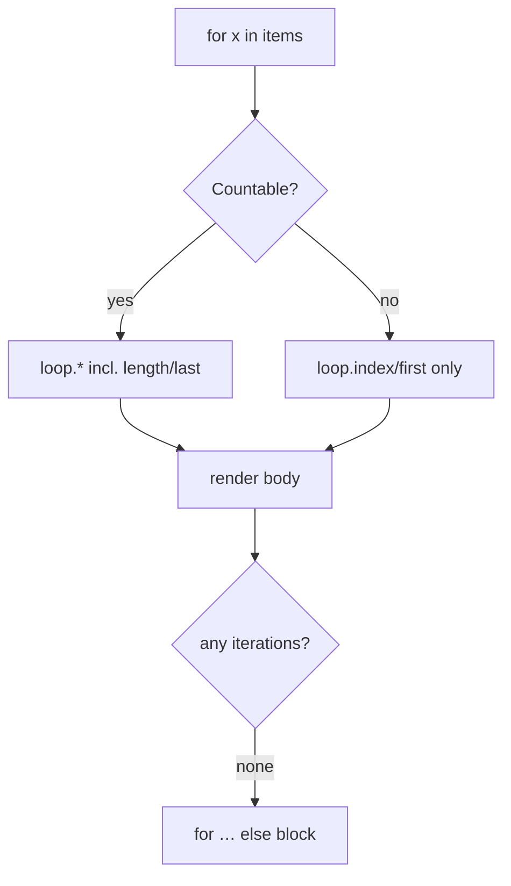

# Loops & Conditions

!!! tip "In a nutshell"
    `` iterates and exposes the `loop` variable (`index`, `first`, `last`,
    `length`); `` handles the empty case. Exam hook: Twig has no
    `break`/`continue` — filter the source with `for x in items if …` instead.

!!! example "Real-world analogy"
    `` is a museum tour guide walking a group past each exhibit: the `loop`
    variable is the guide's clipboard telling them which stop they're on (`index`),
    whether it's the first or last (`first`/`last`), and how many remain. `for …
    else` is the "gallery closed" sign shown when there is nothing to tour.

!!! abstract "Learning objectives"
    By the end of this chapter you can:

    - [ ] Iterate with `for` and use every member of the `loop` variable.
    - [ ] Branch with `if`/`elseif`/`else` and the common Twig tests.
    - [ ] Use the `for … else` clause for empty collections.

    **Syllabus:** `Templating (Twig) → Loops & conditions` ·
    **Level:** Advanced ·
    **Est. time:** 25 min ·
    **Prerequisites:** [Twig Syntax](syntax.md)

---

## Theory

### `for`

```twig

    {{ loop.index }}. {{ item.name }}

```

Iterate arrays, `Traversable`, or key→value with ``.

The **`loop`** variable inside a `for`:

| Member | Meaning |
|---|---|
| `loop.index` / `loop.index0` | 1-based / 0-based position |
| `loop.revindex` / `loop.revindex0` | distance from the end |
| `loop.first` / `loop.last` | `bool` |
| `loop.length` | total count |
| `loop.parent` | context of the enclosing loop |

### `if`

```twig
A
B
F

```

### `for … else`

```twig
{{ u.name }}
<p>No users.</p>

```

## Deep Dive — how it works internally

`` compiles to a PHP `foreach`, and the `loop` variable is a small array
Twig maintains per iteration. Crucially, `loop.length`, `loop.last`,
`loop.revindex` are only available when the iterable is **countable** (an array
or a `Countable`/`Traversable` Twig can count) — for a bare `Generator` Twig may
buffer or omit them. `loop.first`/`loop.index` are always available.



- The **`else`** clause runs only when the collection yields **zero** iterations.
- `` can **filter** and **slice** inline: ``
  and ``.
- You **cannot `break`/`continue`** in Twig — filter the source or use `if`
  inside the body instead. This is deliberate (keeps templates declarative).

!!! note "Source reference"
    `for`/`if` token parsers, `Twig\Node\ForNode`, `Twig\Node\ForLoopNode` —
    [twigphp/Twig `3.x`](https://github.com/twigphp/Twig/blob/3.x/src/Node/ForNode.php).

### Tests (used in conditions)

`is defined`, `is null`, `is empty`, `is even`/`odd`, `is iterable`,
`is same as(x)` (identity `===`), `divisible by(n)`, `constant('X')`. Negate with
`is not`. `empty` is true for `null`, `false`, `0`, `''`, `[]`.

### Null behavior

Iterating `null` is safe: `` when `items` is `null` runs
**zero** iterations and falls straight through to the `for … else` block — no
error in lenient mode. That makes `for … else` the natural guard for a
possibly-null collection; you rarely need a wrapping ``.

In conditions, keep the three tests distinct:

- `x is defined` — the variable exists at all (undefined ≠ null).
- `x is null` — it exists and equals `null`.
- `x is empty` — broader: true for `null`, `false`, `0`, `''` and `[]`.

The trap: `` treats `null`, `0` and `[]` alike as falsy, so use
`is null` when you must tell "no value" apart from "empty list". Combine with
`is defined` when a variable may be missing entirely:
``.

!!! note "Null in real life"
    A null collection is an empty tour group: the guide has no one to walk through
    the exhibits, so they skip straight to the "gallery closed" sign (`for … else`).

## Configuration & code

=== "loop members"

    ```twig
    <ul>
    
        <li class="{{ loop.first ? 'top' }} {{ loop.last ? 'bottom' }}">
            {{ loop.index }}/{{ loop.length }} — {{ row.title }}
        </li>
    
    </ul>
    ```

=== "nested + loop.parent"

    ```twig
    
        
            {{ loop.parent.loop.index }}.{{ loop.index }}
        
    
    ```

=== "inline filter + else"

    ```twig
    
        {{ p.name }}
    
        Nothing in stock.
    
    ```

## Best practices & anti-patterns

| ✅ Do | ❌ Avoid |
|---|---|
| `for … else` for empty state | Extra `` wrapper |
| Filter the source in the controller | Heavy filtering logic in the loop |
| `loop.first`/`last` for edges | Manual index counters |
| `is same as` for identity | `==` when you mean `===` |

## When (not) to use it / alternatives

Keep loops presentational. Sorting, filtering and pagination belong in the
controller/repository; templates should iterate ready-made data. For large
collections, paginate rather than looping thousands of rows in Twig.

!!! danger "Certification traps"
    - There is **no `break`/`continue`** in Twig — use `if` or filter the iterable.
    - `loop.length`/`loop.last` are unavailable for **non-countable** iterators.
    - `loop.index` is **1-based**; `loop.index0` is 0-based.
    - The `for … else` `else` fires on an **empty** collection, not on the last item.
    - `is empty` is true for `0`, `''`, `false`, `[]`, `null` — broader than `is null`.

!!! warning "Common mistakes"
    - Nesting loops and using `loop.index` expecting the outer index — use
      `loop.parent.loop.index`.
    - Using `==` for object identity where `is same as` (`===`) is intended.

## Exercises

1. **(Basic)** Print a numbered list, marking the last item with a divider.
2. **(Intermediate)** Show "No results" when a filtered list is empty, in one
   construct.
3. **(Advanced)** In nested loops, print `outerIndex.innerIndex`.

??? success "Solutions"

    **1.** `{{ loop.index }}. {{ i }}—`.

    **2.** `{{ r }}No results`.

    **3.** `{{ loop.parent.loop.index }}.{{ loop.index }}` inside the inner loop.

## Certification questions

??? question "Q1. What is `loop.index` on the first iteration?"
    - [ ] A. `0`
    - [x] B. `1` ✅
    - [ ] C. `null`
    - [ ] D. `-1`

    **Why:** `loop.index` is 1-based; `loop.index0` is 0-based. **Ref:**
    [for tag](https://twig.symfony.com/doc/3.x/tags/for.html#the-loop-variable).

??? question "Q2. When does the `else` of a `for` run?"
    - [ ] A. On the last item
    - [x] B. When the collection is empty ✅
    - [ ] C. On error
    - [ ] D. Every iteration

    **Why:** `for … else` renders when there are zero iterations. **Ref:**
    [for … else](https://twig.symfony.com/doc/3.x/tags/for.html#the-else-clause).

??? question "Q3. How do you skip an iteration in Twig?"
    - [ ] A. ``
    - [ ] B. ``
    - [x] C. Filter the source (`for x in items if …`) ✅
    - [ ] D. `loop.skip()`

    **Why:** Twig has no `break`/`continue`; use an inline `if` or filter. **Ref:**
    [for tag](https://twig.symfony.com/doc/3.x/tags/for.html).

## Key takeaways

- `for` → `foreach`; `loop` gives `index`, `first`, `last`, `length`, `parent`.
- `for … else` handles the empty case cleanly.
- No `break`/`continue` — filter (`for x in items if …`) instead.
- `loop.length`/`last` need a countable iterable.

## Last-minute revision

!!! tip "Cheat sheet"
    - `loop.index`(1) `index0`(0) `first` `last` `length` `revindex` `parent`.
    - `` · ``.
    - `for … else … endfor` = empty state.
    - Tests: `is defined/null/empty/even/odd/iterable/same as/divisible by`.

## Official References
- [Official — Loops in templates](https://symfony.com/doc/current/templates.html)
- [Twig — for / if tags](https://twig.symfony.com/doc/3.x/tags/for.html)
- [Twig source — ForNode](https://github.com/twigphp/Twig/blob/3.x/src/Node/ForNode.php)

---

<small>Related: [Twig Syntax](syntax.md) · [Filters & Functions](filters-functions.md) · [Includes](includes.md)</small>
