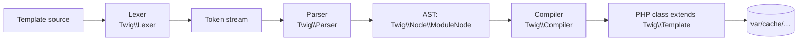

# Twig Syntax

!!! tip "In a nutshell"
    Twig a trois délimiteurs — `{{ }}` affiche, `` agit, `{# #}` commente.
    Les templates sont compilés une seule fois en classes PHP mises en cache, le
    rendu est donc peu coûteux. Point d'examen : `~` concatène (pas `+`), `//` est
    la division entière, et les filtres ont la priorité la plus forte.

!!! example "Real-world analogy"
    Lire un template Twig, c'est comme jouer une pièce à partir d'un script.
    `{{ … }}` sont les répliques dites **à voix haute** (affichées au public),
    `` sont les didascalies qui structurent la scène mais ne sont **jamais
    prononcées**, et `{# … #}` sont les notes du metteur en scène dans la marge —
    pour vous seul, jamais jouées. L'étape de compilation est une répétition
    unique ; chaque représentation suivante est rapide.

!!! abstract "Learning objectives"
    À la fin de ce chapitre, vous saurez :

    - [ ] Distinguer les trois délimiteurs Twig et ce que chacun compile.
    - [ ] Lire correctement les expressions, opérateurs, tests et leur précédence.
    - [ ] Contrôler les espaces avec les modificateurs `-` et le bloc apply `spaceless`.

    **Syllabus:** `Templating (Twig) → Twig syntax` ·
    **Level:** Advanced ·
    **Est. time:** 25 min ·
    **Prerequisites:** [Controllers](../controllers/index.md)

---

## Theory

Twig possède exactement **trois délimiteurs** :

| Délimiteur | Rôle | Compile en |
|---|---|---|
| `{{ … }}` | **afficher** une expression | `echo …;` (via l'escaper) |
| `` | un **tag / une instruction** (structures de contrôle, blocs) | structures de contrôle PHP |
| `{# … #}` | un **commentaire** — jamais rendu | rien |

```twig
{# a comment, stripped at compile time #}
<h1>{{ title }}</h1>
<p>{{ items|length }} item(s)</p>
```

### Variables & attribute access

`{{ user.name }}` résout `user.name` dans cet ordre : `$user['name']`,
`$user->name`, `$user->name()`, `$user->getName()`, `$user->isName()`,
`$user->hasName()`. Utilisez la forme **subscript** `{{ user['name'] }}` pour
forcer un accès tableau/`ArrayAccess`, et `{{ attribute(obj, method, args) }}`
quand le nom est dynamique. Un attribut manquant produit `null` (ou lève une
exception avec `strict_variables`).

```twig
{# user.name tries: $user['name'], ->name, ->name(), getName(), isName(), hasName() #}
{{ user.name }}
{# subscript form: forces the array / ArrayAccess lookup #}
{{ user['name'] }}
{# dynamic attribute name #}
{{ attribute(user, method) }}
{# missing attribute: null on print (or throws with strict_variables) #}
{{ user.nickname ?? 'n/a' }}
```

### Expressions & literals

Chaînes `"hi"`/`'hi'`, nombres `42`/`4.2`, booléens `true`/`false`, `null`,
tableaux `[1, 2]`, hashes `{ key: 'v', (expr): 'v2' }`, et plages `1..5`.

```twig
                    {# strings: "hi" or 'hi' #}
     {# numbers #}
 {# booleans and null in an array #}
               {# array literal #}
 {# hash, (expr) as dynamic key #}
                {# range: 1, 2, 3, 4, 5 #}
```

!!! question "Predict first"
    Que produit `{{ 7 // 2 }}` — `3.5`, `3` ou `4` ?

??? note "Reveal"
    `3`. `//` est la **division entière (floor)** en Twig, distincte de `/`
    (division flottante, qui donne `3.5`). Ces petites différences d'opérateurs —
    `~` vs `+`, `//` vs `/`, les filtres qui ont la priorité la plus forte — sont
    exactement ce que l'examen sonde.

## Deep Dive — how it works internally

Twig est un **compilateur**, pas un interpréteur. `Twig\Environment::render()`
exécute un pipeline en trois étapes : **lex → parse → compile**.



- Le **Lexer** (`Twig\Lexer`) découpe la source en tokens grâce aux expressions
  régulières des délimiteurs.
- Le **Parser** (`Twig\Parser`) + les **token parsers** (`Twig\TokenParser\*`)
  construisent un arbre syntaxique abstrait d'objets `Twig\Node\Node`. Chaque tag
  (`if`, `for`, `block`) possède son propre token parser.
- L'**expression parser** (`Twig\ExpressionParser`) encode la **table de
  précédence des opérateurs** — c'est *le* point que l'examen sonde.
- Le **Compiler** (`Twig\Compiler`) parcourt l'AST et émet une classe PHP
  étendant `Twig\Template`, dont la méthode `doDisplay()` contient des
  instructions `echo`. Elle est écrite une seule fois dans le cache
  (`Twig\Cache\FilesystemCache`, par défaut `var/cache/<env>/twig`) et réutilisée
  à chaque requête suivante — après la première compilation, le « parsing » des
  templates ne coûte rien à l'exécution.

```php
$source = new \Twig\Source('Hello {{ name }}!', 'demo.twig');

// Lexer (Twig\Lexer): source → token stream
$tokens = $twig->tokenize($source);
// Parser (Twig\Parser) + token parsers (Twig\TokenParser\*) + Twig\ExpressionParser:
// tokens → AST of Twig\Node\Node objects
$ast = $twig->parse($tokens);
// Compiler (Twig\Compiler): AST → PHP class extending Twig\Template (doDisplay())
$php = $twig->compile($ast);  // written once to Twig\Cache\FilesystemCache
```

!!! note "Source reference"
    `Twig\Environment`, `Twig\Lexer`, `Twig\Parser`, `Twig\Compiler` —
    [twigphp/Twig `3.x`](https://github.com/twigphp/Twig/blob/3.x/src/Environment.php).

### Operators & precedence

De la priorité la **plus faible** à la **plus forte** :

| Groupe | Opérateurs |
|---|---|
| ternaire | `? :`, `?:`, `??` |
| logique | `or` → `and` → `not` |
| bit à bit | `b-or` `b-xor` `b-and` |
| comparaison | `==` `!=` `<` `>` `<=` `>=` `<=>` `in` `is` `matches` `starts with` `ends with` |
| chaîne | `~` (concaténation) |
| additif | `+` `-` |
| multiplicatif | `*` `/` `//` (division entière) `%` |
| puissance | `**` (associatif à droite) |
| unaire | `-` `+` `not` |

`{{ 2 + 3 * 4 }}` → `14`. `{{ "a" ~ 1 + 1 }}` → `a2` (`+` est prioritaire sur `~`).
Les filtres (`|`) sont prioritaires sur tout opérateur : `{{ -x|abs }}` équivaut à `-(x|abs)`.

```twig
{{ 2 + 3 * 4 }}    {# 14 — * binds tighter than + #}
{{ "a" ~ 1 + 1 }}  {# 'a2' — + binds tighter than ~ #}
{{ 7 // 2 }}       {# 3 — floor division, unlike / #}
{{ 2 ** 3 ** 2 }}  {# 512 — ** is right-associative: 2 ** (3 ** 2) #}
{{ -3|abs }}       {# -3 — parsed as -(3|abs): filters bind tightest #}
```

### Tests

Les tests utilisent `is` : `{{ x is defined }}`, `is null`, `is empty`, `is even`/`odd`,
`is iterable`, `is same as(y)`, `divisible by(3)`, `constant('App\\Foo::BAR')`.
La négation s'écrit `is not` : ``.

```twig
   {# defined test + `is not` negation #}
    {{ x is empty ? 'empty' : x }}

{{ 4 is even }} {{ 3 is odd }}            {# parity tests #}
{{ items is iterable }}
{{ flag is same as(false) }}              {# strict identity (===) #}
{{ 9 is divisible by(3) }}
{{ status is constant('App\\Foo::BAR') }} {# compare against a PHP constant #}
```

### Null behavior

Twig est volontairement tolérant au `null`. **Afficher** `null` produit une
chaîne vide, jamais une erreur : `{{ missing }}` ne rend rien. (Avec
`strict_variables` activé, une variable *non définie* lève une exception, mais
une variable qui vaut `null` s'affiche quand même vide.) Lire un attribut **sur**
`null` — `{{ user.name }}` quand `user` est `null` — produit `null` (à nouveau,
vide à l'affichage) sauf si `strict_variables` est activé.

```twig
{{ missing }}    {# undefined: prints '' (throws only if strict_variables is on) #}

{{ user.name }}  {# attribute on null: null → empty on print in lenient mode #}
```

Gérez-le explicitement avec trois outils :

- **`??`** — null-coalescing : `{{ count ?? 0 }}` remplace uniquement `null`/non défini.
- **`|default`** — `{{ name|default('Anon') }}` remplace `null`, non défini **et**
  vide (`''`, `[]`).
- **les tests** — ``, ``, `is not null`
  pour brancher avant de toucher une valeur.

```twig
{{ count ?? 0 }}                          {# ?? replaces null/undefined only #}
{{ name|default('Anon') }}                {# |default also replaces '' and [] #}
...       {# branch before touching x #}
{{ x }}  {# print only when non-null #}
```

Le bug classique : croire que `{{ a.b.c }}` lève une erreur quand `a.b` est
`null`. En mode tolérant, il affiche silencieusement vide et la coquille ne se
révèle qu'une fois `strict_variables` activé — gardez-le donc activé en dev.

!!! note "Null in real life"
    Une variable null est une ligne vide sur un formulaire : Twig la laisse vide
    et passe à la suite plutôt que de refuser toute la page.

## Configuration & code

=== "Twig template"

    ```twig
    
    {{ total ?? 0 }} — {{ name|default('Anonymous') }}
    ✓
    ```

=== "PHP (rendering)"

    ```php
    <?php
    declare(strict_types=1);

    namespace App\Controller;

    use Symfony\Bundle\FrameworkBundle\Controller\AbstractController;
    use Symfony\Component\HttpFoundation\Response;
    use Symfony\Component\Routing\Attribute\Route;

    final class HomeController extends AbstractController
    {
        #[Route('/', name: 'home')]
        public function index(): Response
        {
            return $this->render('home/index.html.twig', [
                'title' => 'Hello',
                'items' => ['a', 'b'],
            ]);
        }
    }
    ```

### Whitespace control

- `{{- x -}}` / `` suppriment les espaces du côté marqué.
- `…` supprime les espaces **entre les balises
  HTML** (l'ancien tag `` a été retiré dans Twig 3).

```twig
<ul>

  <li>{{ i }}</li>

</ul>
```

## Best practices & anti-patterns

| ✅ À faire | ❌ À éviter |
|---|---|
| Garder la logique en PHP ; les templates présentent | Logique métier / appels BDD dans Twig |
| Utiliser `{# #}` pour les commentaires de template | `<!-- -->` (fuit dans la sortie) |
| S'appuyer sur la précédence, ajouter `()` pour la clarté | Deviner la priorité des opérateurs |
| `` | Le tag `` supprimé |

## When (not) to use it / alternatives

Twig est le choix par défaut pour HTML/texte. Pour des réponses PHP pures,
utilisez `JsonResponse`. Activez `strict_variables` en dev pour attraper les
coquilles ; gardez le mode tolérant (par défaut) en prod pour qu'une variable
optionnelle manquante s'affiche vide plutôt que de provoquer une erreur.

!!! danger "Certification traps"
    - `{{ }}` **affiche et échappe** ; `` **n'affiche pas**. Les confondre
      est un distracteur classique.
    - `~` est la concaténation de chaînes, **pas** `+`. `1 + 1` vaut `2` ; `1 ~ 1` vaut `"11"`.
    - `//` est la **division entière**, `/` la division flottante : `{{ 7 // 2 }}` → `3`.
    - Les filtres sont prioritaires sur l'arithmétique : `{{ 1 + 2|abs }}` équivaut à `1 + (2|abs)`.
    - `` n'existe plus — utilisez ``.

!!! warning "Common mistakes"
    - Utiliser `<!-- -->` pour des notes : cela est rendu côté client. Utilisez `{# #}`.
    - Croire que `{{ a.b }}` lève une erreur quand `b` manque — cela retourne
      `null` sauf si `strict_variables` est activé.

## Exercises

1. **(Basic)** Prédisez la sortie de `{{ 2 ~ 3 + 4 }}` et expliquez la précédence.
2. **(Intermediate)** Écrivez un extrait qui affiche `count` s'il est défini,
   sinon `0`, en utilisant à la fois `??` et `default`.
3. **(Advanced)** Accédez à une propriété dont le nom est stocké dans `key` sur l'objet `obj`.

??? success "Solutions"

    **1.** `27`. `+` est prioritaire sur `~`, donc c'est `2 ~ (3 + 4)` → `2 ~ 7` →
    la chaîne `"27"`.

    **2.** `{{ count ?? 0 }}` (null-coalescing sur non défini) et
    `{{ count|default(0) }}` (traite aussi le vide comme valeur par défaut). `??`
    ne remplace que `null`/non défini ; `default` remplace aussi les valeurs vides
    (`''`, `[]`) en plus de non défini/null.

    **3.** `{{ attribute(obj, key) }}` — accès dynamique aux attributs.

## Certification questions

??? question "Q1. What does `{{ 7 // 2 }}` output?"
    - [ ] A. `3.5`
    - [x] B. `3` ✅
    - [ ] C. `4`
    - [ ] D. Error

    **Why:** `//` est la division entière (floor) en Twig. **Ref:**
    [Twig operators](https://twig.symfony.com/doc/3.x/templates.html#math).

??? question "Q2. Which delimiter executes a statement without printing?"
    - [ ] A. `{{ … }}`
    - [x] B. `` ✅
    - [ ] C. `{# … #}`
    - [ ] D. `#{ … }`

    **Why:** `` sert aux tags/structures de contrôle ; `{{ }}` affiche ; `{# #}` commente.
    **Ref:** [Twig syntax](https://twig.symfony.com/doc/3.x/templates.html#twig-language-references).

## Key takeaways

- Trois délimiteurs : `{{ }}` affiche, `` agit, `{# #}` commente.
- Twig **compile en une classe PHP** mise en cache sous `var/cache/` ; l'exécution est peu coûteuse.
- `~` concatène ; `//` fait la division entière ; les filtres ont la priorité la plus forte.
- Espaces : modificateurs `-` et ``.

## Last-minute revision

!!! tip "Cheat sheet"
    - `{{ }}` echo · `` logique · `{# #}` commentaire.
    - Ordre d'accès aux attributs : index → propriété → méthode → getX → isX → hasX.
    - Précédence forte→faible : `**` > `* / // %` > `+ -` > `~` > comparaison > `and`/`or` > `?:`.
    - Rognage : `{{- -}}`. ``.

## Connections

- **Depends on:** [Controllers](../controllers/index.md) — un controller rend le template dans lequel vit cette syntaxe.
- **Reused in:** [Loops & Conditions](loops-conditions.md), [Filters & Functions](filters-functions.md) — chaque tag, filtre et test s'appuie sur ces délimiteurs et règles de précédence.
- **Confused with:** [String Interpolation](interpolation.md) — `~` concatène tandis que `+` additionne ; `#{}` vit à l'intérieur d'une chaîne, pas dans `{{ }}`.

## Official References
- [Official — Twig for template designers](https://twig.symfony.com/doc/3.x/templates.html)
- [Official — Creating templates (Symfony)](https://symfony.com/doc/current/templates.html)
- [Twig source — Environment/Compiler](https://github.com/twigphp/Twig/blob/3.x/src/Environment.php)

## Video references

!!! tip "Watch & learn"
    Ce sont des chaînes vidéo officielles, mises à jour en continu — cherchez-y
    « Twig templating » pour consolider ce chapitre. Nous lions des chaînes
    stables plutôt que des vidéos individuelles afin que les références ne
    périment jamais.

    - [SymfonyCasts screencasts](https://symfonycasts.com/tracks/symfony) — tutoriels scénarisés à suivre en codant.
    - [Symfony official YouTube](https://www.youtube.com/@SymfonyOfficial) — conférences SymfonyCon & keynotes.
    - [Official docs for this topic](https://symfony.com/doc/current/templates.html) — certaines pages de la doc Symfony intègrent un screencast.

## Confidence check

Je suis prêt quand je peux :

- [ ] expliquer **pourquoi** chacun des trois délimiteurs existe et ce qu'il compile
- [ ] lire des expressions avec la bonne précédence d'opérateurs en Symfony 8
- [ ] déboguer un attribut manquant qui s'affiche vide jusqu'à l'activation de `strict_variables`
- [ ] repérer la réponse piège sur `//`, `~` vs `+`, ou la priorité des filtres
- [ ] expliquer le pipeline lex → parse → compile et la classe `Twig\Template` mise en cache

---

<small>Related: [Auto-Escaping](auto-escaping.md) · [Loops & Conditions](loops-conditions.md) · [Filters & Functions](filters-functions.md)</small>
