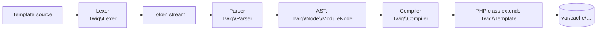

# Twig Syntax

!!! tip "In a nutshell"
    Twig has three delimiters — `{{ }}` prints, `` does, `{# #}` comments.
    Templates compile once to cached PHP classes, so rendering is cheap. Exam hook:
    `~` concatenates (not `+`), `//` is floor division, and filters bind tightest.

!!! example "Real-world analogy"
    Reading a Twig template is like performing from a script. `{{ … }}` are the
    lines you say **out loud** (printed to the audience), `` are the stage
    directions that shape the scene but are **never spoken**, and `{# … #}` are the
    director's margin notes — for you only, never performed. The compile step is a
    one-time rehearsal; every show after is fast.

!!! abstract "Learning objectives"
    By the end of this chapter you can:

    - [ ] Distinguish the three Twig delimiters and what each compiles to.
    - [ ] Read expressions, operators, tests and their precedence correctly.
    - [ ] Control whitespace with `-` modifiers and the `spaceless` apply block.

    **Syllabus:** `Templating (Twig) → Twig syntax` ·
    **Level:** Advanced ·
    **Est. time:** 25 min ·
    **Prerequisites:** [Controllers](../controllers/index.md)

    **Examen Symfony 8 :** OUI

---

## Pour les nuls

### L'idée en une phrase
Twig n'a que trois façons d'écrire quelque chose : afficher (`{{ }}`), agir (``), commenter (`{# #}`) — trois portes, jamais confondues.

### Imagine dans la vraie vie
Lire un template Twig, c'est jouer une pièce depuis un script. `{{ … }}` sont les répliques que tu dis **à voix haute** (affichées au public), `` sont les didascalies qui façonnent la scène mais ne sont **jamais prononcées**, et `{# … #}` sont les notes du metteur en scène en marge — pour toi seul, jamais jouées.

### Dans Symfony
`{{ produit.nom }}` affiche le nom à l'écran ; `` décide *si* quelque chose s'affiche, sans jamais rien afficher lui-même.

### Exemple simple
```twig

    {{ produit.nom }} {# commentaire invisible au public #}

```

### Comment le mémoriser 🧠
"Accolades doubles = ce qui sort à l'écran" (`{{ }}`). "Pourcentage = ce qui se passe en coulisses" (``). "Dièse = notes personnelles invisibles" (`{# #}`).

## Theory

Twig has exactly **three delimiters**:

| Delimiter | Purpose | Compiles to |
|---|---|---|
| `{{ … }}` | **print** an expression | `echo …;` (through the escaper) |
| `` | a **tag / statement** (control flow, blocks) | PHP control structures |
| `{# … #}` | a **comment** — never rendered | nothing |

```twig
{# a comment, stripped at compile time #}
<h1>{{ title }}</h1>
<p>{{ items|length }} item(s)</p>
```

### Variables & attribute access

`{{ user.name }}` resolves `user.name` in this order: `$user['name']`,
`$user->name`, `$user->name()`, `$user->getName()`, `$user->isName()`,
`$user->hasName()`. Use the **subscript** form `{{ user['name'] }}` to force an
array/`ArrayAccess` lookup, and `{{ attribute(obj, method, args) }}` when the
name is dynamic. A missing attribute yields `null` (or throws under `strict_variables`).

```twig
{# user.name tries: $user['name'], ->name, ->name(), getName(), isName(), hasName() #}
{{ user.name }}
{# subscript form: forces the array / ArrayAccess lookup #}
{{ user['name'] }}
{# dynamic attribute name #}
{{ attribute(user, method) }}
{# missing attribute: null on print (or throws with strict_variables) #}
{{ user.nickname ?? 'n/a' }}
```

### Expressions & literals

Strings `"hi"`/`'hi'`, numbers `42`/`4.2`, booleans `true`/`false`, `null`,
arrays `[1, 2]`, hashes `{ key: 'v', (expr): 'v2' }`, and ranges `1..5`.

```twig
                    {# strings: "hi" or 'hi' #}
     {# numbers #}
 {# booleans and null in an array #}
               {# array literal #}
 {# hash, (expr) as dynamic key #}
                {# range: 1, 2, 3, 4, 5 #}
```

!!! question "Predict first"
    What does `{{ 7 // 2 }}` output — `3.5`, `3`, or `4`?

??? note "Reveal"
    `3`. `//` is **floor (integer) division** in Twig, distinct from `/` (float
    division, which gives `3.5`). Small operator differences like this — `~` vs `+`,
    `//` vs `/`, filters binding tightest — are exactly what the exam probes.

## Deep Dive — how it works internally

Twig is a **compiler**, not an interpreter. `Twig\Environment::render()` runs a
three-stage pipeline: **lex → parse → compile**.



- **Lexer** (`Twig\Lexer`) splits source into tokens using the delimiter regexes.
- **Parser** (`Twig\Parser`) + **token parsers** (`Twig\TokenParser\*`) build an
  abstract syntax tree of `Twig\Node\Node` objects. Each tag (`if`, `for`, `block`)
  has its own token parser.
- **Expression parser** (`Twig\ExpressionParser`) encodes the **operator
  precedence table** — this is *the* thing the exam probes.
- **Compiler** (`Twig\Compiler`) walks the AST and emits a PHP class extending
  `Twig\Template`, whose `doDisplay()` contains `echo` statements. It is written
  once to the cache (`Twig\Cache\FilesystemCache`, default `var/cache/<env>/twig`)
  and reused on every subsequent request — templates cost nothing to "parse" at
  runtime after the first compile.

```php
$source = new \Twig\Source('Hello {{ name }}!', 'demo.twig');

// Lexer (Twig\Lexer): source → token stream
$tokens = $twig->tokenize($source);
// Parser (Twig\Parser) + token parsers (Twig\TokenParser\*) + Twig\ExpressionParser:
// tokens → AST of Twig\Node\Node objects
$ast = $twig->parse($tokens);
// Compiler (Twig\Compiler): AST → PHP class extending Twig\Template (doDisplay())
$php = $twig->compile($ast);  // written once to Twig\Cache\FilesystemCache
```

!!! note "Source reference"
    `Twig\Environment`, `Twig\Lexer`, `Twig\Parser`, `Twig\Compiler` —
    [twigphp/Twig `3.x`](https://github.com/twigphp/Twig/blob/3.x/src/Environment.php).

### Operators & precedence

From **lowest** to **highest** binding:

| Group | Operators |
|---|---|
| ternary | `? :`, `?:`, `??` |
| logic | `or` → `and` → `not` |
| bitwise | `b-or` `b-xor` `b-and` |
| comparison | `==` `!=` `<` `>` `<=` `>=` `<=>` `in` `is` `matches` `starts with` `ends with` |
| string | `~` (concatenation) |
| additive | `+` `-` |
| multiplicative | `*` `/` `//` (floor div) `%` |
| power | `**` (right-assoc) |
| unary | `-` `+` `not` |

`{{ 2 + 3 * 4 }}` → `14`. `{{ "a" ~ 1 + 1 }}` → `a2` (`+` binds tighter than `~`).
Filters (`|`) bind tighter than any operator: `{{ -x|abs }}` is `-(x|abs)`.

```twig
{{ 2 + 3 * 4 }}    {# 14 — * binds tighter than + #}
{{ "a" ~ 1 + 1 }}  {# 'a2' — + binds tighter than ~ #}
{{ 7 // 2 }}       {# 3 — floor division, unlike / #}
{{ 2 ** 3 ** 2 }}  {# 512 — ** is right-associative: 2 ** (3 ** 2) #}
{{ -3|abs }}       {# -3 — parsed as -(3|abs): filters bind tightest #}
```

### Tests

Tests use `is`: `{{ x is defined }}`, `is null`, `is empty`, `is even`/`odd`,
`is iterable`, `is same as(y)`, `divisible by(3)`, `constant('App\\Foo::BAR')`.
Negate with `is not`: ``.

```twig
   {# defined test + `is not` negation #}
    {{ x is empty ? 'empty' : x }}

{{ 4 is even }} {{ 3 is odd }}            {# parity tests #}
{{ items is iterable }}
{{ flag is same as(false) }}              {# strict identity (===) #}
{{ 9 is divisible by(3) }}
{{ status is constant('App\\Foo::BAR') }} {# compare against a PHP constant #}
```

### Null behavior

Twig is deliberately null-tolerant. **Printing** `null` outputs an empty string,
never an error: `{{ missing }}` renders nothing. (With `strict_variables` on, an
*undefined* variable throws, but a variable that resolves to `null` still prints
empty.) Reading an attribute **on** `null` — `{{ user.name }}` when `user` is
`null` — yields `null` (again, empty on print) unless `strict_variables` is on.

```twig
{{ missing }}    {# undefined: prints '' (throws only if strict_variables is on) #}

{{ user.name }}  {# attribute on null: null → empty on print in lenient mode #}
```

Handle it explicitly with three tools:

- **`??`** — null-coalescing: `{{ count ?? 0 }}` replaces `null`/undefined only.
- **`|default`** — `{{ name|default('Anon') }}` replaces `null`, undefined **and**
  empty (`''`, `[]`).
- **tests** — ``, ``, `is not null` to
  branch before you touch a value.

```twig
{{ count ?? 0 }}                          {# ?? replaces null/undefined only #}
{{ name|default('Anon') }}                {# |default also replaces '' and [] #}
...       {# branch before touching x #}
{{ x }}  {# print only when non-null #}
```

The classic bug: assuming `{{ a.b.c }}` throws when `a.b` is `null`. In lenient
mode it quietly prints empty and the typo only surfaces once `strict_variables`
is on — so keep it on in dev.

!!! note "Null in real life"
    A null variable is a blank line on a form: Twig leaves it empty and moves on
    rather than refusing the whole page.

## Configuration & code

=== "Twig template"

    ```twig
    
    {{ total ?? 0 }} — {{ name|default('Anonymous') }}
    ✓
    ```

=== "PHP (rendering)"

    ```php
    <?php
    declare(strict_types=1);

    namespace App\Controller;

    use Symfony\Bundle\FrameworkBundle\Controller\AbstractController;
    use Symfony\Component\HttpFoundation\Response;
    use Symfony\Component\Routing\Attribute\Route;

    final class HomeController extends AbstractController
    {
        #[Route('/', name: 'home')]
        public function index(): Response
        {
            return $this->render('home/index.html.twig', [
                'title' => 'Hello',
                'items' => ['a', 'b'],
            ]);
        }
    }
    ```

### Whitespace control

- `{{- x -}}` / `` trim whitespace on the marked side.
- `…` removes whitespace **between HTML tags**
  (the old `` tag was removed in Twig 3).

```twig
<ul>

  <li>{{ i }}</li>

</ul>
```

## Best practices & anti-patterns

| ✅ Do | ❌ Avoid |
|---|---|
| Keep logic in PHP; templates present | Business logic / DB calls in Twig |
| Use `{# #}` for template comments | `<!-- -->` (leaks to output) |
| Rely on precedence, add `()` for clarity | Guessing operator binding |
| `` | The removed `` tag |

## When (not) to use it / alternatives

Twig is the default for HTML/text. For pure PHP responses use `JsonResponse`.
Enable `strict_variables` in dev to catch typos; keep it lenient (default) in
prod so a missing optional variable renders as empty rather than erroring.

!!! danger "Certification traps"
    - `{{ }}` **prints and escapes**; `` **does not print**. Confusing them
      is a classic distractor.
    - `~` is string concatenation, **not** `+`. `1 + 1` is `2`; `1 ~ 1` is `"11"`.
    - `//` is **floor division**, `/` is float division: `{{ 7 // 2 }}` → `3`.
    - Filters bind tighter than arithmetic: `{{ 1 + 2|abs }}` is `1 + (2|abs)`.
    - `` no longer exists — use ``.

!!! warning "Common mistakes"
    - Using `<!-- -->` for notes: it renders to the client. Use `{# #}`.
    - Assuming `{{ a.b }}` throws on missing `b` — it returns `null` unless
      `strict_variables` is on.

## Exercises

1. **(Basic)** Predict the output of `{{ 2 ~ 3 + 4 }}` and explain the precedence.
2. **(Intermediate)** Write a snippet that prints `count` if defined, else `0`,
   using both `??` and `default`.
3. **(Advanced)** Access a property whose name is stored in `key` on object `obj`.

??? success "Solutions"

    **1.** `27`. `+` binds tighter than `~`, so it is `2 ~ (3 + 4)` → `2 ~ 7` →
    the string `"27"`.

    **2.** `{{ count ?? 0 }}` (null-coalescing on undefined) and
    `{{ count|default(0) }}` (also treats empty as default). `??` only replaces
    `null`/undefined; `default` also replaces empty values (`''`, `[]`) as well as
    undefined/null.

    **3.** `{{ attribute(obj, key) }}` — dynamic attribute access.

## Certification questions

*Question d'entraînement inspirée du syllabus — jamais une question officielle de l'examen.*

??? question "Q1. What does `{{ 7 // 2 }}` output?"
    - [ ] A. `3.5`
    - [x] B. `3` ✅
    - [ ] C. `4`
    - [ ] D. Error

    **Why:** `//` is integer (floor) division in Twig. **Ref:**
    [Twig operators](https://twig.symfony.com/doc/3.x/templates.html#math).

??? question "Q2. Which delimiter executes a statement without printing?"
    - [ ] A. `{{ … }}`
    - [x] B. `` ✅
    - [ ] C. `{# … #}`
    - [ ] D. `#{ … }`

    **Why:** `` is for tags/control flow; `{{ }}` prints; `{# #}` comments.
    **Ref:** [Twig syntax](https://twig.symfony.com/doc/3.x/templates.html#twig-language-references).

## Key takeaways

- Three delimiters: `{{ }}` print, `` do, `{# #}` comment.
- Twig **compiles to a PHP class** cached under `var/cache/`; runtime is cheap.
- `~` concatenates; `//` floors; filters bind tightest.
- Whitespace: `-` modifiers and ``.

## Last-minute revision

!!! tip "Cheat sheet"
    - `{{ }}` echo · `` logic · `{# #}` comment.
    - Attribute order: index → property → method → getX → isX → hasX.
    - Precedence high→low: `**` > `* / // %` > `+ -` > `~` > compare > `and`/`or` > `?:`.
    - Trim: `{{- -}}`. ``.

## Connections

- **Depends on:** [Controllers](../controllers/index.md) — a controller renders the template that this syntax lives in.
- **Reused in:** [Loops & Conditions](loops-conditions.md), [Filters & Functions](filters-functions.md) — every tag, filter and test builds on these delimiters and precedence rules.
- **Confused with:** [String Interpolation](interpolation.md) — `~` concatenates while `+` adds; `#{}` lives inside a string, not `{{ }}`.

## Official References
- [Official — Twig for template designers](https://twig.symfony.com/doc/3.x/templates.html)
- [Official — Creating templates (Symfony)](https://symfony.com/doc/8.0/templates.html)
- [Twig source — Environment/Compiler](https://github.com/twigphp/Twig/blob/3.x/src/Environment.php)

## Video references

!!! tip "Watch & learn"
    These are official, continuously-updated video channels — search them for
    "Twig templating" to reinforce this chapter. We link stable channels rather than
    individual videos so the references never rot.

    - [SymfonyCasts screencasts](https://symfonycasts.com/tracks/symfony) — scripted, code-along tutorials.
    - [Symfony official YouTube](https://www.youtube.com/@SymfonyOfficial) — SymfonyCon conference talks & keynotes.
    - [Official docs for this topic](https://symfony.com/doc/8.0/templates.html) — some Symfony doc pages embed a screencast.

## Confidence check

I'm ready when I can:

- [ ] explain **why** each of the three delimiters exists and what it compiles to
- [ ] read expressions with correct operator precedence in Symfony 8
- [ ] debug a missing attribute that prints empty until `strict_variables` is on
- [ ] spot the trick answer on `//`, `~` vs `+`, or filter binding
- [ ] explain the lex → parse → compile pipeline and the cached `Twig\Template` class

---

<small>Related: [Auto-Escaping](auto-escaping.md) · [Loops & Conditions](loops-conditions.md) · [Filters & Functions](filters-functions.md)</small>
