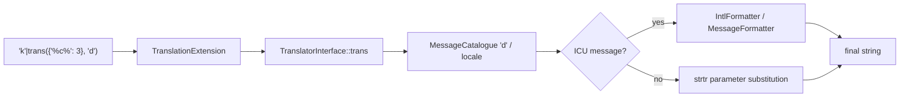

# Translations & Pluralization

!!! tip "In a nutshell"
    Traduisez avec `'key'|trans(params, domain, locale)` et pluralisez avec l'ICU
    `{n, plural, …}` dans un domaine `+intl-icu`. Point d'examen : `transchoice` a
    été supprimé — ICU MessageFormat est désormais la seule voie de pluralisation.

!!! example "Real-world analogy"
    Traduire avec `trans`, c'est utiliser un guide de conversation organisé en
    sections à onglets (les domaines — `messages`, `admin`, `validators`) avec une
    édition par langue (les locales). Vous n'écrivez jamais une phrase anglaise
    complète ; vous cherchez un code d'entrée stable comme `welcome.title`, et le
    guide retourne la phrase dans la langue du lecteur — ou, si l'entrée manque,
    vous renvoie simplement le code. Pour tout ce qui doit s'accorder avec un
    nombre, vous vous appuyez sur l'annexe spéciale ICU (les fichiers `+intl-icu`)
    qui encode les règles grammaticales propres à chaque langue, afin de savoir
    dire « 1 message » mais « 5 messages » — et, dans d'autres langues, tout ce
    que leurs règles de pluriel exigent.

!!! abstract "Learning objectives"
    À la fin de ce chapitre, vous saurez :

    - [ ] Traduire des chaînes avec le filtre `trans` et le tag ``.
    - [ ] Passer des paramètres et choisir un domaine de traduction.
    - [ ] Pluraliser avec l'**ICU MessageFormat** (domaines `+intl-icu`).

    **Syllabus:** `Templating (Twig) → Translations & pluralization` ·
    **Level:** Advanced → Expert ·
    **Est. time:** 25 min ·
    **Prerequisites:** [Twig Syntax](syntax.md)

---

## Theory

Traduisez un message en le faisant passer par **`trans`** :

```twig
{{ 'welcome.title'|trans }}
{{ 'welcome.hello'|trans({ '%name%': user.name }) }}
{{ 'button.save'|trans({}, 'admin') }}   {# domain 'admin' #}
```

Signature : `message|trans(parameters = {}, domain = 'messages', locale = null)`.
La clé (`welcome.title`) est cherchée dans le catalogue de la locale courante ;
si elle manque, la clé elle-même est retournée.

!!! question "Predict first"
    Vous avez besoin de la pluralisation « 1 message / 5 messages » dans un
    template Symfony 8. Vous cherchez `transchoice` ? Quelle est la voie actuelle ?

??? note "Reveal"
    `transchoice()` et `|transchoice` ont été **supprimés**. Pluralisez avec
    l'**ICU MessageFormat** — `{count, plural, one {…} other {…}}` — dans un
    domaine dont le fichier porte le suffixe `+intl-icu`
    (p. ex. `messages+intl-icu.en.yaml`). Seul ce suffixe déclenche l'analyse ICU.

## Deep Dive — how it works internally

Le filtre/tag est fourni par
**`Symfony\Bridge\Twig\Extension\TranslationExtension`**, qui appelle le
**`Symfony\Contracts\Translation\TranslatorInterface::trans()`**. Le translator
charge les catalogues (YAML/XLIFF sous `translations/`) dans un
`MessageCatalogue`, résout le message, substitue les paramètres et — quand le
message est ICU — le passe par l'**`IntlFormatter`** (le `MessageFormatter` de
l'extension PHP `intl`).



- Les **domaines** partitionnent les catalogues (`messages`, `admin`,
  `validators`…). Nommage des fichiers : `messages.en.yaml`, `admin.fr.xlf`, etc.
- Un domaine suffixé **`+intl-icu`** (p. ex. `messages+intl-icu.en.yaml`) est
  analysé par le formateur ICU, débloquant `plural`, `select` et le formatage
  nombre/date sensible à la locale à l'intérieur du message.
- L'ancien `transchoice()` et le filtre `|transchoice` ont été **supprimés** —
  utilisez l'ICU `plural` à la place.
- `` définit le domaine par défaut pour le
  reste du template, ce qui permet d'omettre l'argument de domaine.

!!! note "Source reference"
    `Symfony\Bridge\Twig\Extension\TranslationExtension`,
    `Symfony\Contracts\Translation\TranslatorInterface` —
    [symfony/symfony `8.0`](https://github.com/symfony/symfony/blob/8.0/src/Symfony/Bridge/Twig/Extension/TranslationExtension.php).

### Pluralization with ICU

```yaml
# translations/messages+intl-icu.en.yaml
notifications: >-
    {count, plural,
        =0    {No new messages}
        one   {One new message}
        other {# new messages}
    }
```

```twig
{{ 'notifications'|trans({ 'count': n }) }}
```

`#` affiche le nombre ; `one`/`other` sont des catégories de pluriel CLDR
(propres à la locale) ; `=0` correspond à la valeur exacte. `select` fonctionne
de la même façon pour le genre/les énumérations.

## Configuration & code

=== "Twig — filter & tag"

    ```twig
    {{ 'greeting'|trans({ '%name%': name }) }}

    {% trans with { '%name%': name } from 'admin' %}
        Hello %name%
    

    
    {{ 'dashboard.title'|trans }}   {# uses 'admin' now #}
    ```

=== "YAML catalogues"

    ```yaml
    # translations/messages.en.yaml
    greeting: 'Hello %name%'
    # translations/messages.fr.yaml
    greeting: 'Bonjour %name%'
    ```

=== "Config"

    ```yaml
    # config/packages/translation.yaml
    framework:
        default_locale: en
        translator:
            default_path: '%kernel.project_dir%/translations'
            fallbacks: ['en']
    ```

## Best practices & anti-patterns

| ✅ À faire | ❌ À éviter |
|---|---|
| Utiliser des **clés** stables (`welcome.title`) | Traduire des phrases anglaises brutes |
| L'ICU `plural` pour les comptes | Le `transchoice()` supprimé |
| Encadrer les paramètres avec `%name%` | Concaténer des morceaux traduits |
| Découper par domaine | Un unique catalogue `messages` géant |

## When (not) to use it / alternatives

Traduisez tout ce qui est visible par l'utilisateur, même dans une application
mono-locale (les clés documentent l'intention et facilitent l'i18n future). Pour
le formatage **nombre/date/devise** sensible à la locale dans un message simple,
utilisez l'ICU ou les filtres intl (`format_number`, `format_currency`) — voir
[Intl](../miscellaneous/intl.md).

!!! danger "Certification traps"
    - L'ordre de la signature de `trans` est **`(parameters, domain, locale)`** —
      passer le domaine en premier est faux.
    - `transchoice` est **supprimé** ; la pluralisation est l'ICU `{n, plural, …}`.
    - L'analyse ICU ne s'active que pour le suffixe de domaine **`+intl-icu`**.
    - Une clé manquante retourne la **chaîne de la clé**, elle ne lève pas d'erreur.
    - Les catégories de pluriel (`one`, `other`, `few`, `many`) sont **définies
      par la locale** ; l'anglais a `one`/`other`, d'autres locales diffèrent.

!!! warning "Common mistakes"
    - Oublier le `{}` vide quand seul le domaine est nécessaire :
      `'k'|trans({}, 'admin')`.
    - Mettre de la syntaxe ICU dans un fichier non `+intl-icu` — les accolades
      s'affichent littéralement.

## Exercises

1. **(Basic)** Traduisez `menu.home` depuis le domaine `admin`.
2. **(Intermediate)** Interpolez un paramètre `%user%` dans un message d'accueil.
3. **(Advanced)** Écrivez un message ICU plural pour « You have N notifications »
   avec `=0`, `one`, `other`.

??? success "Solutions"

    **1.** `{{ 'menu.home'|trans({}, 'admin') }}`.

    **2.** `{{ 'greeting'|trans({ '%user%': user.name }) }}` avec le catalogue
    `greeting: 'Hi %user%'`.

    **3.** Voir l'exemple ICU `notifications` ci-dessus ; appelez
    `{{ 'notifications'|trans({ 'count': n }) }}`.

## Certification questions

??? question "Q1. What is the argument order of the `trans` filter?"
    - [x] A. `(parameters, domain, locale)` ✅
    - [ ] B. `(domain, parameters, locale)`
    - [ ] C. `(locale, domain, parameters)`
    - [ ] D. `(parameters, locale, domain)`

    **Why:** `message|trans(parameters = {}, domain = 'messages', locale = null)`.
    **Ref:** [trans filter](https://symfony.com/doc/current/translation.html#translations-in-templates).

??? question "Q2. How do you pluralize in Symfony 8 templates?"
    - [ ] A. `transchoice`
    - [x] B. ICU `{count, plural, …}` in a `+intl-icu` domain ✅
    - [ ] C. `|plural`
    - [ ] D. ``

    **Why:** `transchoice` a été supprimé ; ICU MessageFormat gère les pluriels. **Ref:**
    [Pluralization](https://symfony.com/doc/current/translation/message_format.html).

??? question "Q3. A key has no translation for the current locale (and no fallback). What renders?"
    - [x] A. The key string itself ✅
    - [ ] B. An empty string
    - [ ] C. A 500 error
    - [ ] D. `null`

    **Why:** Le translator retourne l'identifiant non traduit. **Ref:**
    [Translation](https://symfony.com/doc/current/translation.html).

## Key takeaways

- `message|trans(params, domain, locale)` — attention à l'ordre.
- Les domaines partitionnent les catalogues ; `+intl-icu` débloque le formatage ICU.
- Pluralisez avec l'ICU `{n, plural, one{…} other{…}}`, pas avec `transchoice`.
- Les clés manquantes retournent la clé, elles ne provoquent pas d'erreur.

## Last-minute revision

!!! tip "Cheat sheet"
    - `'k'|trans({'%x%': v}, 'domain', 'fr')`.
    - `` puis omettez l'argument de domaine.
    - ICU : `messages+intl-icu.en.yaml`, `{n, plural, =0{} one{} other{#}}`.
    - `transchoice` = supprimé.

## Connections

- **Depends on:** [Twig Syntax](syntax.md) — `trans` est un filtre ; le tag `` suit les mêmes règles de délimiteurs.
- **Reused in:** [Intl](../miscellaneous/intl.md) — les messages ICU partagent le formatage intl utilisé par `format_number`/`format_currency`.
- **Confused with:** [String Interpolation](interpolation.md) — les placeholders `%name%` sont substitués par le translator, pas par l'interpolation `#{}`.

## Official References
- [Official — Translations in templates](https://symfony.com/doc/current/translation.html#translations-in-templates)
- [Official — Message format (ICU)](https://symfony.com/doc/current/translation/message_format.html)
- [Symfony source — TranslationExtension](https://github.com/symfony/symfony/blob/8.0/src/Symfony/Bridge/Twig/Extension/TranslationExtension.php)

## Video references

!!! tip "Watch & learn"
    Ce sont des chaînes vidéo officielles, mises à jour en continu — cherchez-y
    « Twig templating » pour consolider ce chapitre. Nous lions des chaînes
    stables plutôt que des vidéos individuelles afin que les références ne
    périment jamais.

    - [SymfonyCasts screencasts](https://symfonycasts.com/tracks/symfony) — tutoriels scénarisés à suivre en codant.
    - [Symfony official YouTube](https://www.youtube.com/@SymfonyOfficial) — conférences SymfonyCon & keynotes.
    - [Official docs for this topic](https://symfony.com/doc/current/translation.html#translations-in-templates) — certaines pages de la doc Symfony intègrent un screencast.

## Confidence check

Je suis prêt quand je peux :

- [ ] expliquer **pourquoi** la traduction utilise des clés stables + des domaines plutôt que des phrases brutes
- [ ] traduire et pluraliser avec `trans` et l'ICU en Symfony 8
- [ ] déboguer des accolades ICU affichées littéralement dans un fichier non `+intl-icu`
- [ ] repérer la réponse piège qui utilise `transchoice` ou le mauvais ordre d'arguments de `trans`
- [ ] expliquer le flux `TranslationExtension` → `TranslatorInterface` → catalogue/`IntlFormatter`

---

<small>Related: [Filters & Functions](filters-functions.md) · [Intl](../miscellaneous/intl.md) · [Twig Syntax](syntax.md)</small>
