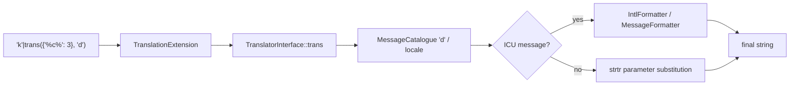

# Translations & Pluralization

!!! tip "In a nutshell"
    Translate with `'key'|trans(params, domain, locale)` and pluralize with ICU
    `{n, plural, …}` in a `+intl-icu` domain. Exam hook: `transchoice` was removed —
    ICU MessageFormat is the only pluralization path now.

!!! abstract "Learning objectives"
    By the end of this chapter you can:

    - [ ] Translate strings with the `trans` filter and the `` tag.
    - [ ] Pass parameters and pick a translation domain.
    - [ ] Pluralize with the **ICU MessageFormat** (`+intl-icu` domains).

    **Syllabus:** `Templating (Twig) → Translations & pluralization` ·
    **Level:** Advanced → Expert ·
    **Est. time:** 25 min ·
    **Prerequisites:** [Twig Syntax](syntax.md)

---

## Theory

Translate a message by piping it through **`trans`**:

```twig
{{ 'welcome.title'|trans }}
{{ 'welcome.hello'|trans({ '%name%': user.name }) }}
{{ 'button.save'|trans({}, 'admin') }}   {# domain 'admin' #}
```

Signature: `message|trans(parameters = {}, domain = 'messages', locale = null)`.
The key (`welcome.title`) is looked up in the catalogue for the current locale;
if missing, the key itself is returned.

!!! question "Predict first"
    You need "1 message / 5 messages" pluralization in a Symfony 8 template.
    Reaching for `transchoice`? What is the current path?

??? note "Reveal"
    `transchoice()` and `|transchoice` were **removed**. Pluralize with **ICU
    MessageFormat** — `{count, plural, one {…} other {…}}` — in a domain whose file
    is suffixed `+intl-icu` (e.g. `messages+intl-icu.en.yaml`). Only that suffix
    triggers ICU parsing.

## Deep Dive — how it works internally

The filter/tag are provided by
**`Symfony\Bridge\Twig\Extension\TranslationExtension`**, which calls the
**`Symfony\Contracts\Translation\TranslatorInterface::trans()`**. The translator
loads catalogues (YAML/XLIFF under `translations/`) into a
`MessageCatalogue`, resolves the message, substitutes parameters, and — when the
message is ICU — runs it through the **`IntlFormatter`** (PHP `intl`
`MessageFormatter`).



- **Domains** partition catalogues (`messages`, `admin`, `validators`…). File
  naming: `messages.en.yaml`, `admin.fr.xlf`, etc.
- A domain suffixed **`+intl-icu`** (e.g. `messages+intl-icu.en.yaml`) is parsed
  with the ICU formatter, unlocking `plural`, `select`, and locale-aware
  number/date formatting inside the message.
- Legacy `transchoice()` and the `|transchoice` filter were **removed** — use ICU
  `plural` instead.
- `` sets the default domain for the rest of the
  template so you can drop the domain argument.

!!! note "Source reference"
    `Symfony\Bridge\Twig\Extension\TranslationExtension`,
    `Symfony\Contracts\Translation\TranslatorInterface` —
    [symfony/symfony `8.0`](https://github.com/symfony/symfony/blob/8.0/src/Symfony/Bridge/Twig/Extension/TranslationExtension.php).

### Pluralization with ICU

```yaml
# translations/messages+intl-icu.en.yaml
notifications: >-
    {count, plural,
        =0    {No new messages}
        one   {One new message}
        other {# new messages}
    }
```

```twig
{{ 'notifications'|trans({ 'count': n }) }}
```

`#` prints the number; `one`/`other` are CLDR plural categories (locale-specific);
`=0` matches the exact value. `select` works the same for gender/enums.

## Configuration & code

=== "Twig — filter & tag"

    ```twig
    {{ 'greeting'|trans({ '%name%': name }) }}

    {% trans with { '%name%': name } from 'admin' %}
        Hello %name%
    

    
    {{ 'dashboard.title'|trans }}   {# uses 'admin' now #}
    ```

=== "YAML catalogues"

    ```yaml
    # translations/messages.en.yaml
    greeting: 'Hello %name%'
    # translations/messages.fr.yaml
    greeting: 'Bonjour %name%'
    ```

=== "Config"

    ```yaml
    # config/packages/translation.yaml
    framework:
        default_locale: en
        translator:
            default_path: '%kernel.project_dir%/translations'
            fallbacks: ['en']
    ```

## Best practices & anti-patterns

| ✅ Do | ❌ Avoid |
|---|---|
| Use stable **keys** (`welcome.title`) | Translating raw English sentences |
| ICU `plural` for counts | Removed `transchoice()` |
| Wrap params in `%name%` | String concatenation of translated parts |
| Split by domain | One giant `messages` catalogue |

## When (not) to use it / alternatives

Translate anything user-facing, even a single-locale app (keys document intent
and ease future i18n). For locale-aware **number/date/currency** formatting
inside a plain message, use ICU or the intl filters (`format_number`,
`format_currency`) — see [Intl](../miscellaneous/intl.md).

!!! danger "Certification traps"
    - `trans` signature order is **`(parameters, domain, locale)`** — passing the
      domain first is wrong.
    - `transchoice` is **removed**; pluralization is ICU `{n, plural, …}`.
    - ICU parsing only kicks in for the **`+intl-icu`** domain suffix.
    - A missing key returns the **key string**, it does not throw.
    - Plural categories (`one`, `other`, `few`, `many`) are **locale-defined**;
      English has `one`/`other`, other locales differ.

!!! warning "Common mistakes"
    - Forgetting the empty `{}` when you only need a domain:
      `'k'|trans({}, 'admin')`.
    - Putting ICU syntax in a non-`+intl-icu` file — the braces render literally.

## Exercises

1. **(Basic)** Translate `menu.home` from the `admin` domain.
2. **(Intermediate)** Interpolate a `%user%` parameter into a greeting.
3. **(Advanced)** Write an ICU plural message for "You have N notifications" with
   `=0`, `one`, `other`.

??? success "Solutions"

    **1.** `{{ 'menu.home'|trans({}, 'admin') }}`.

    **2.** `{{ 'greeting'|trans({ '%user%': user.name }) }}` with catalogue
    `greeting: 'Hi %user%'`.

    **3.** See the `notifications` ICU example above; call
    `{{ 'notifications'|trans({ 'count': n }) }}`.

## Certification questions

??? question "Q1. What is the argument order of the `trans` filter?"
    - [x] A. `(parameters, domain, locale)` ✅
    - [ ] B. `(domain, parameters, locale)`
    - [ ] C. `(locale, domain, parameters)`
    - [ ] D. `(parameters, locale, domain)`

    **Why:** `message|trans(parameters = {}, domain = 'messages', locale = null)`.
    **Ref:** [trans filter](https://symfony.com/doc/current/translation.html#translations-in-templates).

??? question "Q2. How do you pluralize in Symfony 8 templates?"
    - [ ] A. `transchoice`
    - [x] B. ICU `{count, plural, …}` in a `+intl-icu` domain ✅
    - [ ] C. `|plural`
    - [ ] D. ``

    **Why:** `transchoice` was removed; ICU MessageFormat handles plurals. **Ref:**
    [Pluralization](https://symfony.com/doc/current/translation/message_format.html).

??? question "Q3. A key has no translation for the current locale (and no fallback). What renders?"
    - [x] A. The key string itself ✅
    - [ ] B. An empty string
    - [ ] C. A 500 error
    - [ ] D. `null`

    **Why:** The translator returns the untranslated id. **Ref:**
    [Translation](https://symfony.com/doc/current/translation.html).

## Key takeaways

- `message|trans(params, domain, locale)` — mind the order.
- Domains partition catalogues; `+intl-icu` unlocks ICU formatting.
- Pluralize with ICU `{n, plural, one{…} other{…}}`, not `transchoice`.
- Missing keys return the key, they do not error.

## Last-minute revision

!!! tip "Cheat sheet"
    - `'k'|trans({'%x%': v}, 'domain', 'fr')`.
    - `` then drop the domain arg.
    - ICU: `messages+intl-icu.en.yaml`, `{n, plural, =0{} one{} other{#}}`.
    - `transchoice` = removed.

## Connections

- **Depends on:** [Twig Syntax](syntax.md) — `trans` is a filter; the `` tag follows the same delimiter rules.
- **Reused in:** [Intl](../miscellaneous/intl.md) — ICU messages share the intl formatting used by `format_number`/`format_currency`.
- **Confused with:** [String Interpolation](interpolation.md) — `%name%` placeholders are substituted by the translator, not by `#{}` interpolation.

## Official References
- [Official — Translations in templates](https://symfony.com/doc/current/translation.html#translations-in-templates)
- [Official — Message format (ICU)](https://symfony.com/doc/current/translation/message_format.html)
- [Symfony source — TranslationExtension](https://github.com/symfony/symfony/blob/8.0/src/Symfony/Bridge/Twig/Extension/TranslationExtension.php)

## Confidence check

I'm ready when I can:

- [ ] explain **why** translation uses stable keys + domains rather than raw sentences
- [ ] translate and pluralize with `trans` and ICU in Symfony 8
- [ ] debug ICU braces rendering literally in a non-`+intl-icu` file
- [ ] spot the trick answer using `transchoice` or the wrong `trans` argument order
- [ ] explain the `TranslationExtension` → `TranslatorInterface` → catalogue/`IntlFormatter` flow

---

<small>Related: [Filters & Functions](filters-functions.md) · [Intl](../miscellaneous/intl.md) · [Twig Syntax](syntax.md)</small>
