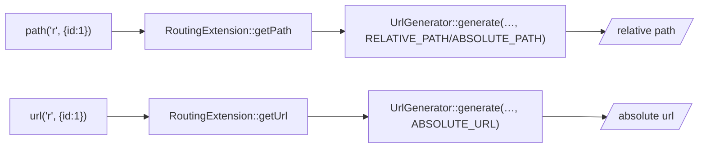

# URL Generation

!!! tip "In a nutshell"
    Générez les liens à partir des noms de routes, ne les codez jamais en dur :
    `path()` donne une URL relative, `url()` une URL absolue. Point d'examen :
    utilisez `url()` dès que le lien quitte la page (e-mails, balises canonical,
    RSS) ; les paramètres en trop deviennent la query string.

!!! example "Real-world analogy"
    Générer une URL, c'est comme indiquer un chemin à quelqu'un. `path()` est le
    raccourci interne au bâtiment — « salle 204, troisième porte à gauche » —
    parfaitement clair une fois que vous êtes déjà dans le même bâtiment (sur le
    même site), mais dénué de sens pour quiconque se trouve ailleurs. `url()` est
    l'adresse postale complète avec rue, ville et pays : la seule forme qui
    fonctionne encore quand le mot est emporté au loin et lu ailleurs — un e-mail,
    un flux RSS, une balise canonical. Dans les deux cas, vous nommez la
    destination par son étiquette (le nom de la route), jamais en recopiant
    l'adresse brute, et tout détail supplémentaire dont l'adresse n'a pas besoin
    devient la ligne « appt/notes » (la query string).

!!! abstract "Learning objectives"
    À la fin de ce chapitre, vous saurez :

    - [ ] Générer des URL relatives avec `path()` et absolues avec `url()`.
    - [ ] Passer des paramètres de route et comprendre le comportement paramètres-en-trop → query string.
    - [ ] Expliquer quelle extension Symfony et quel générateur soutiennent ces fonctions.

    **Syllabus:** `Templating (Twig) → URL generation` ·
    **Level:** Advanced ·
    **Est. time:** 20 min ·
    **Prerequisites:** [Routing](../routing/index.md)

---

## Theory

Ne codez jamais les URL en dur. Générez-les à partir des **noms de routes** pour
que les chemins restent corrects quand les routes changent :

```twig
<a href="{{ path('article_show', { slug: article.slug }) }}">Read</a>
<link rel="canonical" href="{{ url('article_show', { slug: article.slug }) }}">
```

| Fonction | Retourne | Exemple |
|---|---|---|
| `path(name, params)` | URL **relative** | `/articles/hello` |
| `url(name, params)` | URL **absolue** | `https://ex.com/articles/hello` |

Utilisez `path()` pour les liens internes au site ; utilisez `url()` quand l'URL
quitte la page — e-mails, RSS, balises canonical, redirections consommées ailleurs.

!!! question "Predict first"
    Vous construisez le corps d'un e-mail avec `{{ path('order_show', { id: order.id }) }}`.
    Pourquoi les destinataires se plaignent-ils d'un lien cassé ?

??? note "Reveal"
    `path()` produit une URL **relative** (`/order/42`) — parfaite sur la page,
    inutile dans un client mail qui n'a aucun hôte pour la résoudre. Utilisez
    `url()` pour tout ce qui quitte la page (e-mails, balises canonical, RSS) :
    elle émet une URL **absolue** construite à partir du contexte de la request.

## Deep Dive — how it works internally

Les deux fonctions proviennent de
**`Symfony\Bridge\Twig\Extension\RoutingExtension`**, qui délègue au
**`Symfony\Component\Routing\Generator\UrlGeneratorInterface`** (le même
générateur que les controllers utilisent via `generateUrl()`).



- `path()` → type de référence du générateur `ABSOLUTE_PATH` (un chemin relatif à
  la racine comme `/foo`) ; `url()` → `ABSOLUTE_URL` (schéma + hôte + chemin).
- Les **paramètres supplémentaires** non consommés par le motif de la route sont
  ajoutés en **query string** : `path('search', { q: 'a', page: 2 })` quand
  `search` est `/search` → `/search?q=a&page=2`.
- Le générateur lit le **contexte de la request** (`RequestContext` : schéma,
  hôte, URL de base) pour construire les URL absolues — `url()` produit donc le
  bon hôte selon l'environnement.
- `RoutingExtension` marque sa sortie `is_safe: ['html']` pour le contexte
  approprié ; l'URL générée est de toute façon correctement encodée par le
  générateur.

!!! note "Source reference"
    `Symfony\Bridge\Twig\Extension\RoutingExtension`,
    `Symfony\Component\Routing\Generator\UrlGeneratorInterface` —
    [symfony/symfony `8.0`](https://github.com/symfony/symfony/blob/8.0/src/Symfony/Bridge/Twig/Extension/RoutingExtension.php).

Voir [URL generation (Routing)](../routing/url-generation.md) pour les
mécanismes internes du générateur, `RequestContext` et les types de référence.

## Configuration & code

=== "Twig"

    ```twig
    {# named params, extra ones become query string #}
    <a href="{{ path('product_list', { category: 'books', page: 2 }) }}">Books</a>

    {# absolute, for an email/canonical #}
    <a href="{{ url('homepage') }}">Home</a>

    {# link to the current route with a changed param #}
    <a href="{{ path(app.current_route, app.current_route_parameters|merge({ page: 3 })) }}">Next</a>
    ```

=== "Controller (equivalent)"

    ```php
    <?php
    declare(strict_types=1);

    namespace App\Controller;

    use Symfony\Bundle\FrameworkBundle\Controller\AbstractController;
    use Symfony\Component\HttpFoundation\Response;
    use Symfony\Component\Routing\Attribute\Route;
    use Symfony\Component\Routing\Generator\UrlGeneratorInterface;

    final class LinkController extends AbstractController
    {
        #[Route('/go', name: 'go')]
        public function go(): Response
        {
            $rel = $this->generateUrl('homepage');
            $abs = $this->generateUrl('homepage', [], UrlGeneratorInterface::ABSOLUTE_URL);

            return $this->redirect($abs);
        }
    }
    ```

## Best practices & anti-patterns

| ✅ À faire | ❌ À éviter |
|---|---|
| `path()`/`url()` à partir des noms de routes | `/articles/1` codé en dur |
| `url()` pour e-mails/canonical/RSS | `path()` dans un e-mail (relatif, casse) |
| Fusionner `app.current_route_parameters` | Reconstruire l'URL courante à la main |
| Passer les paramètres en hash | Concaténer les paramètres de query en chaîne |

## When (not) to use it / alternatives

Préférez toujours ces fonctions aux littéraux. Choisissez `url()` quand le lien
peut être consulté **hors du site** (e-mail, flux, payload d'API, header
`Location` consommé par un autre hôte). Choisissez `path()` pour la navigation
normale dans la page afin de garder les pages agnostiques de l'hôte.

!!! danger "Certification traps"
    - `path()` est **relative**, `url()` est **absolue** — la question d'examen la
      plus fréquente ici.
    - Les paramètres en trop deviennent la **query string**, ils ne sont pas
      silencieusement ignorés.
    - Un nom de route inconnu lève `RouteNotFoundException` au moment du rendu.
    - `path()` dans le corps d'un e-mail produit un lien **relatif** qui casse
      dans un client mail — utilisez `url()`.

!!! warning "Common mistakes"
    - Oublier un paramètre de route **obligatoire** → `MissingMandatoryParametersException`.
    - Supposer que `url()` utilise `localhost` en prod — elle utilise le contexte
      de la request / l'hôte par défaut configuré.

## Exercises

1. **(Basic)** Liez vers la route `blog_show` avec `slug`.
2. **(Intermediate)** Construisez un `<link>` canonical avec une URL absolue.
3. **(Advanced)** Produisez un lien « page suivante » pour la route courante, en
   incrémentant `page`.

??? success "Solutions"

    **1.** `<a href="{{ path('blog_show', { slug: post.slug }) }}">…</a>`.

    **2.** `<link rel="canonical" href="{{ url('blog_show', { slug: post.slug }) }}">`.

    **3.** `{{ path(app.current_route, app.current_route_parameters|merge({ page: page + 1 })) }}`.

## Certification questions

??? question "Q1. What is the difference between `path()` and `url()`?"
    - [x] A. `path()` is relative, `url()` is absolute ✅
    - [ ] B. `url()` is relative, `path()` is absolute
    - [ ] C. They are identical
    - [ ] D. `path()` only works in controllers

    **Why:** `path()` = `ABSOLUTE_PATH`, `url()` = `ABSOLUTE_URL`. **Ref:**
    [Linking to pages](https://symfony.com/doc/current/templates.html#linking-to-pages).

??? question "Q2. `path('search', { q: 'x', extra: 1 })` where `search` is `/search`. Result?"
    - [x] A. `/search?q=x&extra=1` ✅
    - [ ] B. `/search/x/1`
    - [ ] C. `/search` (extras dropped)
    - [ ] D. Error

    **Why:** Les paramètres absents du motif de route deviennent la query string. **Ref:**
    [URL generation](https://symfony.com/doc/current/routing.html#generating-urls).

??? question "Q3. Which extension provides `path()`/`url()`?"
    - [x] A. `Symfony\Bridge\Twig\Extension\RoutingExtension` ✅
    - [ ] B. `Twig\Extension\CoreExtension`
    - [ ] C. `Symfony\Bridge\Twig\Extension\AssetExtension`
    - [ ] D. `HttpKernelExtension`

    **Why:** `RoutingExtension` enveloppe `UrlGeneratorInterface`. **Ref:**
    [RoutingExtension](https://github.com/symfony/symfony/blob/8.0/src/Symfony/Bridge/Twig/Extension/RoutingExtension.php).

## Key takeaways

- `path()` = relative, `url()` = absolue ; toutes deux depuis les noms de routes.
- Soutenues par `RoutingExtension` → `UrlGeneratorInterface` + `RequestContext`.
- Paramètres en trop → query string ; paramètres obligatoires manquants → exception.
- Utilisez `url()` quand le lien quitte la page (e-mail, canonical, RSS).

## Last-minute revision

!!! tip "Cheat sheet"
    - `path('name', {params})` → `/rel`.
    - `url('name', {params})` → `https://host/rel`.
    - En trop → `?query`. Obligatoire manquant → exception.
    - `app.current_route` + `app.current_route_parameters` pour reconstruire.

## Connections

- **Depends on:** [Routing](../routing/index.md) — `path()`/`url()` transforment un nom de route défini en lien.
- **Reused in:** [URL generation (Routing)](../routing/url-generation.md) — les mêmes `UrlGeneratorInterface`, `RequestContext` et types de référence pilotent Twig comme les controllers.
- **Confused with:** [Assets](assets.md) — `path()`/`url()` servent aux routes ; `asset()` aux fichiers statiques sous `public/`.

## Official References
- [Official — Linking to pages](https://symfony.com/doc/current/templates.html#linking-to-pages)
- [Official — Generating URLs](https://symfony.com/doc/current/routing.html#generating-urls)
- [Symfony source — RoutingExtension](https://github.com/symfony/symfony/blob/8.0/src/Symfony/Bridge/Twig/Extension/RoutingExtension.php)

## Video references

!!! tip "Watch & learn"
    Ce sont des chaînes vidéo officielles, mises à jour en continu — cherchez-y
    « Twig templating » pour consolider ce chapitre. Nous lions des chaînes
    stables plutôt que des vidéos individuelles afin que les références ne
    périment jamais.

    - [SymfonyCasts screencasts](https://symfonycasts.com/tracks/symfony) — tutoriels scénarisés à suivre en codant.
    - [Symfony official YouTube](https://www.youtube.com/@SymfonyOfficial) — conférences SymfonyCon & keynotes.
    - [Official docs for this topic](https://symfony.com/doc/current/templates.html#linking-to-pages) — certaines pages de la doc Symfony intègrent un screencast.

## Confidence check

Je suis prêt quand je peux :

- [ ] expliquer **pourquoi** générer les URL depuis les noms de routes plutôt que de les coder en dur
- [ ] utiliser `path()` vs `url()` et passer des paramètres de route en Symfony 8
- [ ] déboguer un lien relatif cassé dans un e-mail qui aurait dû utiliser `url()`
- [ ] repérer la réponse piège qui inverse relatif/absolu ou ignore les paramètres en trop
- [ ] expliquer comment `RoutingExtension` délègue à `UrlGeneratorInterface` + `RequestContext`

---

<small>Related: [URL generation (Routing)](../routing/url-generation.md) · [Assets](assets.md) · [Global Variables](globals.md)</small>
