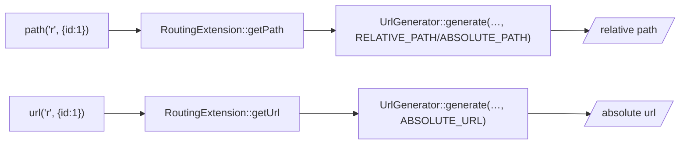

# URL Generation

!!! abstract "Learning objectives"
    By the end of this chapter you can:

    - [ ] Generate relative URLs with `path()` and absolute ones with `url()`.
    - [ ] Pass route parameters and understand extra-params-as-query behaviour.
    - [ ] Explain which Symfony extension and generator back these functions.

    **Syllabus:** `Templating (Twig) → URL generation` ·
    **Level:** Advanced ·
    **Est. time:** 20 min ·
    **Prerequisites:** [Routing](../routing/index.md)

---

## Theory

Never hard-code URLs. Generate them from **route names** so paths stay correct
when routes change:

```twig
<a href="{{ path('article_show', { slug: article.slug }) }}">Read</a>
<link rel="canonical" href="{{ url('article_show', { slug: article.slug }) }}">
```

| Function | Returns | Example |
|---|---|---|
| `path(name, params)` | **relative** URL | `/articles/hello` |
| `url(name, params)` | **absolute** URL | `https://ex.com/articles/hello` |

Use `path()` for on-site links; use `url()` when the URL leaves the page —
emails, RSS, canonical tags, redirects consumed elsewhere.

## Deep Dive — how it works internally

Both functions come from **`Symfony\Bridge\Twig\Extension\RoutingExtension`**,
which delegates to the **`Symfony\Component\Routing\Generator\UrlGeneratorInterface`**
(the same generator controllers use via `generateUrl()`).



- `path()` → generator reference type `ABSOLUTE_PATH` (a root-relative path like
  `/foo`); `url()` → `ABSOLUTE_URL` (scheme + host + path).
- **Extra parameters** not consumed by the route pattern are appended as the
  **query string**: `path('search', { q: 'a', page: 2 })` when `search` is `/search`
  → `/search?q=a&page=2`.
- The generator reads the **request context** (`RequestContext`: scheme, host,
  base URL) to build absolute URLs — so `url()` produces the right host per
  environment.
- `RoutingExtension` marks its output `is_safe: ['html']` for the appropriate
  context; the generated URL is still properly encoded by the generator.

!!! note "Source reference"
    `Symfony\Bridge\Twig\Extension\RoutingExtension`,
    `Symfony\Component\Routing\Generator\UrlGeneratorInterface` —
    [symfony/symfony `8.0`](https://github.com/symfony/symfony/blob/8.0/src/Symfony/Bridge/Twig/Extension/RoutingExtension.php).

See [URL generation (Routing)](../routing/url-generation.md) for the generator
internals, `RequestContext`, and reference types.

## Configuration & code

=== "Twig"

    ```twig
    {# named params, extra ones become query string #}
    <a href="{{ path('product_list', { category: 'books', page: 2 }) }}">Books</a>

    {# absolute, for an email/canonical #}
    <a href="{{ url('homepage') }}">Home</a>

    {# link to the current route with a changed param #}
    <a href="{{ path(app.current_route, app.current_route_parameters|merge({ page: 3 })) }}">Next</a>
    ```

=== "Controller (equivalent)"

    ```php
    <?php
    declare(strict_types=1);

    namespace App\Controller;

    use Symfony\Bundle\FrameworkBundle\Controller\AbstractController;
    use Symfony\Component\HttpFoundation\Response;
    use Symfony\Component\Routing\Attribute\Route;
    use Symfony\Component\Routing\Generator\UrlGeneratorInterface;

    final class LinkController extends AbstractController
    {
        #[Route('/go', name: 'go')]
        public function go(): Response
        {
            $rel = $this->generateUrl('homepage');
            $abs = $this->generateUrl('homepage', [], UrlGeneratorInterface::ABSOLUTE_URL);

            return $this->redirect($abs);
        }
    }
    ```

## Best practices & anti-patterns

| ✅ Do | ❌ Avoid |
|---|---|
| `path()`/`url()` from route names | Hard-coded `/articles/1` |
| `url()` for emails/canonical/RSS | `path()` in an email (relative, breaks) |
| Merge `app.current_route_parameters` | Rebuilding the current URL by hand |
| Pass params as a hash | String-concatenating query params |

## When (not) to use it / alternatives

Always prefer these over literals. Choose `url()` when the link may be viewed
**off-site** (email, feed, API payload, `Location` header consumed by another
host). Choose `path()` for normal in-page navigation to keep pages host-agnostic.

!!! danger "Certification traps"
    - `path()` is **relative**, `url()` is **absolute** — the single most common
      exam question here.
    - Extra params become the **query string**, they are not silently dropped.
    - An unknown route name throws `RouteNotFoundException` at render time.
    - `path()` in an email body yields a **relative** link that breaks in a mail
      client — use `url()`.

!!! warning "Common mistakes"
    - Forgetting a **required** route parameter → `MissingMandatoryParametersException`.
    - Assuming `url()` uses `localhost` in prod — it uses the request context /
      configured default host.

## Exercises

1. **(Basic)** Link to route `blog_show` with `slug`.
2. **(Intermediate)** Build a canonical `<link>` with an absolute URL.
3. **(Advanced)** Produce a "next page" link for the current route, incrementing
   `page`.

??? success "Solutions"

    **1.** `<a href="{{ path('blog_show', { slug: post.slug }) }}">…</a>`.

    **2.** `<link rel="canonical" href="{{ url('blog_show', { slug: post.slug }) }}">`.

    **3.** `{{ path(app.current_route, app.current_route_parameters|merge({ page: page + 1 })) }}`.

## Certification questions

??? question "Q1. What is the difference between `path()` and `url()`?"
    - [x] A. `path()` is relative, `url()` is absolute ✅
    - [ ] B. `url()` is relative, `path()` is absolute
    - [ ] C. They are identical
    - [ ] D. `path()` only works in controllers

    **Why:** `path()` = `ABSOLUTE_PATH`, `url()` = `ABSOLUTE_URL`. **Ref:**
    [Linking to pages](https://symfony.com/doc/current/templates.html#linking-to-pages).

??? question "Q2. `path('search', { q: 'x', extra: 1 })` where `search` is `/search`. Result?"
    - [x] A. `/search?q=x&extra=1` ✅
    - [ ] B. `/search/x/1`
    - [ ] C. `/search` (extras dropped)
    - [ ] D. Error

    **Why:** Parameters not in the route pattern become the query string. **Ref:**
    [URL generation](https://symfony.com/doc/current/routing.html#generating-urls).

??? question "Q3. Which extension provides `path()`/`url()`?"
    - [x] A. `Symfony\Bridge\Twig\Extension\RoutingExtension` ✅
    - [ ] B. `Twig\Extension\CoreExtension`
    - [ ] C. `Symfony\Bridge\Twig\Extension\AssetExtension`
    - [ ] D. `HttpKernelExtension`

    **Why:** `RoutingExtension` wraps `UrlGeneratorInterface`. **Ref:**
    [RoutingExtension](https://github.com/symfony/symfony/blob/8.0/src/Symfony/Bridge/Twig/Extension/RoutingExtension.php).

## Key takeaways

- `path()` = relative, `url()` = absolute; both from route names.
- Backed by `RoutingExtension` → `UrlGeneratorInterface` + `RequestContext`.
- Extra params → query string; missing required params throw.
- Use `url()` when the link leaves the page (email, canonical, RSS).

## Last-minute revision

!!! tip "Cheat sheet"
    - `path('name', {params})` → `/rel`.
    - `url('name', {params})` → `https://host/rel`.
    - Extras → `?query`. Missing required → exception.
    - `app.current_route` + `app.current_route_parameters` to rebuild.

## References

- [Official — Linking to pages](https://symfony.com/doc/current/templates.html#linking-to-pages)
- [Official — Generating URLs](https://symfony.com/doc/current/routing.html#generating-urls)
- [Symfony source — RoutingExtension](https://github.com/symfony/symfony/blob/8.0/src/Symfony/Bridge/Twig/Extension/RoutingExtension.php)

---

<small>Related: [URL generation (Routing)](../routing/url-generation.md) · [Assets](assets.md) · [Global Variables](globals.md)</small>
