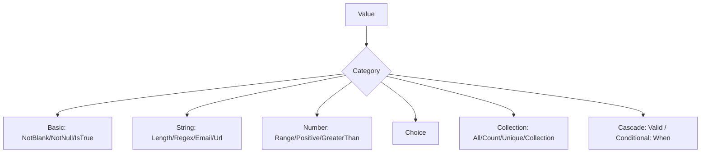

# Built-in Constraints

!!! tip "In a nutshell"
    Symfony fournit une constraint pour presque chaque règle courante ; vous les
    attachez sous forme d'attributs `#[Assert\...]` sur la valeur qu'elles
    protègent. Le fait que les examinateurs adorent : `NotBlank` rejette la chaîne
    vide, tandis que `NotNull` l'accepte — seul un vrai `null` fait échouer
    `NotNull`.

!!! example "Real-world analogy"
    Chaque constraint est **un scanner** sur la ligne de contrôle : les rayons X
    vérifient la forme (`Length`), le détecteur d'odeurs vérifie les liquides
    (`Email`/`Regex`), le portique détecte un seuil (`Range`). `NotBlank` signifie
    « le bagage doit contenir quelque chose » ; `NotNull` signifie seulement
    « un bagage doit être sur le tapis » — un bagage vide compte quand même.

!!! abstract "Learning objectives"
    À la fin de ce chapitre, vous saurez :

    - [ ] Choisir la bonne constraint intégrée dans chaque catégorie
    - [ ] Connaître les options clés qui modifient le comportement d'une constraint
    - [ ] Reconnaître les pièges favoris de l'examen (`NotBlank` vs `NotNull`, `Valid`, `When`)

    **Syllabus:** `Data Validation → Built-in constraints` ·
    **Level:** Advanced / Expert ·
    **Est. time:** 30 min ·
    **Prerequisites:** [Object Validation](object-validation.md)

---

## Theory

Toutes les constraints intégrées vivent dans
`Symfony\Component\Validator\Constraints\` et s'importent via
`use Symfony\Component\Validator\Constraints as Assert;`. Chacune est un petit
value object ; ses options sont des arguments de constructeur. Vous l'attachez en
attribut sur la valeur qu'elle protège.

```php
// all built-in constraints live in Symfony\Component\Validator\Constraints\
use Symfony\Component\Validator\Constraints as Assert; // conventional alias

class Product
{
    // the constraint is a small value object; options are constructor arguments
    #[Assert\Length(min: 3, max: 50)]
    public string $name = '';
}
```

Le catalogue est vaste — l'examen teste les **constraints courantes et leurs cas
limites**, pas les options obscures. Apprenez les catégories ci-dessous.

!!! question "Predict first"
    Une propriété nullable `?string $email` ne porte que `#[Assert\Email]` et est
    laissée à `null`. La validation signale-t-elle une erreur ?

??? note "Reveal"
    Non. Comme la plupart des constraints, `Email` ignore `null`/`''` et ne
    s'exécute jamais. Pour faire de l'absence une erreur, empilez
    `#[Assert\NotBlank]` (ou `NotNull`) devant elle.

## Deep Dive — categories the exam tests

### Basic

| Constraint | Passes when | Note |
|---|---|---|
| `NotBlank` | ni `null`, ni `''`, ni `[]`, ni chaîne blanche | `allowNull: true` pour accepter null |
| `NotNull` | valeur `!== null` | `''` et `0` **passent** |
| `IsNull` | valeur `=== null` | |
| `IsTrue` / `IsFalse` | strictement `true`/`false` (souple : `1`, `'1'`, `true`) | parfait sur les getters |
| `Blank` | la valeur est vide/blanche | l'inverse de `NotBlank` |

La distinction la plus testée de toutes : **`NotBlank` rejette la chaîne vide ;
`NotNull` l'accepte.**

```php
#[Assert\NotBlank]      // '' => violation
public string $title = '';

#[Assert\NotNull]       // '' passes, only a real null fails
public ?string $subtitle = '';
```

### String

```php
<?php
declare(strict_types=1);

namespace App\Entity;

use Symfony\Component\Validator\Constraints as Assert;

class Account
{
    #[Assert\Length(min: 8, max: 4096)]
    public string $password = '';

    #[Assert\Regex(pattern: '/^[a-z0-9_]+$/', message: 'Lowercase, digits, _ only.')]
    public string $handle = '';

    #[Assert\Email(mode: Assert\Email::VALIDATION_MODE_STRICT)]
    public string $email = '';

    #[Assert\Url(requireTld: true)]
    public ?string $website = null;
}
```

- `Length` compte des **caractères** (`min`, `max`, `charset`, `countUnit`).
- Modes d'`Email` : `html5` (par défaut dans la configuration recommandée de
  Symfony), `strict`.
- `Url(requireTld: true)` — exige un TLD ; `protocols` restreint les schémas.

### Number & comparison

| Constraint | Meaning |
|---|---|
| `Range(min, max)` | plage numérique/de dates inclusive |
| `Positive` / `PositiveOrZero` | `> 0` / `>= 0` |
| `Negative` / `NegativeOrZero` | `< 0` / `<= 0` |
| `GreaterThan(v)` / `GreaterThanOrEqual(v)` | strict / non strict |
| `LessThan(v)` / `LessThanOrEqual(v)` | strict / non strict |
| `EqualTo` / `NotEqualTo` | souple (`==`) |
| `IdenticalTo` / `NotIdenticalTo` | strict (`===`) |

Les constraints de comparaison acceptent un `propertyPath` pour comparer à **un
autre champ** (ex. `#[Assert\GreaterThan(propertyPath: 'startDate')]`).

### Choice

```php
#[Assert\Choice(choices: ['draft', 'published', 'archived'])]
public string $status = 'draft';

// callback names a static method returning the allowed *scalar* values
#[Assert\Choice(callback: 'allowedRoles', multiple: true)]
public array $roles = [];
```

`Choice` prend en charge `multiple: true` (valider chaque élément), les comptes
`min`/`max`, et un `callback` retournant l'ensemble autorisé. Pour les valeurs
adossées à un enum, préférez `#[Assert\Type(RoleEnum::class)]` ou un type enum
natif.

### Date & time

`Date`, `Time`, `DateTime` valident le format d'une chaîne ; `Range` compare des
valeurs `\DateTimeInterface` (ex. `min: 'today'` via une chaîne relative).

```php
#[Assert\Date]                      // string in 'Y-m-d' format
public string $birthday = '';

#[Assert\Time]                      // string in 'H:i:s' format
public string $openingTime = '';

#[Assert\DateTime]                  // string in 'Y-m-d H:i:s' format
public string $loggedAt = '';

// Range compares \DateTimeInterface values; relative strings allowed
#[Assert\Range(min: 'today')]
public ?\DateTimeInterface $deliveryDate = null;
```

### Collection & iterable

| Constraint | Purpose |
|---|---|
| `Collection` | valider les **clés** d'un tableau contre des constraints par clé |
| `Count(min, max)` | nombre d'éléments |
| `Unique` | aucun élément en double (`fields:` pour les tableaux de tableaux) |
| `All` | appliquer des constraints à **chaque** élément |
| `Valid` | propager la validation en cascade dans les objets imbriqués |

```php
#[Assert\All([new Assert\NotBlank(), new Assert\Length(max: 20)])]
public array $tags = [];

#[Assert\Collection(
    fields: [
        'street' => new Assert\NotBlank(),
        'zip'    => new Assert\Regex('/^\d{5}$/'),
    ],
    allowExtraFields: false,
    allowMissingFields: false,
)]
public array $address = [];
```

### Misc — `Valid` and `When`

- `#[Assert\Valid]` **propage en cascade** dans un objet ou une collection
  imbriqué(e) afin que ses propres constraints s'exécutent. Sans lui, les objets
  imbriqués sont ignorés. Voir [Scopes](scopes.md).
- `#[Assert\When]` n'applique les constraints internes que si une expression
  `Symfony\Component\ExpressionLanguage` est vraie :

```php
#[Assert\When(
    expression: 'this.getType() === "premium"',
    constraints: [new Assert\NotBlank(), new Assert\Length(min: 10)],
)]
public ?string $vatNumber = null;
```



!!! note "Source reference"
    Les classes de constraints et leurs validators —
    [symfony/symfony `8.0` `Constraints/`](https://github.com/symfony/symfony/tree/8.0/src/Symfony/Component/Validator/Constraints).

### Null behavior

`null` est le point où les constraints piègent le plus de candidats à l'examen.
Les trois constraints de « présence » sont délibérément différentes :

- **`NotNull`** — n'échoue que sur un `null` strict. `''`, `0`, `[]` et `'   '`
  passent tous.
- **`NotBlank`** — échoue sur `null`, `''`, `[]` et (par défaut) les chaînes
  composées uniquement d'espaces. Réglez `allowNull: true` pour laisser passer
  `null` tout en rejetant `''`.
- **`IsNull`** — l'inverse : ne passe que lorsque la valeur **est** `null`.

```php
#[Assert\NotNull]                   // only null fails; '' / 0 / [] pass
public ?string $nickname = '';

#[Assert\NotBlank(allowNull: true)] // null is allowed, but '' still fails
public ?string $bio = null;

#[Assert\IsNull]                    // passes only when the value IS null
public ?string $legacyField = null;
```

Presque toutes les *autres* constraints (`Email`, `Url`, `Length`, `Regex`,
`Range`, `Choice`, `Type`, les comparaisons…) **ignorent `null` et ne produisent
aucune violation** — leurs validators s'arrêtent tôt sur une valeur vide. C'est
pourquoi un email `null` non renseigné passe : `Email` ne s'exécute jamais. Pour
exiger une valeur *et* valider sa forme, empilez les deux afin que le contrôle de
présence fasse le rejet :

```php
#[Assert\NotBlank]   // rejects null / '' / []
#[Assert\Email]      // only runs once there is a value
public ?string $email = null;
```

À l'intérieur d'une `Collection`, les clés manquantes sont régies par les
enveloppes `Required` et `Optional` : un champ `Required` absent échoue, tandis
qu'un champ `Optional` est ignoré quand il est absent mais reste validé quand il
est présent.

```php
#[Assert\Collection(fields: [
    // Required: an absent key is a violation
    'email' => new Assert\Required([new Assert\Email()]),
    // Optional: skipped when absent, validated when present
    'phone' => new Assert\Optional([new Assert\Regex('/^\+?\d+$/')]),
])]
public array $contact = [];
```

!!! note "Null in real life"
    `NotNull` = un bagage doit être sur le tapis (un bagage vide compte quand
    même) ; `NotBlank` = le bagage doit réellement contenir quelque chose ; la
    plupart des autres scanners laissent simplement passer un emplacement vide
    sans l'inspecter.

## Configuration & code

=== "PHP Attributes"

    ```php
    <?php
    declare(strict_types=1);

    namespace App\Entity;

    use Symfony\Component\Validator\Constraints as Assert;

    class Registration
    {
        #[Assert\NotBlank]
        #[Assert\Email]
        public string $email = '';

        #[Assert\NotNull]
        #[Assert\Length(min: 8)]
        public ?string $password = null;

        #[Assert\IsTrue(message: 'You must accept the terms.')]
        public bool $agreeTerms = false;
    }
    ```

=== "YAML"

    ```yaml
    # config/validator/registration.yaml
    App\Entity\Registration:
        properties:
            email:
                - NotBlank: ~
                - Email: ~
            password:
                - NotNull: ~
                - Length: { min: 8 }
            agreeTerms:
                - IsTrue: { message: 'You must accept the terms.' }
    ```

=== "Console"

    ```console
    $ php bin/console debug:validator "App\Entity\Registration"
    ```

## Best practices & anti-patterns

| ✅ Do | ❌ Avoid |
|---|---|
| Empiler `NotBlank` + `Email` quand le vide est invalide | Se fier à `Email` seul (il passe sur `''`) |
| Utiliser `Positive`/`Range` plutôt qu'un `GreaterThan(0)` bricolé | Réinventer des constraints existantes |
| Utiliser `All` pour les collections de scalaires, `Valid` pour les collections d'objets | `All([new Valid()])` quand `Valid` seul suffit |
| Comparer des champs avec `propertyPath` | Dupliquer une valeur juste pour comparer |

## When (not) to use it / alternatives

Commencez toujours par une constraint intégrée — il en existe une pour presque
chaque règle courante. N'écrivez une [custom constraint](custom-constraints.md)
que lorsque la règle est réutilisable et propre à votre domaine, ou un
[callback](callbacks.md) pour une logique inter-champs ponctuelle.

!!! danger "Certification traps"
    - **`NotBlank` ≠ `NotNull`.** `NotBlank` échoue sur `''`, `[]`, `'   '` ;
      `NotNull` n'échoue que sur `null` (donc `''` et `0` passent `NotNull`).
    - `Email` et `Url` **passent sur une valeur vide/null** — combinez-les avec
      `NotBlank` si le vide doit être rejeté.
    - `All` valide les éléments d'une collection ; `Collection` valide les
      **clés** d'un tableau associatif. Ils ne sont pas interchangeables.
    - C'est `Valid` qui propage la cascade — un objet imbriqué sans `Valid` est
      totalement ignoré, même s'il porte ses propres constraints.
    - `Choice` a besoin de `multiple: true` pour valider chaque élément d'un
      tableau.

!!! warning "Common mistakes"
    - Utiliser `Type('string')` en espérant qu'il rejette les chaînes vides — il
      ne vérifie que le type PHP.
    - Oublier `allowExtraFields`/`allowMissingFields` sur `Collection`, qui
      valent `false` par défaut et rejettent les tableaux partiels ou avec des
      champs en trop.

## Exercises

1. **(Basic)** Contraignez un int `quantity` à être strictement positif et une
   chaîne `couponCode` qui, si elle est présente, correspond à
   `/^[A-Z0-9]{6}$/`.
2. **(Advanced)** Validez un tableau `$scores` pour qu'il contienne 1 à 5
   éléments, chacun étant un entier compris entre 0 et 100.

??? success "Solutions"

    **1.**
    ```php
    #[Assert\Positive]
    public int $quantity = 1;

    #[Assert\Regex('/^[A-Z0-9]{6}$/')]
    public ?string $couponCode = null; // null passes Regex
    ```

    **2.**
    ```php
    #[Assert\Count(min: 1, max: 5)]
    #[Assert\All([
        new Assert\Type('integer'),
        new Assert\Range(min: 0, max: 100),
    ])]
    public array $scores = [];
    ```

## Certification questions

??? question "Q1. Which is true about `NotBlank` and `NotNull`?"
    - [ ] A. They are aliases
    - [x] B. `NotBlank` rejects `''`; `NotNull` accepts `''` ✅
    - [ ] C. `NotNull` rejects `''`; `NotBlank` accepts it
    - [ ] D. Both reject `0`

    **Why:** `NotBlank` considère `''`/`[]`/les chaînes blanches comme invalides ;
    `NotNull` n'échoue que sur un `null` strict, donc `''` et `0` le passent.
    **Ref:** [NotBlank](https://symfony.com/doc/current/reference/constraints/NotBlank.html).

??? question "Q2. To validate every element of an indexed array against constraints, use:"
    - [ ] A. `Collection`
    - [x] B. `All` ✅
    - [ ] C. `Count`
    - [ ] D. `Unique`

    **Why:** `All` applique les constraints données à chaque élément ;
    `Collection` valide les *clés* d'un tableau associatif.
    **Ref:** [All](https://symfony.com/doc/current/reference/constraints/All.html).

??? question "Q3. A nested object property has its own constraints but they never run. Why?"
    - [ ] A. The validator does not support nesting
    - [x] B. The property lacks `#[Assert\Valid]` to cascade ✅
    - [ ] C. You must call `validateProperty()` for nested objects
    - [ ] D. Nested objects need a separate validator service

    **Why:** La cascade est opt-in via `Valid` ; sans lui, l'objet imbriqué n'est
    pas traversé.
    **Ref:** [Valid](https://symfony.com/doc/current/reference/constraints/Valid.html).

??? question "Q4. `#[Assert\Email]` on an empty string returns:"
    - [x] A. No violation (empty values pass) ✅
    - [ ] B. A violation because it is not an email
    - [ ] C. A PHP TypeError
    - [ ] D. Depends on the `mode` option

    **Why:** Comme la plupart des constraints, `Email` ignore les valeurs
    vides/null ; associez-le à `NotBlank` pour rejeter le vide.
    **Ref:** [Email](https://symfony.com/doc/current/reference/constraints/Email.html).

## Key takeaways

- `NotBlank` rejette le vide ; `NotNull` ne rejette que `null`.
- `Email`/`Url`/`Regex` passent sur le vide — empilez avec `NotBlank` si besoin.
- `All` = chaque élément ; `Collection` = tableau à clés ; `Valid` = cascade.
- Les constraints de comparaison peuvent viser un autre champ via `propertyPath`.
- `When` applique des constraints conditionnellement via une expression.

## Last-minute revision

!!! tip "Cheat sheet"
    - Basic : `NotBlank`, `NotNull`, `IsNull`, `IsTrue`/`IsFalse`, `Blank`.
    - String : `Length`, `Regex`, `Email`, `Url`.
    - Number : `Range`, `Positive(OrZero)`, `Negative(OrZero)`, `GreaterThan(OrEqual)`.
    - Compare : `EqualTo` (`==`) vs `IdenticalTo` (`===`), option `propertyPath`.
    - Collection : `Collection`, `Count`, `Unique`, `All`, `Valid`.
    - Conditional : `When(expression, constraints)`.

## Connections

- **Depends on:** [Object Validation](object-validation.md) — ces constraints n'agissent qu'une fois que le validator traite l'objet.
- **Reused in:** [Scopes](scopes.md) — `Valid` et `All` déterminent comment la cascade atteint les objets imbriqués et les collections.
- **Confused with:** [Custom Constraints](custom-constraints.md) — commencez ici ; n'écrivez la vôtre que lorsqu'aucune constraint intégrée ne convient.

## Official References
- [Official Symfony docs — Constraints reference](https://symfony.com/doc/current/reference/constraints.html)
- [Symfony source — Constraints/](https://github.com/symfony/symfony/tree/8.0/src/Symfony/Component/Validator/Constraints)

## Video references

!!! tip "Watch & learn"
    Ce sont des chaînes vidéo officielles, mises à jour en continu — cherchez-y
    « Symfony validation » pour consolider ce chapitre. Nous lions des chaînes
    stables plutôt que des vidéos individuelles pour que les références ne
    périment jamais.

    - [SymfonyCasts screencasts](https://symfonycasts.com/tracks/symfony) — tutoriels scénarisés, à suivre en codant.
    - [Symfony official YouTube](https://www.youtube.com/@SymfonyOfficial) — conférences et keynotes SymfonyCon.
    - [Official docs for this topic](https://symfony.com/doc/current/reference/constraints/NotBlank.html) — certaines pages de la doc Symfony intègrent un screencast.

## Confidence check

Je suis prêt quand je peux :

- [ ] expliquer **pourquoi** la plupart des constraints laissent délibérément passer les valeurs vides/null
- [ ] choisir et configurer la bonne constraint intégrée pour une règle dans Symfony 8
- [ ] déboguer un `Email`/`Url` qui « ne rejette jamais » un champ vide
- [ ] repérer la réponse piège `NotBlank` vs `NotNull` (ou `All` vs `Collection`)
- [ ] expliquer comment `Valid` propage la cascade là où les autres constraints ne le font pas

---

<small>Related: [Scopes](scopes.md) · [Object Validation](object-validation.md) ·
[Custom Constraints](custom-constraints.md)</small>
