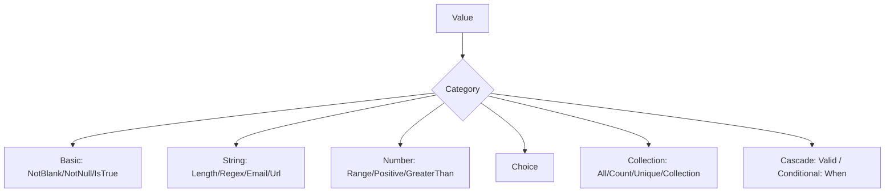

# Built-in Constraints

!!! tip "In a nutshell"
    Symfony ships a constraint for almost every common rule; you attach them as
    `#[Assert\...]` attributes on the value they guard. The fact examiners love:
    `NotBlank` rejects the empty string, while `NotNull` accepts it — only a real
    `null` fails `NotNull`.

!!! example "Real-world analogy"
    Each constraint is **one scanner** on the screening line: the X-ray checks
    shape (`Length`), the sniffer checks for liquids (`Email`/`Regex`), the metal
    detector checks a threshold (`Range`). `NotBlank` means "the bag must contain
    something"; `NotNull` only means "a bag must be on the belt" — an empty bag
    still counts.

!!! abstract "Learning objectives"
    By the end of this chapter you can:

    - [ ] Pick the right built-in constraint from each category
    - [ ] Know the key options that change a constraint's behaviour
    - [ ] Recognise the exam's favourite gotchas (`NotBlank` vs `NotNull`, `Valid`, `When`)

    **Syllabus:** `Data Validation → Built-in constraints` ·
    **Level:** Advanced / Expert ·
    **Est. time:** 30 min ·
    **Prerequisites:** [Object Validation](object-validation.md)

---

## Theory

All built-in constraints live in `Symfony\Component\Validator\Constraints\` and
are imported as `use Symfony\Component\Validator\Constraints as Assert;`. Each is
a small value object; its options are constructor arguments. You attach it as an
attribute on the value it guards.

The catalogue is large — the exam tests the **common ones and their edge cases**,
not obscure options. Learn the categories below.

!!! question "Predict first"
    A nullable `?string $email` carries only `#[Assert\Email]` and is left `null`.
    Does validation report an error?

??? note "Reveal"
    No. Like most constraints, `Email` skips `null`/`''` and never runs. To make
    "missing" an error, stack `#[Assert\NotBlank]` (or `NotNull`) in front of it.

## Deep Dive — categories the exam tests

### Basic

| Constraint | Passes when | Note |
|---|---|---|
| `NotBlank` | not `null`, not `''`, not `[]`, not blank string | `allowNull: true` to accept null |
| `NotNull` | value `!== null` | `''` and `0` **pass** |
| `IsNull` | value `=== null` | |
| `IsTrue` / `IsFalse` | strictly `true`/`false` (loose: `1`, `'1'`, `true`) | great on getters |
| `Blank` | value is empty/blank | opposite of `NotBlank` |

The single most tested distinction: **`NotBlank` rejects the empty string;
`NotNull` accepts it.**

### String

```php
<?php
declare(strict_types=1);

namespace App\Entity;

use Symfony\Component\Validator\Constraints as Assert;

class Account
{
    #[Assert\Length(min: 8, max: 4096)]
    public string $password = '';

    #[Assert\Regex(pattern: '/^[a-z0-9_]+$/', message: 'Lowercase, digits, _ only.')]
    public string $handle = '';

    #[Assert\Email(mode: Assert\Email::VALIDATION_MODE_STRICT)]
    public string $email = '';

    #[Assert\Url(requireTld: true)]
    public ?string $website = null;
}
```

- `Length` counts **characters** (`min`, `max`, `charset`, `countUnit`).
- `Email` modes: `html5` (default in Symfony's recommended setup), `strict`.
- `Url(requireTld: true)` — a required-TLD check; `protocols` limits schemes.

### Number & comparison

| Constraint | Meaning |
|---|---|
| `Range(min, max)` | inclusive numeric/date range |
| `Positive` / `PositiveOrZero` | `> 0` / `>= 0` |
| `Negative` / `NegativeOrZero` | `< 0` / `<= 0` |
| `GreaterThan(v)` / `GreaterThanOrEqual(v)` | strict / non-strict |
| `LessThan(v)` / `LessThanOrEqual(v)` | strict / non-strict |
| `EqualTo` / `NotEqualTo` | loose (`==`) |
| `IdenticalTo` / `NotIdenticalTo` | strict (`===`) |

Comparison constraints accept a `propertyPath` to compare against **another
field** (e.g. `#[Assert\GreaterThan(propertyPath: 'startDate')]`).

### Choice

```php
#[Assert\Choice(choices: ['draft', 'published', 'archived'])]
public string $status = 'draft';

// callback names a static method returning the allowed *scalar* values
#[Assert\Choice(callback: 'allowedRoles', multiple: true)]
public array $roles = [];
```

`Choice` supports `multiple: true` (validate every element), `min`/`max` counts,
and a `callback` returning the allowed set. For enum-backed values prefer
`#[Assert\Type(RoleEnum::class)]` or a native enum type.

### Date & time

`Date`, `Time`, `DateTime` validate string format; `Range` compares
`\DateTimeInterface` values (e.g. `min: 'today'` via a relative string).

### Collection & iterable

| Constraint | Purpose |
|---|---|
| `Collection` | validate array **keys** against per-key constraints |
| `Count(min, max)` | number of elements |
| `Unique` | no duplicate elements (`fields:` for arrays of arrays) |
| `All` | apply constraints to **every** element |
| `Valid` | cascade validation into nested objects |

```php
#[Assert\All([new Assert\NotBlank(), new Assert\Length(max: 20)])]
public array $tags = [];

#[Assert\Collection(
    fields: [
        'street' => new Assert\NotBlank(),
        'zip'    => new Assert\Regex('/^\d{5}$/'),
    ],
    allowExtraFields: false,
    allowMissingFields: false,
)]
public array $address = [];
```

### Misc — `Valid` and `When`

- `#[Assert\Valid]` **cascades** into a nested object/collection so its own
  constraints run. Without it, nested objects are ignored. See [Scopes](scopes.md).
- `#[Assert\When]` applies inner constraints only if an
  `Symfony\Component\ExpressionLanguage` expression is true:

```php
#[Assert\When(
    expression: 'this.getType() === "premium"',
    constraints: [new Assert\NotBlank(), new Assert\Length(min: 10)],
)]
public ?string $vatNumber = null;
```



!!! note "Source reference"
    Constraint classes and their validators —
    [symfony/symfony `8.0` `Constraints/`](https://github.com/symfony/symfony/tree/8.0/src/Symfony/Component/Validator/Constraints).

### Null behavior

`null` is where constraints trip up most exam takers. The three "presence"
constraints are deliberately different:

- **`NotNull`** — fails only on strict `null`. `''`, `0`, `[]` and `'   '` all
  pass.
- **`NotBlank`** — fails on `null`, `''`, `[]` and (by default) whitespace-only
  strings. Set `allowNull: true` to let `null` through while still rejecting `''`.
- **`IsNull`** — the inverse: passes only when the value **is** `null`.

Almost every *other* constraint (`Email`, `Url`, `Length`, `Regex`, `Range`,
`Choice`, `Type`, the comparisons…) **skips `null` and returns no violation** —
their validators bail out early on an empty value. That is why an unset `null`
email passes: `Email` never runs. To require a value *and* validate its shape,
stack the two so the presence check does the rejecting:

```php
#[Assert\NotBlank]   // rejects null / '' / []
#[Assert\Email]      // only runs once there is a value
public ?string $email = null;
```

Inside a `Collection`, missing keys are governed by the `Required` and `Optional`
wrappers: a `Required` field that is absent fails, while an `Optional` field is
skipped when absent but still validated when present.

!!! note "Null in real life"
    `NotNull` = a bag must be on the belt (an empty bag still counts); `NotBlank`
    = the bag must actually contain something; most other scanners simply wave an
    empty slot through without inspecting it.

## Configuration & code

=== "PHP Attributes"

    ```php
    <?php
    declare(strict_types=1);

    namespace App\Entity;

    use Symfony\Component\Validator\Constraints as Assert;

    class Registration
    {
        #[Assert\NotBlank]
        #[Assert\Email]
        public string $email = '';

        #[Assert\NotNull]
        #[Assert\Length(min: 8)]
        public ?string $password = null;

        #[Assert\IsTrue(message: 'You must accept the terms.')]
        public bool $agreeTerms = false;
    }
    ```

=== "YAML"

    ```yaml
    # config/validator/registration.yaml
    App\Entity\Registration:
        properties:
            email:
                - NotBlank: ~
                - Email: ~
            password:
                - NotNull: ~
                - Length: { min: 8 }
            agreeTerms:
                - IsTrue: { message: 'You must accept the terms.' }
    ```

=== "Console"

    ```console
    $ php bin/console debug:validator "App\Entity\Registration"
    ```

## Best practices & anti-patterns

| ✅ Do | ❌ Avoid |
|---|---|
| Stack `NotBlank` + `Email` when empty is invalid | Relying on `Email` alone (it passes on `''`) |
| Use `Positive`/`Range` over hand-rolled `GreaterThan(0)` | Re-inventing existing constraints |
| Use `All` for scalar collections, `Valid` for object collections | `All([new Valid()])` when `Valid` alone suffices |
| Compare fields with `propertyPath` | Duplicating a value just to compare |

## When (not) to use it / alternatives

Reach for a built-in first — there is one for almost every common rule. Only
write a [custom constraint](custom-constraints.md) when the rule is reusable and
domain-specific, or a [callback](callbacks.md) for one-off cross-field logic.

!!! danger "Certification traps"
    - **`NotBlank` ≠ `NotNull`.** `NotBlank` fails on `''`, `[]`, `'   '`;
      `NotNull` only fails on `null` (so `''` and `0` pass `NotNull`).
    - `Email` and `Url` **pass on an empty/null value** — combine with `NotBlank`
      if empty must be rejected.
    - `All` validates elements of a collection; `Collection` validates **keys** of
      an associative array. They are not interchangeable.
    - `Valid` is what cascades — a nested object without `Valid` is skipped
      entirely, even if it has its own constraints.
    - `Choice` needs `multiple: true` to validate each element of an array.

!!! warning "Common mistakes"
    - Using `Type('string')` expecting it to reject empty strings — it only checks
      the PHP type.
    - Forgetting `allowExtraFields`/`allowMissingFields` on `Collection`, which
      default to `false` and reject partial/extra arrays.

## Exercises

1. **(Basic)** Constrain a `quantity` int to be strictly positive and a
   `couponCode` string that, if present, matches `/^[A-Z0-9]{6}$/`.
2. **(Advanced)** Validate an array `$scores` so it has 1–5 elements, each an
   integer between 0 and 100.

??? success "Solutions"

    **1.**
    ```php
    #[Assert\Positive]
    public int $quantity = 1;

    #[Assert\Regex('/^[A-Z0-9]{6}$/')]
    public ?string $couponCode = null; // null passes Regex
    ```

    **2.**
    ```php
    #[Assert\Count(min: 1, max: 5)]
    #[Assert\All([
        new Assert\Type('integer'),
        new Assert\Range(min: 0, max: 100),
    ])]
    public array $scores = [];
    ```

## Certification questions

??? question "Q1. Which is true about `NotBlank` and `NotNull`?"
    - [ ] A. They are aliases
    - [x] B. `NotBlank` rejects `''`; `NotNull` accepts `''` ✅
    - [ ] C. `NotNull` rejects `''`; `NotBlank` accepts it
    - [ ] D. Both reject `0`

    **Why:** `NotBlank` treats `''`/`[]`/blank as invalid; `NotNull` only fails on
    a strict `null`, so `''` and `0` pass it.
    **Ref:** [NotBlank](https://symfony.com/doc/current/reference/constraints/NotBlank.html).

??? question "Q2. To validate every element of an indexed array against constraints, use:"
    - [ ] A. `Collection`
    - [x] B. `All` ✅
    - [ ] C. `Count`
    - [ ] D. `Unique`

    **Why:** `All` applies the given constraints to each element; `Collection`
    validates *keys* of an associative array.
    **Ref:** [All](https://symfony.com/doc/current/reference/constraints/All.html).

??? question "Q3. A nested object property has its own constraints but they never run. Why?"
    - [ ] A. The validator does not support nesting
    - [x] B. The property lacks `#[Assert\Valid]` to cascade ✅
    - [ ] C. You must call `validateProperty()` for nested objects
    - [ ] D. Nested objects need a separate validator service

    **Why:** Cascading is opt-in via `Valid`; without it the nested object is not
    traversed.
    **Ref:** [Valid](https://symfony.com/doc/current/reference/constraints/Valid.html).

??? question "Q4. `#[Assert\Email]` on an empty string returns:"
    - [x] A. No violation (empty values pass) ✅
    - [ ] B. A violation because it is not an email
    - [ ] C. A PHP TypeError
    - [ ] D. Depends on the `mode` option

    **Why:** Like most constraints, `Email` skips empty/null values; pair it with
    `NotBlank` to reject empties.
    **Ref:** [Email](https://symfony.com/doc/current/reference/constraints/Email.html).

## Key takeaways

- `NotBlank` rejects empty; `NotNull` only rejects `null`.
- `Email`/`Url`/`Regex` pass on empty — stack with `NotBlank` when needed.
- `All` = each element; `Collection` = keyed array; `Valid` = cascade.
- Comparison constraints can target another field via `propertyPath`.
- `When` applies constraints conditionally via an expression.

## Last-minute revision

!!! tip "Cheat sheet"
    - Basic: `NotBlank`, `NotNull`, `IsNull`, `IsTrue`/`IsFalse`, `Blank`.
    - String: `Length`, `Regex`, `Email`, `Url`.
    - Number: `Range`, `Positive(OrZero)`, `Negative(OrZero)`, `GreaterThan(OrEqual)`.
    - Compare: `EqualTo` (`==`) vs `IdenticalTo` (`===`), `propertyPath` option.
    - Collection: `Collection`, `Count`, `Unique`, `All`, `Valid`.
    - Conditional: `When(expression, constraints)`.

## Connections

- **Depends on:** [Object Validation](object-validation.md) — these constraints only do anything once the validator runs the object.
- **Reused in:** [Scopes](scopes.md) — `Valid` and `All` decide how they cascade into nested objects and collections.
- **Confused with:** [Custom Constraints](custom-constraints.md) — reach here first; write your own only when no built-in fits.

## Official References
- [Official Symfony docs — Constraints reference](https://symfony.com/doc/current/reference/constraints.html)
- [Symfony source — Constraints/](https://github.com/symfony/symfony/tree/8.0/src/Symfony/Component/Validator/Constraints)

## Video references

!!! tip "Watch & learn"
    These are official, continuously-updated video channels — search them for
    "Symfony validation" to reinforce this chapter. We link stable channels rather than
    individual videos so the references never rot.

    - [SymfonyCasts screencasts](https://symfonycasts.com/tracks/symfony) — scripted, code-along tutorials.
    - [Symfony official YouTube](https://www.youtube.com/@SymfonyOfficial) — SymfonyCon conference talks & keynotes.
    - [Official docs for this topic](https://symfony.com/doc/current/reference/constraints/NotBlank.html) — some Symfony doc pages embed a screencast.

## Confidence check

I'm ready when I can:

- [ ] explain **why** most constraints deliberately pass on empty/null values
- [ ] pick and configure the right built-in for a rule in Symfony 8
- [ ] debug an `Email`/`Url` that "never rejects" an empty field
- [ ] spot the `NotBlank` vs `NotNull` (or `All` vs `Collection`) trick answer
- [ ] explain how `Valid` cascades where other constraints do not

---

<small>Related: [Scopes](scopes.md) · [Object Validation](object-validation.md) ·
[Custom Constraints](custom-constraints.md)</small>
