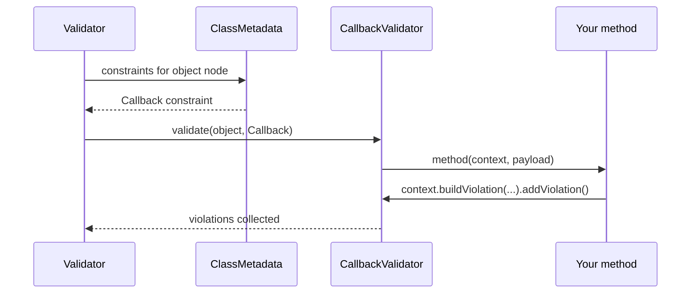

# Custom Callback Validators

!!! tip "In a nutshell"
    Un `#[Assert\Callback]` exécute votre propre méthode pendant la validation —
    le moyen le plus rapide de faire des vérifications ponctuelles inter-champs.
    Vous ajoutez les erreurs via `$context->buildViolation()`, jamais en retournant
    une valeur. Retenez : la forme d'instance est
    `(ExecutionContextInterface, mixed $payload)` ; la forme statique reçoit
    l'objet comme premier argument.

!!! example "Real-world analogy"
    Un callback est le **superviseur qui examine tout le bagage d'un coup**,
    attrapant les combinaisons que les scanners mono-tâche ratent — un couteau
    *et* une carte d'embarquement qui ne correspond pas. Il n'annonce pas de
    verdict ; il consigne l'incident dans le même registre que tout le monde
    (l'`ExecutionContext`).

!!! abstract "Learning objectives"
    À la fin de ce chapitre, vous saurez :

    - [ ] Attacher un `#[Assert\Callback]` à une méthode pour une validation inter-champs
    - [ ] Construire des violations via l'`ExecutionContext` à l'intérieur d'un callback
    - [ ] Choisir entre callbacks, constraints personnalisées et `Expression`

    **Syllabus:** `Data Validation → Callback validators` ·
    **Level:** Advanced / Expert ·
    **Est. time:** 20 min ·
    **Prerequisites:** [Scopes](scopes.md)

---

## Theory

Un **callback** est le moyen le plus rapide d'exécuter une logique de validation
arbitraire qui touche plusieurs propriétés d'un même objet, sans écrire une
constraint réutilisable. Vous marquez une méthode avec `#[Assert\Callback]` ; le
validator l'appelle avec l'`ExecutionContext` courant, et vous ajoutez les
violations manuellement.

```php
<?php
declare(strict_types=1);

namespace App\Entity;

use Symfony\Component\Validator\Constraints as Assert;
use Symfony\Component\Validator\Context\ExecutionContextInterface;

class Event
{
    public function __construct(
        public \DateTimeImmutable $start,
        public \DateTimeImmutable $end,
    ) {}

    #[Assert\Callback]
    public function validateDates(ExecutionContextInterface $context, mixed $payload): void
    {
        if ($this->start >= $this->end) {
            $context->buildViolation('End must be after start.')
                ->atPath('end')
                ->addViolation();
        }
    }
}
```

!!! question "Predict first"
    Votre méthode `#[Assert\Callback]` retourne `false` quand les données sont
    invalides, mais aucune erreur n'apparaît jamais. Pourquoi ?

??? note "Reveal"
    Les valeurs de retour sont ignorées. Un callback doit appeler
    `$context->buildViolation('…')->addViolation()` ; le booléen ne fait rien.

## Deep Dive — how the callback is invoked

`#[Assert\Callback]` correspond à
`Symfony\Component\Validator\Constraints\Callback`, une constraint de **cible
classe** validée par `CallbackValidator`. Lorsque le validator atteint le nœud
de l'objet, il résout le callback et l'invoque. Trois formes de callable sont
acceptées :

| Form | Signature |
|---|---|
| Méthode d'instance (attribut sur la méthode) | `fn(ExecutionContextInterface $context, mixed $payload)` |
| Méthode statique (via l'option `callback:`) | `fn(mixed $object, ExecutionContextInterface $context, mixed $payload)` |
| Tout `callable` référencé par son nom | comme ci-dessus |

L'argument `$payload` transporte l'option `payload` facultative de la
constraint (rarement utilisée ; pratique pour passer des métadonnées). Le
`$context` est le
`Symfony\Component\Validator\Context\ExecutionContextInterface` vivant — le
même objet couvert dans [Violations Builder](violations-builder.md). Vous
pouvez y lire `getObject()`, `getRoot()`, `getGroup()` et appeler
`buildViolation()`.

Comme `Callback` est de portée classe, le callback s'exécute dans le **groupe**
que vous assignez à la constraint (option `groups`, `Default` par défaut) — les
callbacks participent donc aux [group sequences](group-sequence.md) comme
n'importe quelle autre constraint.



!!! note "Source reference"
    `Symfony\Component\Validator\Constraints\Callback` /
    `CallbackValidator` —
    [symfony/symfony `8.0`](https://github.com/symfony/symfony/blob/8.0/src/Symfony/Component/Validator/Constraints/CallbackValidator.php).

### Null behavior

Un callback s'exécute que les champs de l'objet soient définis ou non : les
**propriétés nullables sont donc le bug classique du callback**. Comparer
`$this->start >= $this->end` lance une exception ou se comporte mal si l'un des
deux est `null`. Protégez-vous d'abord, et laissez le `#[Assert\NotNull]` de
chaque champ imposer la présence :

```php
if (null !== $this->start && null !== $this->end && $this->start >= $this->end) {
    $context->buildViolation('End must be after start.')->atPath('end')->addViolation();
}
```

Le callback doit partir du principe qu'une valeur *peut* manquer et soit sortir
tôt, soit utiliser `?->` / `??`. Lire l'instance via `$context->getObject()`
peut également vous livrer un objet partiellement rempli, les mêmes gardes
s'appliquent donc.

!!! note "Null in real life"
    Le superviseur qui examine tout le bagage ne doit pas supposer que chaque
    article est présent — vérifiez que la carte d'embarquement et le billet
    existent tous deux avant de signaler une incohérence entre eux.

## Configuration & code

=== "PHP Attributes"

    ```php
    <?php
    declare(strict_types=1);

    namespace App\Entity;

    use Symfony\Component\Validator\Constraints as Assert;
    use Symfony\Component\Validator\Context\ExecutionContextInterface;

    class Discount
    {
        public int $percent = 0;
        public bool $stackable = false;

        #[Assert\Callback(groups: ['checkout'])]
        public function validate(ExecutionContextInterface $context, mixed $payload): void
        {
            if ($this->percent > 50 && $this->stackable) {
                $context->buildViolation('Large discounts cannot stack.')
                    ->atPath('stackable')
                    ->setInvalidValue($this->stackable)
                    ->addViolation();
            }
        }
    }
    ```

=== "Static callback (YAML)"

    ```yaml
    # config/validator/discount.yaml
    App\Entity\Discount:
        constraints:
            - Callback: [App\Validator\DiscountRules, validate]
    ```

=== "Console"

    ```console
    $ php bin/console debug:validator "App\Entity\Discount"
    ```

Pour la forme statique, la méthode reçoit l'objet en premier :

```php
public static function validate(Discount $object, ExecutionContextInterface $context, mixed $payload): void
```

## Best practices & anti-patterns

| ✅ Do | ❌ Avoid |
|---|---|
| Utiliser les callbacks pour des règles inter-champs ponctuelles | Réutiliser le même callback dans plusieurs classes (créez une constraint) |
| Rapporter sur l'`atPath()` le plus pertinent | Laisser chaque erreur sur la racine de l'objet |
| Assigner un groupe pour l'intégrer aux séquences | Oublier les groupes puis se demander pourquoi il ne s'exécute jamais dans un groupe |
| Garder une logique courte et sans effet de bord | Muter l'objet à l'intérieur du callback |

## When (not) to use it / alternatives

Les callbacks sont idéaux pour une logique **spécifique à une classe** utilisée
une seule fois. Si la règle est **réutilisable**, écrivez une
[constraint personnalisée](custom-constraints.md). S'il s'agit d'une simple
expression booléenne sur des propriétés, `#[Assert\Expression]` est plus
déclaratif. Ne faites jamais de travail lourd en I/O dans un callback exécuté à
chaque request sans le protéger derrière un groupe ou une séquence.

!!! danger "Certification traps"
    - La signature de la méthode d'instance est `(ExecutionContextInterface $context, mixed $payload)`.
      La forme **statique** reçoit l'objet comme **premier** argument.
    - `Callback` est une constraint au **niveau de la classe** ; elle ne reçoit pas
      de valeur de propriété — lisez l'objet depuis `$this` ou
      `$context->getObject()`.
    - Le callback doit ajouter les violations lui-même ; retourner une valeur ne
      fait rien.
    - Les callbacks respectent `groups`, donc un callback dans un groupe autre que
      `Default` ne s'exécute que lorsque ce groupe est validé.

!!! warning "Common mistakes"
    - Retourner `false` ou une chaîne d'erreur en espérant qu'elle soit
      enregistrée — vous devez appeler `buildViolation()->addViolation()`.
    - Placer `#[Assert\Callback]` sur une propriété ; il appartient à une méthode
      (ou à la classe via l'option `callback:`).

## Exercises

1. **(Basic)** Ajoutez un callback à `PasswordChange` qui interdit que le nouveau
   mot de passe soit égal à l'ancien, en rapportant l'erreur sur `newPassword`.
2. **(Advanced)** Utilisez un callback statique sur une classe externe
   `OrderRules` pour signaler une commande dont le `total` est négatif.

??? success "Solutions"

    **1.**
    ```php
    #[Assert\Callback]
    public function checkPasswords(ExecutionContextInterface $context, mixed $payload): void
    {
        if ($this->newPassword === $this->oldPassword) {
            $context->buildViolation('Choose a different password.')
                ->atPath('newPassword')
                ->addViolation();
        }
    }
    ```

    **2.**
    ```php
    // On the entity:
    #[Assert\Callback([OrderRules::class, 'validate'])]
    class Order { public float $total = 0.0; }

    final class OrderRules
    {
        public static function validate(Order $o, ExecutionContextInterface $c, mixed $payload): void
        {
            if ($o->total < 0) {
                $c->buildViolation('Total cannot be negative.')->atPath('total')->addViolation();
            }
        }
    }
    ```

## Certification questions

??? question "Q1. The instance-method callback signature is:"
    - [ ] A. `(mixed $value): bool`
    - [x] B. `(ExecutionContextInterface $context, mixed $payload): void` ✅
    - [ ] C. `(ExecutionContextInterface $context): string`
    - [ ] D. `(object $object, mixed $payload): void`

    **Why:** Un callback d'instance reçoit le context et le payload facultatif et
    ne retourne rien ; les violations sont ajoutées via le context.
    **Ref:** [Callback](https://symfony.com/doc/current/reference/constraints/Callback.html).

??? question "Q2. How does a callback register an error?"
    - [ ] A. `return 'error message';`
    - [ ] B. `return false;`
    - [x] C. `$context->buildViolation('...')->addViolation();` ✅
    - [ ] D. `throw new ValidationException(...);`

    **Why:** Les violations sont construites et ajoutées via l'execution context ;
    les valeurs de retour sont ignorées.
    **Ref:** [Callback](https://symfony.com/doc/current/reference/constraints/Callback.html).

??? question "Q3. A static callback method receives, as its first argument:"
    - [x] A. The object being validated ✅
    - [ ] B. The execution context
    - [ ] C. The payload
    - [ ] D. The property value

    **Why:** La forme statique reçoit `(object, context, payload)` puisqu'il n'y a
    pas de `$this`.
    **Ref:** [Callback](https://symfony.com/doc/current/reference/constraints/Callback.html).

## Key takeaways

- `#[Assert\Callback]` sur une méthode exécute une validation arbitraire au
  niveau de la classe.
- Instance : `(ExecutionContextInterface, mixed $payload)` ; statique : l'objet
  en premier.
- Ajoutez les erreurs via `$context->buildViolation()->addViolation()`.
- Les callbacks respectent `groups` et participent aux séquences.

## Last-minute revision

!!! tip "Cheat sheet"
    - Attribut sur une méthode → `(ExecutionContextInterface $context, mixed $payload)`.
    - `callback: [Class, 'method']` → statique, l'objet est le 1er argument.
    - Portée classe : lire l'objet via `$this` / `$context->getObject()`.
    - `atPath('field')` pour attribuer l'erreur à une propriété.

## Connections

- **Depends on:** [Violations Builder](violations-builder.md) — vous enregistrez les erreurs via l'`ExecutionContext`.
- **Reused in:** [Group Sequence](group-sequence.md) — les callbacks respectent `groups`, ils prennent donc part aux séquences.
- **Confused with:** [Custom Constraints](custom-constraints.md) — un callback est spécifique à une classe et ponctuel ; une constraint est réutilisable.

## Official References
- [Official Symfony docs — Callback](https://symfony.com/doc/current/reference/constraints/Callback.html)
- [Symfony source — CallbackValidator](https://github.com/symfony/symfony/blob/8.0/src/Symfony/Component/Validator/Constraints/CallbackValidator.php)

## Video references

!!! tip "Watch & learn"
    Voici des chaînes vidéo officielles et continuellement mises à jour —
    recherchez-y « Symfony validation » pour consolider ce chapitre. Nous lions des
    chaînes stables plutôt que des vidéos individuelles afin que les références ne
    périment jamais.

    - [SymfonyCasts screencasts](https://symfonycasts.com/tracks/symfony) — tutoriels scénarisés à suivre en codant.
    - [Symfony official YouTube](https://www.youtube.com/@SymfonyOfficial) — conférences et keynotes SymfonyCon.
    - [Official docs for this topic](https://symfony.com/doc/current/reference/constraints/Callback.html) — certaines pages de la doc Symfony intègrent un screencast.

## Confidence check

Je suis prêt quand je peux :

- [ ] expliquer **pourquoi** un callback convient aux règles inter-champs ponctuelles
- [ ] câbler un `#[Assert\Callback]` d'instance et statique dans Symfony 8
- [ ] déboguer un callback sur propriété nullable qui lance une exception ou ne se déclenche jamais
- [ ] repérer le piège de signature instance vs statique (qui reçoit l'objet en premier)
- [ ] expliquer comment `CallbackValidator` résout et invoque la méthode

---

<small>Related: [Violations Builder](violations-builder.md) ·
[Custom Constraints](custom-constraints.md) · [Group Sequence](group-sequence.md)</small>
