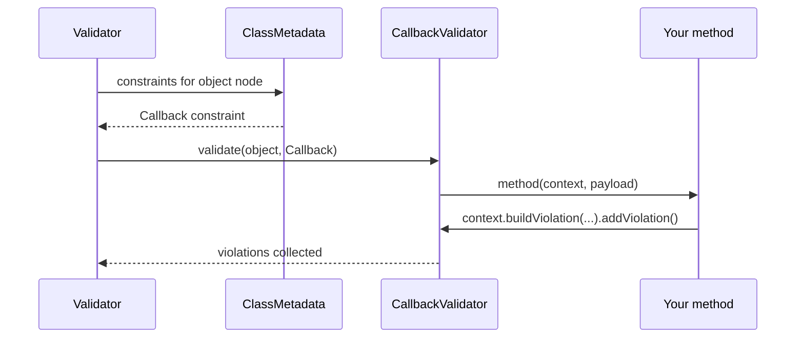

# Custom Callback Validators

!!! tip "In a nutshell"
    A `#[Assert\Callback]` runs your own method during validation — the quickest
    way to do one-off, cross-field checks. You add errors via
    `$context->buildViolation()`, never by returning a value. Remember: the
    instance form is `(ExecutionContextInterface, mixed $payload)`; the static form
    gets the object as its first argument.

!!! example "Real-world analogy"
    A callback is the **supervisor who eyeballs the whole bag at once**, catching
    combinations the single-purpose scanners miss — a knife *and* a mismatched
    boarding pass. They don't announce a verdict; they write the incident into the
    same log everyone else uses (the `ExecutionContext`).

!!! abstract "Learning objectives"
    By the end of this chapter you can:

    - [ ] Attach a `#[Assert\Callback]` to a method for cross-field validation
    - [ ] Build violations through the `ExecutionContext` inside a callback
    - [ ] Choose between callbacks, custom constraints and `Expression`

    **Syllabus:** `Data Validation → Callback validators` ·
    **Level:** Advanced / Expert ·
    **Est. time:** 20 min ·
    **Prerequisites:** [Scopes](scopes.md)

---

## Theory

A **callback** is the quickest way to run arbitrary validation logic that touches
several properties of one object, without writing a reusable constraint. You mark
a method with `#[Assert\Callback]`; the validator calls it with the current
`ExecutionContext`, and you add violations manually.

```php
<?php
declare(strict_types=1);

namespace App\Entity;

use Symfony\Component\Validator\Constraints as Assert;
use Symfony\Component\Validator\Context\ExecutionContextInterface;

class Event
{
    public function __construct(
        public \DateTimeImmutable $start,
        public \DateTimeImmutable $end,
    ) {}

    #[Assert\Callback]
    public function validateDates(ExecutionContextInterface $context, mixed $payload): void
    {
        if ($this->start >= $this->end) {
            $context->buildViolation('End must be after start.')
                ->atPath('end')
                ->addViolation();
        }
    }
}
```

!!! question "Predict first"
    Your `#[Assert\Callback]` method returns `false` when the data is invalid, yet no
    error ever appears. Why?

??? note "Reveal"
    Return values are ignored. A callback must call
    `$context->buildViolation('…')->addViolation()`; the boolean does nothing.

## Deep Dive — how the callback is invoked

`#[Assert\Callback]` maps to
`Symfony\Component\Validator\Constraints\Callback`, a **class-target** constraint
validated by `CallbackValidator`. When the validator reaches the object node, it
resolves the callback and invokes it. Three callable shapes are accepted:

| Form | Signature |
|---|---|
| Instance method (attribute on the method) | `fn(ExecutionContextInterface $context, mixed $payload)` |
| Static method (via `callback:` option) | `fn(mixed $object, ExecutionContextInterface $context, mixed $payload)` |
| Any `callable` referenced by name | as above |

The `$payload` argument carries the constraint's optional `payload` option
(rarely used; handy to pass metadata). The `$context` is the live
`Symfony\Component\Validator\Context\ExecutionContextInterface` — the same object
covered in [Violations Builder](violations-builder.md). From it you can read
`getObject()`, `getRoot()`, `getGroup()` and call `buildViolation()`.

```php
#[Assert\Callback(payload: ['severity' => 'high'])] // payload option
public function audit(ExecutionContextInterface $context, mixed $payload): void
{
    $object = $context->getObject(); // the object being validated
    $root   = $context->getRoot();   // the top-level validated value
    $group  = $context->getGroup();  // the currently validated group

    if ('high' === $payload['severity'] && null === $object->reviewer) {
        $context->buildViolation('A reviewer is required.')->addViolation();
    }
}
```

Because `Callback` is class-scoped, the callback runs in whichever **group** you
assign to the constraint (`groups` option, default `Default`) — so callbacks
participate in [group sequences](group-sequence.md) like any other constraint.

```php
// without the groups option, the Callback belongs to the Default group
#[Assert\Callback(groups: ['checkout'])]
public function checkStock(ExecutionContextInterface $context, mixed $payload): void
{
    // runs only when the 'checkout' group (or a sequence containing it) is validated
}
```



!!! note "Source reference"
    `Symfony\Component\Validator\Constraints\Callback` /
    `CallbackValidator` —
    [symfony/symfony `8.0`](https://github.com/symfony/symfony/blob/8.0/src/Symfony/Component/Validator/Constraints/CallbackValidator.php).

### Null behavior

A callback runs whether or not the object's fields are set, so **nullable
properties are the classic callback bug**. Comparing `$this->start >= $this->end`
throws or misbehaves if either is `null`. Guard first, and let each field's own
`#[Assert\NotNull]` enforce presence:

```php
if (null !== $this->start && null !== $this->end && $this->start >= $this->end) {
    $context->buildViolation('End must be after start.')->atPath('end')->addViolation();
}
```

The callback should assume a value *might* be missing and either bail early or use
`?->` / `??`. Reading the instance via `$context->getObject()` can likewise hand
you a partially populated object, so the same guards apply there.

```php
$object = $context->getObject();          // may be partially populated
$start  = $object?->start;                // ?-> is null-safe on the object
$days   = $this->duration ?? 1;           // ?? supplies a fallback value

if (null === $start) {
    return; // bail early; let #[Assert\NotNull] report the missing value
}
```

!!! note "Null in real life"
    The supervisor eyeballing the whole bag must not assume every item is present
    — check that both the boarding pass and the ticket exist before flagging a
    mismatch between them.

## Configuration & code

=== "PHP Attributes"

    ```php
    <?php
    declare(strict_types=1);

    namespace App\Entity;

    use Symfony\Component\Validator\Constraints as Assert;
    use Symfony\Component\Validator\Context\ExecutionContextInterface;

    class Discount
    {
        public int $percent = 0;
        public bool $stackable = false;

        #[Assert\Callback(groups: ['checkout'])]
        public function validate(ExecutionContextInterface $context, mixed $payload): void
        {
            if ($this->percent > 50 && $this->stackable) {
                $context->buildViolation('Large discounts cannot stack.')
                    ->atPath('stackable')
                    ->setInvalidValue($this->stackable)
                    ->addViolation();
            }
        }
    }
    ```

=== "Static callback (YAML)"

    ```yaml
    # config/validator/discount.yaml
    App\Entity\Discount:
        constraints:
            - Callback: [App\Validator\DiscountRules, validate]
    ```

=== "Console"

    ```console
    $ php bin/console debug:validator "App\Entity\Discount"
    ```

For the static form, the method receives the object first:

```php
public static function validate(Discount $object, ExecutionContextInterface $context, mixed $payload): void
```

## Best practices & anti-patterns

| ✅ Do | ❌ Avoid |
|---|---|
| Use callbacks for one-off cross-field rules | Reusing the same callback across many classes (make a constraint) |
| Report on the most relevant `atPath()` | Leaving every error on the object root |
| Assign a group so it fits sequences | Forgetting groups then wondering why it never runs in a group |
| Keep logic small and side-effect free | Mutating the object inside the callback |

## When (not) to use it / alternatives

Callbacks are ideal for **class-specific** logic used once. If the rule is
**reusable**, write a [custom constraint](custom-constraints.md). If it is a
simple boolean expression over properties, `#[Assert\Expression]` is more
declarative. Never do I/O-heavy work in a callback that runs on every request
without gating it behind a group/sequence.

!!! danger "Certification traps"
    - The instance-method signature is `(ExecutionContextInterface $context, mixed $payload)`.
      The **static** form gets the object as the **first** argument.
    - `Callback` is a **class-level** constraint; it does not receive a property
      value — read the object from `$this` or `$context->getObject()`.
    - The callback must add violations itself; returning a value does nothing.
    - Callbacks honour `groups`, so a callback in a non-`Default` group only runs
      when that group is validated.

!!! warning "Common mistakes"
    - Returning `false`/an error string expecting it to register — you must call
      `buildViolation()->addViolation()`.
    - Placing `#[Assert\Callback]` on a property; it belongs on a method (or class
      via the `callback:` option).

## Exercises

1. **(Basic)** Add a callback to `PasswordChange` that forbids the new password
   equalling the old one, reporting on `newPassword`.
2. **(Advanced)** Use a static callback on an external `OrderRules` class to flag
   an order whose `total` is negative.

??? success "Solutions"

    **1.**
    ```php
    #[Assert\Callback]
    public function checkPasswords(ExecutionContextInterface $context, mixed $payload): void
    {
        if ($this->newPassword === $this->oldPassword) {
            $context->buildViolation('Choose a different password.')
                ->atPath('newPassword')
                ->addViolation();
        }
    }
    ```

    **2.**
    ```php
    // On the entity:
    #[Assert\Callback([OrderRules::class, 'validate'])]
    class Order { public float $total = 0.0; }

    final class OrderRules
    {
        public static function validate(Order $o, ExecutionContextInterface $c, mixed $payload): void
        {
            if ($o->total < 0) {
                $c->buildViolation('Total cannot be negative.')->atPath('total')->addViolation();
            }
        }
    }
    ```

## Certification questions

??? question "Q1. The instance-method callback signature is:"
    - [ ] A. `(mixed $value): bool`
    - [x] B. `(ExecutionContextInterface $context, mixed $payload): void` ✅
    - [ ] C. `(ExecutionContextInterface $context): string`
    - [ ] D. `(object $object, mixed $payload): void`

    **Why:** An instance callback receives the context and the optional payload and
    returns nothing; violations are added via the context.
    **Ref:** [Callback](https://symfony.com/doc/8.0/reference/constraints/Callback.html).

??? question "Q2. How does a callback register an error?"
    - [ ] A. `return 'error message';`
    - [ ] B. `return false;`
    - [x] C. `$context->buildViolation('...')->addViolation();` ✅
    - [ ] D. `throw new ValidationException(...);`

    **Why:** Violations are built and added through the execution context; return
    values are ignored.
    **Ref:** [Callback](https://symfony.com/doc/8.0/reference/constraints/Callback.html).

??? question "Q3. A static callback method receives, as its first argument:"
    - [x] A. The object being validated ✅
    - [ ] B. The execution context
    - [ ] C. The payload
    - [ ] D. The property value

    **Why:** The static form gets `(object, context, payload)` since there is no
    `$this`.
    **Ref:** [Callback](https://symfony.com/doc/8.0/reference/constraints/Callback.html).

## Key takeaways

- `#[Assert\Callback]` on a method runs arbitrary class-level validation.
- Instance: `(ExecutionContextInterface, mixed $payload)`; static: object first.
- Add errors via `$context->buildViolation()->addViolation()`.
- Callbacks respect `groups` and participate in sequences.

## Last-minute revision

!!! tip "Cheat sheet"
    - Attribute on a method → `(ExecutionContextInterface $context, mixed $payload)`.
    - `callback: [Class, 'method']` → static, object is 1st arg.
    - Class-scoped: read object via `$this` / `$context->getObject()`.
    - `atPath('field')` to attribute the error to a property.

## Connections

- **Depends on:** [Violations Builder](violations-builder.md) — you register errors through the `ExecutionContext`.
- **Reused in:** [Group Sequence](group-sequence.md) — callbacks honour `groups`, so they take part in sequences.
- **Confused with:** [Custom Constraints](custom-constraints.md) — a callback is class-specific and one-off; a constraint is reusable.

## Official References
- [Official Symfony docs — Callback](https://symfony.com/doc/8.0/reference/constraints/Callback.html)
- [Symfony source — CallbackValidator](https://github.com/symfony/symfony/blob/8.0/src/Symfony/Component/Validator/Constraints/CallbackValidator.php)

## Video references

!!! tip "Watch & learn"
    These are official, continuously-updated video channels — search them for
    "Symfony validation" to reinforce this chapter. We link stable channels rather than
    individual videos so the references never rot.

    - [SymfonyCasts screencasts](https://symfonycasts.com/tracks/symfony) — scripted, code-along tutorials.
    - [Symfony official YouTube](https://www.youtube.com/@SymfonyOfficial) — SymfonyCon conference talks & keynotes.
    - [Official docs for this topic](https://symfony.com/doc/8.0/reference/constraints/Callback.html) — some Symfony doc pages embed a screencast.

## Confidence check

I'm ready when I can:

- [ ] explain **why** a callback fits one-off, cross-field rules
- [ ] wire an instance and a static `#[Assert\Callback]` in Symfony 8
- [ ] debug a nullable-property callback that throws or never fires
- [ ] spot the instance-vs-static signature trick (who gets the object first)
- [ ] explain how `CallbackValidator` resolves and invokes the method

---

<small>Related: [Violations Builder](violations-builder.md) ·
[Custom Constraints](custom-constraints.md) · [Group Sequence](group-sequence.md)</small>
