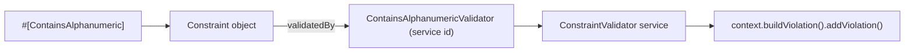

# Custom Constraints

!!! tip "In a nutshell"
    Une règle réutilisable, ce sont deux classes : une `Constraint` (options +
    message par défaut) et son `ConstraintValidator` (la logique qui ajoute les
    violations). Par défaut, le nom du validator est le nom de la constraint suivi
    de `Validator`, et une règle au niveau de la classe doit surcharger
    `getTargets()` pour retourner `CLASS_CONSTRAINT`.

!!! example "Real-world analogy"
    Quand les scanners standard ne détectent pas votre contrebande spécifique,
    l'aéroport commande un **scanner sur mesure** : la machine qui déclare ce
    qu'elle recherche (la `Constraint`) plus l'opérateur formé qui la lit et
    rédige le rapport (le `ConstraintValidator`). L'un décrit la règle ; l'autre
    la fait respecter.

!!! abstract "Learning objectives"
    À la fin de ce chapitre, vous saurez :

    - [ ] Écrire une sous-classe de `Constraint` avec des options et `#[HasNamedArguments]`
    - [ ] L'associer à un `ConstraintValidator` qui construit des violations
    - [ ] Contrôler les cibles (`getTargets()`) et le lien vers le validator (`validatedBy()`)

    **Syllabus:** `Data Validation → Custom constraints` ·
    **Level:** Expert ·
    **Est. time:** 28 min ·
    **Prerequisites:** [Callbacks](callbacks.md), [Violations Builder](violations-builder.md)

---

## Theory

Quand une règle est **réutilisable** entre plusieurs classes, promouvez-la d'un
callback vers une **constraint personnalisée**. Une constraint, ce sont *deux*
classes :

1. Une sous-classe de `Symfony\Component\Validator\Constraint` — un marqueur
   déclaratif qui porte les options et le message par défaut.
2. Une sous-classe de `Symfony\Component\Validator\ConstraintValidator` — la
   logique qui inspecte la valeur et ajoute les violations.

La constraint se lie à son validator via `validatedBy()`, qui par convention
retourne `static::class . 'Validator'`.

```php
// 1) the declarative marker: a Constraint subclass holding options + message
final class Uuid4 extends Constraint
{
    public string $message = 'This is not a UUID v4.';
}

// 2) the logic: a ConstraintValidator subclass, found via validatedBy(),
//    which by default returns static::class . 'Validator' => Uuid4Validator
final class Uuid4Validator extends ConstraintValidator
{
    public function validate(mixed $value, Constraint $constraint): void
    {
        // inspect $value and add violations through $this->context
    }
}
```

!!! question "Predict first"
    Vous ajoutez `#[\Attribute(\Attribute::TARGET_CLASS)]` à une constraint
    personnalisée, mais le validator la traite toujours comme une constraint de
    propriété. Qu'avez-vous oublié ?

??? note "Reveal"
    Surcharger `getTargets()` pour retourner `self::CLASS_CONSTRAINT`. La cible de
    l'attribut PHP et le `getTargets()` du validator sont deux interrupteurs
    distincts — il vous faut les deux.

## Deep Dive — the two classes and their contract

### The Constraint

```php
<?php
declare(strict_types=1);

namespace App\Validator;

use Symfony\Component\Validator\Attribute\HasNamedArguments;
use Symfony\Component\Validator\Constraint;

#[\Attribute(\Attribute::TARGET_PROPERTY | \Attribute::IS_REPEATABLE)]
final class ContainsAlphanumeric extends Constraint
{
    public string $message = 'The value "{{ value }}" must be alphanumeric.';

    #[HasNamedArguments]
    public function __construct(
        public string $mode = 'strict',
        ?array $groups = null,
        mixed $payload = null,
    ) {
        parent::__construct([], $groups, $payload);
    }
}
```

Mécanismes clés :

- Étendez `Constraint`. Les propriétés publiques sont ses **options** ;
  `message` est conventionnel.
- `#[HasNamedArguments]` (de `Symfony\Component\Validator\Attribute`) indique au
  loader de passer les arguments de l'attribut comme **arguments nommés du
  constructeur** plutôt que comme un tableau d'options — le style moderne et
  typé. Transmettez toujours `$groups` et `$payload` à `parent::__construct()`.
- `getTargets()` (hérité) retourne `Constraint::PROPERTY_CONSTRAINT` par défaut.
  Surchargez-le pour retourner `Constraint::CLASS_CONSTRAINT` (ou un tableau des
  deux) pour une constraint au **niveau de la classe**.
- `validatedBy()` retourne par défaut `static::class . 'Validator'` ;
  surchargez-le uniquement lorsque l'id de service du validator diffère.

### The Validator

```php
<?php
declare(strict_types=1);

namespace App\Validator;

use Symfony\Component\Validator\Constraint;
use Symfony\Component\Validator\ConstraintValidator;
use Symfony\Component\Validator\Exception\UnexpectedTypeException;
use Symfony\Component\Validator\Exception\UnexpectedValueException;

final class ContainsAlphanumericValidator extends ConstraintValidator
{
    public function validate(mixed $value, Constraint $constraint): void
    {
        if (!$constraint instanceof ContainsAlphanumeric) {
            throw new UnexpectedTypeException($constraint, ContainsAlphanumeric::class);
        }

        // Convention: null/empty are valid — let NotBlank handle "required".
        if (null === $value || '' === $value) {
            return;
        }

        if (!\is_string($value)) {
            throw new UnexpectedValueException($value, 'string');
        }

        if (!preg_match('/^[a-zA-Z0-9]+$/', $value)) {
            $this->context->buildViolation($constraint->message)
                ->setParameter('{{ value }}', $this->formatValue($value))
                ->addViolation();
        }
    }
}
```

Points du contrat :

- Étendez `ConstraintValidator` ; il implémente
  `Symfony\Component\Validator\ConstraintValidatorInterface` et vous fournit
  `$this->context` (l'`ExecutionContextInterface`) après `initialize()`.
- Restreignez **toujours** le type de la constraint avec `instanceof` et lancez
  `UnexpectedTypeException` sinon — l'examen vérifie ce point.
- **Ignorez null et la chaîne vide**, sauf si l'objectif même de la constraint
  est de les rejeter — cela garde les constraints composables avec `NotBlank`.
- Utilisez `$this->formatValue()` pour interpoler sans risque la valeur
  invalide dans le message.
- Le validator est un **service**, autoconfiguré via le tag
  `validator.constraint_validator` (grâce à `ConstraintValidatorInterface`),
  vous pouvez donc y injecter des dépendances (un repository, le service
  `Security`, etc.).



!!! note "Source reference"
    `Symfony\Component\Validator\Constraint`,
    `ConstraintValidator`, et `Attribute\HasNamedArguments` —
    [symfony/symfony `8.0`](https://github.com/symfony/symfony/blob/8.0/src/Symfony/Component/Validator/Constraint.php).

### Null behavior

Par convention, un validator personnalisé **ignore `null` et `''`** avec un
retour anticipé, afin que la règle se compose avec `NotBlank`/`NotNull` au lieu
de réimplémenter « requis ». Le validator ci-dessus fait exactement cela :

```php
if (null === $value || '' === $value) {
    return; // let NotBlank decide whether empty is allowed
}
```

Deux conséquences. Premièrement, un validator de portée propriété peut toujours
recevoir `null` (propriété nullable, valeur non définie) : protégez-vous avant
de toucher aux méthodes de chaîne ou d'objet — sinon vous risquez un
`TypeError`. Une signature `mixed $value` plus un retour anticipé sur null
(puis un throw sur `!\is_string($value)`) garantit la sécurité. Deuxièmement,
le `$value` d'un validator de portée **classe** est l'objet, qui n'est pas
`null` à ce stade — mais ses *propriétés* peuvent l'être, lisez-les donc avec
`?->` et `??`.

!!! note "Null in real life"
    Un scanner sur mesure ignore un emplacement vide sur le tapis — ce n'est pas
    son rôle de se plaindre qu'un bagage manque ; c'est celui du scanner de
    contrôle de présence (`NotBlank`).

## Configuration & code

=== "Use (PHP Attributes)"

    ```php
    <?php
    declare(strict_types=1);

    namespace App\Entity;

    use App\Validator\ContainsAlphanumeric;
    use Symfony\Component\Validator\Constraints as Assert;

    class Coupon
    {
        #[Assert\NotBlank]
        #[ContainsAlphanumeric(mode: 'strict')]
        public string $code = '';
    }
    ```

=== "Class-level constraint"

    ```php
    <?php
    declare(strict_types=1);

    namespace App\Validator;

    use Symfony\Component\Validator\Constraint;

    #[\Attribute(\Attribute::TARGET_CLASS)]
    final class ConsistentDates extends Constraint
    {
        public string $message = 'Dates are inconsistent.';

        public function getTargets(): string
        {
            return self::CLASS_CONSTRAINT;
        }
    }
    ```

=== "Console"

    ```console
    $ php bin/console debug:validator "App\Entity\Coupon"
    ```

Un validator au **niveau de la classe** reçoit l'objet entier comme `$value` :

```php
public function validate(mixed $value, Constraint $constraint): void
{
    // $value is the object instance here.
}
```

## Best practices & anti-patterns

| ✅ Do | ❌ Avoid |
|---|---|
| Vérification `instanceof` + `UnexpectedTypeException` | Présumer du type de la constraint |
| Ignorer null/vide ; composer avec `NotBlank` | Réimplémenter « requis » dans chaque validator |
| Utiliser `#[HasNamedArguments]` pour des options typées | Les constructeurs à tableau d'options hérités |
| Injecter des services dans le validator | Des helpers statiques faisant des I/O hors DI |

## When (not) to use it / alternatives

Écrivez une constraint personnalisée quand la règle est **réutilisée** ou
nécessite des **dépendances** (recherches en base, l'utilisateur courant). Pour
une règle ponctuelle, un [callback](callbacks.md) est plus léger. Pour une pure
expression sur des champs, `#[Assert\Expression]` suffit.

!!! danger "Certification traps"
    - Le nom de la classe du validator est le nom de la constraint **+
      `Validator`** par convention ; surchargez `validatedBy()` pour le changer.
    - La cible par défaut est `PROPERTY_CONSTRAINT` ; une constraint de classe
      **doit** surcharger `getTargets()` pour retourner `CLASS_CONSTRAINT`.
    - `#[HasNamedArguments]` change la façon dont les arguments de l'attribut sont
      passés — sans lui, le loader utilise le style tableau d'options et les
      arguments nommés peuvent ne pas correspondre.
    - Le `$value` d'un validator au niveau de la classe est l'**objet**, pas une
      valeur de propriété.
    - Vide/null doivent passer par convention ; les faire échouer casse la
      composition avec `NotBlank`.

!!! warning "Common mistakes"
    - Oublier de transmettre `$groups`/`$payload` à `parent::__construct()`, si
      bien que la constraint ignore les groupes.
    - Placer une constraint à cible propriété au niveau de la classe (lance une
      `ConstraintDefinitionException`).

## Exercises

1. **(Advanced)** Créez une constraint de propriété `IsWeekday` + son validator
   qui rejette les valeurs `\DateTimeInterface` tombant un week-end ; vide passe.
2. **(Expert)** Créez une constraint de classe `MatchingPasswords` qui compare
   `password` et `confirm` sur l'objet validé et rapporte l'erreur sur `confirm`.

??? success "Solutions"

    **1.**
    ```php
    #[\Attribute(\Attribute::TARGET_PROPERTY)]
    final class IsWeekday extends Constraint
    {
        public string $message = 'Pick a weekday.';
    }

    final class IsWeekdayValidator extends ConstraintValidator
    {
        public function validate(mixed $value, Constraint $constraint): void
        {
            if (!$constraint instanceof IsWeekday) {
                throw new UnexpectedTypeException($constraint, IsWeekday::class);
            }
            if (null === $value) { return; }
            if (!$value instanceof \DateTimeInterface) {
                throw new UnexpectedValueException($value, \DateTimeInterface::class);
            }
            if ((int) $value->format('N') >= 6) {
                $this->context->buildViolation($constraint->message)->addViolation();
            }
        }
    }
    ```

    **2.**
    ```php
    #[\Attribute(\Attribute::TARGET_CLASS)]
    final class MatchingPasswords extends Constraint
    {
        public string $message = 'Passwords do not match.';
        public function getTargets(): string { return self::CLASS_CONSTRAINT; }
    }

    final class MatchingPasswordsValidator extends ConstraintValidator
    {
        public function validate(mixed $value, Constraint $constraint): void
        {
            if (!$constraint instanceof MatchingPasswords) {
                throw new UnexpectedTypeException($constraint, MatchingPasswords::class);
            }
            if ($value->password !== $value->confirm) {
                $this->context->buildViolation($constraint->message)
                    ->atPath('confirm')->addViolation();
            }
        }
    }
    ```

## Certification questions

??? question "Q1. By default, which validator is used for constraint `App\Validator\Foo`?"
    - [ ] A. `FooConstraintValidator`
    - [x] B. `App\Validator\FooValidator` (name + `Validator`) ✅
    - [ ] C. Whatever service implements `ConstraintValidatorInterface`
    - [ ] D. You must always override `validatedBy()`

    **Why:** `Constraint::validatedBy()` retourne `static::class.'Validator'` par
    convention ; ne le surchargez que pour le changer.
    **Ref:** [Custom constraint](https://symfony.com/doc/current/validation/custom_constraint.html).

??? question "Q2. To make a constraint apply at class scope you must…"
    - [ ] A. Set `#[\Attribute(\Attribute::TARGET_CLASS)]` only
    - [x] B. Also override `getTargets()` to return `CLASS_CONSTRAINT` ✅
    - [ ] C. Rename it with a `Class` suffix
    - [ ] D. Register a compiler pass

    **Why:** La cible de l'attribut PHP et le `getTargets()` du validator sont
    distincts ; le validator se base sur ce dernier pour décider du placement.
    **Ref:** [Class constraint validator](https://symfony.com/doc/current/validation/custom_constraint.html#class-constraint-validator).

??? question "Q3. In a `ConstraintValidator::validate()`, the first thing you should do is…"
    - [x] A. Check `$constraint instanceof YourConstraint` and throw otherwise ✅
    - [ ] B. Add a violation unconditionally
    - [ ] C. Call `initialize()`
    - [ ] D. Read `$this->context->getRoot()`

    **Why:** Protéger le type de la constraint avec `UnexpectedTypeException` est
    la première étape documentée.
    **Ref:** [Custom constraint](https://symfony.com/doc/current/validation/custom_constraint.html).

??? question "Q4. What does `#[HasNamedArguments]` do?"
    - [x] A. Passes attribute arguments as named constructor arguments ✅
    - [ ] B. Marks the constraint as repeatable
    - [ ] C. Registers the validator service
    - [ ] D. Enables group sequences

    **Why:** Il active la construction typée par arguments nommés au lieu du style
    hérité à tableau d'options.
    **Ref:** [Custom constraint](https://symfony.com/doc/current/validation/custom_constraint.html).

## Key takeaways

- Une constraint personnalisée = `Constraint` (options/message) +
  `ConstraintValidator` (logique).
- `validatedBy()` retourne par défaut le nom + `Validator`.
- Surchargez `getTargets()` → `CLASS_CONSTRAINT` pour les règles au niveau de
  la classe.
- Protégez le type de la constraint ; ignorez vide/null ; utilisez
  `#[HasNamedArguments]`.
- Les validators sont des services — injectez librement des dépendances.

## Last-minute revision

!!! tip "Cheat sheet"
    - `extends Constraint` ; propriétés publiques = options ; `message` = template.
    - `#[HasNamedArguments]` pour des options nommées typées ; transmettre `$groups`/`$payload`.
    - `getTargets()` : `PROPERTY_CONSTRAINT` (défaut) / `CLASS_CONSTRAINT`.
    - `extends ConstraintValidator` → `validate($value, Constraint $c): void`, utiliser `$this->context`.
    - Validator de classe : `$value` est l'objet.

## Connections

- **Depends on:** [Violations Builder](violations-builder.md) — le validator rapporte via `$this->context->buildViolation()`.
- **Reused in:** [Autowiring](../dependency-injection/autowiring.md) — les validators sont des services autoconfigurés, vous pouvez donc injecter un repository ou `Security`.
- **Confused with:** [Callbacks](callbacks.md) — un callback est l'alternative ponctuelle ; ne promouvez en constraint que lorsque la règle est réutilisable.

## Official References
- [Official Symfony docs — How to create a custom validation constraint](https://symfony.com/doc/current/validation/custom_constraint.html)
- [Symfony source — Constraint](https://github.com/symfony/symfony/blob/8.0/src/Symfony/Component/Validator/Constraint.php)

## Video references

!!! tip "Watch & learn"
    Voici des chaînes vidéo officielles et continuellement mises à jour —
    recherchez-y « Symfony validation » pour consolider ce chapitre. Nous lions des
    chaînes stables plutôt que des vidéos individuelles afin que les références ne
    périment jamais.

    - [SymfonyCasts screencasts](https://symfonycasts.com/tracks/symfony) — tutoriels scénarisés à suivre en codant.
    - [Symfony official YouTube](https://www.youtube.com/@SymfonyOfficial) — conférences et keynotes SymfonyCon.
    - [Official docs for this topic](https://symfony.com/doc/current/validation/custom_constraint.html) — certaines pages de la doc Symfony intègrent un screencast.

## Confidence check

Je suis prêt quand je peux :

- [ ] expliquer **pourquoi** une règle réutilisable devient une paire `Constraint` + `ConstraintValidator`
- [ ] écrire les deux classes avec `#[HasNamedArguments]` dans Symfony 8
- [ ] déboguer une constraint de classe qui se comporte comme une constraint de propriété
- [ ] repérer la réponse piège sur le nom par défaut de `validatedBy()`
- [ ] expliquer comment le tag `validator.constraint_validator` câble le validator comme service

---

<small>Related: [Violations Builder](violations-builder.md) · [Callbacks](callbacks.md) ·
[Built-in Constraints](built-in-constraints.md)</small>
