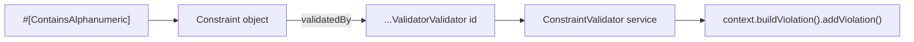

# Custom Constraints

!!! abstract "Learning objectives"
    By the end of this chapter you can:

    - [ ] Write a `Constraint` subclass with options and `#[HasNamedArguments]`
    - [ ] Pair it with a `ConstraintValidator` that builds violations
    - [ ] Control targets (`getTargets()`) and the validator link (`validatedBy()`)

    **Syllabus:** `Data Validation → Custom constraints` ·
    **Level:** Expert ·
    **Est. time:** 28 min ·
    **Prerequisites:** [Callbacks](callbacks.md), [Violations Builder](violations-builder.md)

---

## Theory

When a rule is **reusable** across classes, promote it from a callback to a
**custom constraint**. A constraint is *two* classes:

1. A `Symfony\Component\Validator\Constraint` subclass — a declarative marker
   holding options and the default message.
2. A `Symfony\Component\Validator\ConstraintValidator` subclass — the logic that
   inspects the value and adds violations.

The constraint links to its validator via `validatedBy()`, which by convention
returns `static::class . 'Validator'`.

## Deep Dive — the two classes and their contract

### The Constraint

```php
<?php
declare(strict_types=1);

namespace App\Validator;

use Symfony\Component\Validator\Attribute\HasNamedArguments;
use Symfony\Component\Validator\Constraint;

#[\Attribute(\Attribute::TARGET_PROPERTY | \Attribute::IS_REPEATABLE)]
final class ContainsAlphanumeric extends Constraint
{
    public string $message = 'The value "{{ value }}" must be alphanumeric.';

    #[HasNamedArguments]
    public function __construct(
        public string $mode = 'strict',
        ?array $groups = null,
        mixed $payload = null,
    ) {
        parent::__construct([], $groups, $payload);
    }
}
```

Key mechanics:

- Extend `Constraint`. Public properties are its **options**; `message` is
  conventional.
- `#[HasNamedArguments]` (from `Symfony\Component\Validator\Attribute`) tells the
  loader to pass attribute arguments as **named constructor arguments** rather
  than an options array — the modern, type-safe style. Always forward `$groups`
  and `$payload` to `parent::__construct()`.
- `getTargets()` (inherited) returns `Constraint::PROPERTY_CONSTRAINT` by default.
  Override it to return `Constraint::CLASS_CONSTRAINT` (or an array of both) for a
  **class-level** constraint.
- `validatedBy()` defaults to `static::class . 'Validator'`; override only when
  the validator's service id differs.

### The Validator

```php
<?php
declare(strict_types=1);

namespace App\Validator;

use Symfony\Component\Validator\Constraint;
use Symfony\Component\Validator\ConstraintValidator;
use Symfony\Component\Validator\Exception\UnexpectedTypeException;
use Symfony\Component\Validator\Exception\UnexpectedValueException;

final class ContainsAlphanumericValidator extends ConstraintValidator
{
    public function validate(mixed $value, Constraint $constraint): void
    {
        if (!$constraint instanceof ContainsAlphanumeric) {
            throw new UnexpectedTypeException($constraint, ContainsAlphanumeric::class);
        }

        // Convention: null/empty are valid — let NotBlank handle "required".
        if (null === $value || '' === $value) {
            return;
        }

        if (!\is_string($value)) {
            throw new UnexpectedValueException($value, 'string');
        }

        if (!preg_match('/^[a-zA-Z0-9]+$/', $value)) {
            $this->context->buildViolation($constraint->message)
                ->setParameter('{{ value }}', $this->formatValue($value))
                ->addViolation();
        }
    }
}
```

Contract points:

- Extend `ConstraintValidator`; it implements
  `Symfony\Component\Validator\ConstraintValidatorInterface` and gives you
  `$this->context` (the `ExecutionContextInterface`) after `initialize()`.
- **Always** narrow the constraint type with `instanceof` and throw
  `UnexpectedTypeException` otherwise — the exam checks this.
- **Skip empty/null** unless the constraint's very purpose is to reject them —
  this keeps constraints composable with `NotBlank`.
- Use `$this->formatValue()` for safe message interpolation of the invalid value.
- The validator is a **service**, autoconfigured via the
  `validator.constraint_validator` tag (thanks to `ConstraintValidatorInterface`),
  so you can inject dependencies (a repository, the `Security` service, etc.).



!!! note "Source reference"
    `Symfony\Component\Validator\Constraint`,
    `ConstraintValidator`, and `Attribute\HasNamedArguments` —
    [symfony/symfony `8.0`](https://github.com/symfony/symfony/blob/8.0/src/Symfony/Component/Validator/Constraint.php).

## Configuration & code

=== "Use (PHP Attributes)"

    ```php
    <?php
    declare(strict_types=1);

    namespace App\Entity;

    use App\Validator\ContainsAlphanumeric;
    use Symfony\Component\Validator\Constraints as Assert;

    class Coupon
    {
        #[Assert\NotBlank]
        #[ContainsAlphanumeric(mode: 'strict')]
        public string $code = '';
    }
    ```

=== "Class-level constraint"

    ```php
    <?php
    declare(strict_types=1);

    namespace App\Validator;

    use Symfony\Component\Validator\Constraint;

    #[\Attribute(\Attribute::TARGET_CLASS)]
    final class ConsistentDates extends Constraint
    {
        public string $message = 'Dates are inconsistent.';

        public function getTargets(): string
        {
            return self::CLASS_CONSTRAINT;
        }
    }
    ```

=== "Console"

    ```console
    $ php bin/console debug:validator "App\Entity\Coupon"
    ```

A **class-level** validator receives the whole object as `$value`:

```php
public function validate(mixed $value, Constraint $constraint): void
{
    // $value is the object instance here.
}
```

## Best practices & anti-patterns

| ✅ Do | ❌ Avoid |
|---|---|
| `instanceof` check + `UnexpectedTypeException` | Assuming the constraint type |
| Skip null/empty; compose with `NotBlank` | Re-implementing "required" in every validator |
| Use `#[HasNamedArguments]` for typed options | Legacy options-array constructors |
| Inject services into the validator | Static helpers doing I/O outside DI |

## When (not) to use it / alternatives

Write a custom constraint when the rule is **reused** or needs **dependencies**
(DB lookups, the current user). For a one-off rule, a [callback](callbacks.md) is
lighter. For a pure expression over fields, `#[Assert\Expression]` suffices.

!!! danger "Certification traps"
    - The validator class name is the constraint name **+ `Validator`** by
      convention; override `validatedBy()` to change it.
    - Default target is `PROPERTY_CONSTRAINT`; a class constraint **must** override
      `getTargets()` to return `CLASS_CONSTRAINT`.
    - `#[HasNamedArguments]` changes how attribute args are passed — without it,
      the loader uses the options-array style and named args may not map.
    - A class-level validator's `$value` is the **object**, not a property value.
    - Empty/null should pass by convention; letting them fail breaks composition
      with `NotBlank`.

!!! warning "Common mistakes"
    - Forgetting to forward `$groups`/`$payload` to `parent::__construct()`, so the
      constraint ignores groups.
    - Placing a property-target constraint at class scope (throws
      `ConstraintDefinitionException`).

## Exercises

1. **(Advanced)** Create an `IsWeekday` property constraint + validator that
   rejects `\DateTimeInterface` values falling on a weekend; empty passes.
2. **(Expert)** Create a class-level `MatchingPasswords` constraint that compares
   `password` and `confirm` on the validated object and reports on `confirm`.

??? success "Solutions"

    **1.**
    ```php
    #[\Attribute(\Attribute::TARGET_PROPERTY)]
    final class IsWeekday extends Constraint
    {
        public string $message = 'Pick a weekday.';
    }

    final class IsWeekdayValidator extends ConstraintValidator
    {
        public function validate(mixed $value, Constraint $constraint): void
        {
            if (!$constraint instanceof IsWeekday) {
                throw new UnexpectedTypeException($constraint, IsWeekday::class);
            }
            if (null === $value) { return; }
            if (!$value instanceof \DateTimeInterface) {
                throw new UnexpectedValueException($value, \DateTimeInterface::class);
            }
            if ((int) $value->format('N') >= 6) {
                $this->context->buildViolation($constraint->message)->addViolation();
            }
        }
    }
    ```

    **2.**
    ```php
    #[\Attribute(\Attribute::TARGET_CLASS)]
    final class MatchingPasswords extends Constraint
    {
        public string $message = 'Passwords do not match.';
        public function getTargets(): string { return self::CLASS_CONSTRAINT; }
    }

    final class MatchingPasswordsValidator extends ConstraintValidator
    {
        public function validate(mixed $value, Constraint $constraint): void
        {
            if (!$constraint instanceof MatchingPasswords) {
                throw new UnexpectedTypeException($constraint, MatchingPasswords::class);
            }
            if ($value->password !== $value->confirm) {
                $this->context->buildViolation($constraint->message)
                    ->atPath('confirm')->addViolation();
            }
        }
    }
    ```

## Certification questions

??? question "Q1. By default, which validator is used for constraint `App\Validator\Foo`?"
    - [ ] A. `FooConstraintValidator`
    - [x] B. `App\Validator\FooValidator` (name + `Validator`) ✅
    - [ ] C. Whatever service implements `ConstraintValidatorInterface`
    - [ ] D. You must always override `validatedBy()`

    **Why:** `Constraint::validatedBy()` returns `static::class.'Validator'` by
    convention; override only to change it.
    **Ref:** [Custom constraint](https://symfony.com/doc/current/validation/custom_constraint.html).

??? question "Q2. To make a constraint apply at class scope you must…"
    - [ ] A. Set `#[\Attribute(\Attribute::TARGET_CLASS)]` only
    - [x] B. Also override `getTargets()` to return `CLASS_CONSTRAINT` ✅
    - [ ] C. Rename it with a `Class` suffix
    - [ ] D. Register a compiler pass

    **Why:** The PHP attribute target and the validator's `getTargets()` are
    separate; the validator uses the latter to decide placement.
    **Ref:** [Class constraint validator](https://symfony.com/doc/current/validation/custom_constraint.html#class-constraint-validator).

??? question "Q3. In a `ConstraintValidator::validate()`, the first thing you should do is…"
    - [x] A. Check `$constraint instanceof YourConstraint` and throw otherwise ✅
    - [ ] B. Add a violation unconditionally
    - [ ] C. Call `initialize()`
    - [ ] D. Read `$this->context->getRoot()`

    **Why:** Guarding the constraint type with `UnexpectedTypeException` is the
    documented first step.
    **Ref:** [Custom constraint](https://symfony.com/doc/current/validation/custom_constraint.html).

??? question "Q4. What does `#[HasNamedArguments]` do?"
    - [x] A. Passes attribute arguments as named constructor arguments ✅
    - [ ] B. Marks the constraint as repeatable
    - [ ] C. Registers the validator service
    - [ ] D. Enables group sequences

    **Why:** It opts into typed, named-argument construction instead of the legacy
    options-array style.
    **Ref:** [Custom constraint](https://symfony.com/doc/current/validation/custom_constraint.html).

## Key takeaways

- A custom constraint = `Constraint` (options/message) + `ConstraintValidator`
  (logic).
- `validatedBy()` defaults to name + `Validator`.
- Override `getTargets()` → `CLASS_CONSTRAINT` for class-level rules.
- Guard the constraint type; skip empty/null; use `#[HasNamedArguments]`.
- Validators are services — inject dependencies freely.

## Last-minute revision

!!! tip "Cheat sheet"
    - `extends Constraint`; public props = options; `message` = template.
    - `#[HasNamedArguments]` for typed named options; forward `$groups`/`$payload`.
    - `getTargets()`: `PROPERTY_CONSTRAINT` (default) / `CLASS_CONSTRAINT`.
    - `extends ConstraintValidator` → `validate($value, Constraint $c): void`, use `$this->context`.
    - Class validator: `$value` is the object.

## Official References
- [Official Symfony docs — How to create a custom validation constraint](https://symfony.com/doc/current/validation/custom_constraint.html)
- [Symfony source — Constraint](https://github.com/symfony/symfony/blob/8.0/src/Symfony/Component/Validator/Constraint.php)

---

<small>Related: [Violations Builder](violations-builder.md) · [Callbacks](callbacks.md) ·
[Built-in Constraints](built-in-constraints.md)</small>
