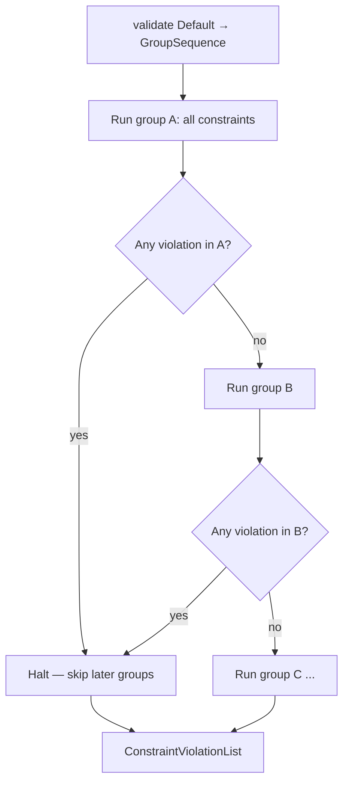
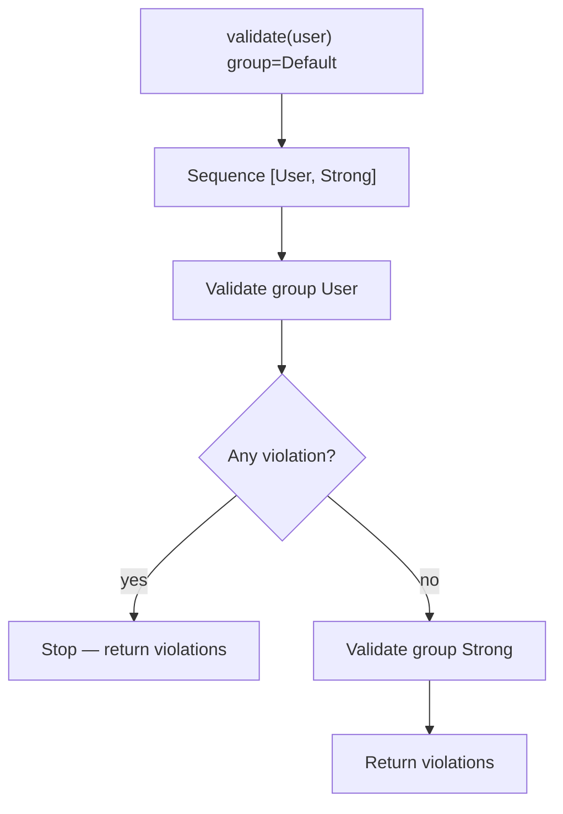

# Group Sequence

!!! tip "In a nutshell"
    Une group sequence valide les groupes dans un ordre fixe et s'arrête au premier
    groupe qui produit une violation : les vérifications peu coûteuses servent ainsi
    de barrière aux plus coûteuses. Piège clé : à l'intérieur de la séquence,
    référencez le groupe `{ClassName}`, jamais `Default` (qui provoquerait une
    boucle).

!!! example "Real-world analogy"
    Une group sequence est le **couloir de contrôles** : vérification des documents,
    puis rayons X, puis fouille. Échouez au contrôle des documents et vous êtes
    refoulé sur-le-champ — les postes suivants ne vous voient même pas. Le
    filtrage s'arrête au premier point de contrôle échoué, exactement le
    comportement stop-on-first-failing-group.

!!! abstract "Learning objectives"
    À la fin de ce chapitre, vous saurez :

    - [ ] Ordonner la validation en étapes avec `#[Assert\GroupSequence]`
    - [ ] Expliquer l'arrêt au premier échec entre les étapes d'une séquence
    - [ ] Calculer la séquence à l'exécution avec `GroupSequenceProvider`

    **Syllabus:** `Data Validation → Group sequences` ·
    **Level:** Advanced / Expert ·
    **Est. time:** 22 min ·
    **Prerequisites:** [Validation Groups](groups.md)

---

## Theory

Une **group sequence** valide les groupes **dans l'ordre** et **s'arrête au
premier groupe qui produit une violation**. Cela évite d'afficher « mot de passe
trop faible » avant « mot de passe requis », et évite d'exécuter des
vérifications coûteuses (une recherche distante) tant que les vérifications peu
coûteuses n'ont pas réussi.

Vous la déclarez au niveau de la classe avec `#[Assert\GroupSequence([...])]`.
Chaque élément est un nom de groupe ; le groupe court spécial **class-name**
représente « les propres constraints `Default` de cette classe ».

Chaque groupe est une **porte** : toutes ses constraints s'exécutent, puis la
séquence s'interrompt au premier groupe ayant produit une violation quelconque —
les groupes suivants sont ignorés.



!!! question "Predict first"
    Une séquence `[User, Strong]` : le groupe `User` produit une violation. Une
    constraint quelconque de `Strong` s'exécute-t-elle ?

??? note "Reveal"
    Non. La séquence s'arrête au premier *groupe* qui produit une violation — tout
    `User` s'exécute, puis elle s'interrompt, donc `Strong` est entièrement ignoré.

## Deep Dive — how stepwise validation works

`Symfony\Component\Validator\Constraints\GroupSequence` est un value object qui
contient une liste ordonnée de groupes. Lorsque le validator est sollicité pour
le groupe **`Default`** d'une classe qui possède une séquence, il substitue la
séquence et itère :

1. Valider toutes les constraints du groupe *N*.
2. Si le groupe *N* a produit **une** violation, **arrêter** — les groupes
   suivants ne s'exécutent pas.
3. Sinon, continuer avec le groupe *N+1*.

Comme `Default` est remappé vers la séquence, une classe **ne peut pas
référencer son propre `Default` à l'intérieur de sa séquence** (boucle infinie).
Vous référencez à la place le groupe **`{ClassName}`**, qui signifie « mes
constraints du groupe Default, à plat ».

```php
<?php
declare(strict_types=1);

namespace App\Entity;

use Symfony\Component\Validator\Constraints as Assert;

#[Assert\GroupSequence(['User', 'Strong'])]
class User
{
    // Belongs to Default → and thus to the "User" group (step 1).
    #[Assert\NotBlank]
    public string $username = '';

    #[Assert\NotBlank]
    public string $password = '';

    // Only reached if step 1 (User) passed.
    #[Assert\Length(min: 12, groups: ['Strong'])]
    #[Assert\NotCompromisedPassword(groups: ['Strong'])]
    public ?string $password2 = null;
}
```

Ici, l'étape 1 est `User` (les vérifications not-blank de base) ; ce n'est que
si aucune n'échoue que l'étape 2 `Strong` exécute les vérifications de longueur
et de mot de passe compromis.



### GroupSequenceProvider — dynamic sequences

Lorsque la séquence dépend de l'**état** de l'objet (un compte gratuit et un
compte premium valident des règles différentes), implémentez
`Symfony\Component\Validator\GroupSequenceProviderInterface` et annotez la
classe avec `#[Assert\GroupSequenceProvider]`.

```php
<?php
declare(strict_types=1);

namespace App\Entity;

use Symfony\Component\Validator\Constraints as Assert;
use Symfony\Component\Validator\GroupSequenceProviderInterface;

#[Assert\GroupSequenceProvider]
class Account implements GroupSequenceProviderInterface
{
    public bool $premium = false;

    #[Assert\NotBlank]
    public string $name = '';

    #[Assert\NotBlank(groups: ['Premium'])]
    public ?string $vatNumber = null;

    public function getGroupSequence(): array
    {
        // Step 1 is always this class's Default constraints.
        $groups = ['Account'];

        if ($this->premium) {
            $groups[] = 'Premium';
        }

        return $groups;
    }
}
```

`getGroupSequence()` peut retourner un tableau de noms de groupes ou un objet
`GroupSequence`. Elle s'exécute à chaque validation de l'objet, si bien que la
séquence s'adapte à l'état.

!!! note "Source reference"
    `Symfony\Component\Validator\Constraints\GroupSequence` et
    `GroupSequenceProviderInterface` —
    [symfony/symfony `8.0`](https://github.com/symfony/symfony/blob/8.0/src/Symfony/Component/Validator/Constraints/GroupSequence.php).

## Configuration & code

=== "PHP Attributes"

    ```php
    <?php
    declare(strict_types=1);

    namespace App\Entity;

    use Symfony\Component\Validator\Constraints as Assert;

    #[Assert\GroupSequence(['Registration', 'Strict'])]
    class Registration
    {
        #[Assert\NotBlank]
        public string $email = '';

        #[Assert\Email(groups: ['Strict'])]
        public string $emailStrict = '';
    }
    ```

=== "YAML"

    ```yaml
    # config/validator/registration.yaml
    App\Entity\Registration:
        group_sequence:
            - Registration
            - Strict
        properties:
            email:
                - NotBlank: ~
            emailStrict:
                - Email: { groups: [Strict] }
    ```

=== "Console"

    ```console
    $ php bin/console debug:validator "App\Entity\Registration"
    ```

## Best practices & anti-patterns

| ✅ Do | ❌ Avoid |
|---|---|
| Placer d'abord les vérifications peu coûteuses/préalables | Mettre une vérification distante coûteuse à l'étape 1 |
| Référencer `{ClassName}`, jamais `Default`, dans une séquence | Ajouter `Default` à sa propre séquence (boucle) |
| N'utiliser un provider que lorsque l'état pilote l'ordre | Coder en dur de nombreuses séquences quasi identiques |
| Retourner une `GroupSequence` ou un tableau depuis le provider | Retourner des *ensembles* de groupes en espérant des exécutions parallèles |

## When (not) to use it / alternatives

Utilisez une séquence lorsque la validation comporte des **étapes préalables**
ou que l'ordre compte. Si toutes les règles doivent toujours être signalées
ensemble, n'utilisez **pas** de séquence — la validation `Default` classique
affiche toutes les erreurs d'un coup. N'utilisez un **provider** que lorsque les
étapes dépendent de l'état à l'exécution.

!!! danger "Certification traps"
    - La séquence s'exécute lors de la validation du groupe **`Default`** ; valider
      `{ClassName}` la contourne (exécution à plat).
    - Une séquence **s'arrête au premier groupe en échec**, pas à la première
      constraint en échec — toutes les constraints d'un groupe s'exécutent, puis la
      séquence s'interrompt.
    - Ne listez jamais le `Default` d'une classe dans sa propre séquence — utilisez
      le groupe court au nom de la classe à la place.
    - `#[Assert\GroupSequenceProvider]` exige que la classe implémente
      `GroupSequenceProviderInterface` ; la méthode est `getGroupSequence()`.

!!! warning "Common mistakes"
    - S'attendre à ce que l'étape 2 s'exécute alors que l'étape 1 a produit une
      violation — cela n'arrivera pas.
    - Oublier l'interface, si bien que l'attribut du provider n'a aucun effet.

## Exercises

1. **(Basic)** Faites en sorte qu'une classe `Login` valide que les deux champs
   sont non vides avant d'exécuter une étape `Strict` qui vérifie le format de
   l'email — uniquement lorsque les vérifications de base réussissent.
2. **(Advanced)** Transformez une `Subscription` en `GroupSequenceProvider` afin
   qu'un groupe `Yearly` ne soit validé que lorsque `plan === 'yearly'`.

??? success "Solutions"

    **1.**
    ```php
    #[Assert\GroupSequence(['Login', 'Strict'])]
    class Login
    {
        #[Assert\NotBlank] public string $email = '';
        #[Assert\NotBlank] public string $password = '';
        #[Assert\Email(groups: ['Strict'])] public string $email2 = '';
    }
    ```

    **2.**
    ```php
    #[Assert\GroupSequenceProvider]
    class Subscription implements GroupSequenceProviderInterface
    {
        public string $plan = 'monthly';
        public function getGroupSequence(): array
        {
            return $this->plan === 'yearly'
                ? ['Subscription', 'Yearly']
                : ['Subscription'];
        }
    }
    ```

## Certification questions

??? question "Q1. A group sequence stops when…"
    - [ ] A. The first constraint in any group fails
    - [x] B. The first *group* in the sequence produces a violation ✅
    - [ ] C. All groups have run
    - [ ] D. It never stops early

    **Why:** Chaque groupe s'exécute entièrement ; la séquence s'interrompt après le
    premier groupe qui produit une violation quelconque.
    **Ref:** [Group sequence](https://symfony.com/doc/current/validation/sequence_provider.html).

??? question "Q2. Inside a class's `GroupSequence`, how do you reference its own basic constraints?"
    - [ ] A. `Default`
    - [x] B. The short class-name group (e.g. `User`) ✅
    - [ ] C. `self`
    - [ ] D. `Basic`

    **Why:** Référencer `Default` provoquerait une boucle ; le groupe `{ClassName}`
    désigne les propres constraints Default de la classe.
    **Ref:** [Group sequence](https://symfony.com/doc/current/validation/sequence_provider.html).

??? question "Q3. `#[Assert\GroupSequenceProvider]` requires the class to…"
    - [x] A. Implement `GroupSequenceProviderInterface::getGroupSequence()` ✅
    - [ ] B. Define a static `groupSequence()` method
    - [ ] C. Extend `GroupSequence`
    - [ ] D. Register a compiler pass

    **Why:** L'attribut du provider délègue à `getGroupSequence()` de l'interface,
    évaluée à chaque validation.
    **Ref:** [Group sequence provider](https://symfony.com/doc/current/validation/sequence_provider.html).

## Key takeaways

- `#[Assert\GroupSequence]` exécute les groupes dans l'ordre et s'arrête au
  premier groupe en échec.
- Elle se déclenche lors de la validation de `Default` ; `{ClassName}` la
  contourne.
- Référencez `{ClassName}`, jamais `Default`, à l'intérieur de la séquence.
- `GroupSequenceProvider` calcule l'ordre à partir de l'état de l'objet via
  `getGroupSequence()`.

## Last-minute revision

!!! tip "Cheat sheet"
    - `#[Assert\GroupSequence(['ClassName', 'Extra'])]` au niveau de la classe.
    - Arrêt au premier **groupe** en échec (pas à la première constraint).
    - Provider : `#[Assert\GroupSequenceProvider]` + `implements GroupSequenceProviderInterface`.
    - `getGroupSequence(): array|GroupSequence`.

## Connections

- **Depends on:** [Validation Groups](groups.md) — une séquence ne fait qu'ordonner des groupes nommés et remapper `Default`.
- **Reused in:** [Callbacks](callbacks.md) — les callbacks rattachés à un groupe s'insèrent dans une étape de séquence comme n'importe quelle constraint.
- **Confused with:** [Object Validation](object-validation.md) — valider `{ClassName}` exécute l'ensemble à plat et contourne la séquence.

## Official References
- [Official Symfony docs — Group sequence & provider](https://symfony.com/doc/current/validation/sequence_provider.html)
- [Symfony source — GroupSequence](https://github.com/symfony/symfony/blob/8.0/src/Symfony/Component/Validator/Constraints/GroupSequence.php)

## Video references

!!! tip "Watch & learn"
    Voici des chaînes vidéo officielles et continuellement mises à jour —
    recherchez-y « Symfony validation » pour consolider ce chapitre. Nous lions des
    chaînes stables plutôt que des vidéos individuelles afin que les références ne
    périment jamais.

    - [SymfonyCasts screencasts](https://symfonycasts.com/tracks/symfony) — tutoriels scénarisés à suivre en codant.
    - [Symfony official YouTube](https://www.youtube.com/@SymfonyOfficial) — conférences et keynotes SymfonyCon.
    - [Official docs for this topic](https://symfony.com/doc/current/validation/sequence_provider.html) — certaines pages de la doc Symfony intègrent un screencast.

## Confidence check

Je suis prêt quand je peux :

- [ ] expliquer **pourquoi** des étapes ordonnées placent les vérifications coûteuses derrière les peu coûteuses
- [ ] déclarer un `#[Assert\GroupSequence]` et un `GroupSequenceProvider` dans Symfony 8
- [ ] déboguer une séquence qui boucle parce qu'elle référence son propre `Default`
- [ ] repérer le piège « s'arrête à la première constraint en échec » vs « premier groupe en échec »
- [ ] expliquer comment `Default` est remappé vers la séquence en interne

---

<small>Related: [Groups](groups.md) · [Callbacks](callbacks.md) ·
[Object Validation](object-validation.md)</small>
