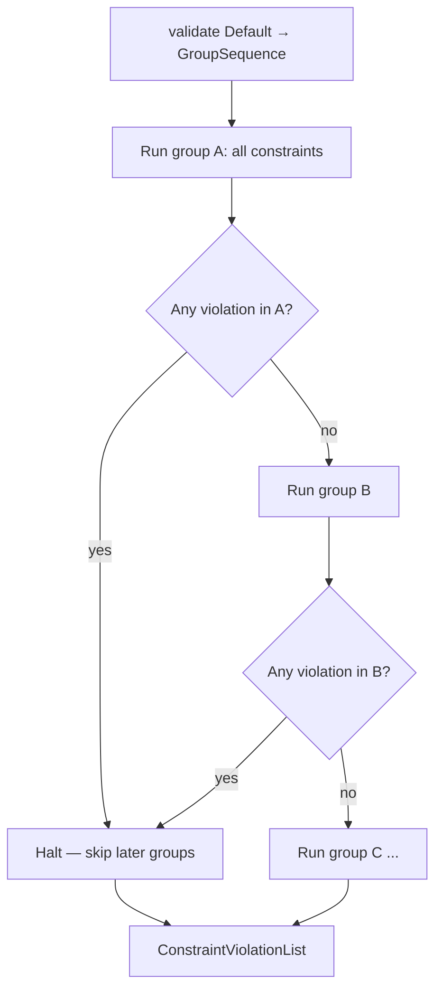
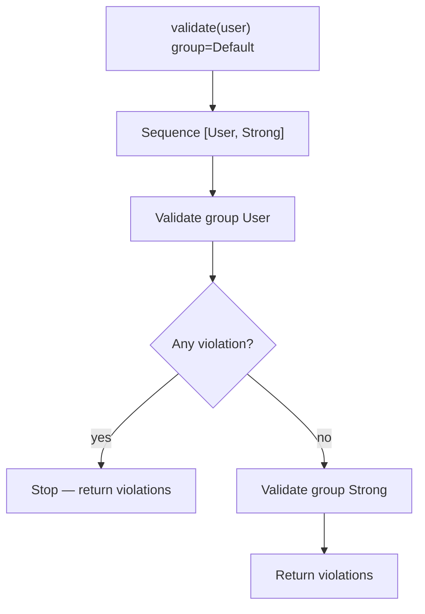

# Group Sequence

!!! tip "In a nutshell"
    A group sequence validates groups in a fixed order and stops at the first group
    that produces a violation, so cheap checks gate expensive ones. Key trap:
    inside the sequence reference the `{ClassName}` group, never `Default` (which
    would loop).

!!! example "Real-world analogy"
    A group sequence is the **checkpoint corridor**: document check, then X-ray,
    then pat-down. Fail the document check and you are turned away on the spot —
    the later stations never even see you. Screening stops at the first failed
    checkpoint, which is exactly stop-on-first-failing-group.

!!! abstract "Learning objectives"
    By the end of this chapter you can:

    - [ ] Order validation into stages with `#[Assert\GroupSequence]`
    - [ ] Explain stop-on-first-failure across sequence steps
    - [ ] Compute the sequence at runtime with `GroupSequenceProvider`

    **Syllabus:** `Data Validation → Group sequences` ·
    **Level:** Advanced / Expert ·
    **Est. time:** 22 min ·
    **Prerequisites:** [Validation Groups](groups.md)

    **Examen Symfony 8 :** OUI

---

## Pour les nuls

### L'idée en une phrase
Une séquence de groupes valide dans un ordre fixe et s'arrête au premier groupe en échec — les vérifications bon marché filtrent avant les coûteuses.

### Imagine dans la vraie vie
Une séquence de groupes est le **couloir de contrôle** : vérification des papiers, puis rayons X, puis fouille. Rate le contrôle des papiers et tu es refoulé sur place — les postes suivants ne te voient même jamais.

### Dans Symfony
Valider d'abord le format d'un email (bon marché) avant de vérifier s'il existe déjà en base (coûteux, requête SQL) évite une requête inutile quand le format est déjà invalide.

### Exemple simple
```php
#[Assert\GroupSequence(['Utilisateur', 'verification_lourde'])]
class Utilisateur {}
```

### Comment le mémoriser 🧠
À l'intérieur d'une séquence, référence toujours le groupe `{ClassName}` — jamais `Default`, qui provoquerait une boucle infinie.

A **group sequence** validates groups **in order** and **stops at the first group
that produces a violation**. This avoids showing "password too weak" before
"password is required", and avoids running expensive checks (a remote lookup)
until cheap ones pass.

You declare it at class scope with `#[Assert\GroupSequence([...])]`. Each element
is a group name; the special short **class-name** group represents "this class's
own `Default` constraints".

```php
#[Assert\GroupSequence(['User', 'Strict'])] // class-name group, then 'Strict'
class User
{
    #[Assert\NotBlank]                      // Default constraint => "User" step
    public string $username = '';

    #[Assert\Email(groups: ['Strict'])]     // runs only if the "User" step passed
    public string $email = '';
}
```

Each group is a **gate**: all of its constraints run, then the sequence halts on
the first group that produced any violation — later groups are skipped.



!!! question "Predict first"
    A sequence `[User, Strong]`: group `User` yields one violation. Does any
    constraint in `Strong` run?

??? note "Reveal"
    No. The sequence stops at the first *group* that produces any violation — all of
    `User` runs, then it halts, so `Strong` is skipped entirely.

## Deep Dive — how stepwise validation works

`Symfony\Component\Validator\Constraints\GroupSequence` is a value object holding
an ordered list of groups. When the validator is asked for the **`Default`**
group of a class that owns a sequence, it substitutes the sequence and iterates:

1. Validate all constraints in group *N*.
2. If group *N* produced **any** violation, **stop** — later groups do not run.
3. Otherwise continue with group *N+1*.

Because `Default` is remapped to the sequence, a class **cannot reference its own
`Default` inside its sequence** (infinite loop). Instead you reference the
**`{ClassName}`** group, which means "my Default-group constraints, flat".

```php
<?php
declare(strict_types=1);

namespace App\Entity;

use Symfony\Component\Validator\Constraints as Assert;

#[Assert\GroupSequence(['User', 'Strong'])]
class User
{
    // Belongs to Default → and thus to the "User" group (step 1).
    #[Assert\NotBlank]
    public string $username = '';

    #[Assert\NotBlank]
    public string $password = '';

    // Only reached if step 1 (User) passed.
    #[Assert\Length(min: 12, groups: ['Strong'])]
    #[Assert\NotCompromisedPassword(groups: ['Strong'])]
    public ?string $password2 = null;
}
```

Here step 1 is `User` (the not-blank basics); only if none fail does step 2
`Strong` run the length + compromised-password checks.



### GroupSequenceProvider — dynamic sequences

When the sequence depends on the object's **state** (a free vs premium account
validates different rules), implement
`Symfony\Component\Validator\GroupSequenceProviderInterface` and annotate the
class with `#[Assert\GroupSequenceProvider]`.

```php
<?php
declare(strict_types=1);

namespace App\Entity;

use Symfony\Component\Validator\Constraints as Assert;
use Symfony\Component\Validator\GroupSequenceProviderInterface;

#[Assert\GroupSequenceProvider]
class Account implements GroupSequenceProviderInterface
{
    public bool $premium = false;

    #[Assert\NotBlank]
    public string $name = '';

    #[Assert\NotBlank(groups: ['Premium'])]
    public ?string $vatNumber = null;

    public function getGroupSequence(): array
    {
        // Step 1 is always this class's Default constraints.
        $groups = ['Account'];

        if ($this->premium) {
            $groups[] = 'Premium';
        }

        return $groups;
    }
}
```

`getGroupSequence()` may return an array of group names or a `GroupSequence`
object. It runs each time the object is validated, so the sequence adapts to
state.

```php
public function getGroupSequence(): array|Assert\GroupSequence
{
    // either a plain array of group names...
    // return ['Account', 'Premium'];

    // ...or a GroupSequence object — re-evaluated on every validation
    return new Assert\GroupSequence(['Account', 'Premium']);
}
```

!!! note "Source reference"
    `Symfony\Component\Validator\Constraints\GroupSequence` and
    `GroupSequenceProviderInterface` —
    [symfony/symfony `8.0`](https://github.com/symfony/symfony/blob/8.0/src/Symfony/Component/Validator/Constraints/GroupSequence.php).

## Configuration & code

=== "PHP Attributes"

    ```php
    <?php
    declare(strict_types=1);

    namespace App\Entity;

    use Symfony\Component\Validator\Constraints as Assert;

    #[Assert\GroupSequence(['Registration', 'Strict'])]
    class Registration
    {
        #[Assert\NotBlank]
        public string $email = '';

        #[Assert\Email(groups: ['Strict'])]
        public string $emailStrict = '';
    }
    ```

=== "YAML"

    ```yaml
    # config/validator/registration.yaml
    App\Entity\Registration:
        group_sequence:
            - Registration
            - Strict
        properties:
            email:
                - NotBlank: ~
            emailStrict:
                - Email: { groups: [Strict] }
    ```

=== "Console"

    ```console
    $ php bin/console debug:validator "App\Entity\Registration"
    ```

## Best practices & anti-patterns

| ✅ Do | ❌ Avoid |
|---|---|
| Order cheap/prerequisite checks first | Putting an expensive remote check in step 1 |
| Reference `{ClassName}`, never `Default`, inside a sequence | Adding `Default` to its own sequence (loop) |
| Use a provider only when state drives the order | Hard-coding many near-identical sequences |
| Return a `GroupSequence` or array from the provider | Returning group *sets* expecting parallel runs |

## When (not) to use it / alternatives

Use a sequence when validation has **prerequisite stages** or ordering matters.
If all rules should always report together, do **not** use a sequence — plain
`Default` validation shows every error at once. Use a **provider** only when the
stages depend on runtime state.

!!! danger "Certification traps"
    - The sequence runs when validating the **`Default`** group; validating
      `{ClassName}` bypasses it (flat run).
    - A sequence **stops at the first failing group**, not the first failing
      constraint — all constraints in a group run, then the sequence halts.
    - Never list a class's own `Default` inside its sequence — use the short
      class-name group instead.
    - `#[Assert\GroupSequenceProvider]` requires the class to implement
      `GroupSequenceProviderInterface`; the method is `getGroupSequence()`.

!!! warning "Common mistakes"
    - Expecting step 2 to run when step 1 had a violation — it will not.
    - Forgetting the interface, so the provider attribute has no effect.

## Exercises

1. **(Basic)** Make a `Login` class validate that both fields are non-blank
   before running a `Strict` step that checks email format — only when the basics
   pass.
2. **(Advanced)** Turn a `Subscription` into a `GroupSequenceProvider` so a
   `Yearly` group is only validated when `plan === 'yearly'`.

??? success "Solutions"

    **1.**
    ```php
    #[Assert\GroupSequence(['Login', 'Strict'])]
    class Login
    {
        #[Assert\NotBlank] public string $email = '';
        #[Assert\NotBlank] public string $password = '';
        #[Assert\Email(groups: ['Strict'])] public string $email2 = '';
    }
    ```

    **2.**
    ```php
    #[Assert\GroupSequenceProvider]
    class Subscription implements GroupSequenceProviderInterface
    {
        public string $plan = 'monthly';
        public function getGroupSequence(): array
        {
            return $this->plan === 'yearly'
                ? ['Subscription', 'Yearly']
                : ['Subscription'];
        }
    }
    ```

## Certification questions

*Question d'entraînement inspirée du syllabus — jamais une question officielle de l'examen.*

??? question "Q1. A group sequence stops when…"
    - [ ] A. The first constraint in any group fails
    - [x] B. The first *group* in the sequence produces a violation ✅
    - [ ] C. All groups have run
    - [ ] D. It never stops early

    **Why:** Each group runs fully; the sequence halts after the first group that
    yields any violation.
    **Ref:** [Group sequence](https://symfony.com/doc/8.0/validation/sequence_provider.html).

??? question "Q2. Inside a class's `GroupSequence`, how do you reference its own basic constraints?"
    - [ ] A. `Default`
    - [x] B. The short class-name group (e.g. `User`) ✅
    - [ ] C. `self`
    - [ ] D. `Basic`

    **Why:** Referencing `Default` would loop; the `{ClassName}` group means the
    class's own Default constraints.
    **Ref:** [Group sequence](https://symfony.com/doc/8.0/validation/sequence_provider.html).

??? question "Q3. `#[Assert\GroupSequenceProvider]` requires the class to…"
    - [x] A. Implement `GroupSequenceProviderInterface::getGroupSequence()` ✅
    - [ ] B. Define a static `groupSequence()` method
    - [ ] C. Extend `GroupSequence`
    - [ ] D. Register a compiler pass

    **Why:** The provider attribute delegates to `getGroupSequence()` from the
    interface, evaluated per validation.
    **Ref:** [Group sequence provider](https://symfony.com/doc/8.0/validation/sequence_provider.html).

## Key takeaways

- `#[Assert\GroupSequence]` runs groups in order, stopping at the first failing
  group.
- It fires when validating `Default`; `{ClassName}` bypasses it.
- Reference `{ClassName}`, never `Default`, inside the sequence.
- `GroupSequenceProvider` computes the order from object state via
  `getGroupSequence()`.

## Last-minute revision

!!! tip "Cheat sheet"
    - `#[Assert\GroupSequence(['ClassName', 'Extra'])]` at class scope.
    - Stop-on-first-failing-**group** (not constraint).
    - Provider: `#[Assert\GroupSequenceProvider]` + `implements GroupSequenceProviderInterface`.
    - `getGroupSequence(): array|GroupSequence`.

## Connections

- **Depends on:** [Validation Groups](groups.md) — a sequence just orders named groups and remaps `Default`.
- **Reused in:** [Callbacks](callbacks.md) — group-tagged callbacks slot into a sequence step like any constraint.
- **Confused with:** [Object Validation](object-validation.md) — validating `{ClassName}` runs the flat set and bypasses the sequence.

## Official References
- [Official Symfony docs — Group sequence & provider](https://symfony.com/doc/8.0/validation/sequence_provider.html)
- [Symfony source — GroupSequence](https://github.com/symfony/symfony/blob/8.0/src/Symfony/Component/Validator/Constraints/GroupSequence.php)

## Video references

!!! tip "Watch & learn"
    These are official, continuously-updated video channels — search them for
    "Symfony validation" to reinforce this chapter. We link stable channels rather than
    individual videos so the references never rot.

    - [SymfonyCasts screencasts](https://symfonycasts.com/tracks/symfony) — scripted, code-along tutorials.
    - [Symfony official YouTube](https://www.youtube.com/@SymfonyOfficial) — SymfonyCon conference talks & keynotes.
    - [Official docs for this topic](https://symfony.com/doc/8.0/validation/sequence_provider.html) — some Symfony doc pages embed a screencast.

## Confidence check

I'm ready when I can:

- [ ] explain **why** ordered stages gate expensive checks behind cheap ones
- [ ] declare a `#[Assert\GroupSequence]` and a `GroupSequenceProvider` in Symfony 8
- [ ] debug a sequence that loops because it references its own `Default`
- [ ] spot the "stops at first failing constraint" vs "first failing group" trick
- [ ] explain how `Default` is remapped to the sequence internally

---

<small>Related: [Groups](groups.md) · [Callbacks](callbacks.md) ·
[Object Validation](object-validation.md)</small>
