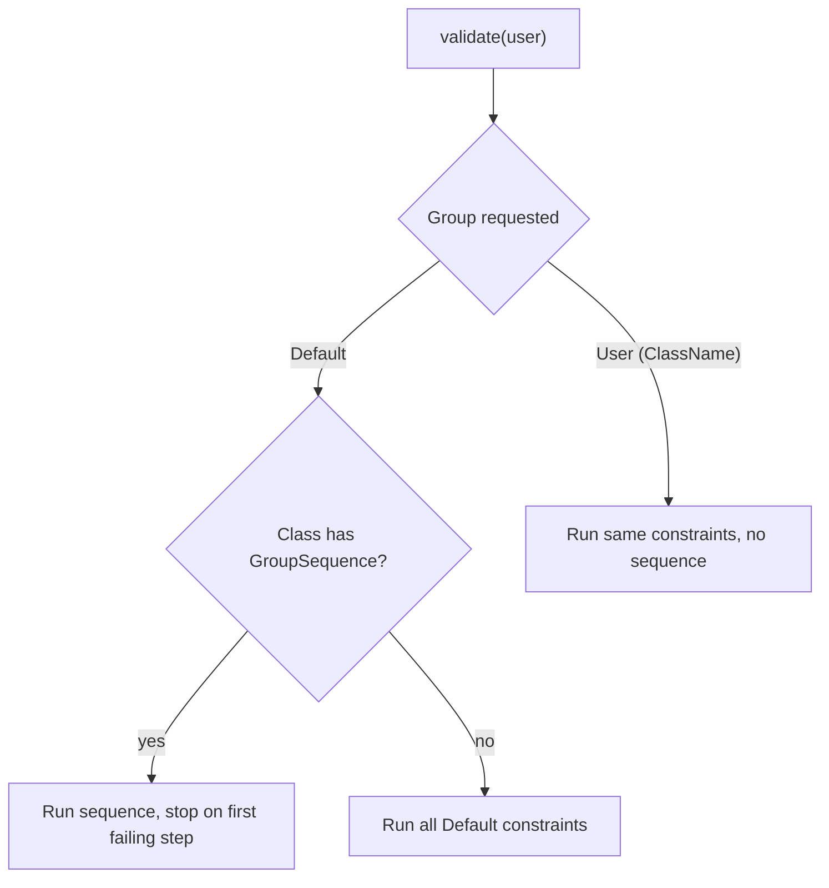

# Validation Groups

!!! tip "In a nutshell"
    Les groupes étiquettent les constraints pour valider un sous-ensemble selon le
    contexte (inscription vs modification de profil). La nuance la plus testée :
    sur une classe avec une group sequence, valider `Default` exécute la séquence,
    tandis que `{ClassName}` exécute les mêmes constraints à plat, en
    contournant l'ordonnancement.

!!! example "Real-world analogy"
    Les groupes sont les **différentes files de contrôle** à l'aéroport. Un membre
    d'équipage, un passager domestique et un passager international passent par des
    ensembles de scanners différents alors qu'il s'agit du même poste de contrôle.
    Valider un groupe choisit la file ; la file `Default` est celle que tout le
    monde emprunte quand aucune file n'est nommée.

!!! abstract "Learning objectives"
    À la fin de ce chapitre, vous saurez :

    - [ ] Affecter des constraints à des groupes nommés et valider un sous-ensemble choisi
    - [ ] Expliquer le groupe spécial `Default` et le groupe `{ClassName}`
    - [ ] Prédire quand valider `Default` diffère de valider `{ClassName}`

    **Syllabus:** `Data Validation → Validation groups` ·
    **Level:** Advanced / Expert ·
    **Est. time:** 25 min ·
    **Prerequisites:** [Object Validation](object-validation.md)

---

## Theory

Parfois, seules *certaines* constraints s'appliquent — un `User` à
l'*inscription* a besoin d'un mot de passe, mais pas lors de la *modification de
profil*. Les **groupes** vous permettent d'étiqueter les constraints et de
valider un ensemble choisi.

Chaque constraint possède une option `groups` (par défaut : `['Default']`). Vous
choisissez les groupes à exécuter en les passant à `validate()` :

```php
$violations = $validator->validate($user, groups: ['registration']);
```

Si vous ne passez aucun groupe, le validator utilise `['Default']`.

!!! question "Predict first"
    Une classe `User` définit un `#[Assert\GroupSequence]`. Vous validez le groupe
    `Default`, puis le groupe `User`. Se comportent-ils de la même façon ?

??? note "Reveal"
    Non. `Default` déclenche la *séquence* (étape par étape, arrêt au premier
    échec) ; le groupe `{ClassName}` `User` exécute les mêmes constraints *à
    plat*, en contournant l'ordre.

## Deep Dive — Default vs {ClassName}

Deux groupes spéciaux rendent l'examen délicat :

- **`Default`** — le groupe implicite de toute constraint qui ne nomme aucun
  groupe.
- **`{ClassName}`** — pour une classe `App\Entity\User`, un groupe littéralement
  nommé `User` (le nom *court* de la classe). Chaque constraint du groupe
  `Default` de la classe est **aussi** dans le groupe `User`.

Pour une classe ordinaire, **`Default` et `User` sont équivalents** — les deux
exécutent les mêmes constraints. La différence n'apparaît que lorsque la classe
définit une **group sequence** (voir [Group Sequence](group-sequence.md)) :

- Valider **`Default`** sur une classe avec un `#[Assert\GroupSequence]`
  déclenche la **séquence** (étape par étape, arrêt au premier échec).
- Valider **`{ClassName}`** (`User`) valide les mêmes constraints **sans** la
  séquence — une exécution à plat, tout d'un coup, qui contourne
  l'ordonnancement.

C'est le piège classique : pour exécuter les constraints d'une classe en
*ignorant* sa propre group sequence, ciblez le groupe `{ClassName}`.

```php
// class App\Entity\User carries #[Assert\GroupSequence(['User', 'Strict'])]

// 'Default' triggers the sequence: stepwise, stop on first failing group
$validator->validate($user, groups: ['Default']);

// 'User' — the {ClassName} short-name group — runs the same constraints
// flat, bypassing the sequence
$validator->validate($user, groups: ['User']);
```



**Propagation des groupes en cascade.** Quand une propriété `#[Assert\Valid]`
est propagée en cascade, le groupe *courant* est transmis vers le bas. Mais il y
a une subtilité : le groupe `Default` de l'objet imbriqué est utilisé quand le
groupe du parent est `Default` ; un groupe *personnalisé* est propagé tel quel.
Un objet imbriqué ne valide donc les constraints de son groupe personnalisé que
si ce groupe personnalisé l'atteint effectivement.

```php
class Order
{
    #[Assert\Valid]              // cascades the *current* group to Address
    public ?Address $address = null;
}

// group 'Default' reaches Address as its own Default group
$validator->validate($order, groups: ['Default']);

// a custom group is propagated as-is: only Address constraints
// tagged groups: ['checkout'] will run on the nested object
$validator->validate($order, groups: ['checkout']);
```

!!! note "Source reference"
    `Symfony\Component\Validator\Constraint::DEFAULT_GROUP` (`'Default'`) et la
    résolution des groupes dans `RecursiveContextualValidator` —
    [symfony/symfony `8.0`](https://github.com/symfony/symfony/blob/8.0/src/Symfony/Component/Validator/Constraint.php).

## Configuration & code

=== "PHP Attributes"

    ```php
    <?php
    declare(strict_types=1);

    namespace App\Entity;

    use Symfony\Component\Validator\Constraints as Assert;

    class User
    {
        #[Assert\NotBlank] // implicitly in the Default group
        public string $email = '';

        // Only checked when the "registration" group is validated.
        #[Assert\NotBlank(groups: ['registration'])]
        #[Assert\Length(min: 8, groups: ['registration'])]
        public ?string $plainPassword = null;

        // In both Default and "profile".
        #[Assert\Length(max: 100, groups: ['Default', 'profile'])]
        public ?string $bio = null;
    }
    ```

=== "YAML"

    ```yaml
    # config/validator/user.yaml
    App\Entity\User:
        properties:
            email:
                - NotBlank: ~
            plainPassword:
                - NotBlank: { groups: [registration] }
                - Length: { min: 8, groups: [registration] }
            bio:
                - Length: { max: 100, groups: [Default, profile] }
    ```

=== "Console"

    ```console
    $ php bin/console debug:validator "App\Entity\User"
    ```

**Exécuter un groupe :**

```php
<?php
declare(strict_types=1);

use Symfony\Component\Validator\Validator\ValidatorInterface;

function checkRegistration(ValidatorInterface $validator, User $user): int
{
    // Runs email (Default) is NOT included — only the "registration" group here.
    $violations = $validator->validate($user, groups: ['registration']);

    // To include Default too, list it explicitly:
    // $validator->validate($user, groups: ['Default', 'registration']);

    return count($violations);
}
```

## Best practices & anti-patterns

| ✅ Do | ❌ Avoid |
|---|---|
| Nommer les groupes par cas d'usage (`registration`, `checkout`) | Abuser des groupes là où un DTO par cas est plus clair |
| Lister `Default` explicitement quand vous en avez aussi besoin | Supposer qu'un groupe personnalisé inclut `Default` |
| Utiliser `{ClassName}` pour contourner une group sequence | Confondre `Default` et `{ClassName}` sur les classes séquencées |
| Garder les noms de groupes en constantes pour éviter les coquilles | Disperser des chaînes magiques |

## When (not) to use it / alternatives

Les groupes brillent quand le **même objet** est validé différemment selon le
contexte. Si les contextes ont réellement des formes différentes, un **DTO
distinct par contexte** est souvent plus clair que de multiples groupes. Dans les
forms, définissez le groupe via l'option de form `validation_groups` (voir
[Form Handling](../forms/handling.md)).

!!! danger "Certification traps"
    - Passer un groupe personnalisé n'inclut **pas** `Default` — listez les deux
      si vous avez besoin des deux.
    - Pour une classe **sans** group sequence, `Default` et `{ClassName}` sont
      équivalents.
    - Pour une classe **avec** une group sequence, `Default` exécute la
      *séquence* tandis que `{ClassName}` exécute l'ensemble à plat — c'est la
      nuance la plus testée de toutes.
    - Les noms de groupes sont **sensibles à la casse** ; le groupe par défaut est
      `Default` (D majuscule).

!!! warning "Common mistakes"
    - Écrire `groups: ['default']` (minuscule) — ce doit être `Default`.
    - S'attendre à ce que les constraints d'un groupe personnalisé d'un objet
      imbriqué s'exécutent alors que seul `Default` l'a atteint via la cascade.

## Exercises

1. **(Basic)** Ajoutez une constraint sur `phone` qui ne s'exécute que dans un
   groupe `checkout`, puis validez un objet pour le checkout en incluant aussi le
   groupe `Default`.
2. **(Advanced)** Étant donné un `User` avec une group sequence `[User, Strong]`,
   décrivez comment valider ses constraints simples en *ignorant* la séquence.

??? success "Solutions"

    **1.**
    ```php
    #[Assert\NotBlank(groups: ['checkout'])]
    public ?string $phone = null;
    // ...
    $validator->validate($user, groups: ['Default', 'checkout']);
    ```

    **2.** Validez directement le groupe `{ClassName}` :
    ```php
    $validator->validate($user, groups: ['User']);
    // Runs the Default-group constraints flat, bypassing the GroupSequence
    // that "Default" would have triggered.
    ```

## Certification questions

??? question "Q1. You call `validate($obj, groups: ['edit'])`. Which constraints run?"
    - [ ] A. `Default` + `edit`
    - [x] B. Only constraints in the `edit` group ✅
    - [ ] C. All constraints regardless of group
    - [ ] D. Only `Default`

    **Why:** Seuls les groupes demandés s'exécutent ; `Default` n'est pas
    implicite.
    **Ref:** [Validation groups](https://symfony.com/doc/current/validation/groups.html).

??? question "Q2. For a class with a `GroupSequence`, validating the `Default` group:"
    - [x] A. Triggers the group sequence ✅
    - [ ] B. Runs all constraints flat, ignoring the sequence
    - [ ] C. Runs nothing
    - [ ] D. Throws an exception

    **Why:** Sur une classe séquencée, `Default` correspond à la séquence ;
    utilisez le groupe `{ClassName}` pour l'exécution à plat.
    **Ref:** [Group sequence](https://symfony.com/doc/current/validation/sequence_provider.html).

??? question "Q3. For class `App\Entity\User` with no sequence, the `{ClassName}` group is:"
    - [ ] A. `App\Entity\User`
    - [x] B. `User` (short name), equivalent to `Default` here ✅
    - [ ] C. `app_entity_user`
    - [ ] D. There is no such group

    **Why:** Le groupe `{ClassName}` utilise le nom court de la classe et
    équivaut à `Default` tant qu'aucune séquence n'est définie.
    **Ref:** [Validation groups](https://symfony.com/doc/current/validation/groups.html).

## Key takeaways

- Le groupe par défaut est `Default` ; les constraints sans groupe lui
  appartiennent.
- Passer un groupe personnalisé exclut `Default`, sauf si vous le listez.
- `{ClassName}` = groupe au nom court ; équivaut à `Default` sauf si une séquence
  existe.
- Sur une classe séquencée : `Default` = exécuter la séquence, `{ClassName}` =
  exécution à plat.

## Last-minute revision

!!! tip "Cheat sheet"
    - Valeur par défaut de l'option `groups` : `['Default']`.
    - `validate($o, groups: ['g'])` n'exécute que `g`.
    - Classe séquencée : `Default` → séquence ; `{ShortClassName}` → pas de séquence.
    - Sensible à la casse ; `Default` avec un D majuscule.

## Connections

- **Depends on:** [Object Validation](object-validation.md) — vous passez `groups:` au même appel `validate()`.
- **Reused in:** [Group Sequence](group-sequence.md) — une séquence est une liste ordonnée de ces groupes.
- **Confused with:** [Form Handling](../forms/handling.md) — dans les forms, vous définissez les groupes via l'option `validation_groups`, pas via l'argument de `validate()`.

## Official References
- [Official Symfony docs — Validation groups](https://symfony.com/doc/current/validation/groups.html)
- [Symfony source — Constraint::DEFAULT_GROUP](https://github.com/symfony/symfony/blob/8.0/src/Symfony/Component/Validator/Constraint.php)

## Video references

!!! tip "Watch & learn"
    Ce sont des chaînes vidéo officielles, mises à jour en continu — cherchez-y
    « Symfony validation » pour consolider ce chapitre. Nous lions des chaînes
    stables plutôt que des vidéos individuelles pour que les références ne
    périment jamais.

    - [SymfonyCasts screencasts](https://symfonycasts.com/tracks/symfony) — tutoriels scénarisés, à suivre en codant.
    - [Symfony official YouTube](https://www.youtube.com/@SymfonyOfficial) — conférences et keynotes SymfonyCon.
    - [Official docs for this topic](https://symfony.com/doc/current/validation/groups.html) — certaines pages de la doc Symfony intègrent un screencast.

## Confidence check

Je suis prêt quand je peux :

- [ ] expliquer **pourquoi** les groupes permettent de valider un même objet différemment selon le contexte
- [ ] affecter et exécuter des groupes nommés dans Symfony 8
- [ ] déboguer un groupe personnalisé qui fait disparaître de façon inattendue les constraints du groupe `Default`
- [ ] repérer le piège `Default` vs `{ClassName}` sur une classe séquencée
- [ ] expliquer comment le groupe courant se propage pendant une cascade

---

<small>Related: [Group Sequence](group-sequence.md) · [Scopes](scopes.md) ·
[Form Handling](../forms/handling.md)</small>
