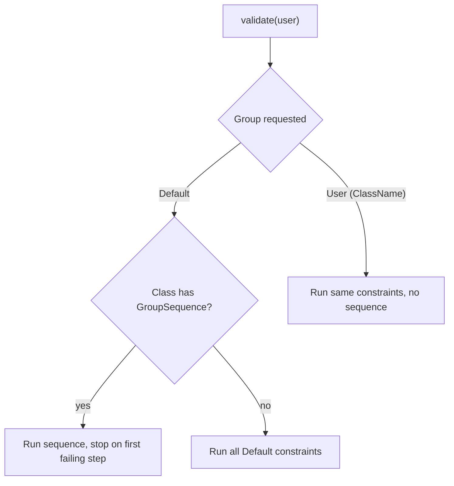

# Validation Groups

!!! tip "In a nutshell"
    Groups tag constraints so you can validate a subset per context (registration
    vs profile edit). The most tested nuance: on a class with a group sequence,
    validating `Default` runs the sequence, while `{ClassName}` runs the same
    constraints flat, bypassing the ordering.

!!! example "Real-world analogy"
    Groups are the **different screening lanes** at the airport. A crew member, a
    domestic passenger and an international passenger walk through different sets of
    scanners even though it is the same checkpoint. Validating a group picks the
    lane; the `Default` lane is the one everyone uses when no lane is named.

!!! abstract "Learning objectives"
    By the end of this chapter you can:

    - [ ] Assign constraints to named groups and validate a chosen subset
    - [ ] Explain the special `Default` group and the `{ClassName}` group
    - [ ] Predict when validating `Default` differs from validating `{ClassName}`

    **Syllabus:** `Data Validation → Validation groups` ·
    **Level:** Advanced / Expert ·
    **Est. time:** 25 min ·
    **Prerequisites:** [Object Validation](object-validation.md)

---

## Theory

Sometimes only *some* constraints apply — a `User` at *registration* needs a
password, but at *profile edit* it does not. **Groups** let you tag constraints
and validate a chosen set.

Every constraint has a `groups` option (default: `['Default']`). You pick which
groups run by passing them to `validate()`:

```php
$violations = $validator->validate($user, groups: ['registration']);
```

If you pass no groups, the validator uses `['Default']`.

!!! question "Predict first"
    A `User` class defines a `#[Assert\GroupSequence]`. You validate the `Default`
    group, then the `User` group. Do they behave the same?

??? note "Reveal"
    No. `Default` triggers the *sequence* (stepwise, stop-on-first-failure); the
    `{ClassName}` group `User` runs the same constraints *flat*, bypassing the order.

## Deep Dive — Default vs {ClassName}

Two special groups make the exam tricky:

- **`Default`** — the implicit group of any constraint that does not name a group.
- **`{ClassName}`** — for a class `App\Entity\User`, a group literally named
  `User` (the *short* class name). Every constraint in the class's `Default`
  group is **also** in the `User` group.

For a plain class **`Default` and `User` are equivalent** — both run the same
constraints. The difference appears only when the class defines a **group
sequence** (see [Group Sequence](group-sequence.md)):

- Validating **`Default`** on a class with a `#[Assert\GroupSequence]`
  triggers the **sequence** (stepwise, stop-on-first-failure).
- Validating **`{ClassName}`** (`User`) validates the same constraints **without**
  the sequence — a flat, all-at-once run that bypasses the ordering.

This is the classic trap: to run a class's constraints *ignoring* its own group
sequence, target the `{ClassName}` group.



**Group propagation on cascade.** When a `#[Assert\Valid]` property is cascaded,
the *current* group is passed down. But there is a subtlety: the nested object's
`Default` group is used when the parent group is `Default`; a *custom* group is
propagated as-is. So a nested object only validates its custom-group constraints
if that custom group actually reaches it.

!!! note "Source reference"
    `Symfony\Component\Validator\Constraint::DEFAULT_GROUP` (`'Default'`) and the
    group resolution in `RecursiveContextualValidator` —
    [symfony/symfony `8.0`](https://github.com/symfony/symfony/blob/8.0/src/Symfony/Component/Validator/Constraint.php).

## Configuration & code

=== "PHP Attributes"

    ```php
    <?php
    declare(strict_types=1);

    namespace App\Entity;

    use Symfony\Component\Validator\Constraints as Assert;

    class User
    {
        #[Assert\NotBlank] // implicitly in the Default group
        public string $email = '';

        // Only checked when the "registration" group is validated.
        #[Assert\NotBlank(groups: ['registration'])]
        #[Assert\Length(min: 8, groups: ['registration'])]
        public ?string $plainPassword = null;

        // In both Default and "profile".
        #[Assert\Length(max: 100, groups: ['Default', 'profile'])]
        public ?string $bio = null;
    }
    ```

=== "YAML"

    ```yaml
    # config/validator/user.yaml
    App\Entity\User:
        properties:
            email:
                - NotBlank: ~
            plainPassword:
                - NotBlank: { groups: [registration] }
                - Length: { min: 8, groups: [registration] }
            bio:
                - Length: { max: 100, groups: [Default, profile] }
    ```

=== "Console"

    ```console
    $ php bin/console debug:validator "App\Entity\User"
    ```

**Running a group:**

```php
<?php
declare(strict_types=1);

use Symfony\Component\Validator\Validator\ValidatorInterface;

function checkRegistration(ValidatorInterface $validator, User $user): int
{
    // Runs email (Default) is NOT included — only the "registration" group here.
    $violations = $validator->validate($user, groups: ['registration']);

    // To include Default too, list it explicitly:
    // $validator->validate($user, groups: ['Default', 'registration']);

    return count($violations);
}
```

## Best practices & anti-patterns

| ✅ Do | ❌ Avoid |
|---|---|
| Name groups by use case (`registration`, `checkout`) | Overusing groups where one DTO per case is clearer |
| List `Default` explicitly when you also need it | Assuming a custom group implies `Default` |
| Use `{ClassName}` to bypass a group sequence | Confusing `Default` with `{ClassName}` on sequenced classes |
| Keep group names as constants to avoid typos | Scattering magic strings |

## When (not) to use it / alternatives

Groups shine when the **same object** is validated differently in different
contexts. If the contexts are genuinely different shapes, a **separate DTO per
context** is often clearer than many groups. In forms, set the group via the
`validation_groups` form option (see [Form Handling](../forms/handling.md)).

!!! danger "Certification traps"
    - Passing a custom group does **not** include `Default` — list both if you
      need both.
    - For a class **without** a group sequence, `Default` and `{ClassName}` are
      equivalent.
    - For a class **with** a group sequence, `Default` runs the *sequence* while
      `{ClassName}` runs the flat set — this is the single most tested nuance.
    - Group names are **case-sensitive**; the default group is `Default` (capital D).

!!! warning "Common mistakes"
    - Writing `groups: ['default']` (lowercase) — it must be `Default`.
    - Expecting a nested object's custom-group constraints to run when only
      `Default` reached it via cascade.

## Exercises

1. **(Basic)** Add a `phone` constraint that only runs in a `checkout` group and
   validate an object for checkout including the `Default` group too.
2. **(Advanced)** Given a `User` with a group sequence `[User, Strong]`, describe
   how to validate its plain constraints while *ignoring* the sequence.

??? success "Solutions"

    **1.**
    ```php
    #[Assert\NotBlank(groups: ['checkout'])]
    public ?string $phone = null;
    // ...
    $validator->validate($user, groups: ['Default', 'checkout']);
    ```

    **2.** Validate the `{ClassName}` group directly:
    ```php
    $validator->validate($user, groups: ['User']);
    // Runs the Default-group constraints flat, bypassing the GroupSequence
    // that "Default" would have triggered.
    ```

## Certification questions

??? question "Q1. You call `validate($obj, groups: ['edit'])`. Which constraints run?"
    - [ ] A. `Default` + `edit`
    - [x] B. Only constraints in the `edit` group ✅
    - [ ] C. All constraints regardless of group
    - [ ] D. Only `Default`

    **Why:** Only the requested groups run; `Default` is not implied.
    **Ref:** [Validation groups](https://symfony.com/doc/current/validation/groups.html).

??? question "Q2. For a class with a `GroupSequence`, validating the `Default` group:"
    - [x] A. Triggers the group sequence ✅
    - [ ] B. Runs all constraints flat, ignoring the sequence
    - [ ] C. Runs nothing
    - [ ] D. Throws an exception

    **Why:** On a sequenced class, `Default` maps to the sequence; use the
    `{ClassName}` group for the flat run.
    **Ref:** [Group sequence](https://symfony.com/doc/current/validation/sequence_provider.html).

??? question "Q3. For class `App\Entity\User` with no sequence, the `{ClassName}` group is:"
    - [ ] A. `App\Entity\User`
    - [x] B. `User` (short name), equivalent to `Default` here ✅
    - [ ] C. `app_entity_user`
    - [ ] D. There is no such group

    **Why:** The `{ClassName}` group uses the short class name and equals `Default`
    unless a sequence is defined.
    **Ref:** [Validation groups](https://symfony.com/doc/current/validation/groups.html).

## Key takeaways

- Default group is `Default`; unnamed constraints belong to it.
- Passing a custom group excludes `Default` unless you list it.
- `{ClassName}` = short-name group; equals `Default` unless a sequence exists.
- On a sequenced class: `Default` = run sequence, `{ClassName}` = flat run.

## Last-minute revision

!!! tip "Cheat sheet"
    - `groups` option default: `['Default']`.
    - `validate($o, groups: ['g'])` runs only `g`.
    - Sequenced class: `Default` → sequence; `{ShortClassName}` → no sequence.
    - Case-sensitive; capital-D `Default`.

## Connections

- **Depends on:** [Object Validation](object-validation.md) — you pass `groups:` to the same `validate()` call.
- **Reused in:** [Group Sequence](group-sequence.md) — a sequence is an ordered list of these groups.
- **Confused with:** [Form Handling](../forms/handling.md) — in forms you set groups via the `validation_groups` option, not the `validate()` argument.

## Official References
- [Official Symfony docs — Validation groups](https://symfony.com/doc/current/validation/groups.html)
- [Symfony source — Constraint::DEFAULT_GROUP](https://github.com/symfony/symfony/blob/8.0/src/Symfony/Component/Validator/Constraint.php)

## Video references

!!! tip "Watch & learn"
    These are official, continuously-updated video channels — search them for
    "Symfony validation" to reinforce this chapter. We link stable channels rather than
    individual videos so the references never rot.

    - [SymfonyCasts screencasts](https://symfonycasts.com/tracks/symfony) — scripted, code-along tutorials.
    - [Symfony official YouTube](https://www.youtube.com/@SymfonyOfficial) — SymfonyCon conference talks & keynotes.
    - [Official docs for this topic](https://symfony.com/doc/current/validation/groups.html) — some Symfony doc pages embed a screencast.

## Confidence check

I'm ready when I can:

- [ ] explain **why** groups let one object validate differently per context
- [ ] assign and run named groups in Symfony 8
- [ ] debug a custom group that unexpectedly drops the `Default` constraints
- [ ] spot the `Default` vs `{ClassName}` trick on a sequenced class
- [ ] explain how the current group propagates during a cascade

---

<small>Related: [Group Sequence](group-sequence.md) · [Scopes](scopes.md) ·
[Form Handling](../forms/handling.md)</small>
