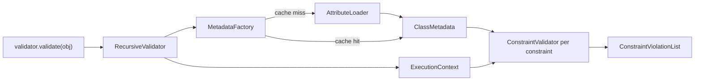

# PHP Object Validation

!!! tip "In a nutshell"
    Vous déclarez les constraints sous forme d'attributs et vous demandez au service
    `ValidatorInterface` de vérifier un objet ; il vous rend une
    `ConstraintViolationList`. Il ne retourne jamais un booléen et ne lève jamais
    d'exception en cas d'échec : vous inspectez le résultat avec `count()`.

!!! example "Real-world analogy"
    Voyez la validation comme le **contrôle des bagages à l'aéroport**. Vous (la
    compagnie aérienne) ne fouillez jamais les bagages vous-même — vous envoyez
    chacun d'eux sur la ligne de contrôle (le `ValidatorInterface`) et vous recevez
    un rapport détaillé de tout ce qui a été signalé (la
    `ConstraintViolationList`). La ligne ne crie jamais « refusé » ; elle vous remet
    une liste, même quand cette liste est vide.

!!! abstract "Learning objectives"
    À la fin de ce chapitre, vous saurez :

    - [ ] Attacher des constraints aux propriétés, aux getters et aux classes entières avec `#[Assert\...]`
    - [ ] Choisir entre `validate()`, `validateProperty()` et `validatePropertyValue()`
    - [ ] Expliquer comment le validator charge et met en cache les métadonnées à l'exécution

    **Syllabus:** `Data Validation → Validating PHP objects` ·
    **Level:** Advanced / Expert ·
    **Est. time:** 25 min ·
    **Prerequisites:** [Dependency Injection](../dependency-injection/index.md)

---

## Theory

Symfony valide **des valeurs contre des constraints**. La valeur habituelle est un
objet dont les *constraints* sont déclarées avec des attributs PHP. Vous ne
validez pas à la main ; vous demandez au service `validator` du container de le
faire et vous relisez une `ConstraintViolationList`.

```php
<?php
declare(strict_types=1);

namespace App\Entity;

use Symfony\Component\Validator\Constraints as Assert;

class Author
{
    #[Assert\NotBlank]
    #[Assert\Length(min: 2, max: 50)]
    public string $name = '';

    #[Assert\Email]
    public ?string $email = null;

    public function __construct(private bool $active = false) {}

    // A getter constraint: the method name minus "get"/"is"/"has" is the path.
    #[Assert\IsTrue(message: 'The author must be active.')]
    public function isActive(): bool
    {
        return $this->active;
    }
}
```

Trois portées de placement existent — **propriété**, **getter** et **classe** —
traitées en détail dans [Scopes](scopes.md). Ici, nous nous concentrons sur
l'*exécution* du validator.

!!! question "Predict first"
    Vous appelez `$validator->validate($author)` sur un objet dont trois
    constraints échouent. Quel est le type de retour, et comment savez-vous qu'il
    y a échec ?

??? note "Reveal"
    Une `ConstraintViolationListInterface` — jamais un booléen, jamais une
    exception levée. Vous l'inspectez avec `count($violations) > 0` ; les trois
    échecs sont trois éléments de cette unique liste.

## Deep Dive — how it works internally

Le point d'entrée est `Symfony\Component\Validator\Validator\ValidatorInterface`,
implémenté par `RecursiveValidator`. Ses quatre méthodes de lecture :

| Method | Validates |
|---|---|
| `validate($value, $constraints?, $groups?)` | une valeur/un objet contre toutes ses constraints (ou une liste explicite) |
| `validateProperty($object, $propertyName, $groups?)` | les constraints d'une seule propriété, avec la valeur courante de l'objet |
| `validatePropertyValue($objectOrClass, $property, $value, $groups?)` | une propriété contre une valeur **hypothétique** |
| `startContext()` / `inContext($context)` | contexte manuel pour la validation imbriquée/personnalisée |

Toutes retournent une
`Symfony\Component\Validator\ConstraintViolationListInterface`.

**Chargement des métadonnées.** Les constraints ne sont pas lues à chaque appel.
Le validator demande à une
`Symfony\Component\Validator\Mapping\Factory\MetadataFactoryInterface`
(`LazyLoadingMetadataFactory`) la `ClassMetadata` de la classe de l'objet. La
factory délègue aux loaders ; dans une application Symfony, le loader par défaut
est `Symfony\Component\Validator\Mapping\Loader\AttributeLoader`, qui fait de la
réflexion sur la classe et lit chaque attribut `#[Assert\...]` sur les
propriétés, les getters et la classe elle-même. Les résultats sont mis en cache
dans un pool PSR-6 (`validator.mapping.cache.adapter`), de sorte que la réflexion
ne se produit qu'une fois par classe.



Pour chaque constraint, le validator résout son `ConstraintValidator` (voir
[Custom Constraints](custom-constraints.md)), appelle `initialize($context)` puis
`validate($value, $constraint)`. Les violations sont collectées dans la liste
liée au
`Symfony\Component\Validator\Context\ExecutionContextInterface` courant.

!!! note "Source reference"
    `Symfony\Component\Validator\Validator\RecursiveValidator` et
    `...\Mapping\Loader\AttributeLoader` —
    [symfony/symfony `8.0`](https://github.com/symfony/symfony/blob/8.0/src/Symfony/Component/Validator/Validator/RecursiveValidator.php).

**Obtenir le service.** Utilisez l'autowiring de `ValidatorInterface` ; ne faites
jamais `new` sur le validator dans le code applicatif (il a besoin de la
metadata factory et du cache).

```php
<?php
declare(strict_types=1);

namespace App\Controller;

use App\Entity\Author;
use Symfony\Component\HttpFoundation\Response;
use Symfony\Component\Validator\Validator\ValidatorInterface;

final class AuthorController
{
    public function __construct(private ValidatorInterface $validator) {}

    public function check(): Response
    {
        $author = new Author();
        $author->name = '';

        $violations = $this->validator->validate($author);

        if (count($violations) > 0) {
            return new Response((string) $violations, 422);
        }

        return new Response('OK');
    }
}
```

### Null behavior

Passer `null` à `validate()` est légal — le validator enveloppe la valeur dans un
nœud et ne trouve aucune métadonnée de classe, si bien que vous récupérez une
`ConstraintViolationListInterface` vide (pas d'erreur, pas de `TypeError`). La
validation, c'est *des valeurs contre des constraints*, et un simple `null` ne
porte aucune constraint qui lui soit propre.

Le cas le plus courant est une *propriété* à `null`. Le validator la visite quand
même, mais la plupart des constraints ignorent `null` (voir
[Built-in Constraints](built-in-constraints.md)) : une propriété nullable ne
portant que `#[Assert\Email]` passe donc quand elle n'est pas renseignée. Ajoutez
`#[Assert\NotNull]` ou `#[Assert\NotBlank]` quand l'absence doit être une erreur
en soi. Une constraint de getter peut de même retourner `null` ; la même règle
d'exemption s'applique à la valeur retournée.

!!! note "Null in real life"
    Un objet `null`, c'est un tapis vide : les scanners tournent mais ne trouvent
    rien à signaler — pas de nouvelles, bonnes nouvelles, ce qui est exactement le
    bug quand vous *attendiez* qu'une valeur obligatoire soit présente.

## Configuration & code

=== "PHP Attributes"

    ```php
    <?php
    declare(strict_types=1);

    namespace App\Entity;

    use Symfony\Component\Validator\Constraints as Assert;

    class Product
    {
        #[Assert\NotBlank]
        public string $sku = '';

        #[Assert\Positive]
        public int $stock = 0;
    }
    ```

=== "YAML"

    ```yaml
    # config/validator/product.yaml
    App\Entity\Product:
        properties:
            sku:
                - NotBlank: ~
            stock:
                - Positive: ~
    ```

=== "Console"

    ```console
    $ php bin/console debug:validator "App\Entity\Product"
    ```

!!! info "Enabling attribute mapping"
    Dans le `framework.yaml` de Symfony,
    `framework.validation.enable_attributes: true` est la valeur par défaut. Les
    fichiers de mapping YAML/XML sous `config/validator/` sont eux aussi chargés
    automatiquement. Tous les loaders actifs sont fusionnés pour une même classe.

## Best practices & anti-patterns

| ✅ Do | ❌ Avoid |
|---|---|
| Autowirer `ValidatorInterface` | `new RecursiveValidator(...)` dans le code applicatif |
| Garder les constraints à côté de la propriété qu'elles protègent | Re-valider à la main avec `if`/`throw` |
| Utiliser `validatePropertyValue` pour « cette valeur passerait-elle ? » | Muter l'objet juste pour tester un champ |
| Laisser le cache de mapping se réchauffer au build | Désactiver le cache de métadonnées en prod |

## When (not) to use it / alternatives

Utilisez le validator pour les **invariants de domaine/de données** sur les
objets et les DTO. Pour la simple coercition de type, préférez les types PHP ;
pour vérifier la forme d'une request dans une API, mappez tout de même vers un
DTO et validez-le. Dans un controller, vous appelez rarement le validator
directement — les [Forms](../forms/handling.md) l'invoquent pour vous pendant
`handleRequest()`, et le value resolver `#[MapRequestPayload]` valide
automatiquement les DTO désérialisés.

!!! danger "Certification traps"
    - `validate()` retourne une `ConstraintViolationListInterface`, **ne lève
      jamais d'exception** en cas d'échec et **ne retourne jamais de `bool`**.
      Vous vérifiez avec `count()`.
    - `validateProperty()` utilise la valeur *courante* de l'objet ;
      `validatePropertyValue()` prend une valeur explicite et ne touche **pas** à
      l'objet.
    - Les métadonnées sont chargées depuis *tous* les loaders activés et
      fusionnées — les attributs n'écrasent pas silencieusement le YAML ; les
      constraints s'accumulent.
    - Les constraints de getter valident la **valeur de retour** de
      `getX`/`isX`/`hasX`, pas une propriété stockée.

!!! warning "Common mistakes"
    - Évaluer à tort une `ConstraintViolationList` non vide comme « truthy » — une
      liste vide reste un objet ; utilisez `count($violations) > 0`.
    - S'attendre à ce que les constraints sur propriétés privées échouent — elles
      fonctionnent très bien ; le loader fait aussi de la réflexion sur les
      membres privés.

## Exercises

1. **(Basic)** Ajoutez des constraints à un DTO `User` pour que `email` soit un
   email valide et `age` au moins 18, puis validez une instance dans un controller
   et retournez le nombre de violations.
2. **(Advanced)** Sans changer l'état de l'objet, vérifiez si affecter
   `age = 15` produirait une violation.

??? success "Solutions"

    **1.**
    ```php
    <?php
    declare(strict_types=1);

    namespace App\Dto;

    use Symfony\Component\Validator\Constraints as Assert;

    final class User
    {
        #[Assert\Email]
        public string $email = '';

        #[Assert\GreaterThanOrEqual(18)]
        public int $age = 0;
    }
    ```
    Dans le controller : `$errors = $validator->validate($user); return new Response((string) count($errors));`
    Une liste non vide signifie que l'objet est invalide.

    **2.**
    ```php
    $violations = $validator->validatePropertyValue($user, 'age', 15);
    // $user->age is unchanged; $violations describes the hypothetical failure.
    ```

## Certification questions

??? question "Q1. What does `ValidatorInterface::validate()` return when the object is invalid?"
    - [ ] A. `false`
    - [ ] B. It throws a `ValidationFailedException`
    - [x] C. A `ConstraintViolationListInterface` containing the violations ✅
    - [ ] D. An array of error strings

    **Why:** `validate()` retourne toujours une liste de violations ; vous
    l'inspectez avec `count()`. Il ne lève jamais d'exception et ne retourne
    jamais de booléen.
    **Ref:** [Validation](https://symfony.com/doc/current/validation.html).

??? question "Q2. Which method checks a value *without* modifying the object?"
    - [ ] A. `validate()`
    - [ ] B. `validateProperty()`
    - [x] C. `validatePropertyValue()` ✅
    - [ ] D. `startContext()`

    **Why:** `validatePropertyValue($objectOrClass, $property, $value)` valide une
    valeur hypothétique ; l'état de l'objet reste intact.
    **Ref:** [ValidatorInterface](https://symfony.com/doc/current/validation.html).

??? question "Q3. How is `#[Assert\...]` attribute metadata turned into constraints?"
    - [ ] A. Parsed on every `validate()` call by reflection
    - [x] B. Loaded once by `AttributeLoader` into `ClassMetadata` and cached ✅
    - [ ] C. Compiled into the DI container at build time only
    - [ ] D. Read from a database table

    **Why:** La `LazyLoadingMetadataFactory` utilise l'`AttributeLoader` pour
    construire la `ClassMetadata`, mise en cache dans un pool PSR-6 pour que la
    réflexion ne s'exécute qu'une fois par classe.
    **Ref:** [Validator internals](https://symfony.com/doc/current/validation.html).

## Key takeaways

- `validate()` retourne une `ConstraintViolationListInterface` ; vérifiez avec
  `count()`.
- `validateProperty()` utilise l'état courant ; `validatePropertyValue()` utilise
  une valeur fournie.
- Les métadonnées viennent de `AttributeLoader` → `ClassMetadata`, mises en cache
  par classe.
- Autowirez `ValidatorInterface` ; n'instanciez jamais le validator vous-même.

## Last-minute revision

!!! tip "Cheat sheet"
    - Service : `Symfony\Component\Validator\Validator\ValidatorInterface`.
    - Retourne `ConstraintViolationListInterface` — `count()`, itérable, `__toString()`.
    - Portées : propriété · getter (valeur de retour de `isX`/`getX`/`hasX`) · classe.
    - Métadonnées : `AttributeLoader` → `ClassMetadata`, cache PSR-6.
    - `debug:validator "App\Entity\X"` liste les constraints mappées.

## Connections

- **Depends on:** [Autowiring](../dependency-injection/autowiring.md) — vous autowirez `ValidatorInterface` au lieu de faire `new`.
- **Reused in:** [Form Handling](../forms/handling.md) — `handleRequest()` exécute le validator pour vous.
- **Confused with:** [Scopes](scopes.md) — *où* les constraints s'attachent vs *comment* vous exécutez le validator ici.

## Official References
- [Official Symfony docs — Validation](https://symfony.com/doc/current/validation.html)
- [Symfony source — RecursiveValidator](https://github.com/symfony/symfony/blob/8.0/src/Symfony/Component/Validator/Validator/RecursiveValidator.php)

## Video references

!!! tip "Watch & learn"
    Ce sont des chaînes vidéo officielles, mises à jour en continu — cherchez-y
    « Symfony validation » pour consolider ce chapitre. Nous lions des chaînes
    stables plutôt que des vidéos individuelles pour que les références ne
    périment jamais.

    - [SymfonyCasts screencasts](https://symfonycasts.com/tracks/symfony) — tutoriels scénarisés, à suivre en codant.
    - [Symfony official YouTube](https://www.youtube.com/@SymfonyOfficial) — conférences et keynotes SymfonyCon.
    - [Official docs for this topic](https://symfony.com/doc/current/validation.html) — certaines pages de la doc Symfony intègrent un screencast.

## Confidence check

Je suis prêt quand je peux :

- [ ] expliquer **pourquoi** `validate()` retourne une liste au lieu de lever une exception ou de retourner un booléen
- [ ] exécuter `validate()`, `validateProperty()` et `validatePropertyValue()` dans Symfony 8
- [ ] déboguer une liste vide lue à tort comme « invalide » à cause d'une erreur de truthiness sur `count()`
- [ ] repérer la réponse piège affirmant que `validate()` lève une exception en cas d'échec
- [ ] expliquer comment `AttributeLoader` construit et met en cache la `ClassMetadata`

---

<small>Related: [Scopes](scopes.md) · [Built-in Constraints](built-in-constraints.md) ·
[Form Handling](../forms/handling.md)</small>
