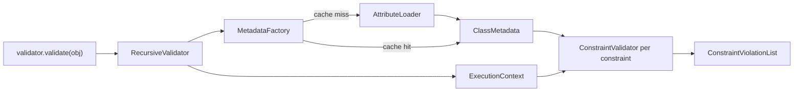

# PHP Object Validation

!!! abstract "Learning objectives"
    By the end of this chapter you can:

    - [ ] Attach constraints to properties, getters and whole classes with `#[Assert\...]`
    - [ ] Choose between `validate()`, `validateProperty()` and `validatePropertyValue()`
    - [ ] Explain how the validator loads and caches metadata at runtime

    **Syllabus:** `Data Validation → Validating PHP objects` ·
    **Level:** Advanced / Expert ·
    **Est. time:** 25 min ·
    **Prerequisites:** [Dependency Injection](../dependency-injection/index.md)

---

## Theory

Symfony validates **values against constraints**. The usual value is an object
whose *constraints* are declared with PHP attributes. You do not validate by
hand; you ask the container's `validator` service to do it and read back a
`ConstraintViolationList`.

```php
<?php
declare(strict_types=1);

namespace App\Entity;

use Symfony\Component\Validator\Constraints as Assert;

class Author
{
    #[Assert\NotBlank]
    #[Assert\Length(min: 2, max: 50)]
    public string $name = '';

    #[Assert\Email]
    public ?string $email = null;

    public function __construct(private bool $active = false) {}

    // A getter constraint: the method name minus "get"/"is"/"has" is the path.
    #[Assert\IsTrue(message: 'The author must be active.')]
    public function isActive(): bool
    {
        return $this->active;
    }
}
```

Three placement scopes exist — **property**, **getter** and **class** — covered
in depth in [Scopes](scopes.md). Here we focus on *running* the validator.

## Deep Dive — how it works internally

The entry point is `Symfony\Component\Validator\Validator\ValidatorInterface`,
implemented by `RecursiveValidator`. Its four read methods:

| Method | Validates |
|---|---|
| `validate($value, $constraints?, $groups?)` | a value/object against all its constraints (or an explicit list) |
| `validateProperty($object, $propertyName, $groups?)` | one property's constraints, using the object's current value |
| `validatePropertyValue($objectOrClass, $property, $value, $groups?)` | one property against a **hypothetical** value |
| `startContext()` / `inContext($context)` | manual context for nested/custom validation |

All return a `Symfony\Component\Validator\ConstraintViolationListInterface`.

**Metadata loading.** Constraints are not read on every call. The validator asks
a `Symfony\Component\Validator\Mapping\Factory\MetadataFactoryInterface`
(`LazyLoadingMetadataFactory`) for the `ClassMetadata` of the object's class. The
factory delegates to loaders; in a Symfony app the default is
`Symfony\Component\Validator\Mapping\Loader\AttributeLoader`, which reflects over
the class and reads every `#[Assert\...]` attribute on properties, getters and
the class itself. Results are cached in a PSR-6 pool
(`validator.mapping.cache.adapter`) so reflection happens once per class.



For each constraint the validator resolves its `ConstraintValidator` (see
[Custom Constraints](custom-constraints.md)), calls `initialize($context)` then
`validate($value, $constraint)`. Violations are collected into the list bound to
the current `Symfony\Component\Validator\Context\ExecutionContextInterface`.

!!! note "Source reference"
    `Symfony\Component\Validator\Validator\RecursiveValidator` and
    `...\Mapping\Loader\AttributeLoader` —
    [symfony/symfony `8.0`](https://github.com/symfony/symfony/blob/8.0/src/Symfony/Component/Validator/Validator/RecursiveValidator.php).

**Getting the service.** Autowire `ValidatorInterface`; never `new` the
validator in app code (it needs the metadata factory + cache).

```php
<?php
declare(strict_types=1);

namespace App\Controller;

use App\Entity\Author;
use Symfony\Component\HttpFoundation\Response;
use Symfony\Component\Validator\Validator\ValidatorInterface;

final class AuthorController
{
    public function __construct(private ValidatorInterface $validator) {}

    public function check(): Response
    {
        $author = new Author();
        $author->name = '';

        $violations = $this->validator->validate($author);

        if (count($violations) > 0) {
            return new Response((string) $violations, 422);
        }

        return new Response('OK');
    }
}
```

## Configuration & code

=== "PHP Attributes"

    ```php
    <?php
    declare(strict_types=1);

    namespace App\Entity;

    use Symfony\Component\Validator\Constraints as Assert;

    class Product
    {
        #[Assert\NotBlank]
        public string $sku = '';

        #[Assert\Positive]
        public int $stock = 0;
    }
    ```

=== "YAML"

    ```yaml
    # config/validator/product.yaml
    App\Entity\Product:
        properties:
            sku:
                - NotBlank: ~
            stock:
                - Positive: ~
    ```

=== "Console"

    ```console
    $ php bin/console debug:validator "App\Entity\Product"
    ```

!!! info "Enabling attribute mapping"
    In Symfony's `framework.yaml`, `framework.validation.enable_attributes: true`
    is the default. YAML/XML mapping files under `config/validator/` are also
    auto-loaded. All active loaders are merged for the same class.

## Best practices & anti-patterns

| ✅ Do | ❌ Avoid |
|---|---|
| Autowire `ValidatorInterface` | `new RecursiveValidator(...)` in app code |
| Keep constraints beside the property they guard | Re-validating manually with `if`/`throw` |
| Use `validatePropertyValue` for "would this value pass?" | Mutating the object just to test one field |
| Let the mapping cache warm at build time | Disabling the metadata cache in prod |

## When (not) to use it / alternatives

Use the validator for **domain/data invariants** on objects and DTOs. For simple
type coercion prefer PHP types; for request-shape checks in an API, still map to
a DTO and validate it. In a controller you rarely call the validator directly —
[Forms](../forms/handling.md) invoke it for you during `handleRequest()`, and the
`#[MapRequestPayload]` argument resolver validates deserialized DTOs
automatically.

!!! danger "Certification traps"
    - `validate()` returns a `ConstraintViolationListInterface`, **never throws**
      on failure and **never returns `bool`**. You check `count()`.
    - `validateProperty()` uses the object's *current* value;
      `validatePropertyValue()` takes an explicit value and does **not** touch the
      object.
    - Metadata is loaded from *all* enabled loaders and merged — attributes do not
      silently override YAML; the constraints accumulate.
    - Getter constraints validate the **return value** of `getX`/`isX`/`hasX`, not
      a stored property.

!!! warning "Common mistakes"
    - Treating a non-empty `ConstraintViolationList` as truthy incorrectly — an
      empty list is still an object; use `count($violations) > 0`.
    - Expecting private property constraints to fail — they work fine; the loader
      reflects private members too.

## Exercises

1. **(Basic)** Add constraints to a `User` DTO so `email` is a valid email and
   `age` is at least 18, then validate an instance in a controller and return the
   violation count.
2. **(Advanced)** Without changing the object's state, check whether setting
   `age = 15` would produce a violation.

??? success "Solutions"

    **1.**
    ```php
    <?php
    declare(strict_types=1);

    namespace App\Dto;

    use Symfony\Component\Validator\Constraints as Assert;

    final class User
    {
        #[Assert\Email]
        public string $email = '';

        #[Assert\GreaterThanOrEqual(18)]
        public int $age = 0;
    }
    ```
    In the controller: `$errors = $validator->validate($user); return new Response((string) count($errors));`
    A non-empty list means invalid.

    **2.**
    ```php
    $violations = $validator->validatePropertyValue($user, 'age', 15);
    // $user->age is unchanged; $violations describes the hypothetical failure.
    ```

## Certification questions

??? question "Q1. What does `ValidatorInterface::validate()` return when the object is invalid?"
    - [ ] A. `false`
    - [ ] B. It throws a `ValidationFailedException`
    - [x] C. A `ConstraintViolationListInterface` containing the violations ✅
    - [ ] D. An array of error strings

    **Why:** `validate()` always returns a violation list; you inspect it with
    `count()`. It never throws or returns a bool.
    **Ref:** [Validation](https://symfony.com/doc/current/validation.html).

??? question "Q2. Which method checks a value *without* modifying the object?"
    - [ ] A. `validate()`
    - [ ] B. `validateProperty()`
    - [x] C. `validatePropertyValue()` ✅
    - [ ] D. `startContext()`

    **Why:** `validatePropertyValue($objectOrClass, $property, $value)` validates a
    hypothetical value; the object's state is untouched.
    **Ref:** [ValidatorInterface](https://symfony.com/doc/current/validation.html).

??? question "Q3. How is `#[Assert\...]` attribute metadata turned into constraints?"
    - [ ] A. Parsed on every `validate()` call by reflection
    - [x] B. Loaded once by `AttributeLoader` into `ClassMetadata` and cached ✅
    - [ ] C. Compiled into the DI container at build time only
    - [ ] D. Read from a database table

    **Why:** The `LazyLoadingMetadataFactory` uses `AttributeLoader` to build
    `ClassMetadata`, cached in a PSR-6 pool so reflection runs once per class.
    **Ref:** [Validator internals](https://symfony.com/doc/current/validation.html).

## Key takeaways

- `validate()` returns a `ConstraintViolationListInterface`; check `count()`.
- `validateProperty()` uses current state; `validatePropertyValue()` uses a
  supplied value.
- Metadata comes from `AttributeLoader` → `ClassMetadata`, cached per class.
- Autowire `ValidatorInterface`; never instantiate the validator yourself.

## Last-minute revision

!!! tip "Cheat sheet"
    - Service: `Symfony\Component\Validator\Validator\ValidatorInterface`.
    - Returns `ConstraintViolationListInterface` — `count()`, iterable, `__toString()`.
    - Scopes: property · getter (`isX`/`getX`/`hasX` return value) · class.
    - Metadata: `AttributeLoader` → `ClassMetadata`, PSR-6 cached.
    - `debug:validator "App\Entity\X"` lists the mapped constraints.

## References

- [Official Symfony docs — Validation](https://symfony.com/doc/current/validation.html)
- [Symfony source — RecursiveValidator](https://github.com/symfony/symfony/blob/8.0/src/Symfony/Component/Validator/Validator/RecursiveValidator.php)

---

<small>Related: [Scopes](scopes.md) · [Built-in Constraints](built-in-constraints.md) ·
[Form Handling](../forms/handling.md)</small>
