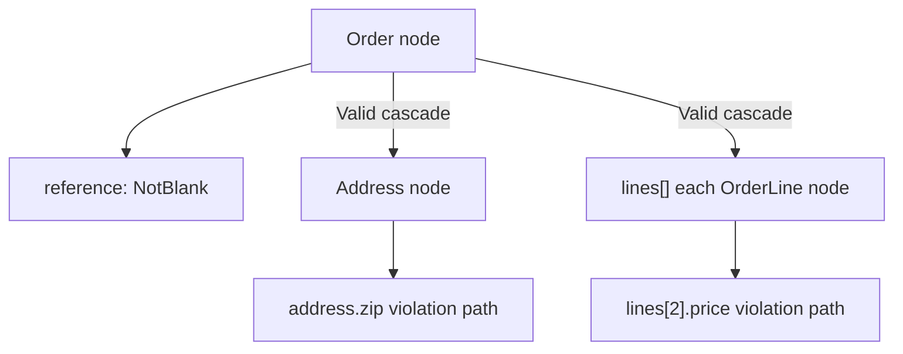

# Validation Scopes

!!! tip "In a nutshell"
    Les constraints s'attachent à trois portées : la propriété, le getter (sa
    valeur de retour) et la classe (l'objet entier, pour les règles inter-champs).
    La règle à mémoriser : un objet imbriqué n'est validé que si sa propriété porte
    `#[Assert\Valid]`.

!!! example "Real-world analogy"
    La portée, c'est **là où pointe le scanner** : sur un seul article
    (propriété), sur ce qu'un capteur calcule à partir du bagage (getter), ou sur
    le bagage entier et la cohérence de son contenu (classe). Et un bagage dans un
    bagage n'est ouvert que s'il porte une étiquette « inspecter le contenu » —
    cette étiquette, c'est `#[Assert\Valid]`.

!!! abstract "Learning objectives"
    À la fin de ce chapitre, vous saurez :

    - [ ] Attacher correctement des constraints aux portées propriété, getter et classe
    - [ ] Propager la validation dans les objets imbriqués et les collections avec `#[Assert\Valid]`
    - [ ] Expliquer comment le validator parcourt un graphe d'objets et construit les chemins de propriété

    **Syllabus:** `Data Validation → Validation scopes & cascading` ·
    **Level:** Advanced / Expert ·
    **Est. time:** 25 min ·
    **Prerequisites:** [Object Validation](object-validation.md)

---

## Theory

Une constraint peut s'attacher à trois **portées** :

| Scope | Attached to | Validates |
|---|---|---|
| **Property** | une propriété (public/protected/private) | la valeur de la propriété |
| **Getter** | une méthode `isX`/`getX`/`hasX` | la valeur de retour de la méthode |
| **Class** | la classe elle-même | l'objet entier (nécessite une constraint à cible classe) |

Les constraints de propriété et de getter visent *une* valeur. Les constraints
au niveau de la classe (p. ex. `#[Assert\Callback]`, `#[Assert\Expression]`, ou
une constraint de classe personnalisée) voient l'objet entier — idéal pour les
règles **inter-champs**.

```php
use Symfony\Component\Validator\Constraints as Assert;
use Symfony\Component\Validator\Context\ExecutionContextInterface;

// Class scope: #[Assert\Expression] sees the whole object (cross-field rule)
#[Assert\Expression('this.start < this.end', message: 'Start must be before end.')]
class Slot
{
    public \DateTimeImmutable $start;
    public \DateTimeImmutable $end;

    // #[Assert\Callback] is also a class-target constraint: plain PHP cross-field logic
    #[Assert\Callback]
    public function check(ExecutionContextInterface $context): void
    {
        if ($this->start >= $this->end) {
            $context->buildViolation('Start must be before end.')->atPath('start')->addViolation();
        }
    }
}
```

!!! question "Predict first"
    Un `Order` possède une `?Address $shippingAddress` dont les propres
    constraints `#[Assert\NotBlank]` ne se déclenchent jamais. Que manque-t-il ?

??? note "Reveal"
    `#[Assert\Valid]` sur la propriété. Les objets imbriqués ne sont pas parcourus
    tant que la propriété n'active pas la cascade ; sans elle, le nœud de
    l'adresse est ignoré.

## Deep Dive — how the validator traverses a graph

Le validator parcourt un objet comme un **graphe de nœuds**. Pour un nœud objet,
il lit la `ClassMetadata` et visite, dans l'ordre : les constraints au niveau de
la classe, puis les constraints de chaque propriété/getter. Chaque violation
enregistre un **chemin de propriété** (`author.email`, `items[0].price`)
construit à partir du nœud où elle s'est produite —
`Symfony\Component\Validator\Context\ExecutionContext` maintient ce chemin via
`getPropertyPath()`.

Les objets imbriqués ne sont **pas** parcourus automatiquement. Pour descendre
dans un objet lié (ou une collection d'objets), vous marquez la propriété avec
`Symfony\Component\Validator\Constraints\Valid`. `Valid` est elle-même une
constraint dont le validator (`ValidValidator`) indique au context de récurser
dans la valeur.

```php
<?php
declare(strict_types=1);

namespace App\Entity;

use Symfony\Component\Validator\Constraints as Assert;

class Order
{
    #[Assert\NotBlank]
    public string $reference = '';

    // Cascade into the Address object so its own constraints run.
    #[Assert\Valid]
    public ?Address $shippingAddress = null;

    // Cascade into every OrderLine in the collection.
    #[Assert\Valid]
    /** @var list<OrderLine> */
    public array $lines = [];
}
```



**Sémantique de la cascade.** `Valid` a une option `traverse` (`true` par
défaut) qui contrôle si un `Traversable` est itéré. Par défaut, chaque élément
d'un tableau ou d'une collection cascadé est validé ; les scalaires de la
collection sont ignorés à moins d'ajouter aussi des constraints d'élément. La
cascade est récursive : un graphe est donc entièrement parcouru — attention aux
cycles (le validator se protège contre la revalidation de la même instance
d'objet au sein d'une même exécution).

```php
use Symfony\Component\Validator\Constraints as Assert;

class Cart
{
    // traverse: true (default) — the Traversable is iterated, each element cascaded
    #[Assert\Valid(traverse: true)]
    public \ArrayObject $lines;

    // traverse: false — the collection object itself is validated, not its elements
    #[Assert\Valid(traverse: false)]
    public \ArrayObject $archivedLines;
}
```

**Les groupes se propagent.** Lors de la cascade, le groupe de validation
*courant* est transmis à l'objet imbriqué (voir [Groups](groups.md)). Surprise
fréquente : l'objet imbriqué est validé dans le groupe que vous exécutez, qui
peut différer de son propre « Default » si vous avez changé de groupes.

!!! note "Source reference"
    `Symfony\Component\Validator\Constraints\Valid` /
    `ValidValidator` et le parcoureur de graphe dans `RecursiveContextualValidator` —
    [symfony/symfony `8.0`](https://github.com/symfony/symfony/blob/8.0/src/Symfony/Component/Validator/Validator/RecursiveContextualValidator.php).

### Null behavior

La cascade est sûre face à null. Une propriété `#[Assert\Valid]` qui vaut `null`
n'est simplement **pas** parcourue — il n'y a rien dans quoi récurser, donc ni
violation ni erreur. Si un objet lié est *requis*, le contrôle de présence et la
cascade sont orthogonaux : protégez la propriété avec `#[Assert\NotNull]` **et**
`#[Assert\Valid]`.

```php
use Symfony\Component\Validator\Constraints as Assert;

class Order
{
    // Valid silently skips null — nothing to recurse into.
    // Presence and cascade are orthogonal: NotNull requires the object,
    // Valid descends into it when it is there.
    #[Assert\NotNull]
    #[Assert\Valid]
    public ?Address $billingAddress = null;
}
```

Pour une collection cascadée, les *éléments* `null` sont visités comme toute
valeur, leurs constraints d'élément s'appliquent donc toujours. Lorsque vous
validez un tableau associatif avec `Collection`, utilisez `Required` vs
`Optional` pour décider si une clé manquante est une erreur. La portée getter a
sa propre subtilité : un getter retournant `null` alimente ses constraints avec
`null`, qu'elles ignorent (sauf `NotNull`/`NotBlank`).

```php
use Symfony\Component\Validator\Constraints as Assert;

class Customer
{
    // Collection: a Required key must exist, an Optional key may be missing
    #[Assert\Collection(fields: [
        'email' => new Assert\Required([new Assert\Email()]),
        'phone' => new Assert\Optional([new Assert\Length(min: 6)]),
    ])]
    public array $contact = [];

    // Getter returning null: Email would skip it, NotNull/NotBlank still fail
    #[Assert\NotNull]
    #[Assert\NotBlank]
    public function getNickname(): ?string
    {
        return null;
    }
}
```

!!! note "Null in real life"
    Un objet imbriqué `null` est une étiquette de bagage sans bagage attaché — le
    contrôle n'a rien à ouvrir, il laisse donc passer, sauf si une règle distincte
    « un bagage doit exister » (`NotNull`) est en place.

## Configuration & code

=== "PHP Attributes"

    ```php
    <?php
    declare(strict_types=1);

    namespace App\Entity;

    use Symfony\Component\Validator\Constraints as Assert;

    #[Assert\Expression(
        expression: 'this.getStart() < this.getEnd()',
        message: 'Start must be before end.',
    )]
    class Booking
    {
        public function __construct(
            private \DateTimeImmutable $start,
            private \DateTimeImmutable $end,
        ) {}

        public function getStart(): \DateTimeImmutable { return $this->start; }
        public function getEnd(): \DateTimeImmutable { return $this->end; }
    }
    ```

=== "YAML"

    ```yaml
    # config/validator/order.yaml
    App\Entity\Order:
        properties:
            reference:
                - NotBlank: ~
            shippingAddress:
                - Valid: ~
            lines:
                - Valid: ~
    ```

=== "Console"

    ```console
    $ php bin/console debug:validator "App\Entity\Order"
    ```

## Best practices & anti-patterns

| ✅ Do | ❌ Avoid |
|---|---|
| Placer les règles inter-champs à la portée classe | Dupliquer une règle sur deux propriétés |
| Ajouter `#[Assert\Valid]` pour descendre dans les relations | Supposer que les objets imbriqués se valident automatiquement |
| Utiliser les constraints de getter pour les invariants calculés | Ajouter une fausse propriété juste pour valider une valeur calculée |
| Garder le graphe d'objets acyclique autant que possible | Des cascades récursives profondes dont vous n'avez pas besoin |

## When (not) to use it / alternatives

Utilisez la **portée classe** dès qu'une règle nécessite deux champs ou plus.
N'utilisez `Valid` que là où vous maîtrisez réellement les constraints de
l'objet imbriqué — cascader dans un graphe énorme à chaque request a un coût.
Pour les collections de scalaires, utilisez `All`
([Built-in Constraints](built-in-constraints.md)) ; `Valid` est pour les
collections d'*objets*.

!!! danger "Certification traps"
    - Les objets imbriqués ne sont **pas** validés à moins que la propriété ne
      porte `#[Assert\Valid]`.
    - Les constraints de getter valident la **valeur de retour**, et le chemin de
      propriété utilise le nom « propriétisé » (`isActive()` → `active`).
    - `Valid` n'est *pas* un groupe et *pas* un moyen de changer de groupes — il ne
      fait que cascader.
    - Les constraints au niveau de la classe exigent que la constraint cible la
      classe (`getTargets()` retourne `CLASS_CONSTRAINT`) ; une constraint à cible
      propriété à la portée classe lance une `ConstraintDefinitionException`.

!!! warning "Common mistakes"
    - Envelopper une collection dans `All([new Valid()])` — pour les collections
      d'objets, un simple `#[Assert\Valid]` sur la propriété cascade dans chaque
      élément.
    - Attendre de `Valid` qu'il *ajoute* des constraints ; il ne fait qu'*exécuter
      celles de l'objet imbriqué*.

## Exercises

1. **(Basic)** Étant donné une `Invoice` avec un `Customer $customer`, faites en
   sorte que le validator descende dans le customer afin que son nom `NotBlank`
   soit vérifié.
2. **(Advanced)** Ajoutez une règle au niveau de la classe à `Invoice` : `total`
   doit être égal à la somme des montants de ses lignes, l'erreur étant rapportée
   sur le chemin `total`.

??? success "Solutions"

    **1.**
    ```php
    #[Assert\Valid]
    public ?Customer $customer = null;
    ```

    **2.** Utilisez un `Callback` au niveau de la classe (voir [Callbacks](callbacks.md)) :
    ```php
    #[Assert\Callback]
    public function validateTotal(ExecutionContextInterface $context): void
    {
        $sum = array_sum(array_map(fn (Line $l) => $l->amount, $this->lines));
        if ($this->total !== $sum) {
            $context->buildViolation('Total mismatch.')
                ->atPath('total')
                ->addViolation();
        }
    }
    ```

## Certification questions

??? question "Q1. What makes the validator recurse into a nested object?"
    - [ ] A. Nothing — it always recurses
    - [x] B. `#[Assert\Valid]` on the property holding it ✅
    - [ ] C. Calling `validateProperty()`
    - [ ] D. A class-level `Valid`

    **Why:** La cascade est un opt-in par propriété via `Valid` ; sinon les objets
    imbriqués sont ignorés.
    **Ref:** [Valid](https://symfony.com/doc/current/reference/constraints/Valid.html).

??? question "Q2. A rule needs to compare two properties of the same object. Best scope?"
    - [ ] A. Property scope on each field
    - [x] B. Class scope (e.g. `Callback`/`Expression`) ✅
    - [ ] C. Getter scope
    - [ ] D. It cannot be done with the validator

    **Why:** Les règles inter-champs ont besoin de l'objet entier ; une constraint
    à cible classe est donc le bon choix.
    **Ref:** [Expression](https://symfony.com/doc/current/reference/constraints/Expression.html).

??? question "Q3. What property path does a violation from `isActive()` use?"
    - [ ] A. `isActive`
    - [x] B. `active` ✅
    - [ ] C. `getActive`
    - [ ] D. The full method name with `()`

    **Why:** Les constraints de getter rapportent sur le nom « propriétisé » ;
    `isActive`/`getActive` correspondent à `active`.
    **Ref:** [Validation — getters](https://symfony.com/doc/current/validation.html).

## Key takeaways

- Trois portées : propriété, getter (valeur de retour), classe (objet entier).
- Les règles inter-champs relèvent de la portée classe.
- Les objets/collections imbriqués ne se valident qu'avec `#[Assert\Valid]`.
- Le groupe cascadé est le groupe *courant* ; `Valid` ne change jamais de
  groupes.

## Last-minute revision

!!! tip "Cheat sheet"
    - Chemin du getter : `isX`/`getX`/`hasX` → `x`.
    - Les constraints de portée classe doivent cibler la classe (`CLASS_CONSTRAINT`).
    - `Valid` = cascade ; `traverse` (true par défaut) contrôle l'itération d'une collection.
    - Collection d'objets → `#[Assert\Valid]` ; collection de scalaires → `All`.

## Connections

- **Depends on:** [Object Validation](object-validation.md) — la portée décide *où* regarde le validator en cours d'exécution.
- **Reused in:** [Callbacks](callbacks.md) — la portée classe est exactement là où vivent les callbacks inter-champs.
- **Confused with:** [Built-in Constraints](built-in-constraints.md) — `Valid` cascade dans les objets ; `All` applique des constraints aux éléments scalaires.

## Official References
- [Official Symfony docs — Validation (scopes)](https://symfony.com/doc/current/validation.html)
- [Symfony source — RecursiveContextualValidator](https://github.com/symfony/symfony/blob/8.0/src/Symfony/Component/Validator/Validator/RecursiveContextualValidator.php)

## Video references

!!! tip "Watch & learn"
    Voici des chaînes vidéo officielles et continuellement mises à jour —
    recherchez-y « Symfony validation » pour consolider ce chapitre. Nous lions des
    chaînes stables plutôt que des vidéos individuelles afin que les références ne
    périment jamais.

    - [SymfonyCasts screencasts](https://symfonycasts.com/tracks/symfony) — tutoriels scénarisés à suivre en codant.
    - [Symfony official YouTube](https://www.youtube.com/@SymfonyOfficial) — conférences et keynotes SymfonyCon.
    - [Official docs for this topic](https://symfony.com/doc/current/reference/constraints/Valid.html) — certaines pages de la doc Symfony intègrent un screencast.

## Confidence check

Je suis prêt quand je peux :

- [ ] expliquer **pourquoi** les règles inter-champs relèvent de la portée classe
- [ ] attacher correctement des constraints de propriété, de getter et de classe dans Symfony 8
- [ ] déboguer des constraints d'objet imbriqué qui ne s'exécutent jamais (`Valid` manquant)
- [ ] repérer le piège du chemin de propriété des getters (`isActive()` → `active`)
- [ ] expliquer comment le validator construit les chemins de propriété en parcourant le graphe

---

<small>Related: [Groups](groups.md) · [Built-in Constraints](built-in-constraints.md) ·
[Callbacks](callbacks.md)</small>
