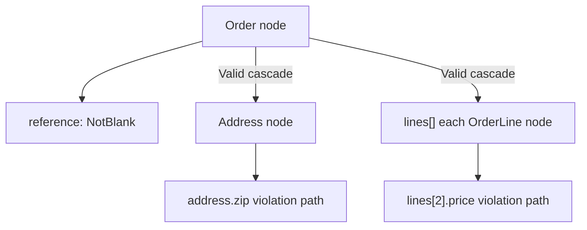

# Validation Scopes

!!! abstract "Learning objectives"
    By the end of this chapter you can:

    - [ ] Attach constraints at property, getter and class scope correctly
    - [ ] Cascade validation into nested objects and collections with `#[Assert\Valid]`
    - [ ] Explain how the validator traverses an object graph and builds property paths

    **Syllabus:** `Data Validation → Validation scopes & cascading` ·
    **Level:** Advanced / Expert ·
    **Est. time:** 25 min ·
    **Prerequisites:** [Object Validation](object-validation.md)

---

## Theory

A constraint can be attached at three **scopes**:

| Scope | Attached to | Validates |
|---|---|---|
| **Property** | a property (public/protected/private) | the property value |
| **Getter** | an `isX`/`getX`/`hasX` method | the method's return value |
| **Class** | the class itself | the whole object (needs a class-target constraint) |

Property and getter constraints target *one* value. Class-level constraints
(e.g. `#[Assert\Callback]`, `#[Assert\Expression]`, or a custom class constraint)
see the whole object — ideal for **cross-field** rules.

## Deep Dive — how the validator traverses a graph

The validator walks an object as a **node graph**. For an object node it reads
`ClassMetadata` and visits, in order: class-level constraints, then each
property/getter's constraints. Every violation records a **property path**
(`author.email`, `items[0].price`) built from the node it occurred on —
`Symfony\Component\Validator\Context\ExecutionContext` maintains this path via
`getPropertyPath()`.

Nested objects are **not** traversed automatically. To descend into a related
object (or a collection of objects) you mark the property with
`Symfony\Component\Validator\Constraints\Valid`. `Valid` is itself a constraint
whose validator (`ValidValidator`) tells the context to recurse into the value.

```php
<?php
declare(strict_types=1);

namespace App\Entity;

use Symfony\Component\Validator\Constraints as Assert;

class Order
{
    #[Assert\NotBlank]
    public string $reference = '';

    // Cascade into the Address object so its own constraints run.
    #[Assert\Valid]
    public ?Address $shippingAddress = null;

    // Cascade into every OrderLine in the collection.
    #[Assert\Valid]
    /** @var list<OrderLine> */
    public array $lines = [];
}
```



**Cascading semantics.** `Valid` has a `traverse` option (default `true`) that
controls whether a `Traversable` is iterated. By default a cascaded array/
collection has each element validated; scalars in the collection are ignored
unless you also add element constraints. Cascading is recursive, so a graph is
fully walked — mind cycles (the validator guards against re-validating the same
object instance within one run).

**Groups propagate.** When you cascade, the *current* validation group is passed
to the nested object (see [Groups](groups.md)). A common surprise: the nested
object is validated in the group you are running, which may differ from its own
"Default" if you changed groups.

!!! note "Source reference"
    `Symfony\Component\Validator\Constraints\Valid` /
    `ValidValidator` and the graph walker in `RecursiveContextualValidator` —
    [symfony/symfony `8.0`](https://github.com/symfony/symfony/blob/8.0/src/Symfony/Component/Validator/Validator/RecursiveContextualValidator.php).

## Configuration & code

=== "PHP Attributes"

    ```php
    <?php
    declare(strict_types=1);

    namespace App\Entity;

    use Symfony\Component\Validator\Constraints as Assert;

    #[Assert\Expression(
        expression: 'this.getStart() < this.getEnd()',
        message: 'Start must be before end.',
    )]
    class Booking
    {
        public function __construct(
            private \DateTimeImmutable $start,
            private \DateTimeImmutable $end,
        ) {}

        public function getStart(): \DateTimeImmutable { return $this->start; }
        public function getEnd(): \DateTimeImmutable { return $this->end; }
    }
    ```

=== "YAML"

    ```yaml
    # config/validator/order.yaml
    App\Entity\Order:
        properties:
            reference:
                - NotBlank: ~
            shippingAddress:
                - Valid: ~
            lines:
                - Valid: ~
    ```

=== "Console"

    ```console
    $ php bin/console debug:validator "App\Entity\Order"
    ```

## Best practices & anti-patterns

| ✅ Do | ❌ Avoid |
|---|---|
| Put cross-field rules at class scope | Duplicating a rule across two properties |
| Add `#[Assert\Valid]` to descend into relations | Assuming nested objects validate automatically |
| Use getter constraints for computed invariants | Adding a fake property just to validate a computed value |
| Keep the object graph acyclic where possible | Deep recursive cascades you don't need |

## When (not) to use it / alternatives

Use **class scope** whenever a rule needs two or more fields. Use `Valid` only
where you actually own the nested object's constraints — cascading into a huge
graph on every request has a cost. For collections of scalars use `All`
([Built-in Constraints](built-in-constraints.md)); `Valid` is for collections of
*objects*.

!!! danger "Certification traps"
    - Nested objects are **not** validated unless the property has
      `#[Assert\Valid]`.
    - Getter constraints validate the **return value**, and the property path uses
      the property-ised name (`isActive()` → `active`).
    - `Valid` is *not* a group and *not* a way to change groups — it only cascades.
    - Class-level constraints require the constraint to target the class
      (`getTargets()` returns `CLASS_CONSTRAINT`); a property-target constraint at
      class scope throws a `ConstraintDefinitionException`.

!!! warning "Common mistakes"
    - Wrapping a collection as `All([new Valid()])` — for object collections just
      `#[Assert\Valid]` on the property cascades into each element.
    - Expecting `Valid` to *add* constraints; it only *runs the nested object's own*.

## Exercises

1. **(Basic)** Given `Invoice` with a `Customer $customer`, make the validator
   descend into the customer so its `NotBlank` name is checked.
2. **(Advanced)** Add a class-level rule to `Invoice` that `total` must equal the
   sum of its line amounts, reporting the error on the `total` path.

??? success "Solutions"

    **1.**
    ```php
    #[Assert\Valid]
    public ?Customer $customer = null;
    ```

    **2.** Use a class-level `Callback` (see [Callbacks](callbacks.md)):
    ```php
    #[Assert\Callback]
    public function validateTotal(ExecutionContextInterface $context): void
    {
        $sum = array_sum(array_map(fn (Line $l) => $l->amount, $this->lines));
        if ($this->total !== $sum) {
            $context->buildViolation('Total mismatch.')
                ->atPath('total')
                ->addViolation();
        }
    }
    ```

## Certification questions

??? question "Q1. What makes the validator recurse into a nested object?"
    - [ ] A. Nothing — it always recurses
    - [x] B. `#[Assert\Valid]` on the property holding it ✅
    - [ ] C. Calling `validateProperty()`
    - [ ] D. A class-level `Valid`

    **Why:** Cascading is opt-in per property via `Valid`; otherwise nested objects
    are ignored.
    **Ref:** [Valid](https://symfony.com/doc/current/reference/constraints/Valid.html).

??? question "Q2. A rule needs to compare two properties of the same object. Best scope?"
    - [ ] A. Property scope on each field
    - [x] B. Class scope (e.g. `Callback`/`Expression`) ✅
    - [ ] C. Getter scope
    - [ ] D. It cannot be done with the validator

    **Why:** Cross-field rules need the whole object, so a class-target constraint
    is correct.
    **Ref:** [Expression](https://symfony.com/doc/current/reference/constraints/Expression.html).

??? question "Q3. What property path does a violation from `isActive()` use?"
    - [ ] A. `isActive`
    - [x] B. `active` ✅
    - [ ] C. `getActive`
    - [ ] D. The full method name with `()`

    **Why:** Getter constraints report on the property-ised name; `isActive`/`getActive`
    map to `active`.
    **Ref:** [Validation — getters](https://symfony.com/doc/current/validation.html).

## Key takeaways

- Three scopes: property, getter (return value), class (whole object).
- Cross-field rules belong at class scope.
- Nested objects/collections validate only with `#[Assert\Valid]`.
- The cascaded group is the *current* group; `Valid` never changes groups.

## Last-minute revision

!!! tip "Cheat sheet"
    - Getter path: `isX`/`getX`/`hasX` → `x`.
    - Class-scope constraints must target the class (`CLASS_CONSTRAINT`).
    - `Valid` = cascade; `traverse` (default true) controls iterating a collection.
    - Object collection → `#[Assert\Valid]`; scalar collection → `All`.

## References

- [Official Symfony docs — Validation (scopes)](https://symfony.com/doc/current/validation.html)
- [Symfony source — RecursiveContextualValidator](https://github.com/symfony/symfony/blob/8.0/src/Symfony/Component/Validator/Validator/RecursiveContextualValidator.php)

---

<small>Related: [Groups](groups.md) · [Built-in Constraints](built-in-constraints.md) ·
[Callbacks](callbacks.md)</small>
