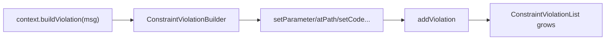

# Violations Builder

!!! tip "In a nutshell"
    À l'intérieur d'un validator ou d'un callback, vous créez les erreurs avec
    `$context->buildViolation(...)` — un builder fluide qui n'enregistre rien tant
    que vous n'appelez pas `addViolation()`. Les appelants relisent les erreurs
    depuis une `ConstraintViolationList`, Countable et itérable.

!!! example "Real-world analogy"
    Le violations builder est le **formulaire de rapport d'incident**. L'agent
    remplit les champs — quel article, l'objet incriminé, un code de référence —
    mais rien n'est consigné tant qu'il n'appuie pas sur « soumettre »
    (`addViolation()`). Plus tard, les superviseurs relisent la pile de rapports
    déposés (la `ConstraintViolationList`).

!!! abstract "Learning objectives"
    À la fin de ce chapitre, vous saurez :

    - [ ] Construire une violation avec `buildViolation()` et ses setters fluides
    - [ ] Attribuer une erreur avec `atPath`, `setInvalidValue`, `setParameter`, `setCode`
    - [ ] Lire une `ConstraintViolationList` et chaque `ConstraintViolationInterface`

    **Syllabus:** `Data Validation → Violations & the execution context` ·
    **Level:** Expert ·
    **Est. time:** 22 min ·
    **Prerequisites:** [Custom Constraints](custom-constraints.md)

---

## Pour les nuls

### L'idée en une phrase
Le constructeur de violations n'enregistre **rien** tant que tu n'appelles pas explicitement `addViolation()` à la fin.

### Imagine dans la vraie vie
Le constructeur de violations est le **formulaire de déclaration d'incident**. L'agent remplit les champs — quel objet, la valeur fautive, un code de référence — mais rien n'est enregistré tant qu'il n'appuie pas sur "soumettre" (`addViolation()`).

### Dans Symfony
```php
$context->buildViolation('Le %champ% ne peut pas être négatif.')
    ->setParameter('%champ%', 'stock')
    ->addViolation(); // RIEN n'est enregistré avant cet appel
```

### Exemple simple
```php
$context->buildViolation('Erreur.')->atPath('email')->addViolation();
```

### Comment le mémoriser 🧠
Oublier `->addViolation()` à la fin de la chaîne fait échouer silencieusement ta validation personnalisée — le builder reste "en brouillon" sans jamais être soumis.

Validation produces **violations**. Inside a validator or callback you create
them through the `Symfony\Component\Validator\Context\ExecutionContextInterface`;
callers read them back from a
`Symfony\Component\Validator\ConstraintViolationListInterface`. Understanding
both ends is essential for custom constraints and API error responses.

```php
// Producer side — inside a validator/callback, via the ExecutionContextInterface
$this->context->buildViolation('Invalid SKU.')->addViolation();

// Consumer side — read the ConstraintViolationListInterface back
$violations = $validator->validate($product);
foreach ($violations as $violation) {
    echo $violation->getMessage();
}
```

!!! question "Predict first"
    A custom validator calls `$this->context->buildViolation('Bad SKU')` and sets a
    few parameters, but the field always validates. What is wrong?

??? note "Reveal"
    It never calls `addViolation()`. The builder records nothing until you commit
    with `addViolation()` — the missing terminal call silently passes the value.


## Theory

La validation produit des **violations**. À l'intérieur d'un validator ou d'un
callback, vous les créez via
`Symfony\Component\Validator\Context\ExecutionContextInterface` ; les appelants
les relisent depuis une
`Symfony\Component\Validator\ConstraintViolationListInterface`. Comprendre les
deux extrémités est essentiel pour les constraints personnalisées et les
réponses d'erreur d'API.

```php
// Producer side — inside a validator/callback, via the ExecutionContextInterface
$this->context->buildViolation('Invalid SKU.')->addViolation();

// Consumer side — read the ConstraintViolationListInterface back
$violations = $validator->validate($product);
foreach ($violations as $violation) {
    echo $violation->getMessage();
}
```

!!! question "Predict first"
    Un validator personnalisé appelle `$this->context->buildViolation('Bad SKU')`
    et définit quelques paramètres, mais le champ passe toujours la validation.
    Qu'est-ce qui cloche ?

??? note "Reveal"
    Il n'appelle jamais `addViolation()`. Le builder n'enregistre rien tant que
    vous ne validez pas avec `addViolation()` — l'appel terminal manquant laisse
    passer la valeur en silence.

## Deep Dive — building a violation

`ExecutionContextInterface::buildViolation(string $message, array $parameters = [])`
retourne un
`Symfony\Component\Validator\Violation\ConstraintViolationBuilderInterface`
— un builder fluide. Rien n'est enregistré tant que vous n'appelez pas
`addViolation()`.

```php
<?php
declare(strict_types=1);

use Symfony\Component\Validator\Constraint;
use Symfony\Component\Validator\ConstraintValidator;

final class SkuValidator extends ConstraintValidator
{
    public function validate(mixed $value, Constraint $constraint): void
    {
        if (\is_string($value) && !str_starts_with($value, 'SKU-')) {
            $this->context->buildViolation('"{{ sku }}" must start with SKU-.')
                ->setParameter('{{ sku }}', $this->formatValue($value))
                ->setInvalidValue($value)
                ->setCode('a1b2c3')
                ->atPath('code')
                ->addViolation();
        }
    }
}
```

Méthodes du builder à connaître :

| Method | Effect |
|---|---|
| `setParameter($key, $value)` / `setParameters([])` | les placeholders du message (`{{ x }}`) |
| `atPath($path)` | rattacher l'erreur à un autre chemin de propriété |
| `setInvalidValue($value)` | la valeur présentée comme fautive |
| `setCode($code)` | un code machine stable pour la violation |
| `setPlural($number)` | sélectionner un message au pluriel |
| `setTranslationDomain($domain)` | remplacer le domaine de traduction |
| `setCause($cause)` | attacher un objet cause sous-jacent |
| `addViolation()` | **valider** — sans lui rien ne se passe |

`$this->context->addViolation($message, $params)` est un raccourci pour le cas
courant (sans setters supplémentaires). Le context expose aussi des accesseurs
de lecture : `getObject()`, `getRoot()`, `getValue()`, `getPropertyPath()`,
`getGroup()`, `getClassName()`, `getConstraint()` et `getViolations()`.

```php
// Shortcut: build + commit in one call (no extra setters)
$this->context->addViolation('Invalid value.', ['{{ value }}' => 'x']);

// Read helpers on the ExecutionContext
$this->context->getObject();       // object owning the validated property
$this->context->getRoot();         // value originally passed to validate()
$this->context->getValue();        // value currently being validated
$this->context->getPropertyPath(); // e.g. "items[0].price"
$this->context->getGroup();        // active validation group, e.g. "Default"
$this->context->getClassName();    // class of the current object
$this->context->getConstraint();   // constraint being validated
$this->context->getViolations();   // violations collected so far
```



### Reading the list

`validate()` retourne une `ConstraintViolationListInterface`, qui est
`\Countable`, `\IteratorAggregate` et `\ArrayAccess`. Chaque élément est une
`Symfony\Component\Validator\ConstraintViolationInterface` :

```php
<?php
declare(strict_types=1);

use Symfony\Component\Validator\ConstraintViolationListInterface;

function toArray(ConstraintViolationListInterface $violations): array
{
    $errors = [];
    foreach ($violations as $violation) {
        $errors[] = [
            'path'    => $violation->getPropertyPath(),   // e.g. "code"
            'message' => $violation->getMessage(),        // interpolated
            'code'    => $violation->getCode(),           // "a1b2c3"
            'invalid' => $violation->getInvalidValue(),
        ];
    }
    return $errors;
}
```

Lectures utiles sur une violation : `getMessage()`, `getMessageTemplate()`
(avant interpolation), `getParameters()`, `getPropertyPath()`,
`getInvalidValue()`, `getCode()`, `getConstraint()`, `getRoot()`, `getCause()`.
La liste prend aussi en charge `findByCodes()` pour filtrer par code, et
`__toString()` pour un affichage lisible.

```php
$violation = $violations->get(0);
$violation->getMessage();         // '"X-1" must start with SKU-.' (interpolated)
$violation->getMessageTemplate(); // '"{{ sku }}" must start with SKU-.' (raw)
$violation->getParameters();      // ['{{ sku }}' => '"X-1"']
$violation->getPropertyPath();    // 'code'
$violation->getInvalidValue();    // 'X-1'
$violation->getCode();            // 'a1b2c3'
$violation->getConstraint();      // the constraint instance
$violation->getRoot();            // the object originally validated
$violation->getCause();           // whatever setCause() attached, or null

$violations->findByCodes('a1b2c3'); // sub-list filtered by code
echo (string) $violations;          // readable dump via __toString()
```

!!! note "Source reference"
    `Symfony\Component\Validator\Violation\ConstraintViolationBuilderInterface`
    et `ConstraintViolationList` —
    [symfony/symfony `8.0`](https://github.com/symfony/symfony/blob/8.0/src/Symfony/Component/Validator/Violation/ConstraintViolationBuilderInterface.php).

## Configuration & code

=== "Build inside a validator"

    ```php
    <?php
    declare(strict_types=1);

    // Inside ConstraintValidator::validate()
    $this->context->buildViolation($constraint->message)
        ->setParameter('{{ value }}', $this->formatValue($value))
        ->setInvalidValue($value)
        ->atPath('slug')
        ->setCode(MyConstraint::INVALID_SLUG_ERROR)
        ->addViolation();
    ```

=== "Read in a controller"

    ```php
    <?php
    declare(strict_types=1);

    use Symfony\Component\HttpFoundation\JsonResponse;
    use Symfony\Component\Validator\Validator\ValidatorInterface;

    function apiValidate(ValidatorInterface $validator, object $dto): JsonResponse
    {
        $violations = $validator->validate($dto);
        if (\count($violations) > 0) {
            $errors = [];
            foreach ($violations as $v) {
                $errors[$v->getPropertyPath()][] = $v->getMessage();
            }
            return new JsonResponse(['errors' => $errors], 422);
        }
        return new JsonResponse(['status' => 'ok']);
    }
    ```

## Best practices & anti-patterns

| ✅ Do | ❌ Avoid |
|---|---|
| Utiliser `{{ placeholder }}` + `setParameter` | Concaténer les valeurs dans la chaîne du message |
| `setInvalidValue()` pour une bonne UX d'erreur | Omettre la valeur invalide |
| Donner des valeurs `setCode()` stables sous forme de constantes | S'appuyer sur le texte traduit du message dans le code |
| Itérer la liste ; utiliser `getPropertyPath()` | Convertir la liste en chaîne pour de vraies UI |

## When (not) to use it / alternatives

Vous construisez des violations dans les
[constraints personnalisées](custom-constraints.md) et les
[callbacks](callbacks.md). Les consommateurs se contentent en général de
**lire** la liste — souvent indirectement : les [Forms](../forms/handling.md)
remappent les violations sur les champs du form, et les value resolvers d'API
les transforment automatiquement en `422`. Ne manipulez la liste brute que
lorsque vous affichez les erreurs vous-même.

!!! danger "Certification traps"
    - `buildViolation()` n'enregistre **rien** tant que `addViolation()` n'est pas
      appelé.
    - `getMessage()` est interpolé ; `getMessageTemplate()` conserve les
      placeholders bruts — l'examen distingue les deux.
    - Les placeholders des messages utilisent `{{ name }}` et sont remplis par
      `setParameter`.
    - `atPath()` **ajoute** au chemin de propriété courant relativement au nœud ;
      il ne réinitialise pas la racine.
    - La liste de violations est un **objet** (Countable/itérable), jamais un
      simple tableau — vérifiez avec `count()`.

!!! warning "Common mistakes"
    - Oublier `addViolation()`, si bien qu'un validator passe en silence.
    - Construire le message avec la valeur intégrée en dur, cassant la traduction.

## Exercises

1. **(Basic)** Dans un validator, ajoutez une violation pour une `color`
   invalide qui inclut la valeur fautive via un placeholder `{{ value }}` et un
   code `INVALID_COLOR`.
2. **(Advanced)** À partir d'une `ConstraintViolationList`, construisez un
   tableau associatif `propertyPath => [messages]` et comptez le total de
   violations.

??? success "Solutions"

    **1.**
    ```php
    $this->context->buildViolation('"{{ value }}" is not a valid color.')
        ->setParameter('{{ value }}', $this->formatValue($value))
        ->setInvalidValue($value)
        ->setCode('INVALID_COLOR')
        ->addViolation();
    ```

    **2.**
    ```php
    $out = [];
    foreach ($violations as $v) {
        $out[$v->getPropertyPath()][] = $v->getMessage();
    }
    $total = \count($violations);
    ```

## Certification questions

??? question "Q1. When is a built violation actually recorded?"
    - [ ] A. Immediately on `buildViolation()`
    - [x] B. Only when `addViolation()` is called ✅
    - [ ] C. When the validator returns
    - [ ] D. On `setParameter()`

    **Why:** Le builder est fluide ; `addViolation()` valide l'ajout dans la liste.
    **Ref:** [Custom constraint](https://symfony.com/doc/8.0/validation/custom_constraint.html).

??? question "Q2. Which returns the message with placeholders still unresolved?"
    - [ ] A. `getMessage()`
    - [x] B. `getMessageTemplate()` ✅
    - [ ] C. `getParameters()`
    - [ ] D. `getCode()`

    **Why:** `getMessage()` est interpolé ; `getMessageTemplate()` conserve les
    placeholders `{{ x }}`.
    **Ref:** [ConstraintViolationInterface](https://symfony.com/doc/8.0/validation.html).

??? question "Q3. `validate()` returns a value that is…"
    - [ ] A. A plain PHP array of strings
    - [x] B. A `ConstraintViolationListInterface` (Countable & iterable) ✅
    - [ ] C. `null` when valid
    - [ ] D. A boolean

    **Why:** C'est toujours un objet liste de violations ; itérez-le ou appelez
    `count()`.
    **Ref:** [Validation](https://symfony.com/doc/8.0/validation.html).

??? question "Q4. To attach an error to a different property you call…"
    - [ ] A. `setPropertyPath()`
    - [x] B. `atPath()` on the builder ✅
    - [ ] C. `setInvalidValue()`
    - [ ] D. `setCode()`

    **Why:** `atPath()` déplace la violation vers le chemin donné relativement au
    nœud courant.
    **Ref:** [Custom constraint](https://symfony.com/doc/8.0/validation/custom_constraint.html).

## Key takeaways

- `buildViolation()` → builder fluide ; validez avec `addViolation()`.
- Setters : `setParameter`, `atPath`, `setInvalidValue`, `setCode`, `setPlural`.
- `getMessage()` (interpolé) vs `getMessageTemplate()` (brut).
- Le résultat est une `ConstraintViolationListInterface` Countable et itérable.

## Last-minute revision

!!! tip "Cheat sheet"
    - `$this->context->buildViolation($msg)->setParameter('{{ x }}', $v)->addViolation();`
    - Raccourci : `$this->context->addViolation($msg, $params)`.
    - Lecture : `getPropertyPath()`, `getMessage()`, `getCode()`, `getInvalidValue()`.
    - Liste : `count()`, `foreach`, `findByCodes()`, `__toString()`.

## Connections

- **Depends on:** [Custom Constraints](custom-constraints.md) — vous construisez les violations à l'intérieur d'un `ConstraintValidator`.
- **Reused in:** [Form Handling](../forms/handling.md) — les forms remappent les violations résultantes sur les champs.
- **Confused with:** [Callbacks](callbacks.md) — même API `ExecutionContext`, point d'entrée différent.

## Official References
- [Official Symfony docs — Custom constraint (violations)](https://symfony.com/doc/8.0/validation/custom_constraint.html)
- [Symfony source — ConstraintViolationBuilderInterface](https://github.com/symfony/symfony/blob/8.0/src/Symfony/Component/Validator/Violation/ConstraintViolationBuilderInterface.php)

## Video references

!!! tip "Watch & learn"
    Voici des chaînes vidéo officielles et continuellement mises à jour —
    recherchez-y « Symfony validation » pour consolider ce chapitre. Nous lions des
    chaînes stables plutôt que des vidéos individuelles afin que les références ne
    périment jamais.

    - [SymfonyCasts screencasts](https://symfonycasts.com/tracks/symfony) — tutoriels scénarisés à suivre en codant.
    - [Symfony official YouTube](https://www.youtube.com/@SymfonyOfficial) — conférences et keynotes SymfonyCon.
    - [Official docs for this topic](https://symfony.com/doc/8.0/validation/custom_constraint.html) — certaines pages de la doc Symfony intègrent un screencast.

## Confidence check

Je suis prêt quand je peux :

- [ ] expliquer **pourquoi** le builder diffère l'enregistrement jusqu'à la validation par `addViolation()`
- [ ] construire et lire des violations avec l'API fluide dans Symfony 8
- [ ] déboguer un validator qui passe en silence parce que `addViolation()` a été omis
- [ ] repérer le piège `getMessage()` vs `getMessageTemplate()`
- [ ] expliquer comment `atPath()` s'ajoute au chemin de propriété courant

---

<small>Related: [Custom Constraints](custom-constraints.md) · [Callbacks](callbacks.md) ·
[Form Handling](../forms/handling.md)</small>
