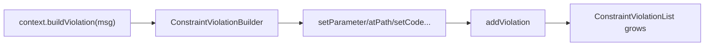

# Violations Builder

!!! tip "In a nutshell"
    Inside a validator or callback you create errors with
    `$context->buildViolation(...)` — a fluent builder that records nothing until
    you call `addViolation()`. Callers read the errors back from a Countable,
    iterable `ConstraintViolationList`.

!!! example "Real-world analogy"
    The violations builder is the **incident report form**. The officer fills in
    the fields — which item, the offending object, a reference code — but nothing
    is logged until they hit "submit" (`addViolation()`). Later, supervisors read
    back the stack of filed reports (the `ConstraintViolationList`).

!!! abstract "Learning objectives"
    By the end of this chapter you can:

    - [ ] Build a violation with `buildViolation()` and its fluent setters
    - [ ] Attribute an error with `atPath`, `setInvalidValue`, `setParameter`, `setCode`
    - [ ] Read a `ConstraintViolationList` and each `ConstraintViolationInterface`

    **Syllabus:** `Data Validation → Violations & the execution context` ·
    **Level:** Expert ·
    **Est. time:** 22 min ·
    **Prerequisites:** [Custom Constraints](custom-constraints.md)

---

## Theory

Validation produces **violations**. Inside a validator or callback you create
them through the `Symfony\Component\Validator\Context\ExecutionContextInterface`;
callers read them back from a
`Symfony\Component\Validator\ConstraintViolationListInterface`. Understanding
both ends is essential for custom constraints and API error responses.

```php
// Producer side — inside a validator/callback, via the ExecutionContextInterface
$this->context->buildViolation('Invalid SKU.')->addViolation();

// Consumer side — read the ConstraintViolationListInterface back
$violations = $validator->validate($product);
foreach ($violations as $violation) {
    echo $violation->getMessage();
}
```

!!! question "Predict first"
    A custom validator calls `$this->context->buildViolation('Bad SKU')` and sets a
    few parameters, but the field always validates. What is wrong?

??? note "Reveal"
    It never calls `addViolation()`. The builder records nothing until you commit
    with `addViolation()` — the missing terminal call silently passes the value.

## Deep Dive — building a violation

`ExecutionContextInterface::buildViolation(string $message, array $parameters = [])`
returns a `Symfony\Component\Validator\Violation\ConstraintViolationBuilderInterface`
— a fluent builder. Nothing is recorded until you call `addViolation()`.

```php
<?php
declare(strict_types=1);

use Symfony\Component\Validator\Constraint;
use Symfony\Component\Validator\ConstraintValidator;

final class SkuValidator extends ConstraintValidator
{
    public function validate(mixed $value, Constraint $constraint): void
    {
        if (\is_string($value) && !str_starts_with($value, 'SKU-')) {
            $this->context->buildViolation('"{{ sku }}" must start with SKU-.')
                ->setParameter('{{ sku }}', $this->formatValue($value))
                ->setInvalidValue($value)
                ->setCode('a1b2c3')
                ->atPath('code')
                ->addViolation();
        }
    }
}
```

Builder methods worth knowing:

| Method | Effect |
|---|---|
| `setParameter($key, $value)` / `setParameters([])` | placeholders in the message (`{{ x }}`) |
| `atPath($path)` | attach the error to another property path |
| `setInvalidValue($value)` | the value shown as offending |
| `setCode($code)` | a stable machine code for the violation |
| `setPlural($number)` | select a pluralised message |
| `setTranslationDomain($domain)` | override the translation domain |
| `setCause($cause)` | attach an underlying cause object |
| `addViolation()` | **commit** — without it nothing happens |

`$this->context->addViolation($message, $params)` is a shortcut for the common
case (no extra setters). The context also exposes read helpers: `getObject()`,
`getRoot()`, `getValue()`, `getPropertyPath()`, `getGroup()`, `getClassName()`,
`getConstraint()` and `getViolations()`.

```php
// Shortcut: build + commit in one call (no extra setters)
$this->context->addViolation('Invalid value.', ['{{ value }}' => 'x']);

// Read helpers on the ExecutionContext
$this->context->getObject();       // object owning the validated property
$this->context->getRoot();         // value originally passed to validate()
$this->context->getValue();        // value currently being validated
$this->context->getPropertyPath(); // e.g. "items[0].price"
$this->context->getGroup();        // active validation group, e.g. "Default"
$this->context->getClassName();    // class of the current object
$this->context->getConstraint();   // constraint being validated
$this->context->getViolations();   // violations collected so far
```



### Reading the list

`validate()` returns a `ConstraintViolationListInterface`, which is
`\Countable`, `\IteratorAggregate` and `\ArrayAccess`. Each element is a
`Symfony\Component\Validator\ConstraintViolationInterface`:

```php
<?php
declare(strict_types=1);

use Symfony\Component\Validator\ConstraintViolationListInterface;

function toArray(ConstraintViolationListInterface $violations): array
{
    $errors = [];
    foreach ($violations as $violation) {
        $errors[] = [
            'path'    => $violation->getPropertyPath(),   // e.g. "code"
            'message' => $violation->getMessage(),        // interpolated
            'code'    => $violation->getCode(),           // "a1b2c3"
            'invalid' => $violation->getInvalidValue(),
        ];
    }
    return $errors;
}
```

Useful reads on a violation: `getMessage()`, `getMessageTemplate()` (before
interpolation), `getParameters()`, `getPropertyPath()`, `getInvalidValue()`,
`getCode()`, `getConstraint()`, `getRoot()`, `getCause()`. The list also supports
`findByCodes()` to filter by code, and `__toString()` for a readable dump.

```php
$violation = $violations->get(0);
$violation->getMessage();         // '"X-1" must start with SKU-.' (interpolated)
$violation->getMessageTemplate(); // '"{{ sku }}" must start with SKU-.' (raw)
$violation->getParameters();      // ['{{ sku }}' => '"X-1"']
$violation->getPropertyPath();    // 'code'
$violation->getInvalidValue();    // 'X-1'
$violation->getCode();            // 'a1b2c3'
$violation->getConstraint();      // the constraint instance
$violation->getRoot();            // the object originally validated
$violation->getCause();           // whatever setCause() attached, or null

$violations->findByCodes('a1b2c3'); // sub-list filtered by code
echo (string) $violations;          // readable dump via __toString()
```

!!! note "Source reference"
    `Symfony\Component\Validator\Violation\ConstraintViolationBuilderInterface`
    and `ConstraintViolationList` —
    [symfony/symfony `8.0`](https://github.com/symfony/symfony/blob/8.0/src/Symfony/Component/Validator/Violation/ConstraintViolationBuilderInterface.php).

## Configuration & code

=== "Build inside a validator"

    ```php
    <?php
    declare(strict_types=1);

    // Inside ConstraintValidator::validate()
    $this->context->buildViolation($constraint->message)
        ->setParameter('{{ value }}', $this->formatValue($value))
        ->setInvalidValue($value)
        ->atPath('slug')
        ->setCode(MyConstraint::INVALID_SLUG_ERROR)
        ->addViolation();
    ```

=== "Read in a controller"

    ```php
    <?php
    declare(strict_types=1);

    use Symfony\Component\HttpFoundation\JsonResponse;
    use Symfony\Component\Validator\Validator\ValidatorInterface;

    function apiValidate(ValidatorInterface $validator, object $dto): JsonResponse
    {
        $violations = $validator->validate($dto);
        if (\count($violations) > 0) {
            $errors = [];
            foreach ($violations as $v) {
                $errors[$v->getPropertyPath()][] = $v->getMessage();
            }
            return new JsonResponse(['errors' => $errors], 422);
        }
        return new JsonResponse(['status' => 'ok']);
    }
    ```

## Best practices & anti-patterns

| ✅ Do | ❌ Avoid |
|---|---|
| Use `{{ placeholder }}` + `setParameter` | Concatenating values into the message string |
| `setInvalidValue()` for good error UX | Leaving the invalid value out |
| Give stable `setCode()` values as constants | Relying on translated message text in code |
| Iterate the list; use `getPropertyPath()` | Casting the list to string for real UIs |

## When (not) to use it / alternatives

You build violations inside [custom constraints](custom-constraints.md) and
[callbacks](callbacks.md). Consumers usually **read** the list — often indirectly:
[Forms](../forms/handling.md) map violations back to form fields, and API
argument resolvers turn them into a `422` automatically. Reach for the raw list
only when you render errors yourself.

!!! danger "Certification traps"
    - `buildViolation()` records **nothing** until `addViolation()` is called.
    - `getMessage()` is interpolated; `getMessageTemplate()` keeps the raw
      placeholders — the exam distinguishes these.
    - Message placeholders use `{{ name }}` and are filled by `setParameter`.
    - `atPath()` **appends** to the current property path relative to the node;
      it does not reset the root.
    - The violation list is an **object** (Countable/Iterable), never a plain
      array — check `count()`.

!!! warning "Common mistakes"
    - Forgetting `addViolation()`, so a validator silently passes.
    - Building the message with the value inlined, breaking translation.

## Exercises

1. **(Basic)** In a validator, add a violation for an invalid `color` that
   includes the offending value via a `{{ value }}` placeholder and a code
   `INVALID_COLOR`.
2. **(Advanced)** Given a `ConstraintViolationList`, build an associative array of
   `propertyPath => [messages]` and count total violations.

??? success "Solutions"

    **1.**
    ```php
    $this->context->buildViolation('"{{ value }}" is not a valid color.')
        ->setParameter('{{ value }}', $this->formatValue($value))
        ->setInvalidValue($value)
        ->setCode('INVALID_COLOR')
        ->addViolation();
    ```

    **2.**
    ```php
    $out = [];
    foreach ($violations as $v) {
        $out[$v->getPropertyPath()][] = $v->getMessage();
    }
    $total = \count($violations);
    ```

## Certification questions

??? question "Q1. When is a built violation actually recorded?"
    - [ ] A. Immediately on `buildViolation()`
    - [x] B. Only when `addViolation()` is called ✅
    - [ ] C. When the validator returns
    - [ ] D. On `setParameter()`

    **Why:** The builder is fluent; `addViolation()` commits it to the list.
    **Ref:** [Custom constraint](https://symfony.com/doc/8.0/validation/custom_constraint.html).

??? question "Q2. Which returns the message with placeholders still unresolved?"
    - [ ] A. `getMessage()`
    - [x] B. `getMessageTemplate()` ✅
    - [ ] C. `getParameters()`
    - [ ] D. `getCode()`

    **Why:** `getMessage()` is interpolated; `getMessageTemplate()` keeps `{{ x }}`
    placeholders.
    **Ref:** [ConstraintViolationInterface](https://symfony.com/doc/8.0/validation.html).

??? question "Q3. `validate()` returns a value that is…"
    - [ ] A. A plain PHP array of strings
    - [x] B. A `ConstraintViolationListInterface` (Countable & iterable) ✅
    - [ ] C. `null` when valid
    - [ ] D. A boolean

    **Why:** It is always a violation list object; iterate it or call `count()`.
    **Ref:** [Validation](https://symfony.com/doc/8.0/validation.html).

??? question "Q4. To attach an error to a different property you call…"
    - [ ] A. `setPropertyPath()`
    - [x] B. `atPath()` on the builder ✅
    - [ ] C. `setInvalidValue()`
    - [ ] D. `setCode()`

    **Why:** `atPath()` relocates the violation to the given path relative to the
    current node.
    **Ref:** [Custom constraint](https://symfony.com/doc/8.0/validation/custom_constraint.html).

## Key takeaways

- `buildViolation()` → fluent builder; commit with `addViolation()`.
- Setters: `setParameter`, `atPath`, `setInvalidValue`, `setCode`, `setPlural`.
- `getMessage()` (interpolated) vs `getMessageTemplate()` (raw).
- The result is a Countable/iterable `ConstraintViolationListInterface`.

## Last-minute revision

!!! tip "Cheat sheet"
    - `$this->context->buildViolation($msg)->setParameter('{{ x }}', $v)->addViolation();`
    - Shortcut: `$this->context->addViolation($msg, $params)`.
    - Read: `getPropertyPath()`, `getMessage()`, `getCode()`, `getInvalidValue()`.
    - List: `count()`, `foreach`, `findByCodes()`, `__toString()`.

## Connections

- **Depends on:** [Custom Constraints](custom-constraints.md) — you build violations inside a `ConstraintValidator`.
- **Reused in:** [Form Handling](../forms/handling.md) — forms map the resulting violations back onto fields.
- **Confused with:** [Callbacks](callbacks.md) — same `ExecutionContext` API, different entry point.

## Official References
- [Official Symfony docs — Custom constraint (violations)](https://symfony.com/doc/8.0/validation/custom_constraint.html)
- [Symfony source — ConstraintViolationBuilderInterface](https://github.com/symfony/symfony/blob/8.0/src/Symfony/Component/Validator/Violation/ConstraintViolationBuilderInterface.php)

## Video references

!!! tip "Watch & learn"
    These are official, continuously-updated video channels — search them for
    "Symfony validation" to reinforce this chapter. We link stable channels rather than
    individual videos so the references never rot.

    - [SymfonyCasts screencasts](https://symfonycasts.com/tracks/symfony) — scripted, code-along tutorials.
    - [Symfony official YouTube](https://www.youtube.com/@SymfonyOfficial) — SymfonyCon conference talks & keynotes.
    - [Official docs for this topic](https://symfony.com/doc/8.0/validation/custom_constraint.html) — some Symfony doc pages embed a screencast.

## Confidence check

I'm ready when I can:

- [ ] explain **why** the builder defers until `addViolation()` commits
- [ ] build and read violations with the fluent API in Symfony 8
- [ ] debug a validator that silently passes because `addViolation()` was omitted
- [ ] spot the `getMessage()` vs `getMessageTemplate()` trick
- [ ] explain how `atPath()` appends to the current property path

---

<small>Related: [Custom Constraints](custom-constraints.md) · [Callbacks](callbacks.md) ·
[Form Handling](../forms/handling.md)</small>
