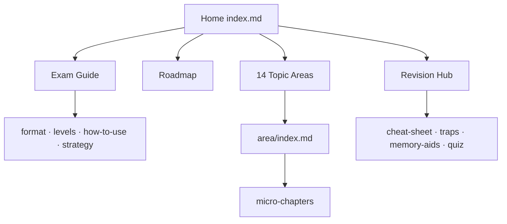
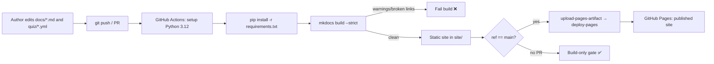

# Architecture

The technical architecture of the **platform** (the documentation product), not of
Symfony itself. It describes how content, tooling, and delivery fit together, and
why each choice was made.

> Scope note: "Symfony architecture" as a *learning topic* lives in
> `docs/architecture/`. This document is about the MkDocs-based delivery system.

## 1. Overview

The platform is a **static documentation site**: Markdown micro-chapters authored
against a fixed template, built by **MkDocs Material** into a searchable static
site, and deployed to **GitHub Pages** by GitHub Actions. A parallel
machine-readable **quiz bank** (`quiz/*.yml`) feeds both terminal self-testing and
the in-site Revision Hub.

There is no application server, database, or runtime backend — everything is
pre-rendered HTML/CSS/JS plus a client-side search index. This keeps hosting free,
fast, and mobile-friendly, and makes the whole platform reviewable as plain text
in Git.

## 2. Repository layout

```text
Sf-8.0/
├── docs/                 # MkDocs docs root — all learner-facing content
│   ├── _meta/            # Author brief, conventions, chapter template (not in nav)
│   ├── index.md          # Home
│   ├── roadmap.md        # Learner-facing roadmap
│   ├── exam-guide/       # Exam format, scoring, strategy
│   ├── revision/         # Cheat sheet, traps, memory aids, quiz guide
│   └── <topic-area>/     # One folder per syllabus area (14), micro-chapters + index.md
├── quiz/                 # certificationy-compatible YAML bank, one file per area
├── specs/                # SpecKit planning artifacts (started at 13, now 25 docs)
├── tasks/                # Granular, independently-executable authoring tasks
├── mkdocs.yml            # Site config + navigation
├── requirements.txt      # Pinned Python build toolchain
├── .github/workflows/    # CI: build --strict + deploy to Pages
├── CONTRIBUTING.md · LICENSE · README.md
```

**Folder-per-topic-area, micro-chapter-per-sub-topic** is the core structural rule.
It maps 1:1 to the syllabus (and the Traceability Matrix), keeps files small for
phone reading, and lets many authors work in parallel without collisions.

## 3. Information architecture

Navigation is a shallow three-level tree, all wired in `mkdocs.yml` `nav:`:



- **Level 1** — Home, Exam Guide, Roadmap, the 14 topic areas, Revision Hub
  (Material tabbed nav, sticky).
- **Level 2** — each area's `index.md` (uses `navigation.indexes`) plus its
  micro-chapters.
- **Level 3** — in-page table of contents (`toc.follow`).

Two navigation aids reduce clicks to ≤2: the **client-side search** (lunr index,
built at compile time) and the **Roadmap graph**, which is the recommended entry
path rather than the raw A–Z nav order.

## 4. Content model

Each micro-chapter is a Markdown file that must follow
[`CHAPTER_TEMPLATE.md`](../docs/_meta/CHAPTER_TEMPLATE.md); its anatomy is specified
in [ContentStructure.md](ContentStructure.md). Content is intentionally **decoupled
from the build config**: adding a chapter is a new `.md` file plus one `nav:` line,
never a code change.

The quiz bank is a sibling content model: `quiz/<area>.yml` in certificationy
schema (categories → questions → answers, each question carrying `explanation` and
`documentation`). It is authored alongside chapters and referenced from
`docs/revision/quiz.md`.

## 5. Build pipeline



Key properties:

- **`--strict` is the quality gate.** Broken internal links, missing nav targets,
  and orphan pages fail the build, so link integrity is enforced mechanically.
- **Build on every push/PR; deploy only from `main`.** PRs get a build-only gate;
  publishing is gated on the default branch with a single-concurrency Pages
  deployment.
- **Reproducible toolchain.** `requirements.txt` pins MkDocs, Material,
  pymdown-extensions, and plugins; CI uses Python 3.12 with pip cache.
- **`fetch-depth: 0`** so the `git-revision-date-localized` plugin can stamp
  last-updated dates.

## 6. Rendering stack

- **MkDocs Material theme** — tabbed/sticky nav, instant loading, palette toggle,
  content code copy/annotate.
- **`pymdownx.superfences`** with a custom `mermaid` fence — diagrams render
  client-side from fenced ```mermaid blocks.
- **`pymdownx.tabbed`** — the PHP/YAML/Console/XML code tabs every chapter uses.
- **`admonition` + `pymdownx.details`** — the objectives/traps/tips admonitions and
  collapsible solutions/questions.
- **`search`** — client-side search index.
- **`minify`** — smaller HTML payloads for mobile.

## 7. Why MkDocs Material

| Requirement | How Material satisfies it |
|---|---|
| Mobile-first navigation | Responsive tabbed + collapsible nav, instant loading, ≤2-tap reach |
| Fast in-content search | Built-in client-side search with suggestions/highlighting, zero backend |
| Diagrams | First-class Mermaid via superfences (lifecycles, flows, hierarchies) |
| Rich pedagogy blocks | Admonitions, collapsible details, code tabs, task lists out of the box |
| Free, simple hosting | Static output → GitHub Pages; no server to run or secure |
| Plain-text review | Everything is Markdown/YAML, diff-able and reviewable in PRs |
| Maintainability | Config decoupled from content; pinned toolchain; strict build |

Alternatives considered and rejected: **Jekyll** (the upstream stack — weaker
search/diagrams, less mobile polish), **Docusaurus/React** (heavier build, JS
runtime, overkill for prose), and **hand-rolled static HTML** (no search, no nav
generation, high maintenance).

## 8. Cross-cutting concerns

- **Link integrity** — relative links only; verified by `--strict`.
- **Versioning** — doc links track `doc/8.0`; source links pin `blob/8.0`; the
  `mike` provider is configured for future multi-version publishing (see
  [FutureMaintenance.md](FutureMaintenance.md)).
- **Scope enforcement** — excluded topics are absent by construction (no folders,
  no nav entries); reviewers verify against [GapAnalysis §5](GapAnalysis.md).
- **Governance** — the coordinator owns `mkdocs.yml` and the Traceability Matrix;
  authors own their `docs/<area>/` folder and `quiz/<area>.yml` only.

## Related specs

[Specification](Specification.md) · [Requirements](Requirements.md) ·
[ContentStructure](ContentStructure.md) · [LearningStrategy](LearningStrategy.md) ·
[FutureMaintenance](FutureMaintenance.md) · [QualityRequirements](QualityRequirements.md).
