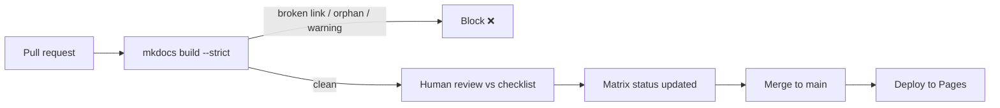

# Future Maintenance

How to keep the platform correct and current as Symfony evolves. This is the
operational counterpart to [QualityRequirements Q6](QualityRequirements.md)
(maintainability) and the home of persona **P3 "The Contributor"**.

## 1. What ages, and why

| Source of drift | Effect | Cadence |
|---|---|---|
| Symfony **minor** release (8.1, 8.2, …) | New features, soft deprecations, changed defaults | ~every 6 months (May & Nov) |
| Symfony **major** release (9.0) | Removals of previously-deprecated APIs, new baselines | ~every 2 years |
| PHP release | New language features, new minimum | Yearly |
| Twig release | Syntax/deprecation changes | As released |
| External doc/source URLs | Link rot | Continuous |
| Exam syllabus revision | Topic weights, added/removed items | Symfony-driven |

Doc links are pinned to `doc/8.0` (not `doc/current`), per the certification's
requirement to verify against Symfony 8.0 exclusively — so prose does **not**
auto-track newer minors the way a `doc/current` link would have. When Symfony
8.1/8.2 ship, the version-pinned facts, deprecations, and defaults described here
are what need active review before the baseline moves.

## 2. Versioning policy

- **Doc links:** always `symfony.com/doc/8.0/...` (pinned to the certified
  Symfony 8.0 branch — deliberately does **not** track newer minors; see the
  baseline-change process below before ever repointing this to `doc/current`
  or a later version).
- **Source links:** pin the branch the content targets — `blob/8.0` today; bump to
  `blob/9.0` only when the platform's baseline moves.
- **Baseline statement:** the "Symfony 8.0 / PHP 8.4+ / Twig 3.x" baseline lives in
  [CONVENTIONS.md](../docs/_meta/CONVENTIONS.md); a baseline change is a
  deliberate, reviewed event that updates conventions, the Matrix, and this file.
- **Multi-version publishing:** the `mike` provider is pre-configured in
  `mkdocs.yml` so older baselines can be kept online when a new major ships.

## 3. Version-bump checklist (per Symfony minor)

- [ ] Read the release's UPGRADE/CHANGELOG for the covered areas.
- [ ] Update any **changed defaults** or config keys in affected chapters.
- [ ] Add genuinely exam-relevant **new features** as new sub-topics (add a Matrix
      row + a `nav:` entry; do not bloat existing chapters).
- [ ] Re-check **exam weight** notes (e.g. Messenger up-weighted, HTTP Caching
      down-weighted) against the current syllabus.
- [ ] Run a **deprecation sweep** (§4) and a **link-rot check** (§5).
- [ ] Rebuild `mkdocs build --strict`; fix warnings.
- [ ] Update `requirements.txt` pins if the toolchain moved; re-verify the build.

## 4. Deprecation sweep

- [ ] Grep content for APIs deprecated/removed in the target version; replace with
      current equivalents (never show a deprecated API as taught content).
- [ ] Verify code snippets still compile against the new baseline.
- [ ] Where a chapter explains *how to handle* deprecations
      (`testing/deprecations.md`, `architecture/deprecations.md`), confirm the
      guidance matches current tooling (PHPUnit bridge, `#[\Deprecated]`).
- [ ] Confirm no removed config keys survive in YAML tabs.

## 5. Link-rot check

- [ ] `mkdocs build --strict` catches broken **internal** links automatically.
- [ ] Periodically validate **external** links (docs, source) with a link checker;
      `doc/8.0` is pinned and should stay stable, but source line anchors on `blob/8.0` can move
      — prefer file-level source links over line-pinned ones for durability.
- [ ] Fix or re-point dead references; note any doc pages Symfony has restructured.

## 6. How to add a chapter

1. Add a row to [TraceabilityMatrix.md](TraceabilityMatrix.md) (coordinator).
2. Copy [`CHAPTER_TEMPLATE.md`](../docs/_meta/CHAPTER_TEMPLATE.md) into
   `docs/<area>/<sub-topic>.md`; follow [ContentStructure.md](ContentStructure.md).
3. Write to the [AGENT_BRIEF](../docs/_meta/AGENT_BRIEF.md) rules; satisfy every
   [DefinitionOfDone](DefinitionOfDone.md) item.
4. Add 3–6 questions to `quiz/<area>.yml`.
5. Add one line to `mkdocs.yml` `nav:` (coordinator owns this file).
6. Self-review against [ReviewChecklist.md](ReviewChecklist.md); ensure
   `mkdocs build --strict` is green.

## 7. CI gates (what protects the platform)



- **`--strict` build** on every push/PR — no broken links, no orphan pages, no
  missing nav targets.
- **Pinned toolchain** — reproducible builds; toolchain bumps are reviewed.
- **Deploy only from `main`** — PRs are build-gated, publishing is protected.
- **Review Checklist + DoD** — the human gate for correctness and depth.

## 8. Ownership & governance

| Area | Owner | Responsibility |
|---|---|---|
| `mkdocs.yml` nav, `requirements.txt`, CI | **Coordinator/maintainer** | Structure, build, releases |
| `specs/` + `TraceabilityMatrix.md` | **Coordinator** | Planning, coverage tracking |
| `docs/<area>/` + `quiz/<area>.yml` | **Area author(s)** | Content correctness & depth |
| Cross-cutting QA | **Reviewer** | Fact-check, code compile, link/scope checks |

Rules of engagement: authors touch **only** their area folder and quiz file;
the coordinator owns navigation and the Matrix; every change lands via PR through
the CI gate.

## 9. Release routine (recommended)

- **Each Symfony minor:** run §3–§5; publish a patched site.
- **Each Symfony major:** re-baseline (§2), version-freeze the old docs via `mike`,
  then run the full deprecation sweep and re-verify the Matrix.
- **Ongoing:** triage issues/PRs, keep the quiz bank aligned with chapters, and
  re-check exam weightings when Symfony updates the certification syllabus.

## Related specs

[QualityRequirements](QualityRequirements.md) · [Architecture](Architecture.md) ·
[MigrationPlan](MigrationPlan.md) · [ContentStructure](ContentStructure.md) ·
[TraceabilityMatrix](TraceabilityMatrix.md) · [DefinitionOfDone](DefinitionOfDone.md).

## Offline PDF export (optional)

The site build (`mkdocs.yml`) and CI intentionally do **not** include a PDF plugin,
to keep the deploy fast and dependency-light. To produce a single PDF locally:

```console
$ pip install -r requirements.txt -r requirements-pdf.txt
# Debian/Ubuntu also need: libpango-1.0-0 libpangocairo-1.0-0 libgdk-pixbuf2.0-0
$ ENABLE_PDF=1 mkdocs build   # after adding the with-pdf plugin block below
```

Add this block under `plugins:` in a throwaway/local `mkdocs.yml` (or a copy) —
keep it out of the committed config so the main build stays unaffected:

```yaml
  - with-pdf:
      output_path: pdf/symfony8-cert-prep.pdf
      cover_title: Symfony 8 Expert Certification Prep
      enabled_if_env: ENABLE_PDF
```

## 10. Official syllabus revision process (added P3, this run)

This mission's compliance run established a **six-status traceability
schema** (absent / structure / partiel / validé techniquement / validé
éditorialement / conforme — see `specs/TraceabilityMatrix.md`'s own legend)
and a set of automated checks that assume the current 175-subtopic taxonomy.
When Symfony (or the certification vendor) revises the official syllabus —
adds, removes, or re-weights topics — follow this order, not an ad-hoc edit:

1. **Re-verify the source, don't assume.** Fetch
   `certification.symfony.com/exams/symfony.html` fresh (this run's network
   egress to that domain was blocked — confirmed via a failed fetch, not
   assumed — so this step could not be executed this run; a future session
   with reachable network must do it before touching anything else).
2. **Update `specs/OfficialSyllabusBaseline.md` first** — it exists
   specifically to hold the syllabus snapshot *before* the matrix or docs
   change, with its own explicit "this tracks, but is not itself, the
   official syllabus" banner kept intact. Diff the new fetch against the
   existing baseline; note every add/remove/reweight explicitly.
3. **Update `tools/gen_traceability_matrix.py`'s `SYLLABUS` list** to match
   — add/remove/relabel rows; do not hand-edit
   `specs/TraceabilityMatrix.md` itself (it's regenerated, not
   hand-maintained — see the file's own header).
4. **For a removed topic:** move its chapter(s) to
   `docs/appendices/out-of-syllabus/` with the same "Hors syllabus officiel
   Symfony 8.0" admonition the three existing exclusions use (see
   `tools/check_exclusions.py`'s own list — add the new chapter's slug
   there too, in the `EXCLUDED` tuple, so the consistency check covers it),
   tag its quiz questions `out_of_scope: true`, and add a row to
   `specs/TraceabilityMatrix.md`'s "Out-of-scope / Additional Learning"
   section (via the generator, not by hand).
5. **For an added topic:** follow §6 above ("How to add a chapter") —
   Matrix row, chapter file, quiz questions, `mkdocs.yml` nav entry.
6. **Regenerate every derived report**, in this order, and re-run the full
   check suite before committing:
   `tools/gen_traceability_matrix.py` → `tools/audit.py` →
   `tools/final_audit.py` → `tools/check_section_order.py` →
   `tools/check_exclusions.py` → `tools/validate_quiz.py` →
   `tools/check_quiz_duplicates.py` → `tools/check_placeholders.py` →
   `tools/check_editorial_structure.py` → `tools/check_doc_version_refs.py`
   → the four `tools/lint_*.py` tools → `mkdocs build --strict`.
7. **Never claim "conforme" or a coverage percentage as officially
   verified** without having actually completed step 1 against a live
   fetch in that same session — the six-status schema's "conforme" is
   this project's own completeness bar (structural + technical +
   editorial validation + a French translation), not an assertion that
   the item matches a re-fetched official source, unless step 1 was done.

## 11. Tools added by the P0–P3 compliance run (2026-08-27)

For a future maintainer wondering what each of these does before deleting
or modifying one — every one has its own docstring with more detail:

| Tool | Purpose | CI status |
|---|---|---|
| `tools/repo_meta.py` | Shared provenance-stamp helper (commit/branch/date) for generated reports | n/a (library) |
| `tools/check_report_freshness.py` | Flags a generated report whose stamped commit != current HEAD | informational (non-blocking) |
| `tools/check_exclusions.py` | Verifies the out-of-syllabus exclusion list stays consistent (files, nav, quiz tags, matrix section) | **blocking** |
| `tools/lint_yaml.py` / `lint_twig.py` / `lint_xml.py` | Syntax/structure checks for fenced code snippets (YAML fully; Twig block-tag pairing only; XML well-formedness) | **blocking** |
| `tools/check_quiz_duplicates.py` | Jaccard token-overlap near-duplicate scan across the quiz bank (lexical heuristic, human review required per pair) | informational (non-blocking) |
| `tools/check_editorial_structure.py` | Nav<->docs consistency, code-fence balance, empty-heading detection | **blocking** |
| `tools/check_site_quality.py` + `_site_quality_check.js` | Real headless-Chromium + axe-core accessibility/quality audit (needs `npm install --prefix tools` first) | **not** wired into CI (Chromium/npm cost + needs human judgment on 2 of its findings) — on-demand only |

## Non-gating quality checks

`.github/workflows/quality.yml` runs weekly (and on demand):

- **markdownlint** (`.markdownlint.yaml`, relaxed) — style, informational.
- **lychee link check** (`fail: false`) — surfaces link-rot without failing.

These never block the docs deploy. `dependabot.yml` opens monthly PRs to bump the
pip toolchain and GitHub Actions.
