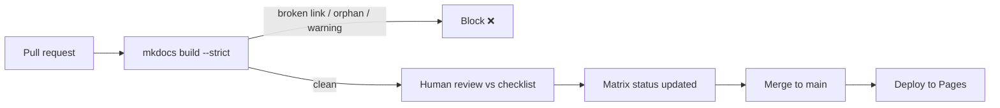

# Future Maintenance

How to keep the platform correct and current as Symfony evolves. This is the
operational counterpart to [QualityRequirements Q6](QualityRequirements.md)
(maintainability) and the home of persona **P3 "The Contributor"**.

## 1. What ages, and why

| Source of drift | Effect | Cadence |
|---|---|---|
| Symfony **minor** release (8.1, 8.2, …) | New features, soft deprecations, changed defaults | ~every 6 months (May & Nov) |
| Symfony **major** release (9.0) | Removals of previously-deprecated APIs, new baselines | ~every 2 years |
| PHP release | New language features, new minimum | Yearly |
| Twig release | Syntax/deprecation changes | As released |
| External doc/source URLs | Link rot | Continuous |
| Exam syllabus revision | Topic weights, added/removed items | Symfony-driven |

Because doc links use `doc/current`, prose about *current* behavior tends to stay
valid across minors; **version-pinned facts, deprecations, and defaults** are what
need active maintenance.

## 2. Versioning policy

- **Doc links:** always `symfony.com/doc/current/...` (tracks latest stable).
- **Source links:** pin the branch the content targets — `blob/8.0` today; bump to
  `blob/9.0` only when the platform's baseline moves.
- **Baseline statement:** the "Symfony 8.0 / PHP 8.4+ / Twig 3.x" baseline lives in
  [CONVENTIONS.md](../docs/_meta/CONVENTIONS.md); a baseline change is a
  deliberate, reviewed event that updates conventions, the Matrix, and this file.
- **Multi-version publishing:** the `mike` provider is pre-configured in
  `mkdocs.yml` so older baselines can be kept online when a new major ships.

## 3. Version-bump checklist (per Symfony minor)

- [ ] Read the release's UPGRADE/CHANGELOG for the covered areas.
- [ ] Update any **changed defaults** or config keys in affected chapters.
- [ ] Add genuinely exam-relevant **new features** as new sub-topics (add a Matrix
      row + a `nav:` entry; do not bloat existing chapters).
- [ ] Re-check **exam weight** notes (e.g. Messenger up-weighted, HTTP Caching
      down-weighted) against the current syllabus.
- [ ] Run a **deprecation sweep** (§4) and a **link-rot check** (§5).
- [ ] Rebuild `mkdocs build --strict`; fix warnings.
- [ ] Update `requirements.txt` pins if the toolchain moved; re-verify the build.

## 4. Deprecation sweep

- [ ] Grep content for APIs deprecated/removed in the target version; replace with
      current equivalents (never show a deprecated API as taught content).
- [ ] Verify code snippets still compile against the new baseline.
- [ ] Where a chapter explains *how to handle* deprecations
      (`testing/deprecations.md`, `architecture/deprecations.md`), confirm the
      guidance matches current tooling (PHPUnit bridge, `#[\Deprecated]`).
- [ ] Confirm no removed config keys survive in YAML tabs.

## 5. Link-rot check

- [ ] `mkdocs build --strict` catches broken **internal** links automatically.
- [ ] Periodically validate **external** links (docs, source) with a link checker;
      `doc/current` should be stable, but source line anchors on `blob/8.0` can move
      — prefer file-level source links over line-pinned ones for durability.
- [ ] Fix or re-point dead references; note any doc pages Symfony has restructured.

## 6. How to add a chapter

1. Add a row to [TraceabilityMatrix.md](TraceabilityMatrix.md) (coordinator).
2. Copy [`CHAPTER_TEMPLATE.md`](../docs/_meta/CHAPTER_TEMPLATE.md) into
   `docs/<area>/<sub-topic>.md`; follow [ContentStructure.md](ContentStructure.md).
3. Write to the [AGENT_BRIEF](../docs/_meta/AGENT_BRIEF.md) rules; satisfy every
   [DefinitionOfDone](DefinitionOfDone.md) item.
4. Add 3–6 questions to `quiz/<area>.yml`.
5. Add one line to `mkdocs.yml` `nav:` (coordinator owns this file).
6. Self-review against [ReviewChecklist.md](ReviewChecklist.md); ensure
   `mkdocs build --strict` is green.

## 7. CI gates (what protects the platform)



- **`--strict` build** on every push/PR — no broken links, no orphan pages, no
  missing nav targets.
- **Pinned toolchain** — reproducible builds; toolchain bumps are reviewed.
- **Deploy only from `main`** — PRs are build-gated, publishing is protected.
- **Review Checklist + DoD** — the human gate for correctness and depth.

## 8. Ownership & governance

| Area | Owner | Responsibility |
|---|---|---|
| `mkdocs.yml` nav, `requirements.txt`, CI | **Coordinator/maintainer** | Structure, build, releases |
| `specs/` + `TraceabilityMatrix.md` | **Coordinator** | Planning, coverage tracking |
| `docs/<area>/` + `quiz/<area>.yml` | **Area author(s)** | Content correctness & depth |
| Cross-cutting QA | **Reviewer** | Fact-check, code compile, link/scope checks |

Rules of engagement: authors touch **only** their area folder and quiz file;
the coordinator owns navigation and the Matrix; every change lands via PR through
the CI gate.

## 9. Release routine (recommended)

- **Each Symfony minor:** run §3–§5; publish a patched site.
- **Each Symfony major:** re-baseline (§2), version-freeze the old docs via `mike`,
  then run the full deprecation sweep and re-verify the Matrix.
- **Ongoing:** triage issues/PRs, keep the quiz bank aligned with chapters, and
  re-check exam weightings when Symfony updates the certification syllabus.

## Related specs

[QualityRequirements](QualityRequirements.md) · [Architecture](Architecture.md) ·
[MigrationPlan](MigrationPlan.md) · [ContentStructure](ContentStructure.md) ·
[TraceabilityMatrix](TraceabilityMatrix.md) · [DefinitionOfDone](DefinitionOfDone.md).

## Offline PDF export (optional)

The site build (`mkdocs.yml`) and CI intentionally do **not** include a PDF plugin,
to keep the deploy fast and dependency-light. To produce a single PDF locally:

```console
$ pip install -r requirements.txt -r requirements-pdf.txt
# Debian/Ubuntu also need: libpango-1.0-0 libpangocairo-1.0-0 libgdk-pixbuf2.0-0
$ ENABLE_PDF=1 mkdocs build   # after adding the with-pdf plugin block below
```

Add this block under `plugins:` in a throwaway/local `mkdocs.yml` (or a copy) —
keep it out of the committed config so the main build stays unaffected:

```yaml
  - with-pdf:
      output_path: pdf/symfony8-cert-prep.pdf
      cover_title: Symfony 8 Expert Certification Prep
      enabled_if_env: ENABLE_PDF
```

## Non-gating quality checks

`.github/workflows/quality.yml` runs weekly (and on demand):

- **markdownlint** (`.markdownlint.yaml`, relaxed) — style, informational.
- **lychee link check** (`fail: false`) — surfaces link-rot without failing.

These never block the docs deploy. `dependabot.yml` opens monthly PRs to bump the
pip toolchain and GitHub Actions.
