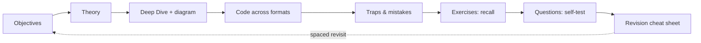

# Learning Strategy

The pedagogy behind the platform. It explains *why* the content is shaped the way
it is, and how the [chapter template](../docs/_meta/CHAPTER_TEMPLATE.md)
operationalizes each principle so pedagogy is enforced by structure, not left to
author discretion.

## 1. Target learner and outcome

The learner is a competent PHP developer (persona P1/P2 in
[Specification §5](Specification.md)) preparing for a high-stakes, time-boxed exam
(75 questions / 90 min → ~72 s/question). The desired outcome is not "familiarity"
but **fast, confident recall of precise facts and the ability to spot subtle
distractors**. Every pedagogical choice serves that outcome.

## 2. Core principles

### Active recall over passive reading

Reading is the weakest form of study. Each chapter forces retrieval: inline
**certification questions** (collapsible, answer hidden), **exercises** with hidden
solutions, and a **last-minute revision** cheat sheet that the learner should be
able to reconstruct from memory. The learner answers *before* revealing.

### Spaced repetition

Material is designed to be revisited on a widening schedule, not crammed once. The
mechanisms:

- Per-chapter **key takeaways** + **cheat sheet** blocks are re-readable in seconds.
- The **Revision Hub** aggregates cheat sheets, traps, and memory aids for repeated
  passes as the exam approaches.
- The **quiz bank** is re-runnable indefinitely, surfacing weak areas each cycle.
- **Revision priority** labels (Critical/High/Medium) tell the learner what to
  space most tightly near the exam.

### Deep-dive rationale (understand, don't memorize)

Isolated facts decay; facts anchored to a mental model persist and generalize. So
every chapter includes a mandatory **Deep Dive** into internals — real FQCNs,
execution order, lifecycle, extension points, trade-offs. Understanding *why*
`kernel.view` only fires when a controller returns a non-`Response` lets a learner
answer a dozen phrasings of the same question instead of memorizing one.

### Trap-driven learning

The exam tests *distinctions*, not definitions. Each chapter has a **Certification
traps** admonition capturing the subtle detail, common misconception, or
version-specific gotcha the exam exploits. The Revision Hub carries a cross-area
**trap index**. Learners study the trap alongside the correct model so the two are
encoded together.

### Progressive disclosure and dependency ordering

Concepts are never used before they are taught. The [Roadmap](Roadmap.md) sequences
stages by dependency (mental model first: request→response, container build), not
by syllabus order. Difficulty ramps within and across chapters.

### Mobile, micro-chapter delivery

Study happens in short bursts (commute, breaks). Micro-chapters (150–450 lines,
one idea each) fit those bursts and map cleanly to spaced repetition units. See
[ContentStructure.md](ContentStructure.md).

## 3. Learning loop

Each chapter walks a learner from *what they'll be able to do* → *understand* →
*apply* → *avoid pitfalls* → *retrieve* → *condense*, then feeds the spaced-revisit
cycle via the Revision Hub.

## 4. Exercise and question design

- **Exercises** are applied tasks with a clear expected outcome and a **hidden**
  worked solution (learner attempts first). Levels are tagged (Advanced/Expert).
- **Certification questions** mirror the real formats (single, multiple,
  true/false), include realistic distractors drawn from the chapter's traps, and
  always carry a **Why** explanation plus a `doc/8.0` reference.
- **Quiz bank** questions (`quiz/<area>.yml`) are the machine-scored counterpart:
  3–6 per chapter, each with `explanation` + `documentation`, re-runnable via
  certificationy-cli for spaced self-testing.
- Questions are **educational, never brain-dumped** exam items.

## 5. Dual-track: Advanced vs Expert

The same content serves both certification levels (which differ by score, not by
separate exams — see [`docs/exam-guide/levels.md`](../docs/exam-guide/levels.md)):

| | Advanced track | Expert track |
|---|---|---|
| Focus | Correct usage, config, common flows | Internals, trade-offs, edge cases |
| Chapter sections | Objectives→Code + traps | + full Deep Dive, source refs |
| Roadmap coverage | Stages 1–13, usage emphasis | All stages + every Deep Dive |
| Revision Hub | Cheat sheet + key traps | Full trap index is mandatory |
| Diagrams | Read for the flow | Trace class/lifecycle detail |

A learner self-selects a track; the template exposes both depths in one file so
nobody maintains two versions.

## 6. How the template enforces pedagogy

Pedagogy is baked into the mandatory section order, so a compliant chapter is a
pedagogically sound chapter:

| Principle | Template mechanism |
|---|---|
| Goal clarity | `!!! abstract` learning objectives (measurable) + syllabus map |
| Understand-first | Mandatory **Deep Dive** + ≥1 Mermaid diagram |
| Applicability | Code tabs (PHP/YAML/Console); when-(not)-to-use table |
| Trap-driven | `!!! danger` traps + `!!! warning` mistakes, every chapter |
| Active recall | Exercises + hidden solutions; collapsible questions |
| Spaced repetition | Key takeaways + `!!! tip` cheat sheet; Revision Hub aggregation |
| Anchored facts | References to `doc/8.0` + `blob/8.0` source |

The [Definition of Done](DefinitionOfDone.md) and [Review Checklist](ReviewChecklist.md)
turn these into pass/fail gates, so the pedagogy cannot silently erode.

## Related specs

[Specification](Specification.md) · [Roadmap](Roadmap.md) ·
[ContentStructure](ContentStructure.md) · [Requirements](Requirements.md) ·
[QualityRequirements](QualityRequirements.md) · [DefinitionOfDone](DefinitionOfDone.md).
