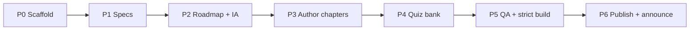

# Migration Plan

How the upstream **[ThomasBerends Symfony Certification Preparation List](https://github.com/ThomasBerends/symfony-certification-preparation-list)**
(Symfony 7.0) maps onto this platform. The short version: **only the topic
structure is reused; all content is rebuilt.** This is a green-field authoring
effort, not a prose migration — see [GapAnalysis.md](GapAnalysis.md).

## 1. Source vs target

| | Source (upstream) | Target (this platform) |
|---|---|---|
| Nature | Curated list of links | Full self-contained learning platform |
| Version | Symfony 7.0 | Symfony 8.0 / PHP 8.4+ |
| Content | `topics/*.md` link bullets, ~672 lines | Micro-chapters: theory, deep dive, code, traps, exercises, quiz |
| Stack | Jekyll + GitHub Pages | MkDocs Material + GitHub Pages |
| Prose / code / diagrams | None | Full per chapter |

## 2. What is reused

- **Topic structure only** — the 14 syllabus areas and their sub-topic breakdown,
  which the upstream list mirrors from the official syllabus. This became the
  `docs/<area>/` folder layout and the [Traceability Matrix](TraceabilityMatrix.md).
- **The idea of tracking the official syllabus** as the source of truth.
- **The MIT license posture** and the spirit of a free community resource.

Nothing else — no prose, no ordering, no navigation, no build config.

## 3. What is rebuilt (everything else)

| Dimension | Action |
|---|---|
| Learning prose | Written from scratch at Expert depth |
| Deep dives / internals | New — FQCNs, lifecycle, extension points |
| Code examples | New — PHP 8.4 / Symfony 8, attributes-first |
| Diagrams | New — Mermaid per flow/lifecycle |
| Exercises + solutions | New — every chapter |
| Certification traps / mistakes | New — every chapter + trap index |
| Revision aids | New — cheat sheets, memory aids, quiz bank |
| Navigation & search | Rebuilt on MkDocs Material (was Jekyll) |
| Study order | New optimized [Roadmap](Roadmap.md) (not syllabus order) |
| Version content | 7.0 → 8.0 deltas applied (see [GapAnalysis §3](GapAnalysis.md)) |

## 4. Version deltas driving rewrites

Carried from [GapAnalysis §3](GapAnalysis.md), the 7.0 → 8.0 changes that reshape
content:

- **PHP baseline → 8.4+** — rewrite the PHP API topic around 8.3/8.4 features
  (property hooks, asymmetric visibility, `new` in initializers, typed class
  constants, `#[\Override]`, `json_validate()`, DNF types, `readonly` classes).
- **All Symfony links → `doc/current`**; source links pin `blob/8.0`.
- **HTTP Caching down-weighted** — keep full coverage, mark revision priority Medium.
- **Messenger up-weighted** — expand into multiple sub-sections, raise priority.
- **Ban deprecated APIs** — show modern replacements only.

## 5. Attribution & redirects

- **Attribution preserved** — the README and this plan credit the upstream list as
  the origin; the `LICENSE` remains MIT (compatible with the upstream MIT license).
- **No content copied**, so there is no derivative-prose licensing concern; reuse is
  limited to the syllabus-derived structure, which is factual/organizational.
- **Redirects** — the upstream project keeps its own URL; this platform publishes at
  a new GitHub Pages URL (`site_url` in `mkdocs.yml`). There is no in-place URL
  takeover, so no server redirects are required. If a future consolidation is
  desired, add a note/link from the upstream README rather than rewriting URLs here.
- **Trademark** — Symfony trademark disclaimer retained in the site copyright and
  README ([QualityRequirements Q10](QualityRequirements.md)).

## 6. Phased cutover

| Phase | Deliverable | Exit criterion |
|---|---|---|
| P0 Scaffold | Repo, `mkdocs.yml` nav, template, conventions, CI | `mkdocs build --strict` green on empty stubs |
| P1 Specs | This SpecKit set (13 docs) | All specs complete, cross-linked, no TODOs |
| P2 Roadmap + IA | Landing pages (Home, Roadmap, Exam Guide, Revision Hub) | Nav resolves; entry paths clear |
| P3 Author chapters | 14 area indexes + all micro-chapters | Each passes [DefinitionOfDone](DefinitionOfDone.md) |
| P4 Quiz bank | `quiz/<area>.yml`, 3–6 Q per chapter | Valid schema; explanations + docs present |
| P5 QA | Fact-check, code-compile, link check | [ReviewChecklist](ReviewChecklist.md) pass; Matrix 100% |
| P6 Publish | GitHub Pages deploy from `main` | Live site; upstream attribution linked |

Cutover is **additive**: the platform stands up in parallel and is announced once
P5 passes; the upstream list is never mutated.

## 7. Risks

| Risk | Mitigation |
|---|---|
| Syllabus drift vs upstream list | Track official syllabus directly; Matrix is source of truth |
| Content debt (some areas lag) | Per-chapter DoD gate + Matrix status per row |
| Version regressions (7.x sneaks in) | Ban list + Review Checklist "no deprecated APIs" |
| Link rot to Symfony docs | Use `doc/current`; periodic link sweep (see [FutureMaintenance](FutureMaintenance.md)) |

## Related specs

[GapAnalysis](GapAnalysis.md) · [Specification](Specification.md) ·
[Roadmap](Roadmap.md) · [TraceabilityMatrix](TraceabilityMatrix.md) ·
[FutureMaintenance](FutureMaintenance.md) · [DefinitionOfDone](DefinitionOfDone.md).
