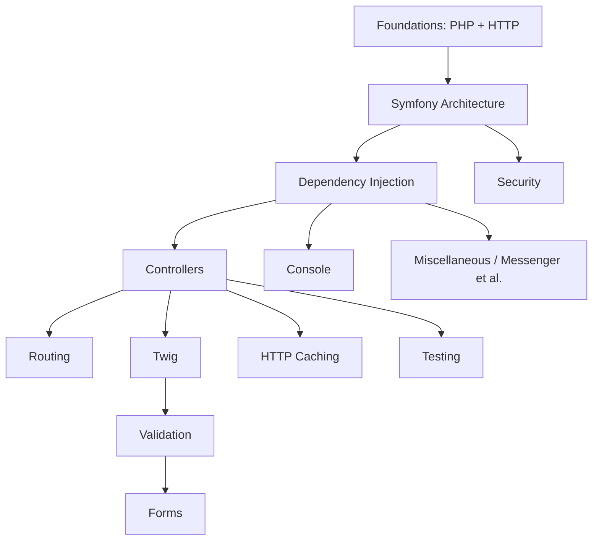

# Learning Roadmap (Planning)

Phase 4 deliverable. This is the **optimized study order**, deliberately *not* the
syllabus order, designed to maximize understanding for an **Expert** candidate.
A learner-facing version lives at [`docs/roadmap.md`](../docs/roadmap.md).

## Design principle

Teach the **mental model first** (how a request becomes a response, how the
container is built), then layer features on top. Concepts are never used before
they are taught. Dependencies flow downward.

## Ordered stages

| # | Stage | Why here | Prereqs | Difficulty | Est. time | Revision priority |
|---|---|---|---|---|---|---|
| 1 | PHP & Web Security | Language baseline (PHP 8.4) + threat model everything relies on | — | ★★☆ | 4–6 h | High |
| 2 | HTTP | Request/response mental model; foundation for Symfony's HttpFoundation | 1 | ★★☆ | 3–4 h | High |
| 3 | Symfony Architecture | The kernel, events, request lifecycle — the core mental model | 2 | ★★★ | 5–7 h | **Critical** |
| 4 | Dependency Injection | The backbone; needed to understand every other component | 3 | ★★★ | 6–8 h | **Critical** |
| 5 | Controllers | First feature layer, now that lifecycle + DI are clear | 3,4 | ★★☆ | 3–4 h | High |
| 6 | Routing | Pairs with controllers; matcher/generator internals | 5 | ★★☆ | 3–4 h | High |
| 7 | Templating (Twig) | Presentation layer on controllers | 5 | ★★☆ | 3–4 h | Medium |
| 8 | Data Validation | Constraint/validator model; prerequisite for Forms | 4 | ★★☆ | 3–4 h | Medium |
| 9 | Forms | Composes Twig + Validation + DI + events | 7,8 | ★★★ | 5–6 h | High |
| 10 | Security | Firewalls, authenticators, voters — builds on events + DI + HTTP | 3,4 | ★★★ | 6–8 h | **Critical** |
| 11 | HTTP Caching | Extends HTTP/response; ESI, reverse proxy | 2,5 | ★★☆ | 2–3 h | Medium (down-weighted) |
| 12 | Console | Mostly standalone; input/output/events | 4 | ★☆☆ | 2–3 h | Medium |
| 13 | Automated Tests | Test what you can now build | 5,6,9 | ★★☆ | 3–4 h | Medium |
| 14 | Miscellaneous (Messenger ★, Serializer, Mailer, Cache, Process, Lock, Intl, Runtime, Clock, Profiler, Config) | Advanced components; **Messenger up-weighted** | 3,4 | ★★★ | 7–9 h | High (Messenger **Critical**) |

**Total:** ~55–75 hours of focused study for Expert level.

## Per-stage chapter design

Each stage's `index.md` restates: prerequisites, expected level, difficulty,
dependencies, revision priority, and a checklist of its micro-chapters.

## Revision priority legend

- **Critical** — heavily tested; revisit last-minute (Architecture, DI, Security,
  Messenger).
- **High / Medium** — proportional to exam weight; HTTP Caching is *Medium* due to
  reduced weighting in the Symfony 8 exam.

## Two tracks

- **Advanced track:** stages 1–13 with emphasis on correct usage.
- **Expert track:** all stages + every Deep Dive and the internals/source sections;
  the Revision Hub trap index is mandatory.
